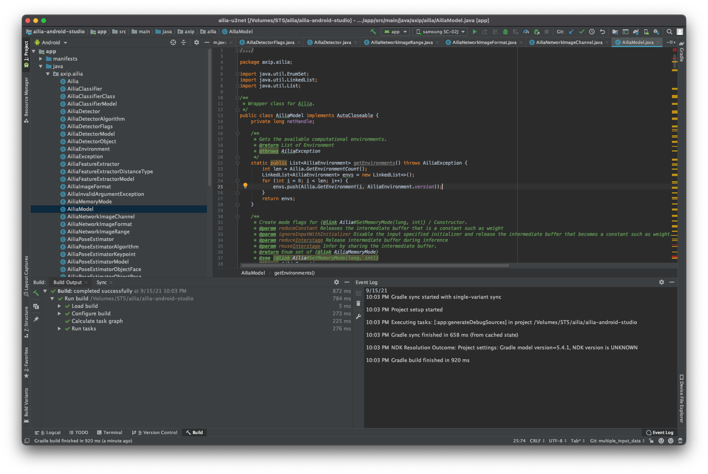

# ailia SDK Tutorial (JNI)

# ailia SDK Tutorial (JNI)

[](/@cochard-dav?source=post_page---byline--92b797725e08---------------------------------------)

[David Cochard](/@cochard-dav?source=post_page---byline--92b797725e08---------------------------------------)

4 min read

·

Oct 22, 2021

--

[Listen](/m/signin?actionUrl=https%3A%2F%2Fmedium.com%2Fplans%3Fdimension%3Dpost_audio_button%26postId%3D92b797725e08&operation=register&redirect=https%3A%2F%2Fmedium.com%2Faxinc-ai%2Failia-sdk-tutorial-jni-92b797725e08&source=---header_actions--92b797725e08---------------------post_audio_button------------------)

Share

This is a tutorial on how to use ailia SDK with the Java Native Interface (JNI) to perform deep learning inference in Java using GPU. For more information about ailia SDK, please refer to [here](https://ailia.jp/).

---

## Using the ailia SDK from Java

ailia SDK provides a Java Native Interface (JNI) API to perform inference using ONNX on Android devices.

Since ONNX does not require any special conversion operations and can be used as-is, it is possible to run ONNX models on Android that were previously difficult to run due to conversion error problems.

In particular, it is an ideal solution for running models trained with *Pytorch* on Android.

## Download ailia SDK

First, you need to download the evaluation version of the ailia SDK from the ailia website.

[## ailia SDK - Deep Learning Framework -

### Object detection, image classification, features extraction. Use trained models for your embedded applications! Get…

ailia.jp](https://ailia.jp/en/?source=post_page-----92b797725e08---------------------------------------)

## Download the Android Studio project

Clone the `ailia-android-studio` repository below which contains the Android Studio project files.

[## GitHub — axinc-ai/ailia-android-studio: ailia example for android studio

### ailia example for android studio. Contribute to axinc-ai/ailia-android-studio development by creating an account on…

github.com](https://github.com/axinc-ai/ailia-android-studio?source=post_page-----92b797725e08---------------------------------------)

## Copy the ailia SDK library

Copy the ailia SDK library files from the `library/android` folder of the ailia SDK to `app/src/main/jniLibs` of the downloaded project.

```
ailia_sdk/library/android/arm64-v8a/libailia.so  
ailia_sdk/library/android/armeabi-v7a/libailia.so  
ailia_sdk/library/android/x86/libailia.so  
ailia_sdk/library/android/x86_64/libailia.so　　↓↓↓app/src/main/jniLibs/arm64-v8a/libailia.so  
app/src/main/jniLibs/armeabi-v7a/libailia.so  
app/src/main/jniLibs/x86/libailia.so  
app/src/main/jniLibs/x86_64/libailia.so
```

After the copy succeeded the file structure should look like below.


## Open the Android Studio project

Open the project you have downloaded using *Android Studio*.

Press enter or click to view image in full size



Connect your Android device and click on the play button in the upper right corner to build and run the application. The background segmentation model should run on the Android device like below.


Background segmentation on Android

## Inference of single-input /single-output models

To infer a single-input /single-output model, use the [predict API](/axinc-ai/ailia-sdk-tutorial-predict-api-c0f1f72cd437).

Read the `onnx` and `prototxt` files placed in the `res/raw` folder and initialise the `AiliaModel` instance from it. Then allocate input and output buffers with the buffer size calculated from `getInputShape` and `getOutputShape`, and perform inference by calling the predict API.

```
//create ailia instance  
int envId = 0;  
AiliaModel ailia;  
ailia = new AiliaModel(envId, Ailia.MULTITHREAD_AUTO,  
            loadRawFile(R.raw.u2netp_opset11_proto), loadRawFile(R.raw.u2netp_opset11_weight));  
  
//prepare input and output buffer  
AiliaShape input_shape;  
AiliaShape output_shape;  
input_shape = ailia.getInputShape();  
output_shape = ailia.getOutputShape();int input_size = input_shape.x*input_shape.y*input_shape.z*input_shape.w;  
float [] input_buf = new float[input_size];  
  
int preds_size = output_shape.x*output_shape.y*output_shape.z*output_shape.w;  
float [] output_buf = new float[preds_size];//fill input data//compute  
int float_to_byte = 4;  
ailia.predict(output_buf, preds_size * float_to_byte, input_buf, input_size * float_to_byte);
```

The following sample shows how to infer a model with one input and one output.

[## ailia-android-studio/MainActivity.java at main · axinc-ai/ailia-android-studio

### ailia example for android studio. Contribute to axinc-ai/ailia-android-studio development by creating an account on…

github.com](https://github.com/axinc-ai/ailia-android-studio/blob/main/app/src/main/java/jp/axinc/ailia_u2net/MainActivity.java?source=post_page-----92b797725e08---------------------------------------)

## Inference of multiple input-output models

To infer a model with multiple inputs and outputs, use the update API.

The function `setInputBlobData` sets data to all blobs, call the `update` API to infer, and finally `getBlobData` to get the processing results. If you try to infer a model with multiple inputs with the predict API, an error `-7(STATUS_INVALID_STATE)` will be returned.

```
//create ailia instance  
int envId = 0;  
AiliaModel ailia;  
ailia = new AiliaModel(envId, Ailia.MULTITHREAD_AUTO,  
            loadRawFile(R.raw.u2netp_opset11_proto), loadRawFile(R.raw.u2netp_opset11_weight));  
  
//prepare input and output buffer  
AiliaShape input_shape;  
AiliaShape output_shape;  
input_shape = ailia.getBlobShape(ailia.getBlobIndexByInputIndex(0));  
output_shape = ailia.getBlobShape(ailia.getBlobIndexByOutputIndex(0));int input_size = input_shape.x*input_shape.y*input_shape.z*input_shape.w;  
float [] input_buf = new float[input_size];  
  
int preds_size = output_shape.x*output_shape.y*output_shape.z*output_shape.w;  
float [] output_buf = new float[preds_size];//fill input data//compute  
int float_to_byte = 4;  ailia.setInputBlobData(input_buf,input_size*float_to_byte,ailia.getBlobIndexByInputIndex(0)); // if the model has multiple input, please repeat this line  
ailia.update();  
ailia.getBlobData(output_buf,preds_size*float_to_byte,ailia.getBlobIndexByOutputIndex(0));
```

The following sample shows how to infer a model with multiple inputs and outputs.

[## Implement multiple input mode by kyakuno · Pull Request #2 · axinc-ai/ailia-android-studio

### Add this suggestion to a batch that can be applied as a single commit. This suggestion is invalid because no changes…

github.com](https://github.com/axinc-ai/ailia-android-studio/pull/2/files?source=post_page-----92b797725e08---------------------------------------)

---

[ax Inc.](https://axinc.jp/en/) has developed [ailia SDK](https://ailia.jp/en/), which enables cross-platform, GPU-based rapid inference.

ax Inc. provides a wide range of services from consulting and model creation, to the development of AI-based applications and SDKs. Feel free to [contact us](https://axinc.jp/en/) for any inquiry.