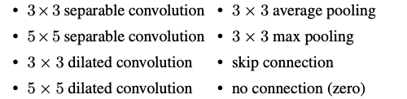
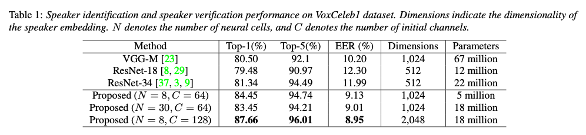

# AutoSpeech : Speech-based person identification model

# AutoSpeech : Speech-based person identification model

[](/@cochard-dav?source=post_page---byline--f01822f6d8e5---------------------------------------)

[David Cochard](/@cochard-dav?source=post_page---byline--f01822f6d8e5---------------------------------------)

4 min read

·

Oct 26, 2021

--

1

[Listen](/m/signin?actionUrl=https%3A%2F%2Fmedium.com%2Fplans%3Fdimension%3Dpost_audio_button%26postId%3Df01822f6d8e5&operation=register&redirect=https%3A%2F%2Fmedium.com%2Faxinc-ai%2Fautospeech-speech-based-person-identification-model-f01822f6d8e5&source=---header_actions--f01822f6d8e5---------------------post_audio_button------------------)

Share

This is an introduction to「AutoSpeech」, a machine learning model that can be used with [ailia SDK](https://ailia.jp/en/). You can easily use this model to create AI applications using [ailia SDK](https://ailia.jp/en/) as well as many other ready-to-use [ailia MODELS](https://github.com/axinc-ai/ailia-models).

---

## Overview

*AutoSpeech* is a machine learning model that can identify individuals from their speech. By inputting two audio files and generating the feature vectors of each recording, the degree of similarity between the two files can be computed. This method can be used to match a recording against feature vectors of people voices stored in a database for identification. It can be used for voice biometric authentication, or identifying speakers in speech transcriptions.

[## AutoSpeech: Neural Architecture Search for Speaker Recognition

### Speaker recognition systems based on Convolutional Neural Networks (CNNs) are often built with off-the-shelf backbones…

arxiv.org](https://arxiv.org/abs/2005.03215?source=post_page-----f01822f6d8e5---------------------------------------)

## Architecture

There are two main tasks for speaker recognition: Speaker IDentification (SID) and Speaker Verification (SV). In recent years, end-to-end speaker recognition systems have emerged and achieved state-of-the-art performance.

In end-to-end speaker recognition, a Convolutional Neural Network (CNN) or Recurrent Neural Network (RNN) is used as feature extractor for each audio frame, which is then turned into a fixed length speaker embedding (*d-vector*) by a a temporal aggregation layer. Finally, *cosine similarity* is used on those embeddings to produce the final speaker identification decision.

*VGG* and *ResNet* architectures are usually used for the feature extraction. However, these architectures are intended for image identification and are not optimal for speaker recognition.

*AutoSpeech* uses *Neural Architecture Search (NAS)* to search for the best network architecture. The search space is a set of the following layers:



Source: <https://arxiv.org/abs/2005.03215>

The NAS process is made of two types of neural cells: *normal cells* that keep the spatial resolution of the feature tensor (number of dimensions), and *reduction cells* that shrinks the resolution. For example, in *VGG* `Conv -> Relu` corresponds to a *normal cell* and `MaxPooling` corresponds to a *reduction cell*. These cells are stacked 8 times to form the final model architecture.


Source: <https://arxiv.org/abs/2005.03215>


Source: <https://arxiv.org/abs/2005.03215>

*VoxCeleb1* dataset was used for training and evaluation.

[## VoxCeleb

### VoxCeleb1 contains over 100,000 utterances for 1,251 celebrities, extracted from videos uploaded to YouTube. 26/10/2017…

www.robots.ox.ac.uk](https://www.robots.ox.ac.uk/~vgg/data/voxceleb/vox1.html?source=post_page-----f01822f6d8e5---------------------------------------)

The evaluation results are shown below. The proposed method out performs those based on *VGG* and *ResNet*.

Press enter or click to view image in full size



Source: <https://arxiv.org/abs/2005.03215>

The processing is performed on STFT spectrum data of audio files at sampling rate 16 kHz. The audio file is divided into frames, on which the feature vector is computed, and the mean of all frames is taken as the final fixed-length feature vector. The *cosine similarity* metric is then calculated by normalizing and inner-product of feature vectors.

## Usage

The following command will allow you to input two audio files and output the similarity.

```
$ python3 auto_speech.py --input1 wav/id10270/8jEAjG6SegY/00008.wav --input2 wav/id10270/x6uYqmx31kE/00001.wav
```

[## ailia-models/audio\_processing/auto\_speech at master · axinc-ai/ailia-models

### Audio file Wav file from The VoxCeleb1 Dataset https://www.robots.ox.ac.uk/~vgg/data/voxceleb/vox1.html Default input…

github.com](https://github.com/axinc-ai/ailia-models/tree/master/audio_processing/auto_speech?source=post_page-----f01822f6d8e5---------------------------------------)

Here is an example output. If the similarity is greater than the threshold, the person is identified as the same person and the output is “*match*”.

```
INFO auto_speech.py (229) : Start inference...  
INFO auto_speech.py (243) :  similar: 0.42532125  
INFO auto_speech.py (245) :  verification: match (threshold: 0.260)
```

The training is done on dataset made of speeches in English, but let’s test it on Japanese sentences using the audio file library below.

[## 効果音ラボ — フリー、商用無料、報告不用の効果音素材をダウンロード

### フリー素材ながら質を追求した、数百種の無料効果音をダウンロードできます。

soundeffect-lab.info](https://soundeffect-lab.info/sound/voice/info-lady1.html?source=post_page-----f01822f6d8e5---------------------------------------)

Various inferences showed that sentences from the same person matched with a similarity between 0.41 and 0.80. An example of similar sentences (same words) from two different people unmatched with a similarity 0.228. Therefore the same model can also be used for other languages, in that case Japanese.

---

[ax Inc.](https://axinc.jp/en/) has developed [ailia SDK](https://ailia.jp/en/), which enables cross-platform, GPU-based rapid inference.

ax Inc. provides a wide range of services from consulting and model creation, to the development of AI-based applications and SDKs. Feel free to [contact us](https://axinc.jp/en/) for any inquiry.