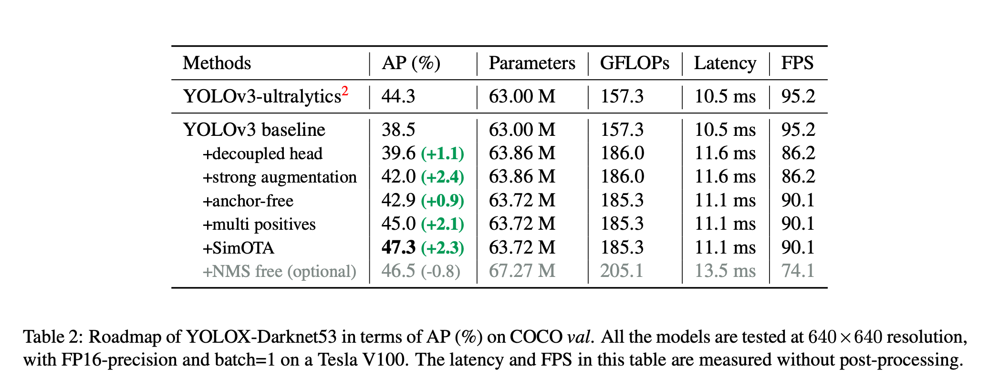
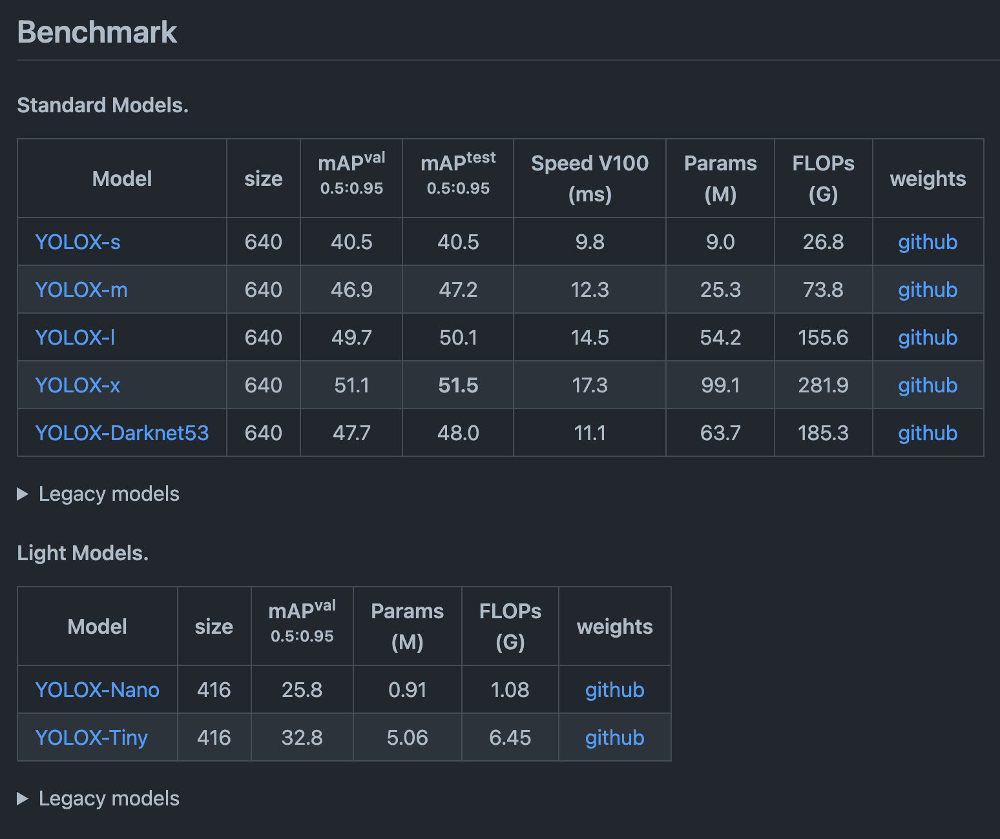
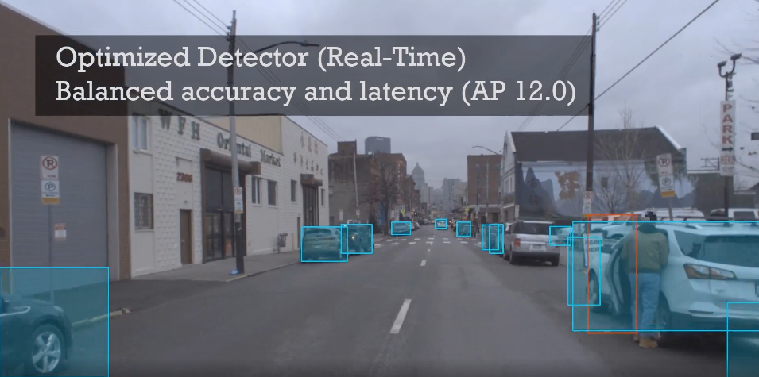

# YOLOX : Object detection model exceeding YOLOv5

# YOLOX : Object detection model exceeding YOLOv5

[](/@cochard-dav?source=post_page---byline--d6cea6d3c4bc---------------------------------------)

[David Cochard](/@cochard-dav?source=post_page---byline--d6cea6d3c4bc---------------------------------------)

4 min read

·

Nov 1, 2021

--

[Listen](/m/signin?actionUrl=https%3A%2F%2Fmedium.com%2Fplans%3Fdimension%3Dpost_audio_button%26postId%3Dd6cea6d3c4bc&operation=register&redirect=https%3A%2F%2Fmedium.com%2Faxinc-ai%2Fyolox-object-detection-model-exceeding-yolov5-d6cea6d3c4bc&source=---header_actions--d6cea6d3c4bc---------------------post_audio_button------------------)

Share

This is an introduction to「YOLOX」, a machine learning model that can be used with [ailia SDK](https://ailia.jp/en/). You can easily use this model to create AI applications using [ailia SDK](https://ailia.jp/en/) as well as many other ready-to-use [ailia MODELS](https://github.com/axinc-ai/ailia-models).

---

## Overview

*YOLOX* is a state-of-the-art object detection model released in August 2021, which combines performance beyond [YOLOv5](/axinc-ai/yolov5-the-latest-model-for-object-detection-b13320ec516b) with a permissive Apache license.


Source: <https://github.com/Megvii-BaseDetection/YOLOX/blob/main/assets/logo.png>

Press enter or click to view image in full size


Source: <https://github.com/Megvii-BaseDetection/YOLOX/blob/main/assets/demo.png>

[## YOLOX: Exceeding YOLO Series in 2021

### In this report, we present some experienced improvements to YOLO series, forming a new high-performance detector …

arxiv.org](https://arxiv.org/abs/2107.08430?source=post_page-----d6cea6d3c4bc---------------------------------------)

[## GitHub — Megvii-BaseDetection/YOLOX: YOLOX is a high-performance anchor-free YOLO, exceeding…

### YOLOX is a high-performance anchor-free YOLO, exceeding yolov3~v5 with MegEngine, ONNX, TensorRT, ncnn, and OpenVINO…

github.com](https://github.com/Megvii-BaseDetection/YOLOX?source=post_page-----d6cea6d3c4bc---------------------------------------)

## Architecture

*YOLOX* is an object detection model that is an anchor-free version of the conventional *YOLO* and introduces *decoupled head* and *SimOTA*. This model was awarded first place of the *Streaming Perception Challenge* at *CVPR2021 Automatic Driving Workshop*.

Since the existing [*YOLOv4*](/axinc-ai/yolov4-a-machine-learning-model-to-detect-the-position-and-type-of-an-object-4f108ed0507b)and [*YOLOv5*](/axinc-ai/yolov5-the-latest-model-for-object-detection-b13320ec516b)pipelines are over-optimized for the use of anchors, YOLOX has been improved with [*YOLOv3-SPP*](/axinc-ai/yolov3-a-machine-learning-model-to-detect-the-position-and-type-of-an-object-60f1c18f8107) as a baseline. *YOLOv3-SPP* was updated to use the advanced *YOLOv5* architecture that adopts an advanced *CSPNet* backbone and an additional *PAN head*.

In object detection models, the tasks of *classification* and *regression* (calculation of bounding box positions) are performed simultaneously, which is known to cause conflicts and reduce accuracy. To solve this problem, the concept of *decoupled head* was introduced. The conventional *YOLO* series backbone and feature pyramids still use a classic *coupled head,* but *YOLOX* has been updated to use a *decoupled head* and achieve higher accuracy.

Press enter or click to view image in full size


Source: <https://arxiv.org/pdf/2107.08430.pdf>

*YOLOX* was trained on a dataset that was strongly augmented using Mosaic and Mixup strategies. The authors also use the advanced label assignment *SimOTA*, a modified version of [OTA](https://arxiv.org/abs/2103.14259), to optimize loss.

The contribution of each newly introduced tool is as follows.

Press enter or click to view image in full size



Source: <https://arxiv.org/pdf/2107.08430.pdf>

The benchmark results of *YOLOX* are shown below.

Press enter or click to view image in full size


Source: <https://arxiv.org/pdf/2107.08430.pdf>

## YOLOX model variants

There are variations of *YOLOX* split in two categories, *Standard Models* for high precision and *Light Models* for edge devices.

Press enter or click to view image in full size



Source: <https://github.com/Megvii-BaseDetection/YOLOX>

## YOLOX performance

Inference time and mAP50 was measured on validation set of COCO2017. *YOLOX-s* is able to achieve the same accuracy as *YOLOv4* with half processing time.

Press enter or click to view image in full size


mAP50 of YOLOX

Press enter or click to view image in full size


Inference time of YOLOX

The following repository and ailia SDK 1.2.8 were used to measure mAP and inference time.

[## GitHub — rafaelpadilla/Object-Detection-Metrics: Most popular metrics used to evaluate object…

### If you use this code for your research, please consider citing: @Article{electronics10030279, AUTHOR = {Padilla, Rafael…

github.com](https://github.com/rafaelpadilla/Object-Detection-Metrics/?source=post_page-----d6cea6d3c4bc---------------------------------------)

## CVPR2021 Automous Driving Workshop Streaming Perception Challenge

The link below is the leaderboard of the *Streaming Perception Challenge* at *CVPR2021 Automatic Driving Workshop*, in which *YOLOX* won the first place under the name *BaseDet*.

[## EvalAI: Evaluating state of the art in AI

### EvalAI is an open-source web platform for organizing and participating in challenges to push the state of the art on AI…

eval.ai](https://eval.ai/web/challenges/challenge-page/800/overview?source=post_page-----d6cea6d3c4bc---------------------------------------)

For this challenge,[*Argoverse 1.1*](https://www.cs.cmu.edu/~mengtial/proj/streaming/) dataset was used, which is the [*Argoverse HD*](https://www.argoverse.org/data.html) dataset for automated driving with the addition of 2D bounding box annotations similar to the COCO dataset. The *Argoverse 1.1* dataset contains 1,250,000 bounding boxes annotated using car frontal camera videos.

Press enter or click to view image in full size



Source: <https://www.cs.cmu.edu/~mengtial/proj/streaming/>

[## Streaming Perception

### Based upon the autonomous driving dataset Argoverse 1.1, we build our dataset with high-frame-rate annotations for…

www.cs.cmu.edu](https://www.cs.cmu.edu/~mengtial/proj/streaming/?source=post_page-----d6cea6d3c4bc---------------------------------------)

## Usage

YOLOX can be used with ailia SDK with the following command to detect object in the webcam video stream.

```
$ python3 yolox.py -v 0
```

By default, *YOLOX-s* is used. Other models, including tiny models, can be used by using `-m` option.

[## ailia-models/object\_detection/yolox at master · axinc-ai/ailia-models

### (Image from https://github.com/RangiLyu/nanodet/blob/main/demo\_mnn/imgs/000252.jpg) Ailia input shape: (1, 3, 416…

github.com](https://github.com/axinc-ai/ailia-models/tree/master/object_detection/yolox?source=post_page-----d6cea6d3c4bc---------------------------------------)

---

[ax Inc.](https://axinc.jp/en/) has developed [ailia SDK](https://ailia.jp/en/), which enables cross-platform, GPU-based rapid inference.

ax Inc. provides a wide range of services from consulting and model creation, to the development of AI-based applications and SDKs. Feel free to [contact us](https://axinc.jp/en/) for any inquiry.