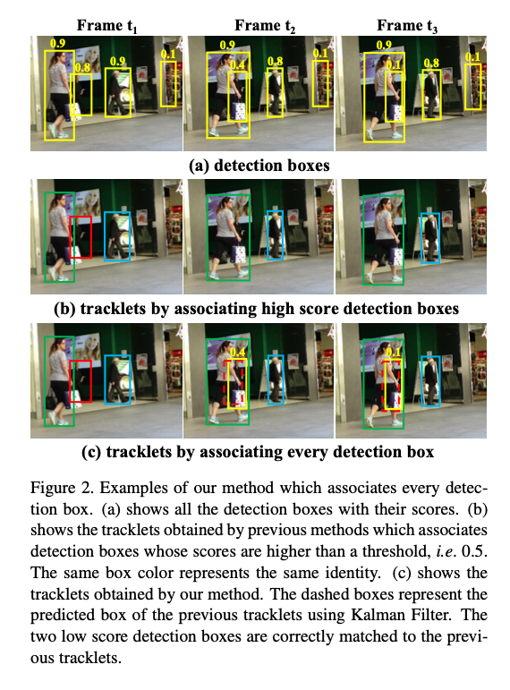
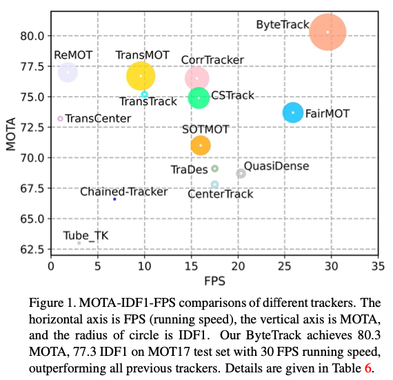
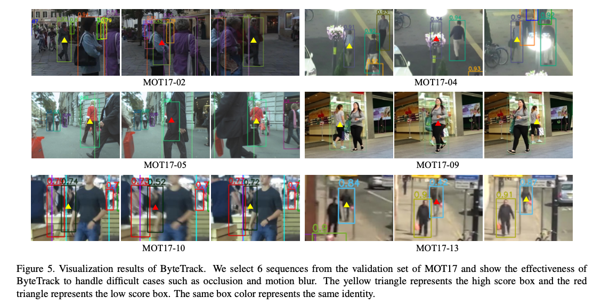

# ByteTrack : Tracking model that also considers low accuracy bounding boxes

# ByteTrack : Tracking model that also considers low accuracy bounding boxes

[](/@cochard-dav?source=post_page---byline--17f5ed70e00c---------------------------------------)

[David Cochard](/@cochard-dav?source=post_page---byline--17f5ed70e00c---------------------------------------)

5 min read

·

Nov 19, 2021

--

1

[Listen](/m/signin?actionUrl=https%3A%2F%2Fmedium.com%2Fplans%3Fdimension%3Dpost_audio_button%26postId%3D17f5ed70e00c&operation=register&redirect=https%3A%2F%2Fmedium.com%2Faxinc-ai%2Fbytetrack-tracking-model-that-also-considers-low-accuracy-bounding-boxes-17f5ed70e00c&source=---header_actions--17f5ed70e00c---------------------post_audio_button------------------)

Share

This is an introduction to「ByteTrack」, a machine learning model that can be used with [ailia SDK](https://ailia.jp/en/). You can easily use this model to create AI applications using [ailia SDK](https://ailia.jp/en/) as well as many other ready-to-use [ailia MODELS](https://github.com/axinc-ai/ailia-models).

---

## Overview

*ByteTrack* is a model for object tracking published in October 2021. By applying *ByteTrack* to the bounding box of people detected by [*YOLOX*](/axinc-ai/yolox-object-detection-model-exceeding-yolov5-d6cea6d3c4bc), you can assign a unique ID to each person. *ByteTrack* is currently the state-of-the-art and outperforms *SiamMOT* and transformer-based tracking models.

Press enter or click to view image in full size


Source: <https://github.com/ifzhang/ByteTrack>

[## ByteTrack: Multi-Object Tracking by Associating Every Detection Box

### Multi-object tracking (MOT) aims at estimating bounding boxes and identities of objects in videos. Most methods obtain…

arxiv.org](https://arxiv.org/abs/2110.06864?source=post_page-----17f5ed70e00c---------------------------------------)

[## GitHub — ifzhang/ByteTrack: ByteTrack: Multi-Object Tracking by Associating Every Detection Box

### ByteTrack is a simple, fast and strong multi-object tracker. ByteTrack: Multi-Object Tracking by Associating Every…

github.com](https://github.com/ifzhang/ByteTrack?source=post_page-----17f5ed70e00c---------------------------------------)

## Architecture

In Multi-Object Tracking (MOT), object detection is first performed using models such as [*YOLOX*](/axinc-ai/yolox-object-detection-model-exceeding-yolov5-d6cea6d3c4bc), and a tracking algorithm is used to track objects in-between frames. However, in real-world applications, the result of object detection is sometimes incomplete, resulting in objects being ignored.

Most object detection algorithms ignore bounding boxes with low confidence values. This is because there is a trade-off since accepting bounding boxes with low confidence values will improve the detection rate (True Positive), but will also cause False Positive.

However, the question whether all bounding boxes with low confidence values should be removed or not is relevant. Even with a low confidence value, the object may still exist, and ignoring it would decrease the efficiency of the tracking model.

The following figure illustrates this problem. In frame `t1`, four people with confidence values above 0.5 are tracked. However, at frames`t2` and `t3`, the score of the person with the red bounding box drops from 0.8 to 0.4 and then further down from 0.4 to 0.1 due to occlusion. As a result, this person is ignored.



Source: <https://arxiv.org/pdf/2110.06864.pdf>

*ByteTrack* solves this problem by using a motion model that manages a queue called *tracklets* to store objects being tracked, and performs tracking and matching between bounding boxes with low confidence values.

In the matching process, an algorithm called *BYTE* is used. First, the positions in the next frame of objects in the *tracklets* are predicted using the *Kalman filter*, then they are matched with high-score detected bounding boxes using *motion similarity*. With *motion similality*, the score is computed by Interaction over Union (IoU), which indicates the amount of overlap between objects (step (b) in the above image shows the results of this first matching).

Next, the algorithm performs a second matching. Objects in the *tracklets* that could not be matched (eg. red boxes in the previous image), are then matched with detected bounding boxes with lower confidence values (step (c) in the above image shows the results of this second matching).

The details of the algorithm are described below. It is a simple tracking algorithm using Kalman filter, therefore it is very fast.


Source: <https://arxiv.org/pdf/2110.06864.pdf>

Despite the simplicity of the method, *ByteTrack* achieves SoTA object tracking.



Source: <https://arxiv.org/pdf/2110.06864.pdf>

Here is an example of detection in each benchmark.

Press enter or click to view image in full size



Source: <https://arxiv.org/pdf/2110.06864.pdf>

And a performance comparison with conventional methods.

Press enter or click to view image in full size


Source: <https://arxiv.org/pdf/2110.06864.pdf>

The object detection step is based on [*YOLOX*](/axinc-ai/yolox-object-detection-model-exceeding-yolov5-d6cea6d3c4bc) trained on the *MOT19* and *MOT20* datasets, where the recognition resolution is 1440x800 for *MOT17* and 1600x896 for *MOT20*. Therefore, *ByteTrack* itself runs fast, but the object detection processing time is rather high.

## Comparison with DeepSort

[*DeepSort*](/axinc-ai/deepsort-a-machine-learning-model-for-tracking-people-1170743b5984)uses *ReID* identification model to link bounding boxes of detected people between frames, and for those who could not be linked, *Sort* uses the prediction of bounding box movement calculated by Kalman filter to link them between frames. However, this is only done for bounding boxes with high confidence values.

*ByteTrack* does not use *ReID*, but uses only the movement prediction of bounding boxes calculated using the Kalman filter to track people between frames. Therefore, it is technically similar to *Sort* step used in *DeepSort*. However, performance have been improved by splitting the processing in two steps, the first one targeting the bounding boxes with high confidence values, the second one for the ones with low confidence values.

## Usage

*ByteTrack* can be used with ailia SDK by running the following command.

```
$ python3 bytetrack.py -v 0
```

You will need to install the `lap` library as a dependency.

```
$ pip3 install lap
```

To run faster, use the `-m` option to swap the object detection model for a lighter version of YOLOX, for example `yolox_s` in the command below.

```
$ python3 bytetrack.py -v 0 -m yolox_s
```

[## ailia-models/object\_tracking/bytetrack at master · axinc-ai/ailia-models

### (Video from https://vimeo.com/60139361) This model requires additional module. Automatically downloads the onnx and…

github.com](https://github.com/axinc-ai/ailia-models/tree/master/object_tracking/bytetrack?source=post_page-----17f5ed70e00c---------------------------------------)

---

[ax Inc.](https://axinc.jp/en/) has developed [ailia SDK](https://ailia.jp/en/), which enables cross-platform, GPU-based rapid inference.

ax Inc. provides a wide range of services from consulting and model creation, to the development of AI-based applications and SDKs. Feel free to [contact us](https://axinc.jp/en/) for any inquiry.