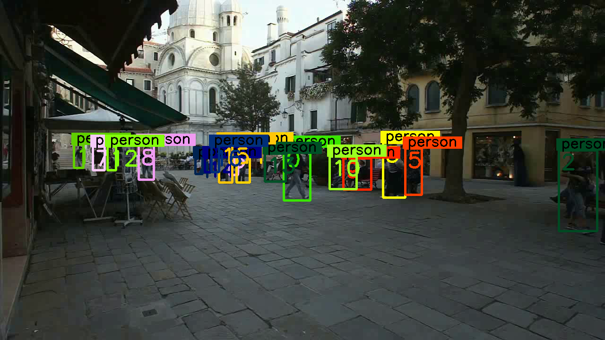
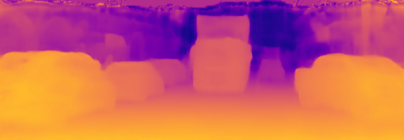

# Released ailia SDK 1.2.9

# Released ailia SDK 1.2.9

[](/@cochard-dav?source=post_page---byline--d9121216ad1e---------------------------------------)

[David Cochard](/@cochard-dav?source=post_page---byline--d9121216ad1e---------------------------------------)

4 min read

·

Dec 1, 2021

--

[Listen](/m/signin?actionUrl=https%3A%2F%2Fmedium.com%2Fplans%3Fdimension%3Dpost_audio_button%26postId%3Dd9121216ad1e&operation=register&redirect=https%3A%2F%2Fmedium.com%2Faxinc-ai%2Freleased-ailia-sdk-1-2-9-d9121216ad1e&source=---header_actions--d9121216ad1e---------------------post_audio_button------------------)

Share

We are pleased to introduce version 1.2.9 of ailia SDK, a cross-platform framework to perform fast AI inference on GPU or CPU. You can find more information about ailia SDK on the [official website](https://ailia.jp/en/).

---

## Optimization for Arm NEON

The inference performance in Arm environments such as Android and Mac M1 has been greatly improved using inline NEON assembly and various optimizations based on Arm big.LITTLE architecture.

## Unification of the Android inference backend to Vulkan

Google has announced the end of support for *RenderScript* from Android 12 and [recommends to migrate to Vulkan](https://developer.android.com/guide/topics/renderscript/migrate). In line with this, we have ended support for *RenderScript* in the ailia SDK and migrated the inference backend to *Vulkan*.

## Multiple input/output support for JNI

The support for multiple input/output has been added to JNI in order to run more complex models on Android platform.

[## GitHub — axinc-ai/ailia-android-studio: ailia example for android studio

### ailia example for android studio. Contribute to axinc-ai/ailia-android-studio development by creating an account on…

github.com](https://github.com/axinc-ai/ailia-android-studio?source=post_page-----d9121216ad1e---------------------------------------)

## Enhancements of memory saving mode in Python

We added a memory-saving mode to the *Classifier* and *Detector* APIs in Python, similar to the *Predict* API, where `memory_mode` can be given as an argument when creating an instance.

## YOLOX support via the *Detector* API

The Detector API now supports [YOLOX](/axinc-ai/yolox-object-detection-model-exceeding-yolov5-d6cea6d3c4bc), a highly accurate object detection model, and existing apps can be converted to YOLOX by simply rewriting the arguments of the Detector API. Since the pre-processing and post-processing is now done in C++, it runs faster than doing the pre-processing and post-processing in Python. In addition, BGR data can now be given as argument instead of BGRA so that unnecessary color format conversions can be avoided.

```
#yolov4  
detector = ailia.Detector( MODEL_PATH, WEIGHT_PATH,            len(COCO_CATEGORY), format=ailia.NETWORK_IMAGE_FORMAT_RGB,  channel=ailia.NETWORK_IMAGE_CHANNEL_FIRST,            range=ailia.NETWORK_IMAGE_RANGE_U_FP32,            algorithm=ailia.DETECTOR_ALGORITHM_YOLOV4, env_id=args.env_id)#yolox  
detector = ailia.Detector( MODEL_PATH, WEIGHT_PATH, len(COCO_CATEGORY), format=ailia.NETWORK_IMAGE_FORMAT_BGR, channel=ailia.NETWORK_IMAGE_CHANNEL_FIRST, range=ailia.NETWORK_IMAGE_RANGE_U_INT8, algorithm=ailia.DETECTOR_ALGORITHM_YOLOX, env_id=args.env_id)
```

[## ailia-models/object\_detection/yolox at master · axinc-ai/ailia-models

### (Image from https://github.com/RangiLyu/nanodet/blob/main/demo\_mnn/imgs/000252.jpg) Ailia input shape: (1, 3, 416…

github.com](https://github.com/axinc-ai/ailia-models/tree/master/object_detection/yolox?source=post_page-----d9121216ad1e---------------------------------------)

## Python 3.10 support

`collections.abc.Sequence` alias is no longer supported in Python 3.10 causing issues with the run API. If you encounter the following errors with ailia SDK 1.2.8, please update to ailia SDK 1.2.9.

```
File "Python310\lib\site-packages\ailia\wrapper.py", line 407, in run  
    elif isinstance(input, collections.Sequence) :  
AttributeError: module 'collections' has no attribute 'Sequence'
```

## Support of new layers

The support of the *SoftSign* layer and `opset=12` for some layers was added. We are planning to officially support opset=12 to 14 in ailia SDK 1.2.10. For example the model *HitNet* recently added to ailia MODELS uses opset=12.

[## ailia-models/depth\_estimation/hitnet at master · axinc-ai/ailia-models

### (Image from https://vision.middlebury.edu/stereo/data/scenes2003/) Shape : (1, 6, 640, 480) Shape : (640, 480, 1)…

github.com](https://github.com/axinc-ai/ailia-models/tree/master/depth_estimation/hitnet?source=post_page-----d9121216ad1e---------------------------------------)

## Automatic management of evaluation license file

When installing the evaluation version of ailia SDK with `pip`, the license file is now automatically copied. The license file will also be automatically copied when you build your app in Unity.

## Addition of new models

The following models will be newly supported in ailia SDK 1.2.9.

*SiamMOT* : Siamese Multi-Object Tracking

Press enter or click to view image in full size



Source: <https://vimeo.com/60139361>

[## ailia-models/object\_tracking/siam-mot at master · axinc-ai/ailia-models

### (Video from https://vimeo.com/60139361) Automatically downloads the onnx and prototxt files on the first run. It is…

github.com](https://github.com/axinc-ai/ailia-models/tree/master/object_tracking/siam-mot?source=post_page-----d9121216ad1e---------------------------------------)

*BackGroundMattingV2* : Background removal model

Press enter or click to view image in full size


Source: <https://github.com/PeterL1n/BackgroundMattingV2#video--image-examples>

[## ailia-models/background\_removal/background\_matting\_v2 at master · axinc-ai/ailia-models

### (Image from https://drive.google.com/drive/folders/16H6Vz3294J-DEzauw06j4IUARRqYGgRD) Automatically downloads the onnx…

github.com](https://github.com/axinc-ai/ailia-models/tree/master/background_removal/background_matting_v2?source=post_page-----d9121216ad1e---------------------------------------)

*HitNet* : Depth estimation model from stereo camera


Source: <https://vision.middlebury.edu/stereo/data/scenes2003/>

[## ailia-models/depth\_estimation/hitnet at master · axinc-ai/ailia-models

### (Image from https://vision.middlebury.edu/stereo/data/scenes2003/) Shape : (1, 6, 640, 480) Shape : (640, 480, 1)…

github.com](https://github.com/axinc-ai/ailia-models/tree/master/depth_estimation/hitnet?source=post_page-----d9121216ad1e---------------------------------------)

*LapDepth* : Monocular depth estimation model

Press enter or click to view image in full size



Source: <https://github.com/tjqansthd/LapDepth-release/blob/master/example/kitti_demo.jpg>

[## ailia-models/depth\_estimation/lap-depth at master · axinc-ai/ailia-models

### (Image from https://github.com/tjqansthd/LapDepth-release/blob/master/example/kitti\_demo.jpg) (Image from…

github.com](https://github.com/axinc-ai/ailia-models/tree/master/depth_estimation/lap-depth?source=post_page-----d9121216ad1e---------------------------------------)

*RestyleEncoder* : “Toonification” of face images

Press enter or click to view image in full size


Source: <https://github.com/yuval-alaluf/restyle-encoder/tree/main/notebooks/images>

[## ailia-models/generative\_adversarial\_networks/restyle-encoder at master · axinc-ai/ailia-models

### (Image from https://github.com/yuval-alaluf/restyle-encoder/blob/main/notebooks/images/) Shape : (1, 3, 1024, 1024)…

github.com](https://github.com/axinc-ai/ailia-models/tree/master/generative_adversarial_networks/restyle-encoder?source=post_page-----d9121216ad1e---------------------------------------)

*SAM* : Age transformation for face images

Press enter or click to view image in full size


Source: <https://github.com/yuval-alaluf/SAM/blob/master/notebooks/images/866.jpg>

[## ailia-models/generative\_adversarial\_networks/sam at master · axinc-ai/ailia-models

### (Image from https://github.com/yuval-alaluf/SAM/blob/master/notebooks/images/866.jpg) Shape : (1, 3, 1024, 1024) Face…

github.com](https://github.com/axinc-ai/ailia-models/tree/master/generative_adversarial_networks/sam?source=post_page-----d9121216ad1e---------------------------------------)

---

[ax Inc.](https://axinc.jp/en/) has developed [ailia SDK](https://ailia.jp/en/), which enables cross-platform, GPU-based rapid inference.

ax Inc. provides a wide range of services from consulting and model creation, to the development of AI-based applications and SDKs. Feel free to [contact us](https://axinc.jp/en/) for any inquiry.