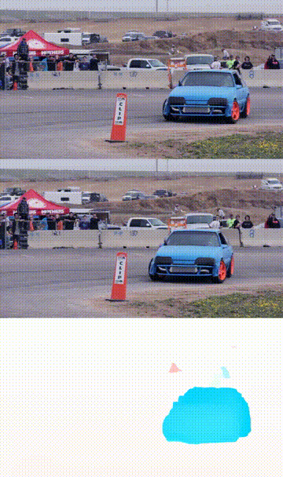
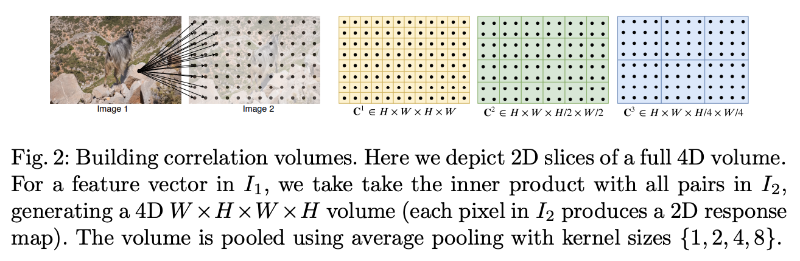
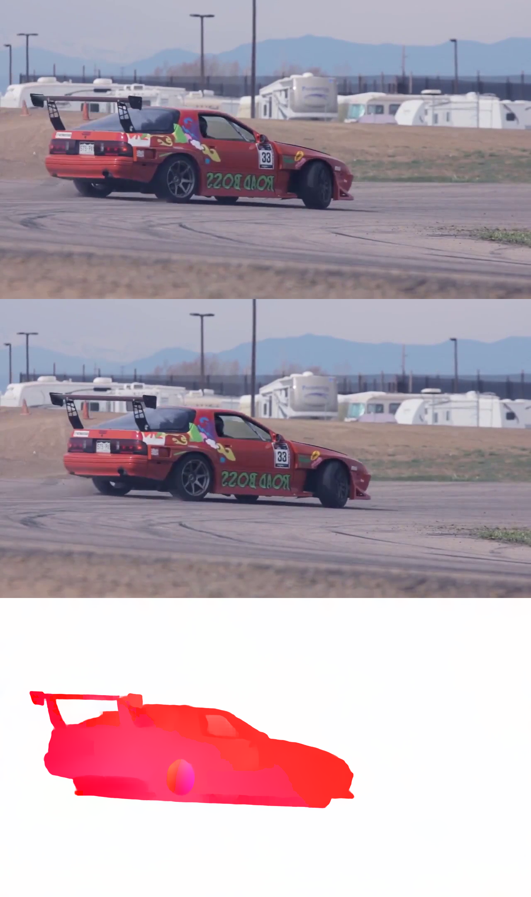
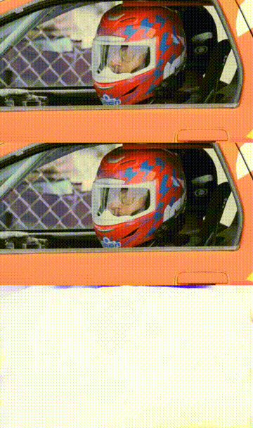

# RAFT: A Machine Learning Model for Estimating Optical Flow

# RAFT: A Machine Learning Model for Estimating Optical Flow

[](/@cochard-dav?source=post_page---byline--6ab6d077e178---------------------------------------)

[David Cochard](/@cochard-dav?source=post_page---byline--6ab6d077e178---------------------------------------)

6 min read

·

Jan 4, 2022

--

[Listen](/m/signin?actionUrl=https%3A%2F%2Fmedium.com%2Fplans%3Fdimension%3Dpost_audio_button%26postId%3D6ab6d077e178&operation=register&redirect=https%3A%2F%2Fmedium.com%2Faxinc-ai%2Fraft-a-machine-learning-model-for-estimating-optical-flow-6ab6d077e178&source=---header_actions--6ab6d077e178---------------------post_audio_button------------------)

Share

This is an introduction to「RAFT」, a machine learning model that can be used with [ailia SDK](https://ailia.jp/en/). You can easily use this model to create AI applications using [ailia SDK](https://ailia.jp/en/) as well as many other ready-to-use [ailia MODELS](https://github.com/axinc-ai/ailia-models).

---

## Overview

*RAFT (Recurrent All-pairs Field Transforms)* is the latest optical flow estimation technology presented by the [PRINCETON VISION & LEARNING LAB](https://pvl.cs.princeton.edu/), a laboratory at the prestigious Princeton University. At the time of publication, [the paper](https://arxiv.org/pdf/2003.12039.pdf) has achieved State-of-The-Art performance on well-known datasets such as KITTI and Sintel, and has been selected as the Best Paper at the ECCV 2020, the world’s leading image processing conference.

[## RAFT: Recurrent All-Pairs Field Transforms for Optical Flow

### We introduce Recurrent All-Pairs Field Transforms (RAFT), a new deep network architecture for optical flow. RAFT…

arxiv.org](https://arxiv.org/abs/2003.12039?source=post_page-----6ab6d077e178---------------------------------------)

*Optical flow* is a vector representation that quantifies the movement of an element between two frames in a video. In the example below we are tracking the optical flow of the red dot over 5 frames.


Source: <https://www.bitcraze.io/2017/11/optical-flow/>

(⊿x, ⊿y) is the distance vector of the red dot when the image transitioned from Frame 2 to Frame 3. In other words, if the coordinates of the red point in Frame 2 are (x, y), then the coordinates of the red point in Frame 3 will be (x+Δx, y+Δy), so the optical flow at coordinates (x, y) will be (Δx, Δy).

For RAFT and other optical flow estimation using deep learning, we basically compute this value for every pixel in the image. This is commonly described as *Dense Optical Flow Estimation*. Optical flow at coordinates (0, 0) is (⊿a, ⊿b), optical flow at coordinates (0, 1) is (⊿c, ⊿d), and so on.

On the other hand, the old way of performing optical flow estimation was done only for specific image regions that were strongly characterized, such as object corners and color boundaries. This is commonly described as *Sparse Optical Flow Estimation*.

Below is a comparison of *Sparse Optical Flow Estimation* on the left, and *Dense Optical Flow Estimation* on the right.


Source: <https://nanonets.com/blog/optical-flow/>

The sparse optical flow estimation on the left side shows that the estimation is performed only for a specific part of the image, such as a car. The green line represents the trajectory of where the corner of the car in the previous frame transitions to in the next frame. On the other hand, optical flow is not estimated for image areas that are fixed, such as roads, buildings, skies, trees, or even some cars with weak visibility characteristics.

The dense optical flow estimation on the right is a bit confusing, but the estimation is done for all pixels. The colored areas are the areas where strong optical flow is estimated, and the black areas are the areas where optical flow estimation is weak.

Dense optical flow estimation can also be expressed as below.


Source: <https://pixabay.com/videos/car-racing-motor-sports-action-74/>

The upper image is the previous frame, the following one is the current frame, and the last image is the estimated optical flow between the 2 frames.

The optical flow vector coloring scheme maps to the color wheel below to show the vector direction. For example pixels are light blue blue when the car is moving to the left, and red when the car is moving to the right.


Optical flow estimation only tracks the relative motion of objects from on frame to the next, not the actual motion of objects in the real world. Therefore, if the camera moves during the video, optical flow estimation also occurs against the background.



Source: <https://pixabay.com/videos/car-racing-motor-sports-action-74/>

The dense optical flow estimations above were computed using the model from the public RAFT github repository.

[## GitHub - princeton-vl/RAFT

### This repository contains the source code for our paper: RAFT: Recurrent All Pairs Field Transforms for Optical Flow…

github.com](https://github.com/princeton-vl/RAFT?source=post_page-----6ab6d077e178---------------------------------------)

## Architecture

The network architecture is presented as follows.

Press enter or click to view image in full size


Source: <https://arxiv.org/pdf/2003.12039.pdf>

In the steps described above, the *4D Correlation Volumes* contains high values for pixels that are similar in appearance, and low values for pixels that are not. This 4D Correlation Volumes is then processed by average pooling the last two dimensions with kernel sizes 1, 2, 4, and 8.

More details on those steps are given in the paper, but basically the pipeline can be seen as 3 stages:

[1] feature extraction  
[2] computing visual similarity  
[3] iterative updates

The first step, “[1] feature extraction” is similar to what is done in general deep learning architectures using convolutional networks in order to emphasize significant features.

The second step, “[2] computing visual similarity”, aims at calculating the similarity between a specific part of the previous frame image and each part of the subsequent frame image in a brute force fashion.

Press enter or click to view image in full size



Source: <https://arxiv.org/pdf/2003.12039.pdf>

Finally, the third stage, “[3] Iterative updating,” is an approach that increases accuracy by iteratively performing inferences. In other words, if the number of iterations is small, the calculation time is short but the accuracy is relatively low, and if the number of iterations is large, the calculation time is long but the accuracy tends to be relatively high.

The following figure shows the optical flow estimates for each iteration for two specific frames of the racing car video introduced earlier. The higher the number of iterations, the better the accuracy.

Press enter or click to view image in full size


It is obvious from the SOTA results that the above architectural innovations were able to achieve high accuracy, but they also require high cost performance in terms of the time required for training as well as processing time required for inference.

Press enter or click to view image in full size


Source: <https://arxiv.org/pdf/2003.12039.pdf>

In the graphs above, the vertical axis represents the amount of errors. Thus, the lower it is, the more accurate the model is.

The horizontal axis of the left graph is the number of parameters. For hardware with limited memory capacity such as smartphone, it is preferable to have a small number of parameters.

The horizontal axis of the middle graph shows the time required for inference.  
The lower the value, the more inference can be done in real time.

The horizontal axis of the right graph shows the amount of iterations required for training the model. The lower the value, the easier it is to create a new specialized model for a new target.

## Usage

RAFT can be used with ailia SDK with the code below.

[## ailia-models/optical\_flow\_estimation/raft at master · axinc-ai/ailia-models

### （1 frame before） （1 frame after） (from https://pixabay.com/videos/car-racing-motor-sports-action-74/) （estimated…

github.com](https://github.com/axinc-ai/ailia-models/tree/master/optical_flow_estimation/raft?source=post_page-----6ab6d077e178---------------------------------------)

Run the following command to perform inference on a single image.

```
$ python3 raft.py --inputs input_before.png input_after.png --savepath output.png
```

Below is the result you can expect.

Press enter or click to view image in full size



Run the following command to perform inference on video file.

```
$ python3 raft.py --video input.mp4 --savepath output.mp4
```

Below is the result you can expect.



---

[ax Inc.](https://axinc.jp/en/) has developed [ailia SDK](https://ailia.jp/en/), which enables cross-platform, GPU-based rapid inference.

ax Inc. provides a wide range of services from consulting and model creation, to the development of AI-based applications and SDKs. Feel free to [contact us](https://axinc.jp/en/) for any inquiry.