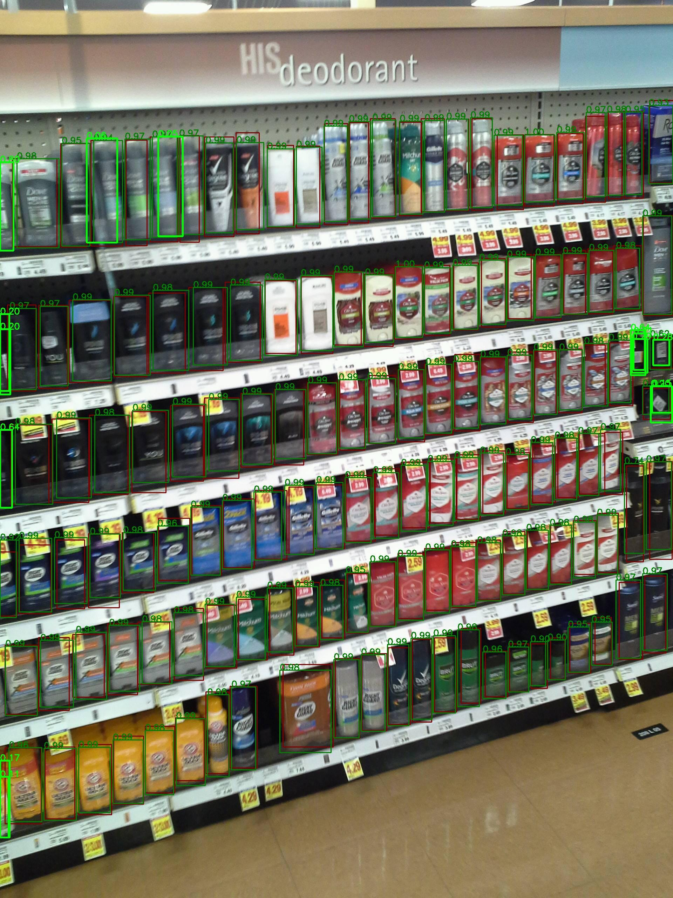

# SKU110K-DenseDet : A Machine Learning Model That Can Detect Products in a Store.

# SKU110K-DenseDet : A Machine Learning Model That Can Detect Products in a Store.

[](/@cochard-dav?source=post_page---byline--baf9d98cb441---------------------------------------)

[David Cochard](/@cochard-dav?source=post_page---byline--baf9d98cb441---------------------------------------)

3 min read

·

Jan 6, 2022

--

[Listen](/m/signin?actionUrl=https%3A%2F%2Fmedium.com%2Fplans%3Fdimension%3Dpost_audio_button%26postId%3Dbaf9d98cb441&operation=register&redirect=https%3A%2F%2Fmedium.com%2Faxinc-ai%2Fsku110k-densedet-a-machine-learning-model-that-can-detect-products-in-a-store-baf9d98cb441&source=---header_actions--baf9d98cb441---------------------post_audio_button------------------)

Share

This is an introduction to「SKU110K-DenseDet」, a machine learning model that can be used with [ailia SDK](https://ailia.jp/en/). You can easily use this model to create AI applications using [ailia SDK](https://ailia.jp/en/) as well as many other ready-to-use [ailia MODELS](https://github.com/axinc-ai/ailia-models).

---

## Overview

*SKU110K-DenseDet* is a machine learning model that can detect products in a store. It can detect the bounding boxes of products presented on a supermarket shelf, but there is no categorization, only the presence of a product is detected.

Press enter or click to view image in full size



Source: <https://github.com/Media-Smart/SKU110K-DenseDet>

[## A Solution to Product detection in Densely Packed Scenes

### This work is a solution to densely packed scenes dataset SKU-110k. Our work is modified from Cascade R-CNN. To solve…

arxiv.org](https://arxiv.org/abs/2007.11946?source=post_page-----baf9d98cb441---------------------------------------)

[## GitHub — Media-Smart/SKU110K-DenseDet: A state of art detector for densely packed scenes dataset…

### A state of art detector for densely packed scenes dataset SKU-110K. For more information, please read our technical…

github.com](https://github.com/Media-Smart/SKU110K-DenseDet?source=post_page-----baf9d98cb441---------------------------------------)

## About SKU110K

*SKU110K* is a data set for product detection published in April 2019 which contains 11,762 images taken with cell phones in thousands of supermarkets around the world (United States, Europe, East Asia). Bounding boxes were manually annotated. It contains 90,968 bounding boxes in 8,233 images for training and 432,312 bounding boxes in 2,941 images for validation.


Source: <https://arxiv.org/pdf/1904.00853.pdf>

[## GitHub — eg4000/SKU110K\_CVPR19

### Dataset and Codebase for CVPR2019 “Precise Detection in Densely Packed Scenes” [Paper link] A typical image in our…

github.com](https://github.com/eg4000/SKU110K_CVPR19?source=post_page-----baf9d98cb441---------------------------------------)

[## Precise Detection in Densely Packed Scenes

### Man-made scenes can be densely packed, containing numerous objects, often identical, positioned in close proximity. We…

arxiv.org](https://arxiv.org/abs/1904.00853?source=post_page-----baf9d98cb441---------------------------------------)

## Architecture

*SKU110K-DenseDet* was trained using *MMDetection*. It achieves a 58.0% mAP using [Cascade R-CNN](https://paperswithcode.com/method/cascade-r-cnn). The backbone uses *ResNXt-101*.

Since *SKU110K* contains many small objects, usual architectures and input resolutions for object detection is not accurate enough. Therefore input size of images is set to 2560x2560.

In environments with low GPU memory, random cropping of images is used during training, in a way that it does not negatively impact the training results.

*SKU110K* contains on average 150 bounding boxes per image. This is significantly more than *MS COCO* and default hyper parameters are not optimal. Hence the max positive sample number of both RPN and R-CNN sampler were adjusted to release the limits.

## Usage

*SKU110K-DenseDet* can be executed using ailia SDK with the following command. Due to the huge size of the backbone, please specify `-e 0` to run in CPU mode in environments with low GPU memory.

```
$ python3 sku110k-densedet.py -i input.jpg -e 0
```

[## ailia-models/object\_detection/sku110k-densedet at master · axinc-ai/ailia-models

### (Image from https://github.com/eg4000/SKU110K\_CVPR19) Shape : (1, 3, 2560, 2560) det\_bboxes shape : (n, 5) det\_labels…

github.com](https://github.com/axinc-ai/ailia-models/tree/master/object_detection/sku110k-densedet?source=post_page-----baf9d98cb441---------------------------------------)

---

[ax Inc.](https://axinc.jp/en/) has developed [ailia SDK](https://ailia.jp/en/), which enables cross-platform, GPU-based rapid inference.

ax Inc. provides a wide range of services from consulting and model creation, to the development of AI-based applications and SDKs. Feel free to [contact us](https://axinc.jp/en/) for any inquiry.