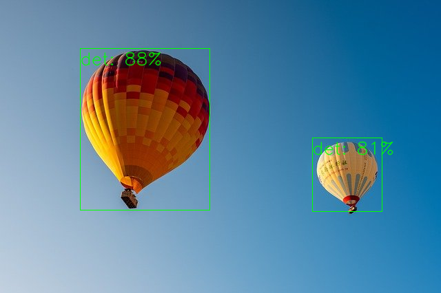

# MobileObjectLocalizer : Class-agnostic Mobile Object Detector

# MobileObjectLocalizer : Class-agnostic Mobile Object Detector

[](/@cochard-dav?source=post_page---byline--b740c0ceb16c---------------------------------------)

[David Cochard](/@cochard-dav?source=post_page---byline--b740c0ceb16c---------------------------------------)

2 min read

·

Jan 7, 2022

--

[Listen](/m/signin?actionUrl=https%3A%2F%2Fmedium.com%2Fplans%3Fdimension%3Dpost_audio_button%26postId%3Db740c0ceb16c&operation=register&redirect=https%3A%2F%2Fmedium.com%2Faxinc-ai%2Fmobileobjectlocalizer-class-agnostic-mobile-object-detector-b740c0ceb16c&source=---header_actions--b740c0ceb16c---------------------post_audio_button------------------)

Share

This is an introduction to「MobileObjectLocalizer」, a machine learning model that can be used with [ailia SDK](https://ailia.jp/en/). You can easily use this model to create AI applications using [ailia SDK](https://ailia.jp/en/) as well as many other ready-to-use [ailia MODELS](https://github.com/axinc-ai/ailia-models).

---

## Overview

*MobileObjectLocalizer* is a general-purpose object detection model developed by Google that can be used for any type of object. Unlike models such as [YOLO](/axinc-ai/yolox-object-detection-model-exceeding-yolov5-d6cea6d3c4bc) which classifies objects among the 80 classes of COCO, *MobileObjectLocalizer* does not assign any category but it can detect any object.



Source: <https://pixabay.com/photos/hot-air-balloons-sky-sunrise-dawn-4561263/>

[## TensorFlow Hub

### A class-agnostic mobile object detector

tfhub.dev](https://tfhub.dev/google/object_detection/mobile_object_localizer_v1/1?source=post_page-----b740c0ceb16c---------------------------------------)

## Architecture

*MobileObjectLocalizer* uses *MobileNetV2* and *SSD-Lite*. The input resolution is 192x192, and it outputs up to 100 bounding boxes.

Although the accuracy is not that high, it can detect the bounding box of any object without learning. It can be used for various applications, such as creating a 1000-class discriminator by adding *ResNet50* in the later stage, or using it for auto-focus by detecting the bounding box with the highest confidence value on the screen.

## Usage

You can use *MobileObjectLocalizer* with ailia SDK using the following command.

```
$ python3 mobile_object_localizer.py -v 0
```

[## ailia-models/object\_detection/mobile\_object\_localizer at master · axinc-ai/ailia-models

### (Image from https://commons.wikimedia.org/wiki/File:Il\_cuore\_di\_Como.jpg) Shape : (1, 3, 192, 192) detection\_boxes…

github.com](https://github.com/axinc-ai/ailia-models/tree/master/object_detection/mobile_object_localizer?source=post_page-----b740c0ceb16c---------------------------------------)

Here is an example output.

---

[ax Inc.](https://axinc.jp/en/) has developed [ailia SDK](https://ailia.jp/en/), which enables cross-platform, GPU-based rapid inference.

ax Inc. provides a wide range of services from consulting and model creation, to the development of AI-based applications and SDKs. Feel free to [contact us](https://axinc.jp/en/) for any inquiry.