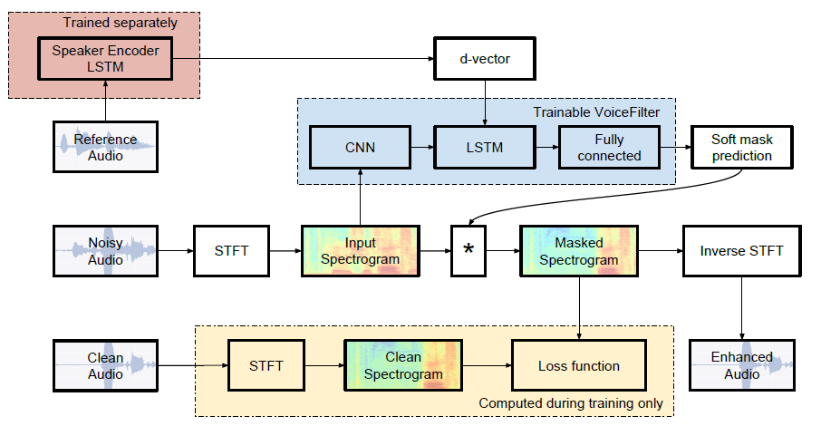
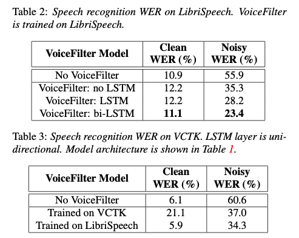

# VoiceFilter : Targeted Voice Separation Model

# VoiceFilter : Targeted Voice Separation Model

[](/@cochard-dav?source=post_page---byline--6fe6f85309ea---------------------------------------)

[David Cochard](/@cochard-dav?source=post_page---byline--6fe6f85309ea---------------------------------------)

3 min read

·

Jan 26, 2022

--

[Listen](/m/signin?actionUrl=https%3A%2F%2Fmedium.com%2Fplans%3Fdimension%3Dpost_audio_button%26postId%3D6fe6f85309ea&operation=register&redirect=https%3A%2F%2Fmedium.com%2Faxinc-ai%2Fvoicefilter-targeted-voice-separation-model-6fe6f85309ea&source=---header_actions--6fe6f85309ea---------------------post_audio_button------------------)

Share

This is an introduction to「VoiceFilter」, a machine learning model that can be used with [ailia SDK](https://ailia.jp/en/). You can easily use this model to create AI applications using [ailia SDK](https://ailia.jp/en/) as well as many other ready-to-use [ailia MODELS](https://github.com/axinc-ai/ailia-models).

---

## Overview

*VoiceFilter* is a speech separation model developed by Google AI and released in May 2020. It is capable of extracting the voice of an designated person from an audio file in which multiple people are speaking at the same time.

[## VoiceFilter: Targeted Voice Separation by Speaker-Conditioned Spectrogram Masking

### In this paper, we present a novel system that separates the voice of a target speaker from multi-speaker signals, by…

arxiv.org](https://arxiv.org/abs/1810.04826?source=post_page-----6fe6f85309ea---------------------------------------)

[## GitHub — mindslab-ai/voicefilter: Unofficial PyTorch implementation of Google AI’s VoiceFilter…

### Hi everyone! It’s Seung-won from MINDs Lab, Inc. It’s been a long time since I’ve released this open-source, and I…

github.com](https://github.com/mindslab-ai/voicefilter?source=post_page-----6fe6f85309ea---------------------------------------)

## Architecture

Although the performance of speech recognition has increased in recent years, the accuracy in environments where multiple people are talking is not sufficient. To solve this problem, it is important to improve the recognition by using *speech separation* to extract the voices from different speakers. However, it is a complex problem to know how many people are currently speaking. Also, speakers need to be labeled, which requires the use of *deep clustering* or *deep attractor network*.

The proposed method in this model treats all voices other than the target speaker (whose voice we want to extract) as noise. In addition, it is assumed that a sample of the voice of the target speaker is provided for reference. This method is similar to the traditional task of *speech separation*, but it is targeted to a designated individual. This speaker-dependent speech separation task is often referred to as as *voice filtering*.

In the *VoiceFilter* architecture, two types of models are used: a *speaker recognition network* that produces speaker-discriminative embeddings (aka *d-vectors*), and a *spectrogram masking network* which extracts a specific person’s voice from a noisy spectrogram of several people talking and the target speaker embeddings as input.

Press enter or click to view image in full size



Source: <https://github.com/mindslab-ai/voicefilter>

The *speaker recognition network* computes speaker embedding d-vectors based on a 3-layer LSTM. It takes as input a spectrogram extracted from windows of 1600 ms, and outputs speaker embeddings with a fixed dimension of 256. A d-vector is computed by sliding windows with 50% overlap, and averaging the L2-normalized d-vectors obtained on each window.

The *VoiceFilter* system calculates a *magnitude spectrogram* from “noisy audio” (recording with mixed voices of multiple people). This *magnitude spectrogram* is then multiplied with a soft mask produced from the d-vector, and merged with the phase of the noisy audio. The result is then processed by applying an inverse STFT to obtain the output waveform.

*Word Error Rate (WER)* was used to evaluate the model accuracy on the *LibriSpeech* and *VCTK* datasets. The speech recognizer used for the WER evaluation was trained on a YouTube dataset.

In the tables below, *Clean WER* refers to WER for clean audio, and *Noisy WER* refers to WER for noisy audio. Using *VoiceFilter*, the error rate for noisy audio is reduced from 55.9% to 23.4%.



Source: <https://arxiv.org/abs/1810.04826>

## Usage

You can use *VoiceFilter* with ailia SDK using the following command. `mixed.wav` refers to the the audio of several people talking, and `ref-voice.wav` is the reference sample of the voice of the target speaker.

```
$ python3 voicefilter.py --input mixed.wav --reference_file ref-voice.wav
```

[## ailia-models/audio\_processing/voicefilter at master · axinc-ai/ailia-models

### Audio file Reference audio for d-vector Input an audio file that is spoken by multiple people and an audio file that…

github.com](https://github.com/axinc-ai/ailia-models/tree/master/audio_processing/voicefilter?source=post_page-----6fe6f85309ea---------------------------------------)

---

[ax Inc.](https://axinc.jp/en/) has developed [ailia SDK](https://ailia.jp/en/), which enables cross-platform, GPU-based rapid inference.

ax Inc. provides a wide range of services from consulting and model creation, to the development of AI-based applications and SDKs. Feel free to [contact us](https://axinc.jp/en/) for any inquiry.