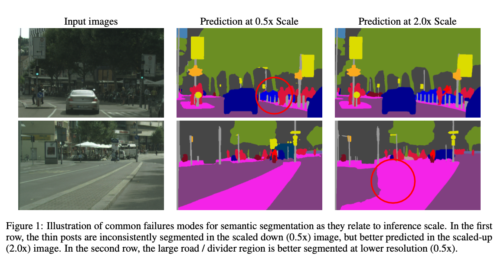

# PaddleSeg: Highly Accurate Segmentation Model Using Hierarchical Attention

# PaddleSeg: Highly Accurate Segmentation Model Using Hierarchical Attention

[](/@cochard-dav?source=post_page---byline--18e69363dc2a---------------------------------------)

[David Cochard](/@cochard-dav?source=post_page---byline--18e69363dc2a---------------------------------------)

3 min read

·

Jan 31, 2022

--

2

[Listen](/m/signin?actionUrl=https%3A%2F%2Fmedium.com%2Fplans%3Fdimension%3Dpost_audio_button%26postId%3D18e69363dc2a&operation=register&redirect=https%3A%2F%2Fmedium.com%2Faxinc-ai%2Fpaddleseg-highly-accurate-segmentation-model-using-hierarchical-attention-18e69363dc2a&source=---header_actions--18e69363dc2a---------------------post_audio_button------------------)

Share

This is an introduction to「PaddleSeg」, a machine learning model that can be used with [ailia SDK](https://ailia.jp/en/). You can easily use this model to create AI applications using [ailia SDK](https://ailia.jp/en/) as well as many other ready-to-use [ailia MODELS](https://github.com/axinc-ai/ailia-models).

---

## Overview

*PaddleSeg* is a highly accurate segmentation model based on *PaddlePaddle (Baidu)* and release in May 2020. Its multi-scale attention system achieves state-of-the-art results on the *Cityscapes* dataset.


Source: <https://github.com/PaddlePaddle/PaddleSeg/tree/release/2.3/contrib/CityscapesSOTA>

[## Hierarchical Multi-Scale Attention for Semantic Segmentation

### Multi-scale inference is commonly used to improve the results of semantic segmentation. Multiple images scales are…

arxiv.org](https://arxiv.org/abs/2005.10821?source=post_page-----18e69363dc2a---------------------------------------)

[## PaddleSeg/contrib/CityscapesSOTA at release/2.3 · PaddlePaddle/PaddleSeg

### The implementation of Hierarchical Multi-Scale Attention based on PaddlePaddle. [Paper] Based on the above work, we…

github.com](https://github.com/PaddlePaddle/PaddleSeg/tree/release/2.3/contrib/CityscapesSOTA?source=post_page-----18e69363dc2a---------------------------------------)

## Architecture

In segmentation, multi-scale inference is often used. Images of different resolutions are input to the network and the results are averaged or combined based on maximum values.

*PaddleSeg* proposes a *multi-scale* approach coupled with an *attention* mechanism. This allows the network to learn which scale of image is preferable to use in each case and output better segmentation.

For example, in the example below, the thin pole disappears at a scale of 0.5x. At a scale of 2.0x, the poles is correctly segmented, but conversely, the accuracy of the road segmentation decreases. The *attention* mechanism is then used to combines those results and get the best segmentation result possible.

Press enter or click to view image in full size



Source: <https://arxiv.org/abs/2005.10821>

Also, *attention* is done in a hierarchical manner. In explicit attention, the coefficients of the composition of the output of each segmentation are obtained directly. *Explicit attention* directly finds the coefficients for each scale and compose them to compute final result. By doing attention in a hierarchical manner, the number of coefficients to be computed can be reduced and training can be done faster.

Press enter or click to view image in full size


Source: <https://arxiv.org/abs/2005.10821>

The backbone used for this model is *HRNet\_w48*.

*PaddleSeg* has achieved state-of-the-art results on the *Cityscapes* data set.

Press enter or click to view image in full size


Source: <https://arxiv.org/abs/2005.10821>

## Usage

You can use *PaddleSeg* with ailia SDK with the following command. The segmentation is performed on image `input.jpg` , the output composite image `output.jpg` and the mask image `output_mask.jpg` are generated.

```
$ python3 paddleseg.py --input input.jpg --savepath output.jpg
```

[## ailia-models/image\_segmentation/paddleseg at master · axinc-ai/ailia-models

### (Image from https://www.cityscapes-dataset.com/downloads/) Automatically downloads the onnx and prototxt files on the…

github.com](https://github.com/axinc-ai/ailia-models/tree/master/image_segmentation/paddleseg?source=post_page-----18e69363dc2a---------------------------------------)

---

[ax Inc.](https://axinc.jp/en/) has developed [ailia SDK](https://ailia.jp/en/), which enables cross-platform, GPU-based rapid inference.

ax Inc. provides a wide range of services from consulting and model creation, to the development of AI-based applications and SDKs. Feel free to [contact us](https://axinc.jp/en/) for any inquiry.