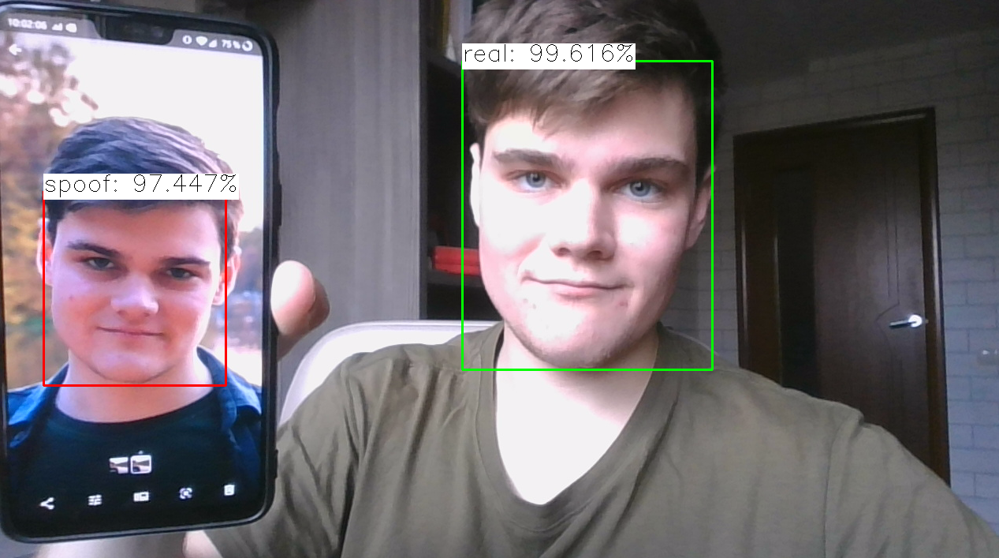
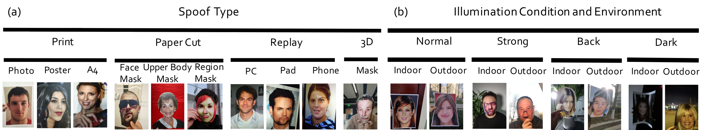
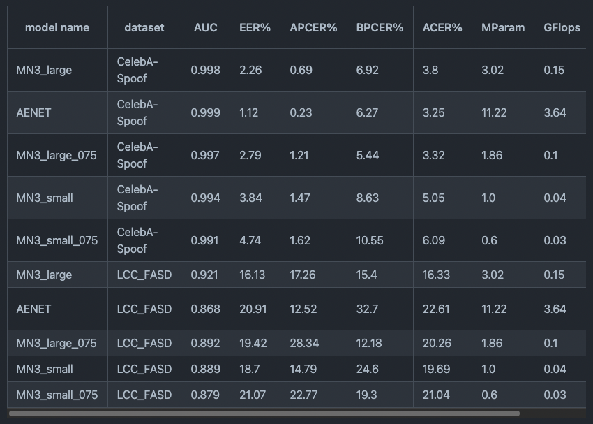

# FaceAntiSpoofing : A Machine Learning Model to Determine If a Face is Real

# FaceAntiSpoofing : A Machine Learning Model to Determine If a Face is Real

[](/@cochard-dav?source=post_page---byline--b6c30f12abb6---------------------------------------)

[David Cochard](/@cochard-dav?source=post_page---byline--b6c30f12abb6---------------------------------------)

2 min read

·

Feb 3, 2022

--

[Listen](/m/signin?actionUrl=https%3A%2F%2Fmedium.com%2Fplans%3Fdimension%3Dpost_audio_button%26postId%3Db6c30f12abb6&operation=register&redirect=https%3A%2F%2Fmedium.com%2Faxinc-ai%2Ffaceantispoofing-a-machine-learning-model-to-determine-if-a-face-is-real-b6c30f12abb6&source=---header_actions--b6c30f12abb6---------------------post_audio_button------------------)

Share

This is an introduction to「FaceAntiSpoofing」, a machine learning model that can be used with [ailia SDK](https://ailia.jp/en/). You can easily use this model to create AI applications using [ailia SDK](https://ailia.jp/en/) as well as many other ready-to-use [ailia MODELS](https://github.com/axinc-ai/ailia-models).

---

## Overview

*FaceAntiSpoofing* is a machine learning model that determines whether a face in a picture is real (an actual person being photographed) or fake (printed on a sheet of paper). It can be used for identity verification (Know Your Customer, or KYC for short) and other purposes.

Press enter or click to view image in full size



Source: <https://github.com/kprokofi/light-weight-face-anti-spoofing>

[## GitHub — kprokofi/light-weight-face-anti-spoofing: towards the solving spoofing problem

### Towards the solving anti-spoofing problem on RGB only data. This repository contains a training and evaluation pipeline…

github.com](https://github.com/kprokofi/light-weight-face-anti-spoofing?source=post_page-----b6c30f12abb6---------------------------------------)

## Architecture

*FaceAntiSpoofing* is based on MobileNetV3 and was trained on the [*CelebA-Spoof*](https://github.com/Davidzhangyuanhan/CelebA-Spoof) dataset.

Press enter or click to view image in full size


Source: <https://github.com/Davidzhangyuanhan/CelebA-Spoof>

*CelebA-Spoof* contains images of faces printed on paper or displayed on a PC, tablet, or cell phone.

Press enter or click to view image in full size



Source: <https://github.com/Davidzhangyuanhan/CelebA-Spoof>

It also contains variants of the same picture under different angles and shapes.

Press enter or click to view image in full size


Source: <https://github.com/Davidzhangyuanhan/CelebA-Spoof>

The accuracy of the *MobileNet3 Large* model reaches 99.8% on the *CelebA-Spoof* dataset.

Press enter or click to view image in full size



Source: <https://github.com/kprokofi/light-weight-face-anti-spoofing>

## Usage

*FaceAntiSpoofing* can be used with ailia SDK using the following command. By appending the `--detection` option, the faces are detected in the input image and labelled as `real` or `fake`.

```
$ python3 face-anti-spoofing.py --input input.jpg --detection
```

[## ailia-models/face\_recognition/face-anti-spoofing at master · axinc-ai/ailia-models

### (Image from https://search.creativecommons.org/photos/df3a19c2-47ca-4f58-8aed-0dc62e89e9e9) Shape: (1, 3, 128, 128) RGB…

github.com](https://github.com/axinc-ai/ailia-models/tree/master/face_recognition/face-anti-spoofing?source=post_page-----b6c30f12abb6---------------------------------------)

---

[ax Inc.](https://axinc.jp/en/) has developed [ailia SDK](https://ailia.jp/en/), which enables cross-platform, GPU-based rapid inference.

ax Inc. provides a wide range of services from consulting and model creation, to the development of AI-based applications and SDKs. Feel free to [contact us](https://axinc.jp/en/) for any inquiry.