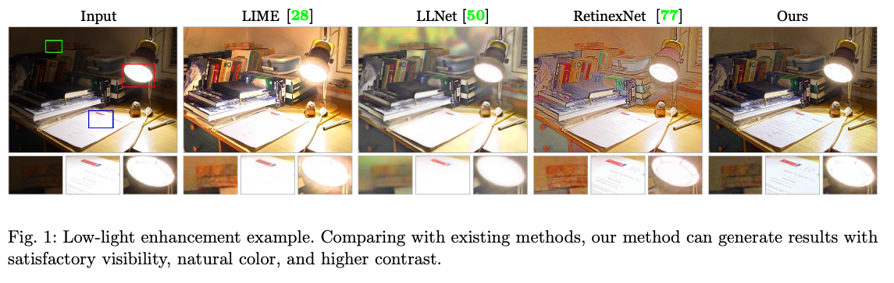
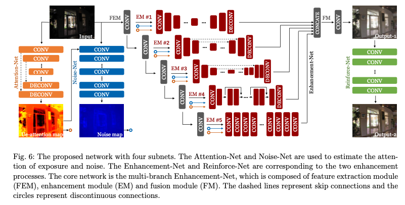
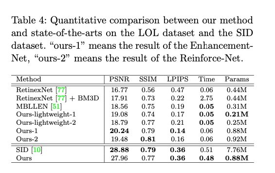

# AGLLNet : A Machine Learning Model for Brightening Dark Images

# AGLLNet : A Machine Learning Model for Brightening Dark Images

[](/@cochard-dav?source=post_page---byline--133a0887b5c---------------------------------------)

[David Cochard](/@cochard-dav?source=post_page---byline--133a0887b5c---------------------------------------)

3 min read

·

Feb 6, 2022

--

[Listen](/m/signin?actionUrl=https%3A%2F%2Fmedium.com%2Fplans%3Fdimension%3Dpost_audio_button%26postId%3D133a0887b5c&operation=register&redirect=https%3A%2F%2Fmedium.com%2Faxinc-ai%2Fagllnet-a-machine-learning-model-for-brightening-dark-images-133a0887b5c&source=---header_actions--133a0887b5c---------------------post_audio_button------------------)

Share

This is an introduction to「AGLLNet」, a machine learning model that can be used with [ailia SDK](https://ailia.jp/en/). You can easily use this model to create AI applications using [ailia SDK](https://ailia.jp/en/) as well as many other ready-to-use [ailia MODELS](https://github.com/axinc-ai/ailia-models).

---

## Overview

*AGLLNet* is a machine learning model that uses *attention* to correct exposure and brighten dark images. It was developed by Beihang University and published in August 2019.

Press enter or click to view image in full size



Source: <https://arxiv.org/abs/1908.00682>

[## Attention Guided Low-light Image Enhancement with a Large Scale Low-light Simulation Dataset

### Low-light image enhancement is challenging in that it needs to consider not only brightness recovery but also complex…

arxiv.org](https://arxiv.org/abs/1908.00682?source=post_page-----133a0887b5c---------------------------------------)

[## GitHub — yu-li/AGLLNet: Attention Guided Low-light Image Enhancement with a Large Scale Low-light…

### This is the test code for “Attention Guided Low-light Image Enhancement with a Large Scale Low-light Simulation…

github.com](https://github.com/yu-li/AGLLNet?source=post_page-----133a0887b5c---------------------------------------)

## Architecture

Brightening a dark image is a challenging task because it requires not only correcting the brightness, but also correcting the color distortion and noise hidden in the dark areas of the image. Simply adjusting the brightness make these distortions become apparent.

The first step to train this model was to create a data set. The authors took images with normal exposure as input, corrected the exposure to make it darker, and added noise. The area where exposure compensation is applied is called the *ue-attention map*, and the area where noise is added is called the *noise map*. Each image was also applied contrast and edge correction and the result was used as reference images.

Press enter or click to view image in full size


Source: <https://arxiv.org/abs/1908.00682>

*AGLLNet* uses an end-to-end attention-guided method based on multi-branch CNN. Train two attention maps for brightness correction and denoising on the new dataset we created. Using the newly created dataset for training, the method learns two attention maps to guide the brightness enhancement and denoising tasks respectively.

The first attention map recognizes underexposed areas, and the second recognizes noise in the texture. Based on these attention maps, a multi-branch correction CNN is applied.

The CNN applied to input images is made of 4 subnets. *Attention-Net* and *Noise-Net* are applied to guide the attention to underexposed areas and the denoising process. Then comes *Enhancement-Net* and *Refinforce-Net* to perform image enhancements. *Enhancement-Net* includes a feature extraction module, a enhancement module, and a fusion module to perform enhancing and denoising simultaneously. Lastly, *ReinforceNet* is designed for contrast re-enhancement to solve the low-contrast limitation caused by regression.

Press enter or click to view image in full size



Source: <https://arxiv.org/abs/1908.00682>

This method quantitatively outperforms conventional image enhancement models.



Source: <https://arxiv.org/abs/1908.00682>

By applying this low-light image enhancement model as a preprocessing step for object detection, we can increase the detection rate of *MaskRCNN*.

Press enter or click to view image in full size


Source: <https://arxiv.org/abs/1908.00682>

## Usage

*AGLLNet* can be used with ailia SDK using the following command.

```
$ python3 agllnet.py --input input.jpg --savepath output.jpg
```

[## ailia-models/low\_light\_image\_enhancement/agllnet at master · axinc-ai/ailia-models

### (Image from https://github.com/yu-li/AGLLNet/blob/main/input/5047.png) Ailia input shape: (1, 3, 768, 1152)…

github.com](https://github.com/axinc-ai/ailia-models/tree/master/low_light_image_enhancement/agllnet?source=post_page-----133a0887b5c---------------------------------------)

---

[ax Inc.](https://axinc.jp/en/) has developed [ailia SDK](https://ailia.jp/en/), which enables cross-platform, GPU-based rapid inference.

ax Inc. provides a wide range of services from consulting and model creation, to the development of AI-based applications and SDKs. Feel free to [contact us](https://axinc.jp/en/) for any inquiry.