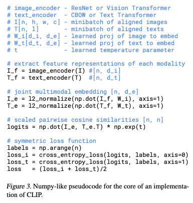
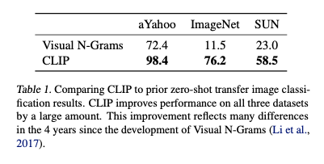
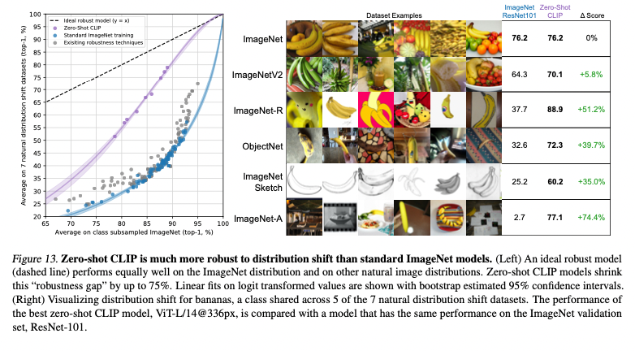

# CLIP: Learning Transferable Visual Models From Natural Language Supervision

# CLIP: Learning Transferable Visual Models From Natural Language Supervision

[](/@cochard-dav?source=post_page---byline--4508b3f0ea46---------------------------------------)

[David Cochard](/@cochard-dav?source=post_page---byline--4508b3f0ea46---------------------------------------)

4 min read

·

Feb 21, 2022

--

[Listen](/m/signin?actionUrl=https%3A%2F%2Fmedium.com%2Fplans%3Fdimension%3Dpost_audio_button%26postId%3D4508b3f0ea46&operation=register&redirect=https%3A%2F%2Fmedium.com%2Faxinc-ai%2Fclip-learning-transferable-visual-models-from-natural-language-supervision-4508b3f0ea46&source=---header_actions--4508b3f0ea46---------------------post_audio_button------------------)

Share

This is an introduction to「CLIP」, a machine learning model that can be used with [ailia SDK](https://ailia.jp/en/). You can easily use this model to create AI applications using [ailia SDK](https://ailia.jp/en/) as well as many other ready-to-use [ailia MODELS](https://github.com/axinc-ai/ailia-models).

---

## Overview

*CLIP* is an object identification model published in February 2021 and developed by *OpenAI*, famous for *GPT3*. Classic image classification models identify objects from a predefined set of categories, for example 1000 categories in the case of the *ImageNet* challenge. *CLIP* was trained with a huge amount of data, 400 million images on the web and corresponding text data, and can perform object identification in any category without re-training.

[## Learning Transferable Visual Models From Natural Language Supervision

### State-of-the-art computer vision systems are trained to predict a fixed set of predetermined object categories. This…

arxiv.org](https://arxiv.org/abs/2103.00020?source=post_page-----4508b3f0ea46---------------------------------------)

[## GitHub — openai/CLIP: Contrastive Language-Image Pretraining

### CLIP (Contrastive Language-Image Pre-Training) is a neural network trained on a variety of (image, text) pairs. It can…

github.com](https://github.com/openai/CLIP?source=post_page-----4508b3f0ea46---------------------------------------)

## Architecture

Traditional object identification models predict fixed, predetermined categories. This approach requires new labeled data when attempting to recognize objects in a new category. *CLIP* solves this problem by learning from the text associated to an image, rather than manually-assigned labels.

*CLIP* was pre-trained using 400 million images and corresponding text from the Internet. After pre-training, natural language is used to reference learned visual concepts (or describe new ones) enabling *zero-shot transfer* and allows for identification using arbitrary labels that have not been part of any previous training.

This approach was evaluated against 30 different benchmarks, specifically, OCR, action detection from video, place name detection, and general object identification.

*CLIP* performs as well as models trained on the benchmark dataset for most tasks, even though it does not use the benchmark training dataset and has not undergone any additional training. For example it achieves the same performance as *ResNet-50* on the *ImageNet* benchmark even though it does not use the 1.28 million pieces of training data.

The architecture of *CLIP* is as follows.

Press enter or click to view image in full size


Source: <https://arxiv.org/abs/2103.00020>

Regular image classification models use a *feature extractor* to extract features from the input image, and a *linear classifier* to predict the label.

*CLIP* was trained using a combination of *image encoder* and *text encoder*. The training data is a batch of `(image, text)` tuples. During training, the inner product of the vector from the *image encoder* and the vector from the *text encoder* gives the value 1 if the image/text association is correct, 0 otherwise.

The inference uses a trained *text encoder* to encode the class name of the target dataset, producing a vector of embeddings, then computes the inner product of the image encoded vector, and takes the label with the highest value as the correct answer. This is the procedure used to generate a zero-shot linear classifier.



Source: <https://arxiv.org/abs/2103.00020>

CLIP significantly exceeds the performance of conventional zero-shot transfer.



Source: <https://arxiv.org/abs/2103.00020>

The performance difference between the various image classification benchmarks is as follows.


Source: <https://arxiv.org/abs/2103.00020>

*CLIP* shows a +1.9% performance increase compared to *ResNet50* on *ImageNet* despite zero-shot transfer.

As discussed in GPT3 “prompt engineering”, you need to provide an appropriate string as a query. For example, on the *Oxford-IIIT Pets* dataset, the query `A photo of a {label}, a type of pet.` is given for a more appropriate context. For OCR datasets, performance can be improved by prefixing the text or number you want to recognize with quotes. For satellite image classification, the sentence `A satellite photo of a {label}.` is a valid query.

Compared to models pre-trained with standard *ImageNet*, *CLIP* provides stable performances even when the variance of the dataset changes.

Press enter or click to view image in full size



Source: <https://arxiv.org/abs/2103.00020>

## Usage

You can use *CLIP* with ailia SDK using the following command. Given the input image `input.jpg`, it returns the probability of being a *human*, a *dog* or a *cat*. Any text can be given as input.

```
$ python3 clip.py -i input.jpg --text "a human" --text "a dog" --text "a cat"
```

[## ailia-models/image\_classification/clip at master · axinc-ai/ailia-models

### (Image from https://scikit-image.org/) ### predicts the most likely top5 labels among input textual labels ### a cat…

github.com](https://github.com/axinc-ai/ailia-models/tree/master/image_classification/clip?source=post_page-----4508b3f0ea46---------------------------------------)

---

[ax Inc.](https://axinc.jp/en/) has developed [ailia SDK](https://ailia.jp/en/), which enables cross-platform, GPU-based rapid inference.

ax Inc. provides a wide range of services from consulting and model creation, to the development of AI-based applications and SDKs. Feel free to [contact us](https://axinc.jp/en/) for any inquiry.