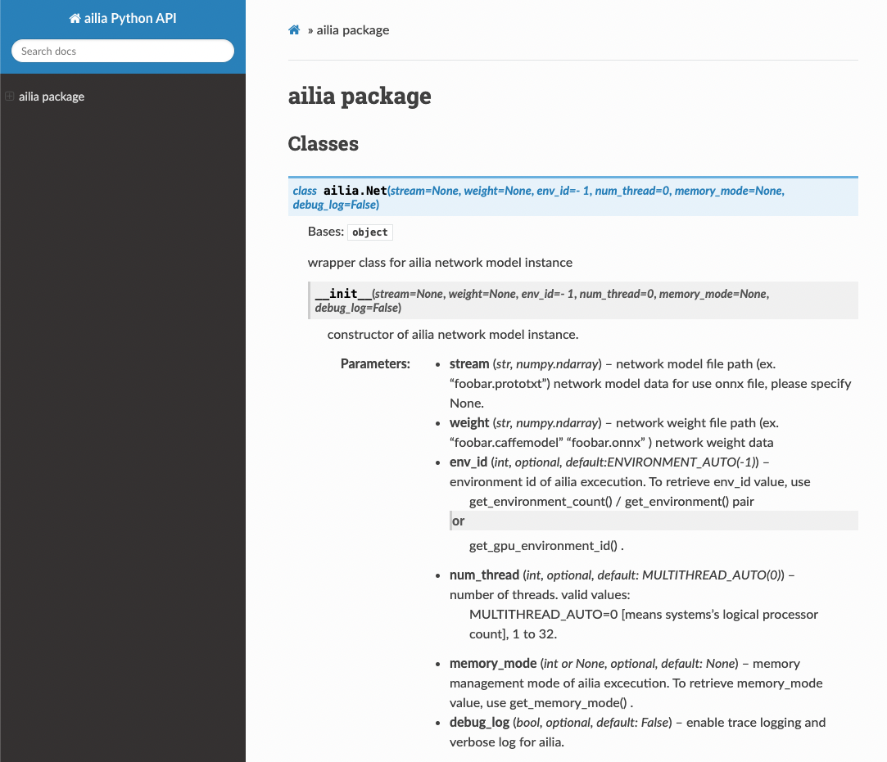
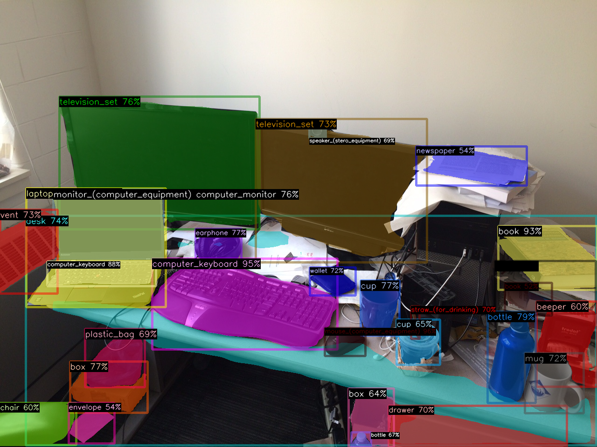

# Released ailia SDK 1.2.10

# Released ailia SDK 1.2.10

[David Cochard](/@cochard-dav?source=post_page---byline--d596f040d8ca---------------------------------------)

2 min read

·

Mar 3, 2022

--

[Listen](/m/signin?actionUrl=https%3A%2F%2Fmedium.com%2Fplans%3Fdimension%3Dpost_audio_button%26postId%3Dd596f040d8ca&operation=register&redirect=https%3A%2F%2Fmedium.com%2Faxinc-ai%2Freleased-ailia-sdk-1-2-10-d596f040d8ca&source=---header_actions--d596f040d8ca---------------------post_audio_button------------------)

Share

We are pleased to introduce version 1.2.10 of ailia SDK, a cross-platform framework to perform fast AI inference on GPU or CPU. You can find more information about ailia SDK on the [official website](https://ailia.jp/en/).

---

## Support of ONNX opset 12 to 15

With the addition of the latest opset, more layers are supported which means more models can be exported. Newly supported layers include *Celu, Einsum, HardSwish, LpNormalization, MeanVarianceNormalization* and *Trilu*.

## Faster loading of compressed models

Quantized and compressed ONNX models can be loaded faster in this new release. An example model which took 1345ms to load on Google Pixel 6 with ailia SDK 1.2.9 now only takes 358ms with ailia SDK 1.2.10, or 3.7 times faster. It now really close to the loading time of the uncompressed model which takes 322 ms.

## Optimizations

Layers *Transpose,Softmax, Resize* and *Conv3D* have been greatly optimized on CPU. We also performed CUDA acceleration for *Matmul* and *Softmax*, and Vulkan acceleration for *Resize*.

## Support for Nvidia drivers that support Vulkan 1.3

We fixed an issue that caused instance creation to fail with the latest Nvidia drivers supporting Vulkan 1.3. It was dueto a bug from *khronos/VulkanHeader*, which is used by the ailia SDK, and it’s been addressed by updating *khronos/VulkanHeader* to the latest version.

## Release of web documentation

API specifications can now be checked online from our website.

Press enter or click to view image in full size

Extract of API reference（<https://axinc-ai.github.io/ailia-sdk/api/python/en/>）

All the links can be found at the site below.

[## GitHub — axinc-ai/ailia-sdk: cross-platform high speed inference SDK

### SDK for optimized running of many popular neural networks on multiple platform ailia SDK is a cross-platform high speed…

github.com](https://github.com/axinc-ai/ailia-sdk?source=post_page-----d596f040d8ca---------------------------------------)

## Addition of new models

ailia SDK 1.2.10 comes with some new models.

### Detic: Object detection model and segmentation supporting 21k classes with high accuracy

Press enter or click to view image in full size

Source: <https://web.eecs.umich.edu/~fouhey/fun/desk/desk.jpg>

[## ailia-models/object\_detection/detic at master · axinc-ai/ailia-models

### (Image from https://web.eecs.umich.edu/~fouhey/fun/desk/desk.jpg, credit David Fouhey) Automatically downloads the onnx…

github.com](https://github.com/axinc-ai/ailia-models/tree/master/object_detection/detic?source=post_page-----d596f040d8ca---------------------------------------)

### Traffic Sign Detection: Traffic sign recognition model

Press enter or click to view image in full size

Source: <https://github.com/aarcosg/traffic-sign-detection/blob/master/test_images/image2.jpg>

[## ailia-models/object\_detection/traffic-sign-detection at master · axinc-ai/ailia-models

### (Image from https://github.com/aarcosg/traffic-sign-detection/blob/master/test\_images/image2.jpg) Automatically…

github.co](https://github.com/axinc-ai/ailia-models/tree/master/object_detection/traffic-sign-detection?source=post_page-----d596f040d8ca---------------------------------------)

---

[ax Inc.](https://axinc.jp/en/) has developed [ailia SDK](https://ailia.jp/en/), which enables cross-platform, GPU-based rapid inference.

ax Inc. provides a wide range of services from consulting and model creation, to the development of AI-based applications and SDKs. Feel free to [contact us](https://axinc.jp/en/) for any inquiry.