# ax Facial Features: Eyelids, Eyelashes and Facial Hair Classification

# ax Facial Features: Eyelids, Eyelashes and Facial Hair Classification

[](/@cochard-dav?source=post_page---byline--9b3b12f1d6a1---------------------------------------)

[David Cochard](/@cochard-dav?source=post_page---byline--9b3b12f1d6a1---------------------------------------)

5 min read

·

Mar 10, 2022

--

[Listen](/m/signin?actionUrl=https%3A%2F%2Fmedium.com%2Fplans%3Fdimension%3Dpost_audio_button%26postId%3D9b3b12f1d6a1&operation=register&redirect=https%3A%2F%2Fmedium.com%2Faxinc-ai%2Fax-facial-features-eyelids-eyelashes-and-facial-hair-classification-9b3b12f1d6a1&source=---header_actions--9b3b12f1d6a1---------------------post_audio_button------------------)

Share

This is an introduction to「ax Facial Features」, a machine learning model that can be used with [ailia SDK](https://ailia.jp/en/). You can easily use this model to create AI applications using [ailia SDK](https://ailia.jp/en/) as well as many other ready-to-use [ailia MODELS](https://github.com/axinc-ai/ailia-models).

---

## Overview

[ax Inc.](https://axinc.jp/en/) investigated and developed eyelids (single or double), eyelashes’ density (dense, moderate, sparse) classifications and facial hair detection (moustache, beard and/or mouth side hair presence) through neural networks with limited resources. Results show a promising potential in achieving a high accuracy with a larger dataset.

## Dataset and model architecture

A crucial component when building a machine learning model is data used to train and validate the model. To the best of our effort, no existing dataset with annotations ready to be used for the aforementioned applications could be found. Therefore, three new datasets (limited due to time constraints) were collected and annotated for this purpose. In the following sections, the datasets and model architectures for each task are described.

### Eyelids

Press enter or click to view image in full size

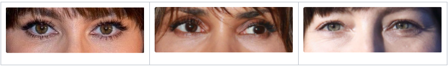

Samples from the eyelids dataset

The eyelids dataset consists in 615 images of the eyes region with 479 of them annotated as double eyelids and the remaining 136 as single eyelids. Regarding the architecture, *ResNet50* with a new fully connected head is used. The model takes as input an eyes region image cropped with the aid of [Face Mesh](/axinc-ai/facemesh-detecting-key-points-on-faces-in-real-time-977c03f1bab)’s face landmarks.

### Eyelashes

Press enter or click to view image in full size

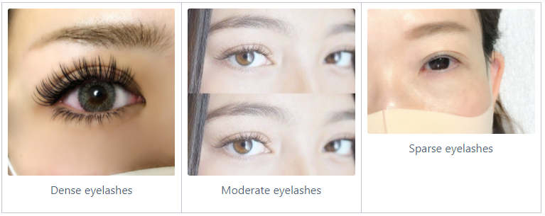

Samples from the eyelashes dataset

The eyelashes dataset consists in 253 images of the eyes region (same as those used for the eyelids classification) with 118 dense, 126 moderate and 9 sparse eyelashes. The category examples shown above were used as a baseline to label the images. This dataset was particularly difficult to collect as high resolution images are required to clearly analyze the eyelashes density. The architecture is a *ResNet50* with a new fully connected head. Similar to the eyelids model, the input of the eyelashes model is an eyes region image cropped with the aid of [Face Mesh](/axinc-ai/facemesh-detecting-key-points-on-faces-in-real-time-977c03f1bab)’s face landmarks.

### Facial hair

Press enter or click to view image in full size

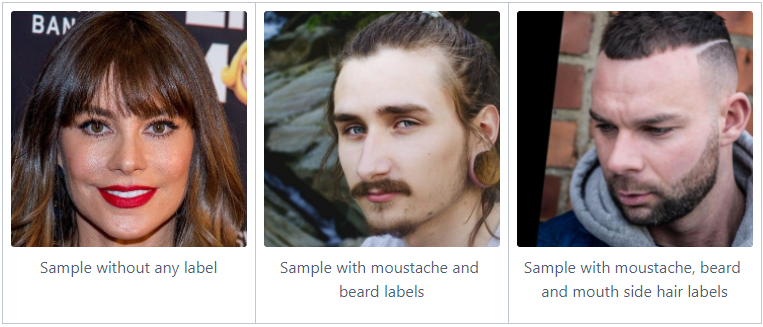

Samples from the facial hair dataset

Facial hair detection is different from the previous two tasks in that it is a multi-label classification, i.e. each image can have zero or more labels. The facial hair dataset consists in 522 face images with 442 images without any labels and 80 with at least one label (some samples are shown above). Among the 80 images, there are 68 moustache labels, 76 beard ones and 37 mouth side hair labels. The architecture is again a *ResNet50* with a new fully connected head. The input to the model is a face image cropped with the aid of [Face Mesh](/axinc-ai/facemesh-detecting-key-points-on-faces-in-real-time-977c03f1bab)’s face landmarks.

## Results

Models pre-trained on *ImageNet* were fine-tuned using 90% of the datasets and the remaining 10% are used to validate it. Results for each task are detailed hereafter.

### Eyelids

Press enter or click to view image in full size

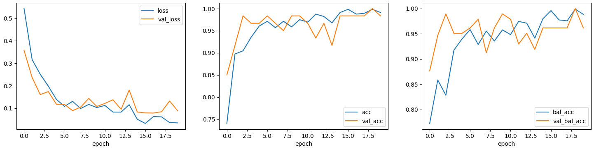

Metrics evolution — loss: cross entropy, accuracy, balanced accuracy

Press enter or click to view image in full size

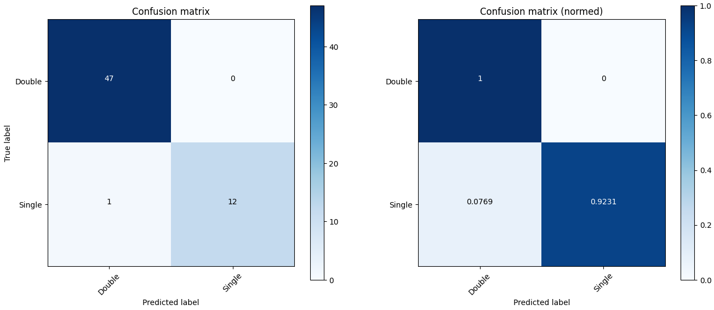

Despite the dataset being extremely small, around 98% accuracy is achieved. These results are promising and suggest that a better accuracy and generalization could potentially be achieved with more data.

Future work could investigate using smaller crops around each eye and classifying each one of them to further improve the performance and tackle cases where people have hybrid eyelids.

### Eyelashes

Press enter or click to view image in full size

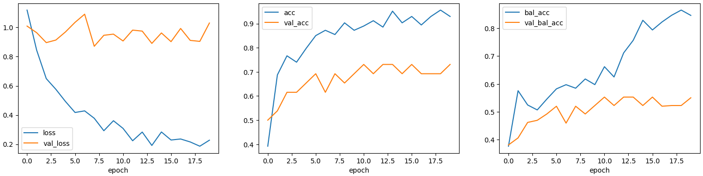

Metrics evolution — loss: cross entropy, accuracy, balanced accuracy

Press enter or click to view image in full size

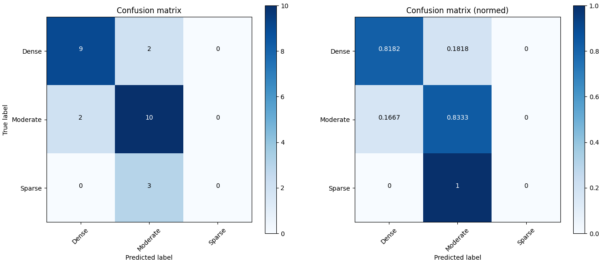

The number of samples for the Sparse class is extremely small and therefore, the model couldn’t be well trained on it. Moreover, eyelashes density is a continuous (and not discrete) feature, thus it is understandable that the model (even humans) is more easily confused with the categories. Although the results are unsatisfactory (~69% accuracy), there is still room for further investigation using more data to achieve a higher accuracy.

### Facial hair

Press enter or click to view image in full size

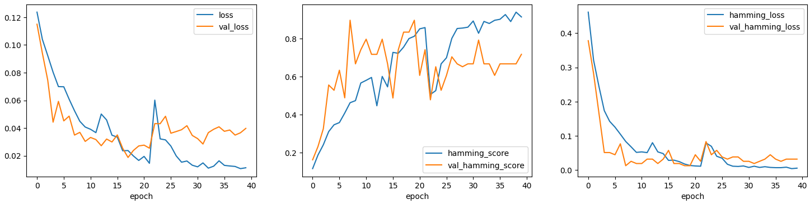

Metrics evolution — loss: binary cross entropy, Hamming score, Hamming loss

Press enter or click to view image in full size

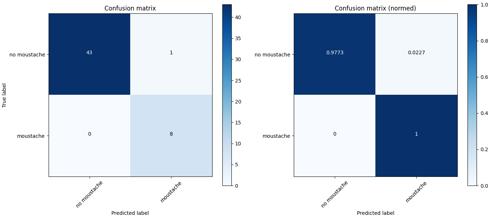

Press enter or click to view image in full size

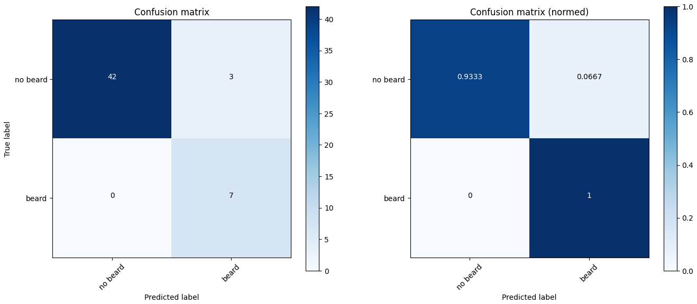

Press enter or click to view image in full size

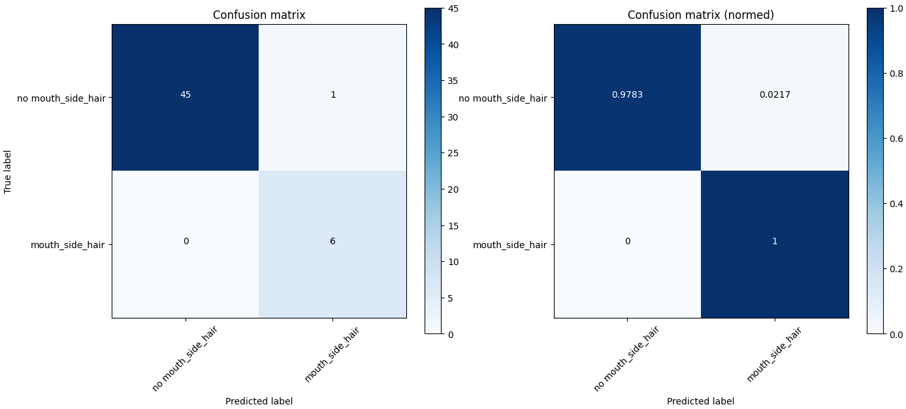

Again, although the dataset is extremely small, a Hamming score (computed on samples with at least one non-zero true label or prediction) around 72% is achieved and all true labels are correctly predicted while there are some false positives. The results are nonetheless promising and further study with more data could potentially achieve even better performance.

## Usage

You can use *ax Facial Features* with ailia SDK to perform facial features (eyelids, eyelashes and facial hair) classification on an image using the following command.

```
$ python3 ax_facial_features.py -i path_to_image
```

[## ailia-models/face\_recognition/ax\_facial\_features at master · axinc-ai/ailia-models

### The collection of pre-trained, state-of-the-art AI models for ailia SDK …

github.com](https://github.com/axinc-ai/ailia-models/tree/master/face_recognition/ax_facial_features?source=post_page-----9b3b12f1d6a1---------------------------------------)

Here below is an example of the output on the following image.

Press enter or click to view image in full size


Source: <https://pixabay.com/photos/people-cowboy-male-hat-person-875597/>

Press enter or click to view image in full size

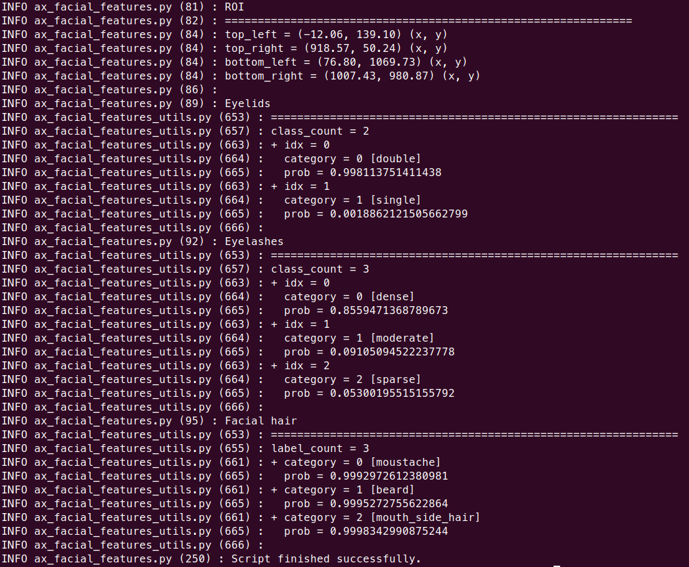

ax Facial Features output example

The model can also be applied to the webcam video stream by using the following command.

```
$ python3 ax_facial_features.py -v 0
```

---

[ax Inc.](https://axinc.jp/en/) has developed [ailia SDK](https://ailia.jp/en/), which enables cross-platform, GPU-based rapid inference.

ax Inc. provides a wide range of services from consulting and model creation, to the development of AI-based applications and SDKs. Feel free to [contact us](https://axinc.jp/en/) for any inquiry.