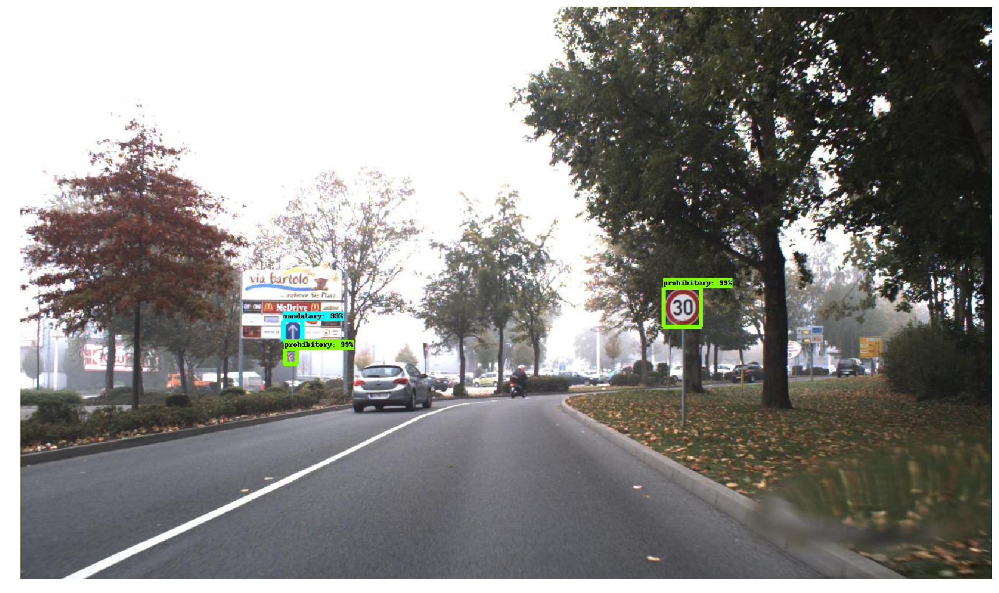
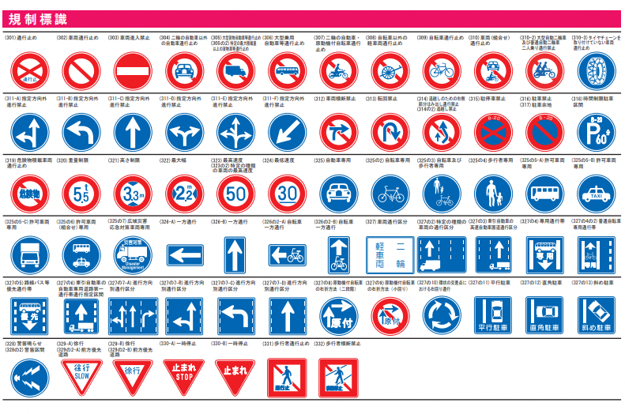

# TrafficSignDetection : Machine Learning Model to Detect Road Signs

# TrafficSignDetection : Machine Learning Model to Detect Road Signs

[](/@cochard-dav?source=post_page---byline--76d7c175ee01---------------------------------------)

[David Cochard](/@cochard-dav?source=post_page---byline--76d7c175ee01---------------------------------------)

3 min read

·

Mar 17, 2022

--

[Listen](/m/signin?actionUrl=https%3A%2F%2Fmedium.com%2Fplans%3Fdimension%3Dpost_audio_button%26postId%3D76d7c175ee01&operation=register&redirect=https%3A%2F%2Fmedium.com%2Faxinc-ai%2Ftrafficsigndetection-machine-learning-model-to-detect-road-signs-76d7c175ee01&source=---header_actions--76d7c175ee01---------------------post_audio_button------------------)

Share

This is an introduction to「TrafficSignDetection」, a machine learning model that can be used with [ailia SDK](https://ailia.jp/en/). You can easily use this model to create AI applications using [ailia SDK](https://ailia.jp/en/) as well as many other ready-to-use [ailia MODELS](https://github.com/axinc-ai/ailia-models).

## Overview

*TrafficSignDetection* is a machine learning model for detecting road signs released in November 2018.

Press enter or click to view image in full size



Source: <https://github.com/aarcosg/traffic-sign-detection>

[## GitHub — aarcosg/traffic-sign-detection: Traffic Sign Detection. Code for the paper entitled…

### Traffic Sign Detection. Code for the paper entitled “Evaluation of deep neural networks for traffic sign detection…

github.com](https://github.com/aarcosg/traffic-sign-detection?source=post_page-----76d7c175ee01---------------------------------------)

## Architecture

*TrafficSignDetection* uses one *Faster R-CNN, R-FCN, SSD* or *YOLOv2* state-of-the-art object-detection model architecture, pre-trained on the Microsoft COCO dataset and then fine-tuned on the [*German Traffic Sign Detection Benchmark*](http://benchmark.ini.rub.de/?section=gtsdb) *(GTSDB)* dataset.

[## German Traffic Sign Benchmarks

### 2013–01–07 Unfortunately, the ReadMe.txt in the download package with the GTSDB training data (TrainIJCNN2013.zip)…

benchmark.ini.rub.de](https://benchmark.ini.rub.de/gtsdb_news.html?source=post_page-----76d7c175ee01---------------------------------------)

The mAP using *Faster R-CNN ResNet50* is 91.52.

Press enter or click to view image in full size


Source: <https://github.com/aarcosg/traffic-sign-detection>

Three categories can be detected: *prohibitory*, *mandatory*, and *danger*.

Although it was trained on a dataset made of German road signs, many of the designs are common to other countries and the model can also be used in those countries. The capture below shows the result on a street in Japan.

Press enter or click to view image in full size


Source: <https://pixabay.com/photos/kobe-the-sea-blue-sky-4975863/>

Below are some examples of German traffic signs included in the GTSRB dataset.


Source: [https://www.sciencedirect.com/science/article/pii/S0893608012000457?via%3Dihub#f000015](https://www.sciencedirect.com/science/article/pii/S0893608012000457?via%3Dihub=#f000015)

The following chart shows the main signs used in Japan. Designs for speed limits and one-way streets for example are similar to Germany and the model can detect them just fine.

Press enter or click to view image in full size



Source: <https://www.mlit.go.jp/road/sign/sign/douro/ichiran.pdf>

## Usage

*TrafficSignDetection* can be used with [ailia SDK 1.2.10](/axinc-ai/released-ailia-sdk-1-2-10-d596f040d8ca) using the following command.

```
$ python3 traffic-sign-detection.py --input input.jpg --savepath output.jpg
```

[## ailia-models/object\_detection/traffic-sign-detection at master · axinc-ai/ailia-models

### (Image from https://github.com/aarcosg/traffic-sign-detection/blob/master/test\_images/image2.jpg) Automatically…

github.com](https://github.com/axinc-ai/ailia-models/tree/master/object_detection/traffic-sign-detection?source=post_page-----76d7c175ee01---------------------------------------)

---

[ax Inc.](https://axinc.jp/en/) has developed [ailia SDK](https://ailia.jp/en/), which enables cross-platform, GPU-based rapid inference.

ax Inc. provides a wide range of services from consulting and model creation, to the development of AI-based applications and SDKs. Feel free to [contact us](https://axinc.jp/en/) for any inquiry.