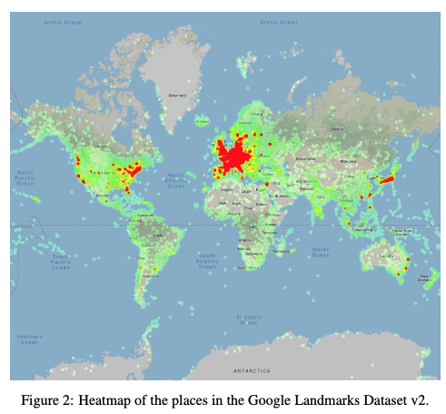
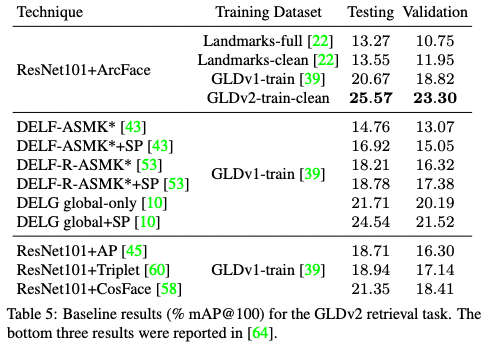
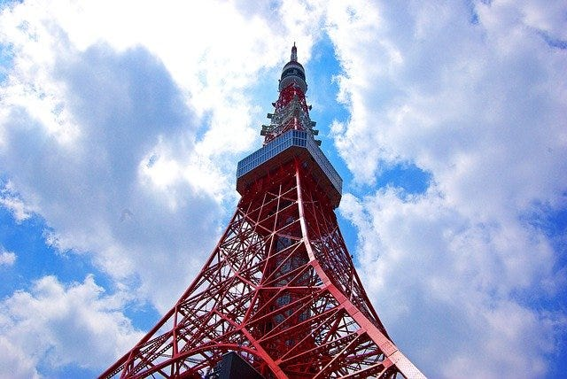
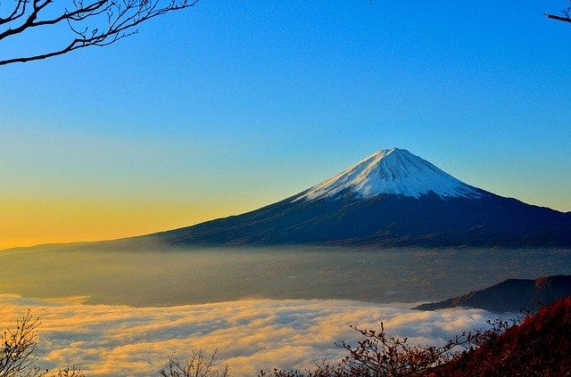
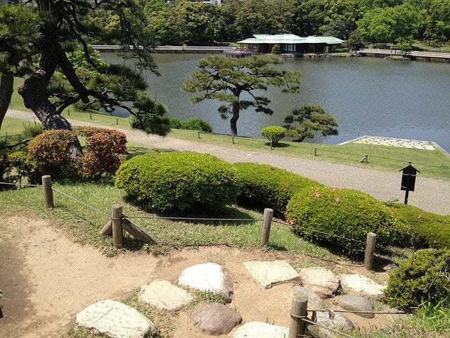

# LandmarksClassifierAsia : A Machine Learning Model to Identify Japanese Tourist Attractions

# LandmarksClassifierAsia : A Machine Learning Model to Identify Japanese Tourist Attractions

[](/@cochard-dav?source=post_page---byline--9bb9600d2c80---------------------------------------)

[David Cochard](/@cochard-dav?source=post_page---byline--9bb9600d2c80---------------------------------------)

4 min read

·

Mar 21, 2022

--

[Listen](/m/signin?actionUrl=https%3A%2F%2Fmedium.com%2Fplans%3Fdimension%3Dpost_audio_button%26postId%3D9bb9600d2c80&operation=register&redirect=https%3A%2F%2Fmedium.com%2Faxinc-ai%2Flandmarksclassifierasia-a-machine-learning-model-to-identify-japanese-tourist-attractions-9bb9600d2c80&source=---header_actions--9bb9600d2c80---------------------post_audio_button------------------)

Share

This is an introduction to「LandmarksClassifierAsia」, a machine learning model that can be used with [ailia SDK](https://ailia.jp/en/). You can easily use this model to create AI applications using [ailia SDK](https://ailia.jp/en/) as well as many other ready-to-use [ailia MODELS](https://github.com/axinc-ai/ailia-models).

## Overview

*LandmarksClassifierAsia* is a machine learning model for identifying Japanese tourist attractions published by *Google* in April 2020. The model can identify 17,771 popular landmarks based on a single image.

[## Google Landmarks Dataset v2 — A Large-Scale Benchmark for Instance-Level Recognition and Retrieval

### While image retrieval and instance recognition techniques are progressing rapidly, there is a need for challenging…

arxiv.org](https://arxiv.org/abs/2004.01804?source=post_page-----9bb9600d2c80---------------------------------------)

[## TensorFlow Hub

### Landmark recognition model tuned for Asia

tfhub.dev](https://tfhub.dev/google/on_device_vision/classifier/landmarks_classifier_asia_V1/1?source=post_page-----9bb9600d2c80---------------------------------------)

## Architecture

The model input is a 321x321 RGB image normalized to a range of 0 to 1. The landmark is assumed to be cropped and entered in the input image for proper detection. The output is a similarity score for 98,960 categories with the associated names of landmarks in English. There are 17,771 unique categories therefore some labels are redundant in the output and some post-processing is required to merge duplicates.

For example, if the output vector is `[0.3, 0.5, 0.1]` and the labels are `[label_1, label_2, label_1]`, the output should be `{label_1: 0.3, label_2: 0.5}` giving only the highest score among the overlapping labels.

The model was trained on *Google Landmarks Dataset V2 (GLDv2)*. This dataset contains 5 million training images, 200 000 labels, and 110 000 test images. The images were collected from *Wikimedia Commons* and manually annotated over 800 hours.



Source: <https://arxiv.org/abs/2004.01804>

[## Announcing Google-Landmarks-v2: An Improved Dataset for Landmark Recognition & Retrieval

### Last year we released Google-Landmarks, the largest world-wide landmark recognition dataset available at that time. In…

ai.googleblog.com](https://ai.googleblog.com/2019/05/announcing-google-landmarks-v2-improved.html?source=post_page-----9bb9600d2c80---------------------------------------)

Because of the large number of categories of the dataset, distance metric learning was used and performance results were given relative to *ResNet101+ArcFace*. [Checking the model in Netron](https://netron.app/?url=https%3A%2F%2Fstorage.googleapis.com%2Failia-models%2Flandmarks_classifier_asia%2Flandmarks_classifier_asia_V1_1.onnx.prototxt), it appears that the published model is not *ResNet101*, but a slightly lighter backbone using kernel sizes 3x3 and 1x1.

The mAP@100 (recognition rate using top-100 of detection results) for the model using *ResNet101* and *ArcFace* is 23.30%. The numerical value appears low because of the huge number of labels.



Source: <https://arxiv.org/abs/2004.01804>

## Results

Here are the results of this model on some input images. We can see that very distinctive landmarks such as *Tokyo Tower* and *Kaminarimon* below are perfectly detected.



Source: <https://pixabay.com/photos/japan-tokyo-tower-landmark-343444/>

```
TopK predictions:  
  Tokyo Tower: 92.34%  
  Sapporo TV Tower: 84.53%  
  Yokohama Marine Tower: 81.77%
```


Source: <https://pixabay.com/photos/tokyo-asakusa-kaminarimon-gate-2443311/>

```
TopK predictions:  
  Kaminarimon Gate Senso-ji: 92.01%  
  Hōzōmon Gate: 89.89%  
  Osu Kannon: 85.13%
```

However other less recognizable landmarks such as *Mount Fuji* and *Hamarikyu* do not come out as good since mountains and gardens are less distinctive and seem a little more difficult to detect.



Source: <https://pixabay.com/photos/mountain-volcano-peak-summit-477832/>

```
TopK predictions:  
  Asagirikogen Rest Area: 89.05%  
  Mt. Omuro: 81.65%  
  Mount Fuji: 81.06%
```



Source: <https://pixabay.com/photos/hamarikyu-japan-garden-lake-path-960271/>

```
TopK predictions:  
  Kannon-in: 85.25%  
  Keitakuen Garden: 83.54%  
  Kyoto Imperial Palace: 83.07%
```

## Usage

You can use *LandmarksClassifierAsia* with ailia SDK using the following command.

```
$ python3 landmarks_classifier_asia.py --input input.jpg
```

[## ailia-models/landmark\_classification/landmarks\_classifier\_asia at master · axinc-ai/ailia-models

### (Image from https://pixabay.com/photos/japan-tokyo-tower-landmark-343444/) Shape : (1, 321, 321, 3) Shape : (1, 98960)…

github.com](https://github.com/axinc-ai/ailia-models/tree/master/landmark_classification/landmarks_classifier_asia?source=post_page-----9bb9600d2c80---------------------------------------)

---

[ax Inc.](https://axinc.jp/en/) has developed [ailia SDK](https://ailia.jp/en/), which enables cross-platform, GPU-based rapid inference.

ax Inc. provides a wide range of services from consulting and model creation, to the development of AI-based applications and SDKs. Feel free to [contact us](https://axinc.jp/en/) for any inquiry.