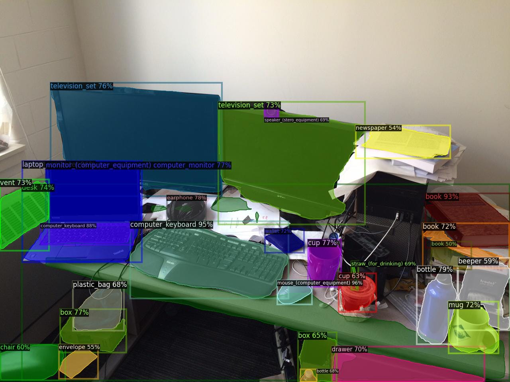
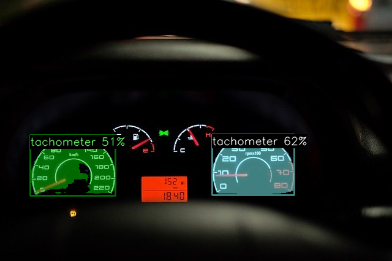
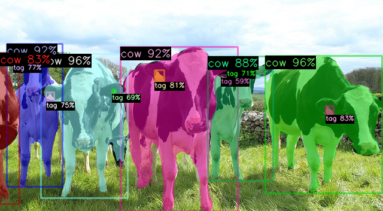
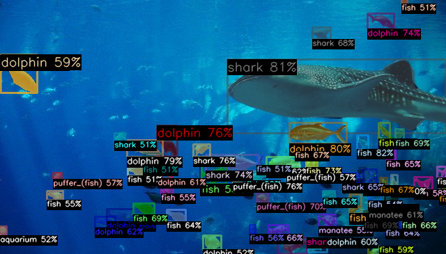
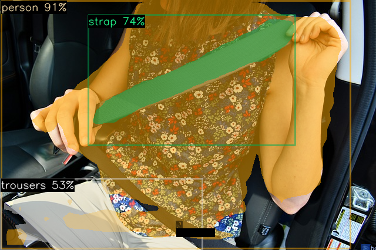
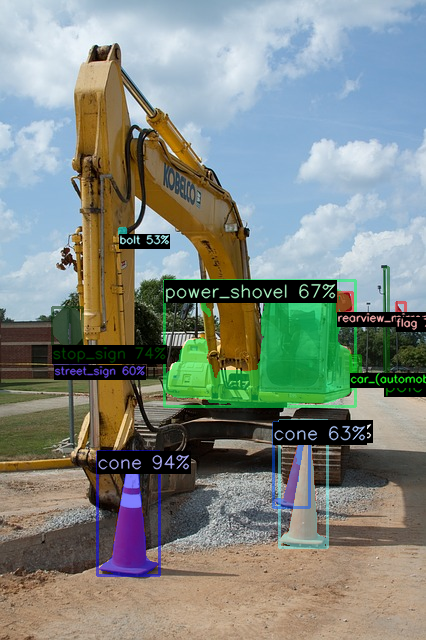

# Detic : Object Detection and Segmentation of 21k Classes with High Accuracy

# Detic : Object Detection and Segmentation of 21k Classes with High Accuracy

[](/@cochard-dav?source=post_page---byline--49cba412b7d4---------------------------------------)

[David Cochard](/@cochard-dav?source=post_page---byline--49cba412b7d4---------------------------------------)

5 min read

·

Jun 27, 2022

--

[Listen](/m/signin?actionUrl=https%3A%2F%2Fmedium.com%2Fplans%3Fdimension%3Dpost_audio_button%26postId%3D49cba412b7d4&operation=register&redirect=https%3A%2F%2Fmedium.com%2Faxinc-ai%2Fdetic-object-detection-and-segmentation-of-21k-classes-with-high-accuracy-49cba412b7d4&source=---header_actions--49cba412b7d4---------------------post_audio_button------------------)

Share

This is an introduction to「Detic」, a machine learning model that can be used with [ailia SDK](https://ailia.jp/en/). You can easily use this model to create AI applications using [ailia SDK](https://ailia.jp/en/) as well as many other ready-to-use [ailia MODELS](https://github.com/axinc-ai/ailia-models).

## Overview

*Detic (Detector with Image Classes)* is a segmentation model that can identify 21K object classes developed by *Facebook Research* and published in January 2022. It is able to detect objects that were previously undetectable with models such as YOLO, with high accuracy and without retraining. The model can be trained with only image annotations without the need for object bounding boxes.

Press enter or click to view image in full size



Source: <https://github.com/facebookresearch/Detic>

[## Detecting Twenty-thousand Classes using Image-level Supervision

### Current object detectors are limited in vocabulary size due to the small scale of detection datasets. Image…

arxiv.org](https://arxiv.org/abs/2201.02605?source=post_page-----49cba412b7d4---------------------------------------)

[## GitHub — facebookresearch/Detic: Code release for “Detecting Twenty-thousand Classes using…

### Detic: A Detector with image c lasses that can use image-level labels to easily train detectors. Detecting…

github.com](https://github.com/facebookresearch/Detic?source=post_page-----49cba412b7d4---------------------------------------)

## Architecture

Identifying the bounding box and the class (type or category) of an object in an input image is called *object detection,* or simply *detection*. Identifying only the class name fis called *object identification*, or *classification*.

Conventional *object detection* models suffer from the high annotation cost of bounding boxes, which allows only small datasets to be created and only a limited number of classes to be trained on and detected.

In contrast, *object identification* only requires annotation of labels on an per-image basis, which is faster and thus involves larger datasets. Therefore it is possible to train and identify a larger number of classes, but the dataset does not contain bounding boxes information and cannot be used for *object detection*.

*Detic* solves this problem by training the object detector on a dataset for object identification.

The method of training an object detector without using bounding boxes information is called *Weakly-Supervised Object detection (WSOD)*. *Detic* uses *Semi-supervised WSOD* on the *ImageNet-21K* dataset, usually used for object identification, to train the object detector.

Press enter or click to view image in full size


Source: <https://arxiv.org/abs/2201.02605>

Unlike previous studies, *Detic* does not provide class labels for the object detector’s resulting bounding boxes. Instead for each bounding box detected, the class name is identified by using [*CLIP embedding vector*](/axinc-ai/clip-learning-transferable-visual-models-from-natural-language-supervision-4508b3f0ea46) trained on a very large data set.

During training, since only per-image class labels exist, class identification is performed on the largest bounding box output by the object detector, and the *loss* is calculated. If *loss* is large, the bounding box calculation for the discriminator and the object detector are adjusted and the training continues.

## Training dataset

*ImageNet21k* used for *Detic* training is a dataset for primarily used for object identification tasks. It only contains labels for each entire image, but on a very large number since it contains 21k class labels and 14 million images.

*LVIS* is a dataset used for evaluation in the *Detic* training. This dataset is usually used for object detection and contains 1000+ class labels and 120,000 images.

## Detic pre-trained model

Several variants of *Detic* were published, trained on multiple backbones.

[## Detic/MODEL\_ZOO.md at main · facebookresearch/Detic

### This file documents a collection of models reported in our paper. The training time was measured on Big Basin servers…

github.com](https://github.com/facebookresearch/Detic/blob/main/docs/MODEL_ZOO.md?source=post_page-----49cba412b7d4---------------------------------------)

For example, the model below was trained using the [*SwinB (Swin-Transformer)*](https://github.com/microsoft/Swin-Transformer) backbone, the *CenterNet2* detector*, Federated Loss*, and *large-scale jittering* model architectures, with the *ImageNet21k* and *COCO* datasets. It is possible to choose between the *COCO* and *LVIS* class lists or the *COCO* and *ImageNet21k* class lists.

> Detic\_C2\_SwinB\_896\_4x\_IN-21K+COCO\_lvis.onnx  
> Detic\_C2\_SwinB\_896\_4x\_IN-21K+COCO\_in21k.onnx

The model below uses a *ResNet50* backbone and is trained using the *ImageNet21k* dataset for object identification. Although the mask mAP is lower than *SwinB*, faster inference is possible.

> Detic\_C2\_R50\_640\_4x\_lvis.onnx  
> Detic\_C2\_R50\_640\_4x\_in21k.onnx

## Examples of Detic results

*Detic* can recognize objects from many more categories than *YOLO* without the need for retraining. Here is an example of *Detic* recognition using *SwinB + LVIS.*

### Construction machinery


Source: <https://pixabay.com/photos/construction-site-demolition-work-3688252/>

### Construction cones


Source: <https://pixabay.com/photos/heavy-equipment-construction-99510/>

### Dashboard speedometers



Source: <https://pixabay.com/photos/car-dashboard-speedometer-speed-2667434/>

### Cows and ear tags



Source: <https://pixabay.com/photos/holstein-cattle-cows-heifers-field-2318436/>

### Underwater animals



### Seatbelts



Source: <https://pixabay.com/photos/seat-belt-seatbelt-vehicle-4227630/>

## Usage

You can use the following commands can be used to run *Detic* arbitrary images using ailia SDK 1.2.10.

```
$ python3 detic.py --input input.jpg --savepath output.jpg
```

[## ailia-models/object\_detection/detic at master · axinc-ai/ailia-models

### (Image from https://web.eecs.umich.edu/~fouhey/fun/desk/desk.jpg, credit David Fouhey) Automatically downloads the onnx…

github.com](https://github.com/axinc-ai/ailia-models/tree/master/object_detection/detic?source=post_page-----49cba412b7d4---------------------------------------)

It is also possible to infer using the *ResNet50* backbone, which is about 4 times faster than *SwinB*, by using the `-m R50_640_4x` option.

```
$ python3 detic.py --input input.jpg --savepath output.jpg -m R50_640_4x
```

An example of inference on a *ResNet50* backbone is shown below, which is less accurate than the *SwinB* results shown above, but can it can still detect contruction cones.



Source: <https://pixabay.com/photos/heavy-equipment-construction-99510/>

## Limitations and workarounds

*Detic* is highly accurate, but its large model size (551 MB) makes it too heavy to run on edge devices. Therefore, for edge devices, it is desirable to create annotation data in *Detic* and train [*YOLOX*](/axinc-ai/yolox-object-detection-model-exceeding-yolov5-d6cea6d3c4bc)on it to extend YOLOX default recognition categories.

[ax Inc.](https://axinc.jp/en/) has a service to automatically train YOLOX using Detic.

---

[ax Inc.](https://axinc.jp/en/) has developed [ailia SDK](https://ailia.jp/en/), which enables cross-platform, GPU-based rapid inference.

ax Inc. provides a wide range of services from consulting and model creation, to the development of AI-based applications and SDKs. Feel free to [contact us](https://axinc.jp/en/) for any inquiry.