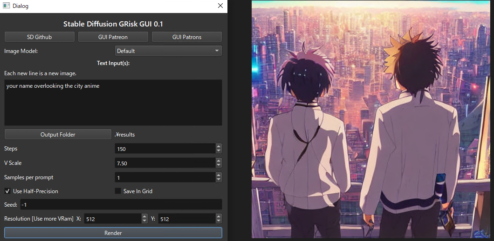
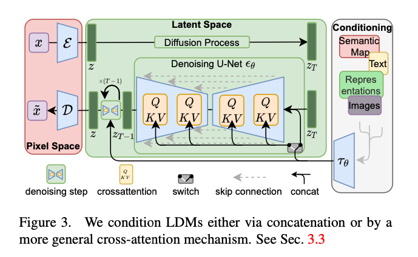

# StableDiffusion: Machine Learning Model to Generate Images From Text

# StableDiffusion: Machine Learning Model to Generate Images From Text

[David Cochard](/@cochard-dav?source=post_page---byline--22034d9b44b7---------------------------------------)

4 min read

·

Aug 31, 2022

--

[Listen](/m/signin?actionUrl=https%3A%2F%2Fmedium.com%2Fplans%3Fdimension%3Dpost_audio_button%26postId%3D22034d9b44b7&operation=register&redirect=https%3A%2F%2Fmedium.com%2Faxinc-ai%2Fstablediffusion-machine-learning-model-to-generate-images-from-text-22034d9b44b7&source=---header_actions--22034d9b44b7---------------------post_audio_button------------------)

Share

*StableDiffusion* is a machine learning model that generates images from text. The trained model is publicly available, and images can be generated freely on a PC.

---

## Overview

*StableDiffusion* is a machine learning model for generating images from text published in August 2022. Service such as *DALLE2* and *Midjourney* exist to generate images from text, but in both cases, the trained models are private and must be accessed via a web service. *StableDiffusion* allows users to freely generate images on their PCs because the trained models are publicly available.

[## GitHub — CompVis/stable-diffusion

### Stable Diffusion was made possible thanks to a collaboration with Stability AI and Runway and builds upon our previous…

github.com](https://github.com/CompVis/stable-diffusion?source=post_page-----22034d9b44b7---------------------------------------)

[## High-Resolution Image Synthesis with Latent Diffusion Models

### By decomposing the image formation process into a sequential application of denoising autoencoders, diffusion models…

arxiv.org](https://arxiv.org/abs/2112.10752?source=post_page-----22034d9b44b7---------------------------------------)

## Usage

To use *Stable Diffusion* on Windows, pre-built binaries are provided by *GRisk* and available at the link below*.*

[## Stable Diffusion GRisk GUI 0.1

### This project require a Nvidia Card that can run CUDA. With a card with 4 vram, it should generate 256X512 images. This…

grisk.itch.io](https://grisk.itch.io/stable-diffusion-gui?source=post_page-----22034d9b44b7---------------------------------------)

After unzipping `Stable Diffusion GRisk GUI.rar`, launch the `Stable Diffusion GRisk GUI.exe`

Since the default parameters do not generate a proper image, set the `Steps` to 150 and the `Resolution` to 512. Then enter a text prompt and click `Render` to generate an image. The generated images are stored in the results folder.

Press enter or click to view image in full size

UI of Stable Diffusion GRisk

When the number of words in the prompt is small, the output tends to be unstable, perhaps because the feature vector does not have enough information to construct a picture. Therefore, it seems best to provide information about the picture you want in as much detail as possible.

“hastune miku standing on the mountain anime”

“your name overlooking the city anime”

Image generation takes about 32 seconds on a machine equipped with an RTX3080.

## Dataset

*StableDiffusion* was trained on the *LAION-5B* dataset which contains 5.85 billion image/text pairs.

[## LAION-5B: A NEW ERA OF OPEN LARGE-SCALE MULTI-MODAL DATASETS | LAION

### by: Romain Beaumont, 8 Aug, 2022 We present a dataset of 5,85 billion CLIP-filtered image-text pairs, 14x bigger than…

laion.ai](https://laion.ai/blog/laion-5b/?source=post_page-----22034d9b44b7---------------------------------------)

The contents of the dataset can be searched from the following page. The search uses CLIP’s Embedding, indicating that CLIP is also effective for image searches.

[## Clip front

### Clip front

Clip frontrom1504.github.io](https://rom1504.github.io/clip-retrieval/?back=https%3A%2F%2Fknn5.laion.ai&index=laion5B&useMclip=false&source=post_page-----22034d9b44b7---------------------------------------)

*StableDiffusion* was trained on images from LAION-2B at resolution 256x256, then on 170 million 512x512 resolution images from LAION-5B.

[## CompVis/stable-diffusion · Hugging Face

### Edit model card Stable Diffusion is a latent text-to-image diffusion model capable of generating photo-realistic images…

huggingface.co](https://huggingface.co/CompVis/stable-diffusion?source=post_page-----22034d9b44b7---------------------------------------)

## Training duration

The training of *StableDiffusion* took 150,000 hours on an AWS A100 machine with 40GB VRAM.

[## stable-diffusion/Stable\_Diffusion\_v1\_Model\_Card.md at main · CompVis/stable-diffusion

### This model card focuses on the model associated with the Stable Diffusion model, available here. Developed by: Robin…

github.com](https://github.com/CompVis/stable-diffusion/blob/main/Stable_Diffusion_v1_Model_Card.md?source=post_page-----22034d9b44b7---------------------------------------)

## Architecture

*StableDiffusion* uses the *Text Encoder* from *CLIP* and the *AutoEncoder* from *UNet* to construct the *LatentDiffusionModel* (diffusion model) then the final image.

*StableDiffusion* architecture (Source: <https://arxiv.org/abs/2112.10752>)

The architecture of the image generation is similar to *DALLE-2*, which also uses CLIP features and diffusion models.

Press enter or click to view image in full size

Source: <https://cdn.openai.com/papers/dall-e-2.pdf>

*CLIP* is trained on 400 million images on the Internet and can output the similarity between any text and image. Unlike conventional classifiers, it is trained with text pairs instead of labels, thus achieving zero-shot image classification even for unknown images. Since *CLIP* feature vectors have information that indicates the meaning of the image, they can be applied not only to image classification but also to image generation.

[## CLIP: Learning Transferable Visual Models From Natural Language Supervision

### This is an introduction to「CLIP」, a machine learning model that can be used with ailia SDK. You can easily use this…

medium.com](/axinc-ai/clip-learning-transferable-visual-models-from-natural-language-supervision-4508b3f0ea46?source=post_page-----22034d9b44b7---------------------------------------)

First, *CLIP*’s text encoder is used to obtain feature vectors from the text. After converting each word into a word vector, the transformer extracts feature vectors that indicate the meaning of the text.

From the feature vector generated by the text encoder, a diffusion model in the space of feature vectors is used to generate a feature vector for the image encoder.

Finally, the image decoder is used to convert the feature vector into an image.

In the diffusion model, feature vectors are generated by starting from noise and repeatedly denoising. *UNet* is used for denoising.

It uses the same classifier-free guidance as *GLIDE*.

[## GLIDE: Towards Photorealistic Image Generation and Editing with Text-Guided Diffusion Models

### Diffusion models have recently been shown to generate high-quality synthetic images, especially when paired with a…

arxiv.org](https://arxiv.org/abs/2112.10741?source=post_page-----22034d9b44b7---------------------------------------)

## Support in ailia SDK

*StableDiffusion* currently requires Pytorch. We are investigating the possibility of converting the model to ONNX to run it with the ailia SDK.

---

[ax Inc.](https://axinc.jp/en/) has developed [ailia SDK](https://ailia.jp/en/), which enables cross-platform, GPU-based rapid inference.

ax Inc. provides a wide range of services from consulting and model creation, to the development of AI-based applications and SDKs. Feel free to [contact us](https://axinc.jp/en/) for any inquiry.