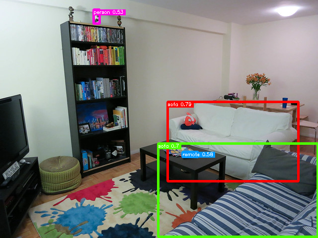

# Released ailia SDK 1.2.13

# Released ailia SDK 1.2.13

[](/@terada_80332?source=post_page---byline--5d768fbdcf04---------------------------------------)

[Takehiko TERADA](/@terada_80332?source=post_page---byline--5d768fbdcf04---------------------------------------)

3 min read

·

Oct 24, 2022

--

[Listen](/m/signin?actionUrl=https%3A%2F%2Fmedium.com%2Fplans%3Fdimension%3Dpost_audio_button%26postId%3D5d768fbdcf04&operation=register&redirect=https%3A%2F%2Fmedium.com%2Faxinc-ai%2Freleased-ailia-sdk-1-2-13-5d768fbdcf04&source=---header_actions--5d768fbdcf04---------------------post_audio_button------------------)

Share

We are pleased to introduce version 1.2.13 of ailia SDK, a cross-platform framework to perform fast AI inference on GPU or CPU. You can find more information about ailia SDK on the [official website](https://axinc.jp/en/solutions/ailia_sdk.html).


## Acceleration through enhanced TensorCore support on NVIDIA platforms

Enhanced TensorCore support on the NVIDIA platform provides significant speedups in the FP16 environment; Jetson NX can infer yolox 1.54 times faster than ailia SDK 1.2.12.

In ailia-models, available backends (execution environments) can be enumerated with the env\_list option.

```
$ python3 yolox.py --env_list
```

By default the FP32 backend is used so please manually select the FP16 backend from the enumerated list; for Jetson, backend number 2 corresponds to FP16.

```
$ python3 yolox.py -e 2
```

## Support for Jetson Orin

ailia 1.2.13 support Jetpack 5.0.2 and cuDNN 8.3 and are now compatible with Jetson Orin, enabling fast inference using TensorCore.

## Metal and Vulkan support for optimized specific activation functions

The composite activations added for CPU and CUDA in ailia SDK 1.2.12 have been added for Metal and Vulkan. In addition, we have extended the GPU execution range of ResizeNearest and Concat. macOS (M1 Max) can now infer yolox 1.48 times faster than ailia SDK 1.2.12.

## Reduction of memory copying

Improved performance of the ailiaSetBlobData API for models with multiple inputs and outputs; Python essentially uses the ailiaSetBlobData API, which improves overall performance when used from Python.

## ONNX opset 16 support

Bernoulli, CastLike, GreaterOrEqual, GridSample, LessOrEqual are implemented, and ONNX opset 16 is supported.

## Acceleration of DiffusionModel by speeding up Einsum

Accelerated Einsum for faster inference in DiffusionModel. ailia-models DiffusionModel are now faster using GPU.

[## ailia-models/diffusion at master · axinc-ai/ailia-models

### The collection of pre-trained, state-of-the-art AI models for ailia SDK — ailia-models/diffusion at master ·…

github.com](https://github.com/axinc-ai/ailia-models/tree/master/diffusion?source=post_page-----5d768fbdcf04---------------------------------------)

## End of support for C++ AMP

Microsoft has [deprecated C++ AMP](https://learn.microsoft.com/ja-jp/cpp/parallel/amp/cpp-amp-overview?view=msvc-170) thus we have decided to discontinue the support of C++ AMP. Vulkan Backend can be used instead.

## Enhanced Unity documentation

The documentation for each API of Unity has been enhanced. You can check it from the following URL.

[## ailia: ailia Unity Plugin Document

### Edit description

axinc-ai.github.io](https://axinc-ai.github.io/ailia-sdk/api/unity/en/?source=post_page-----5d768fbdcf04---------------------------------------)

## Introduction of new models

- **Crestereo**, **MobileStereoNet** : Depth Estimation from Stereo Images

[## ailia-models/depth\_estimation/crestereo at master · axinc-ai/ailia-models

### Ailia input shape(1, 3, 360, 640) (Image from https://vision.middlebury.edu/stereo/data/scenes2003/) rigth image input…

github.com](https://github.com/axinc-ai/ailia-models/tree/master/depth_estimation/crestereo?source=post_page-----5d768fbdcf04---------------------------------------)

[## ailia-models/depth\_estimation/mobilestereonet at master · axinc-ai/ailia-models

### (Image from http://www.cvlibs.net/datasets/kitti/eval\_scene\_flow.php) Automatically downloads the onnx and prototxt…

github.com](https://github.com/axinc-ai/ailia-models/tree/master/depth_estimation/mobilestereonet?source=post_page-----5d768fbdcf04---------------------------------------)

- **Glip** : Object detection from arbitrary text



Source: Flickr30K（<https://github.com/microsoft/GLIP/blob/main/DATA.md>）

[## ailia-models/object\_detection/glip at master · axinc-ai/ailia-models

### (Image from http://farm4.staticflickr.com/3693/9472793441\_b7822c00de\_z.jpg) This model requires additional module. pip3…

github.com](https://github.com/axinc-ai/ailia-models/tree/master/object_detection/glip?source=post_page-----5d768fbdcf04---------------------------------------)

- **Dehamer** : Fog removal model


Souce: <https://github.com/Li-Chongyi/Dehamer/blob/main/data/classic_test_image/input/canyon.png>

[## ailia-models/image\_manipulation/dehamer at master · axinc-ai/ailia-models

### (Image from https://github.com/Li-Chongyi/Dehamer/blob/main/data/classic\_test\_image/input/canyon.png) Shape : (1, 3…

github.com](https://github.com/axinc-ai/ailia-models/tree/master/image_manipulation/dehamer?source=post_page-----5d768fbdcf04---------------------------------------)

- **Detic** : GridSampler integrated version of object detection model

[## ailia-models/object\_detection/detic at master · axinc-ai/ailia-models

### (Image from https://web.eecs.umich.edu/~fouhey/fun/desk/desk.jpg, credit David Fouhey) Automatically downloads the onnx…

github.com](https://github.com/axinc-ai/ailia-models/tree/master/object_detection/detic?source=post_page-----5d768fbdcf04---------------------------------------)

The opset16 version is available with the following command: GridSample can be run inside the ailia SDK, thus avoiding the problem of possible conflicts with Pytorch’s cuDNN version.

```
$ python3 detic.py --opset16
```

## Evaluation version of ailia SDK

ailia SDK 1.2.13 evaluation version can be downloaded at the link below.

[## ax Inc.

### A future in which all devices carry AI We believe such a future is on the way. To usher in that day, we will keep…

axinc.jp](https://axinc.jp/en/trial/?source=post_page-----5d768fbdcf04---------------------------------------)

---

[ailia SDK](https://axinc.jp/en/solutions/ailia_sdk.html) is a self-contained cross-platform high speed inference SDK for AI developed by ax Inc.

ax Inc. provides a wide range of services from consulting and model creation, to the development of AI-based applications and SDKs. Feel free to [contact us](https://axinc.jp/en/) for any inquiry.