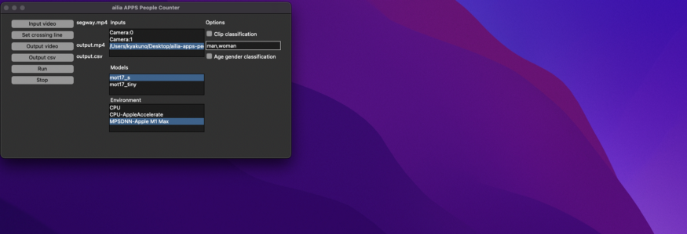
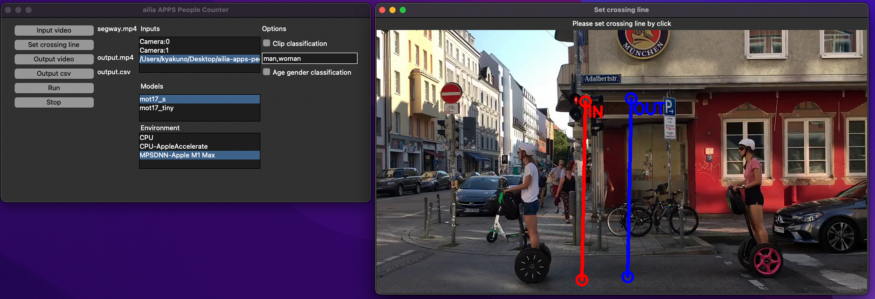
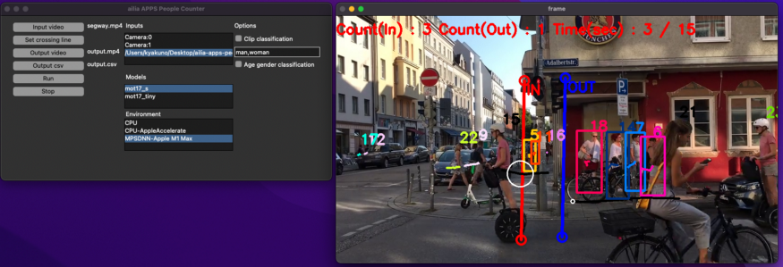
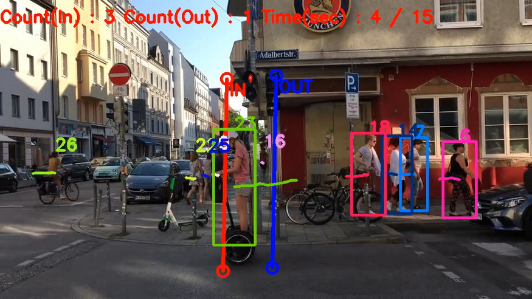
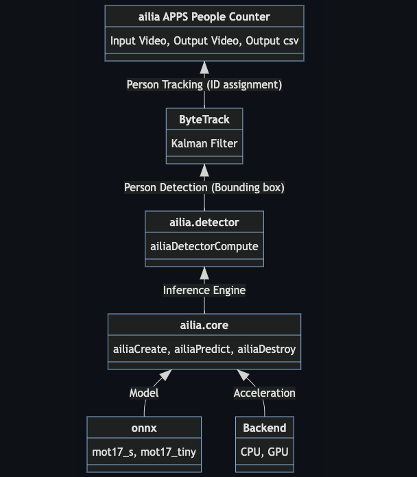

# ailia APPS People Counter : An AI application that can perform human flow analysis

# ailia APPS People Counter : An AI application that can perform human flow analysis

[](/@terada_80332?source=post_page---byline--fcc9f55e301a---------------------------------------)

[Takehiko TERADA](/@terada_80332?source=post_page---byline--fcc9f55e301a---------------------------------------)

5 min read

·

Jan 5, 2023

--

[Listen](/m/signin?actionUrl=https%3A%2F%2Fmedium.com%2Fplans%3Fdimension%3Dpost_audio_button%26postId%3Dfcc9f55e301a&operation=register&redirect=https%3A%2F%2Fmedium.com%2Faxinc-ai%2Failia-apps-people-counter-an-ai-application-that-can-perform-human-flow-analysis-fcc9f55e301a&source=---header_actions--fcc9f55e301a---------------------post_audio_button------------------)

Share

Introducing ailia APPS People Counter, which allows you to perform people flow analysis using ailia SDK. You can set an arbitrary straight line in the GUI and count the number of people entering and exiting.

### About ailia APPS People Counter

ailia APPS People Counter is an AI application that can perform human flow analysis developed using the ailia SDK. It is developed as open source and can be freely used with the ailia SDK license.

An example video of the execution is shown below.

Video source:<https://pixabay.com/ja/videos/%E3%82%BB%E3%82%B0%E3%82%A6%E3%82%A7%E3%82%A4%E3%82%B9%E3%82%AF%E3%83%BC%E3%82%BF%E3%83%BC-%E4%BA%BA%E3%80%85-%E5%8B%95%E3%81%8F-28146/>

### Operating environment for ailia APPS People Counter

Works on Windows, macOS, Linux, and Jetson. Python is required for execution.

### How to use ailia APPS People Counter

Clone the source code.

```
git clone https://github.com/axinc-ai/ailia-apps-people-counter
```

[## GitHub - axinc-ai/ailia-apps-people-counter: Count the number of people crossing a line from AI…

### Count the number of people crossing a line from a video using an AI model for people detection and tracking. python3…

github.com](https://github.com/axinc-ai/ailia-apps-people-counter?source=post_page-----fcc9f55e301a---------------------------------------)

Install dependent libraries.

```
pip3 install lap
```

Starts the GUI.

```
python3 ailia-apps-people-counter.py
```

Press enter or click to view image in full size



The application will look like above

Press the Input video button to select a video file; press the Set crossing line button and click on the screen to draw two lines.

Press enter or click to view image in full size



Designation of measurement lines

Press the Run button to start measurement. If the locus of the person’s center point intersects the OUT -> IN line, it is counted as entering, and if it intersects the IN -> OUT line, it is counted as exiting.

Press enter or click to view image in full size



Measurement screen

### Video output of ailia APPS People Counter

The Output video button allows you to save the result to a video file.

Press enter or click to view image in full size



Example of output video

### CSV output of ailia APPS People Counter

The Output csv button allows you to write the result to a csv file. The following is an example of a CSV file output, where the number of people passing through each second is shown.

```
time(sec) , count(in) , count(out) , total_count(in) , total_count(out)  
0 , 0 , 0 , 0 , 0  
1 , 1 , 1 , 1 , 1  
2 , 1 , 1 , 2 , 2
```

### Architecture of ailia APPS People Counter

Detect people with yolox\_s trained on the mot17 dataset. Next, the person is tracked and assigned an ID using bytetrack. Finally, the trajectory for each ID is determined to intersect with a straight line and counted up. ailia SDK is used for fast AI inference.



architecture

mot17\_s performs person detection at 1088x608 resolution and mot17\_tiny at 416x416 resolution.

### Options for ailia APPS People Counter

When a person crosses a line, attribute estimation can be performed on the person. To enable attribute estimation, activate the Clip classification or Age Gender classification checkboxes.

### Clip classification

Specify an attribute with any text, and the attribute will reflect the text that best matches using the full body image. For example, the attributes “man” and “woman” can be used for gender inference.

[## CLIP: Learning Transferable Visual Models From Natural Language Supervision

### This is an introduction to「CLIP」, a machine learning model that can be used with ailia SDK. You can easily use this…

medium.com](/axinc-ai/clip-learning-transferable-visual-models-from-natural-language-supervision-4508b3f0ea46?source=post_page-----fcc9f55e301a---------------------------------------)

The CSV will have a count for each attribute at the end.

```
time(sec) , count(in) , count(out) , total_count(in) , total_count(out) , man , woman  
0 , 0 , 0 , 0 , 0 , 0 , 0  
1 , 1 , 1 , 1 , 1 , 1 , 1
```

### Age gender classification

Using AgeGenderRecognitionRetail developed by Intel, it uses facial images to reflect gender and age as attributes. If a face cannot be detected, it is set to Unknown.

[## AgeGenderRecognitionRetail : A Machine Learning Model to Identify Age and Gender

### This is an introduction to「AgeGenderRecognitionRetail」, a machine learning model that can be used with ailia SDK. You…

medium.com](/axinc-ai/agegenderrecognitionretail-a-machine-learning-model-to-identify-age-and-gender-8506510414b?source=post_page-----fcc9f55e301a---------------------------------------)

Attribute information is added to the CSV at the end.

```
time(sec) , count(in) , count(out) , total_count(in) , total_count(out) , age_gender(list)  
0 , 0 , 0 , 0 , 0  
1 , 1 , 0 , 1 , 0 , Male 25  
2 , 1 , 1 , 2 , 1 , Unknown , Male 38
```

### Option for validating the accuracy of attribute estimation

By enabling the Always classify for debug checkbox, you can always activate attribute detection even when not crossing a line. This option allows for more simplified verification of the accuracy of attribute estimation using webcams, videos, etc.

### Addition of functionality to ailia APPS People Counter

Since ailia APPS People Counter is developed as OSS, it is possible to freely extend its functions. We can also add functions on our side if you request it to ax corporation.

### Application of ailia APPS People Counter

It can be used to measure the number of visitors to shopping centers and events, which entrances are used the most, and traffic volume surveys.

---

ax Inc. is a company that puts AI to practical use, developing the ailia SDK, which enables cross-platform, high-speed inference using GPUs. ax Inc. provides total solutions for AI, from consulting, model creation, SDK provision, application and system development using AI, and support. Please feel free to [contact us](https://axinc.jp/en) for a total solution for AI.