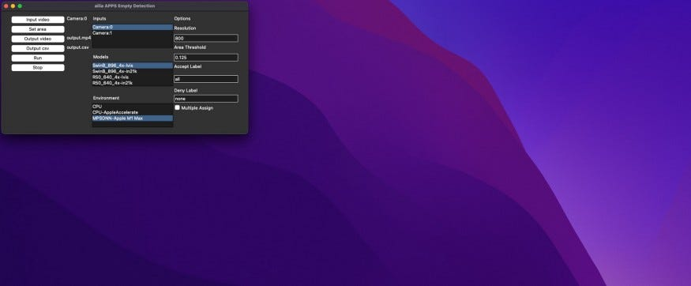
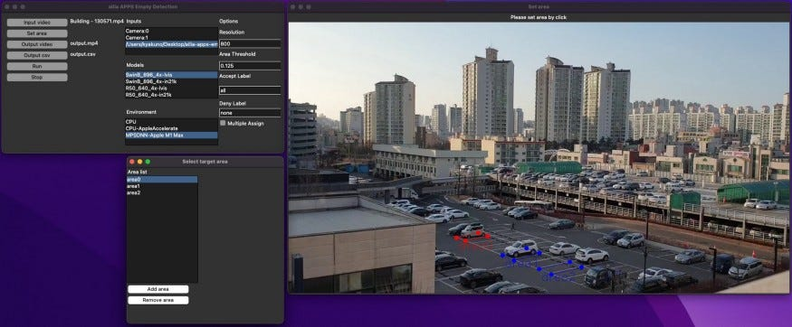
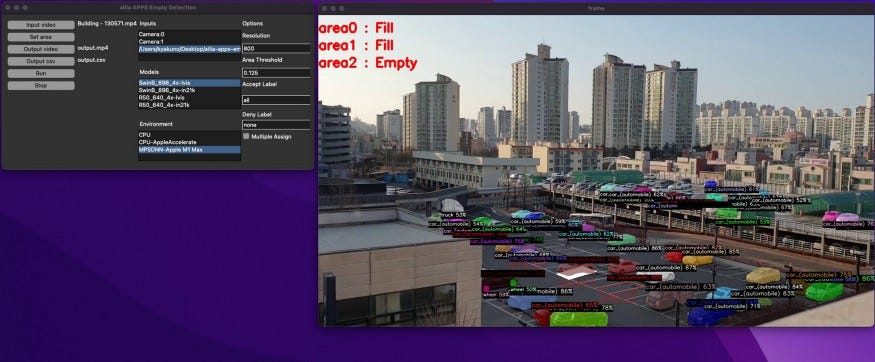
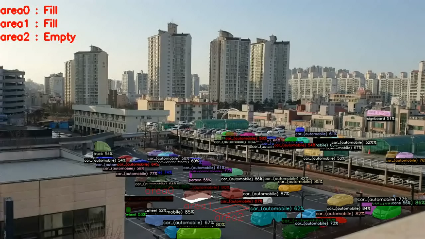
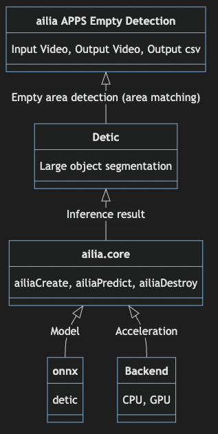
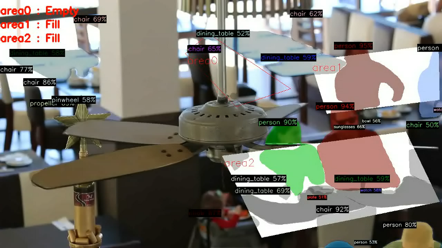

# ailia APPS Empty Detection : AI application that allows you to check the availability of parking lots and restaurants

# ailia APPS Empty Detection : AI application that allows you to check the availability of parking lots and restaurants

[](/@terada_80332?source=post_page---byline--b2710d3091ab---------------------------------------)

[Takehiko TERADA](/@terada_80332?source=post_page---byline--b2710d3091ab---------------------------------------)

5 min read

·

Jan 6, 2023

--

[Listen](/m/signin?actionUrl=https%3A%2F%2Fmedium.com%2Fplans%3Fdimension%3Dpost_audio_button%26postId%3Db2710d3091ab&operation=register&redirect=https%3A%2F%2Fmedium.com%2Faxinc-ai%2Failia-apps-empty-detection-ai-application-that-allows-you-to-check-the-availability-of-parking-b2710d3091ab&source=---header_actions--b2710d3091ab---------------------post_audio_button------------------)

Share

Introducing ailia APPS Empty Detection, which allows you to check the availability of parking lots and restaurants using ailia SDK. You can set an arbitrary area with GUI and detect if there is an object there or not.

### About ailia APPS Empty Detection

ailia APPS Empty Detection is an AI application developed using the ailia SDK that can check the availability of any specified area. It is developed as open source and can be freely used with the ailia SDK license.

Here is an example. If a car exists in the specified area, the message “Fill” is displayed; if not, “Empty” is displayed. This can be applied not only to cars, but also to goods, people, etc.

Execution example of ailia APPS Empty Detection

### Operating environment for ailia APPS Empty Detection

Works with Windows, macOS, Linux and Jetson. Requires Python to run.

### How to use ailia APPS EmptyDetection

Clone the source code.

```
git clone https://github.com/axinc-ai/ailia-apps-empty-detection
```

[## GitHub - axinc-ai/ailia-apps-empty-detection: Detect empty area using AI object detection

### Detects cars in parking lots, inventory on shelves, etc., and counts vacant information. Empty area detection Export…

github.com](https://github.com/axinc-ai/ailia-apps-empty-detection?source=post_page-----b2710d3091ab---------------------------------------)

Install dependent libraries, not required for ailia SDK 1.2.14 or later, scheduled for release in February 2023.

```
pip3 install torch
```

Launch GUI.

```
python3 ailia-apps-empty-detection.py
```

Press enter or click to view image in full size



Launched GUI

Press the Input video button and select a video file. Set the detection area by pressing the Set area button and clicking the screen four times. The detection area can be increased with Add area or deleted with Remove area. You can also edit the area name by double-clipping the area name.

Press enter or click to view image in full size



Setting the detection area

The detection area can also be saved in json from File in the window menu.

Press the Run button to start detection. Fill is displayed when an object exists in the specified detection area, and Empty is displayed when it does not exist.

Press enter or click to view image in full size



Execution example

### Video output of ailia APPS Empty Detection

You can save the result to a video file with the Output video button.

Press enter or click to view image in full size



Video file output example

### CSV output of ailia APPS Empty Detection

You can specify the output destination csv file with the Output csv button. Here is an example of CSV file output. Every second it writes 1 if the object is present and 0 if it is not.

```
time(sec) , area0 , area1 , area2  
0 , 1 , 1 , 0
```

### Architecture of ailia APPS Empty Detection

Use Detic to get object position and area. If the area of the specified area and the area of the object overlap by 12.5% or more, it is judged to exist. Many objects can be detected without re-learning by using [Detic AI model](/axinc-ai/detic-object-detection-and-segmentation-of-21k-classes-with-high-accuracy-49cba412b7d4).



Architecture

### Options for ailia APPS Empty Detection

### Resolution

You can speed up by lowering the recognition resolution of Detic.

### Area Threshold

Specify the ratio of whether or not to judge that an object exists when how much it overlaps. The default value is 12.5%.

### Accept Label

Accuracy can be improved by detecting only specified labels. By default (all), all objects are detected, so even if there is a signboard, it will be determined that the car is parked. Therefore, by specifying car as the Accept Label, it is possible to exclude signboards from detection targets and process only cars. Multiple Accept Labels can be specified separated by commas.

### Deny Label

Accuracy can be improved by ignoring only certain labels. For example, by specifying person, it is possible to remove the effect when a person crosses the camera. By default (none), all objects are detected.

### Multiple Assign

By default, 1 object is assigned to 1 most overlapping area. Due to the angle of the camera in a parking lot, etc., the outline of the car may overlap in the adjacent area, so the default setting assigns it to one area to improve accuracy.

Enabling Multiple Assign allows you to assign one object to multiple areas. It is used in applications such as object detection that specify areas in detail and assume that one large object overlaps multiple areas.

### Models

You can choose between SwinB, a highly accurate model using VisionTransformer, and ResNet50, which uses traditional Convolution. You can also choose between lvis, which can detect 1000 categories, and imagenet21k, which can detect 21000 categories. In terms of accuracy, SwinB is recommended. For general objects, lvis is sufficient, but if there are objects that cannot be detected by lvis, use imagenet21k.

### Addition of functionality to ailia APPS Empty Detection

Since ailia APPS Empty Detection is developed as OSS, you can freely extend its functions. We can also add functions on our side if you request it to ailia APPS Inc.

### Application of ailia APPS Empty Detection

## Parking lot

The availability of parking spaces by location can be presented to users in an easy-to-understand manner. In addition, the occupancy rate of a parking lot can be calculated from a csv file.

## Restaurant

The availability of each table can be presented to users in an easy-to-understand manner. In addition, table occupancy rates can be calculated from csv.

Press enter or click to view image in full size



Source: <https://pixabay.com/videos/pub-food-restaurant-eat-beer-33583/>

## Factory

It is possible to detect whether there is a package in a specific area and display it in the factory. Unnecessary transportation can be suppressed.

## Store

You can detect missing items on shelves and confirm the need for inventory replenishment.

---

ax Inc. is a company that puts AI to practical use, developing the ailia SDK, which enables cross-platform, high-speed inference using GPUs. ax Inc. provides total solutions for AI, from consulting, model creation, SDK provision, application and system development using AI, and support. Please feel free to [contact us](https://axinc.jp/en) for a total solution for AI.