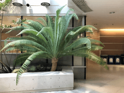
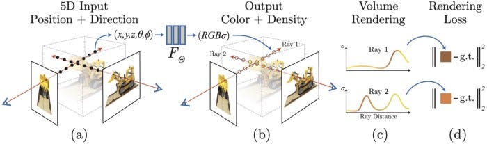
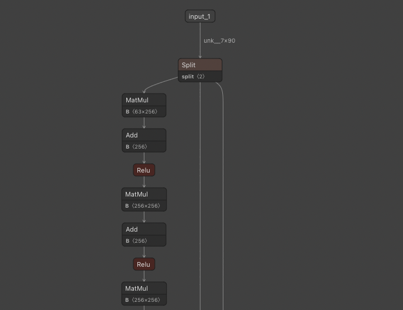
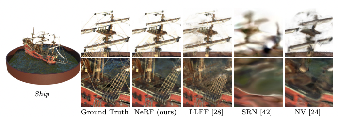

# NeRF : Machine learning model to generate and render 3D models from multiple viewpoint images

# NeRF : Machine learning model to generate and render 3D models from multiple viewpoint images

[](/@terada_80332?source=post_page---byline--599631dc2075---------------------------------------)

[Takehiko TERADA](/@terada_80332?source=post_page---byline--599631dc2075---------------------------------------)

4 min read

·

Jan 10, 2023

--

1

[Listen](/m/signin?actionUrl=https%3A%2F%2Fmedium.com%2Fplans%3Fdimension%3Dpost_audio_button%26postId%3D599631dc2075&operation=register&redirect=https%3A%2F%2Fmedium.com%2Faxinc-ai%2Fnerf-machine-learning-model-to-generate-and-render-3d-models-from-multiple-viewpoint-images-599631dc2075&source=---header_actions--599631dc2075---------------------post_audio_button------------------)

Share

This is an introduction to「NeRF」, a machine learning model that can be used with [ailia SDK](https://ailia.jp/en/). You can easily use this model to create AI applications using [ailia SDK](https://ailia.jp/en/) as well as many other ready-to-use [ailia MODELS](https://github.com/axinc-ai/ailia-models).

### Oveview

NeRF (Neural Radiance Fields) is a technology released in March 2020. nerF can generate a 3D model from multiple viewpoint images and render any viewpoint video. neRF does not use polygons, but instead uses machine learning models to represent 3D model representation.



Source: <https://github.com/bmild/nerf>

[## NeRF: Representing Scenes as Neural Radiance Fields for View Synthesis

### We present a method that achieves state-of-the-art results for synthesizing novel views of complex scenes by optimizing…

arxiv.org](https://arxiv.org/abs/2003.08934?source=post_page-----599631dc2075---------------------------------------)

[## GitHub - bmild/nerf: Code release for NeRF (Neural Radiance Fields)

### Tensorflow implementation of optimizing a neural representation for a single scene and rendering new views. NeRF…

github.com](https://github.com/bmild/nerf?source=post_page-----599631dc2075---------------------------------------)

### Architecture

The 3D model generated by NeRF is represented as a parameter of the machine learning model; one machine learning model is generated per 3D model, which is a functional representation of the 3D model.

In training, a machine learning model is trained using images from multiple viewpoints and the camera parameters of each image as input.



Source: <https://github.com/bmild/nerf>

The inference outputs (R,G,B,σ) by giving the coordinates (x,y,z) on the space you want to generate and the viewing direction (θ,φ). σ is the density. As in ray tracing, the RGB values are calculated pixel by pixel.

The model architecture is based on a 90-element 1D input vector, which is a projection of (x,y,z) and (θ,φ) into a higher dimensional space by PositionEmbedding, with a series of Linear operations.



[https://netron.app/?url=https://storage.googleapis.com/ailia-models/nerf/nerf.opt.onnx.prototxt](https://netron.app/?url=https%3A%2F%2Fstorage.googleapis.com%2Failia-models%2Fnerf%2Fnerf.opt.onnx.prototxt)

The data for training is input in LLFF format, which includes an image file and a numpy file showing the camera position.

[## GitHub - Fyusion/LLFF: Code release for Local Light Field Fusion at SIGGRAPH 2019

### Tensorflow implementation for novel view synthesis from sparse input images. Local Light Field Fusion: Practical View…

github.com](https://github.com/fyusion/llff?source=post_page-----599631dc2075---------------------------------------)

When attempting to build a 3D model from video, it is necessary to add camera position annotations to the video. One way to automatically detect the camera position is to use COLMAP, which is based on SfM technology and is used, for example, to estimate the camera position from drone video. COLMAP is particularly good at estimating the position of a camera in video in which the target object is stationary and orbiting around it.

NERF can output images with finer detail than conventional methods.

Press enter or click to view image in full size



Source: <https://arxiv.org/pdf/2003.08934.pdf>

### Usage

With the ailia SDK, it is possible to input the converted 3D model as ONNX, actually infer it, and generate an image.

Render one frame with the following command.

```
python3 nerf.py -s output.png
```

You can change the viewpoint to render with the angle option.

```
python3 nerf.py --angle 100
```

You can increase the rendering resolution with the render\_factor option. Renders at 1/4 resolution by default. The settings below will render at 1/2 resolution.

```
python3 nerf.py --render_factor 2
```

[## ailia-models/neural\_rendering/nerf at master · axinc-ai/ailia-models

### Multiple images for construct 3D model (from…

github.com](https://github.com/axinc-ai/ailia-models/tree/master/neural_rendering/nerf?source=post_page-----599631dc2075---------------------------------------)

### Related information

### 3D reconstruction using COLMAP and NeRF

[## GitHub - ALBERT-Inc/NeRF-tutorial: NeRFチュートリアル

### 学習済みモデルによるレンダリング COLMAPはSfM用のソフトウェアです。カメラパラメータの推定に加え、ソフトウェア単体でも3次元復元ができます。インストールは githubのリリースページ…

github.com](https://github.com/ALBERT-Inc/NeRF-tutorial?source=post_page-----599631dc2075---------------------------------------)

### Convert NeRF to volume texture and render in Unity

> *Back to your idea of caching the 4d volume. I have a* [*unity project*](https://github.com/kwea123/nerf_Unity) *and* [*video*](https://www.youtube.com/watch?v=8AJIIVImPWo&list=PLDV2CyUo4q-K02pNEyDr7DYpTQuka3mbV&index=8&t=80s&ab_channel=AI%E8%91%B5) *that realize this. It is very fast (>100FPS) in the video, but the image quality is definitely lower than if you do the “correct” inference. I didn’t write python code to evaluate it, but in my opinion it might result in 5~6 points difference in PSNR.*

[## GitHub - kwea123/nerf\_Unity: Unity project for nerf\_pl (Neural Radiance Fields)

### Unity projects for my implementation of nerf\_pl (Neural Radiance Fields) Update : Now you can view the volume from…

github.com](https://github.com/kwea123/nerf_Unity?source=post_page-----599631dc2075---------------------------------------)

[## About the inference speed of NeRF · Issue #91 · bmild/nerf

### On the paper , it is mentioned that inference speed of NeRF is very slow. It seems to me that, to get an image, there…

github.com](https://github.com/bmild/nerf/issues/91?source=post_page-----599631dc2075---------------------------------------)

---

[ax Inc.](https://axinc.jp/en/) has developed [ailia SDK](https://ailia.jp/en/), which is a self-contained cross-platform high speed inference SDK for rapid AI application development.

ax Inc. provides a wide range of services from consulting and model creation, to the development of AI-based applications and SDKs. Feel free to [contact us](https://axinc.jp/en/) for any inquiry.