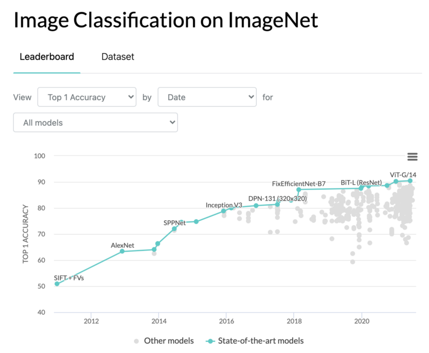
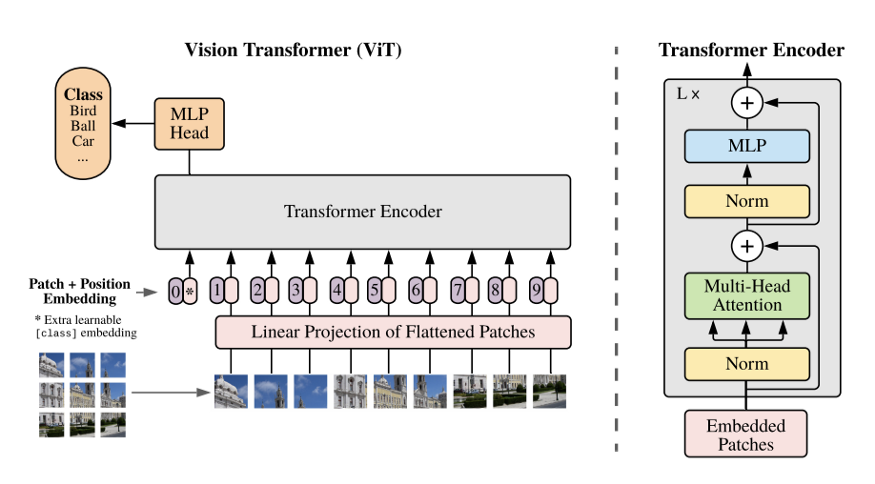
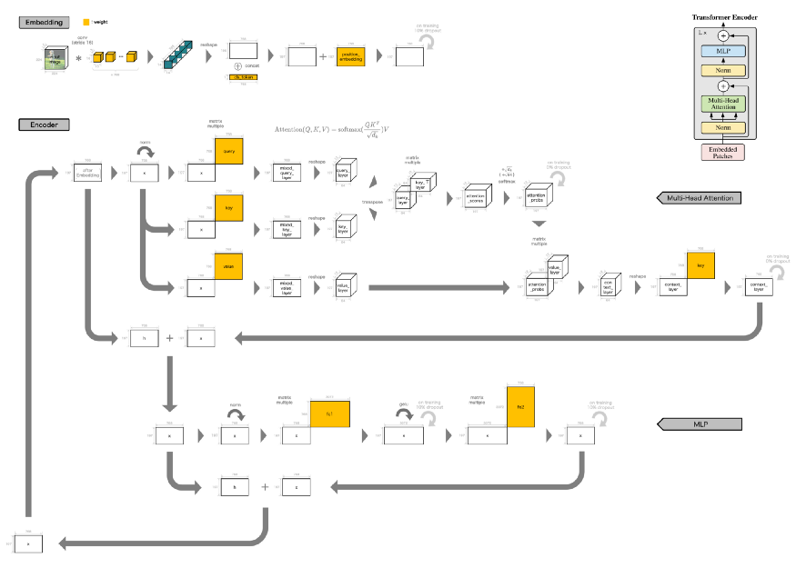
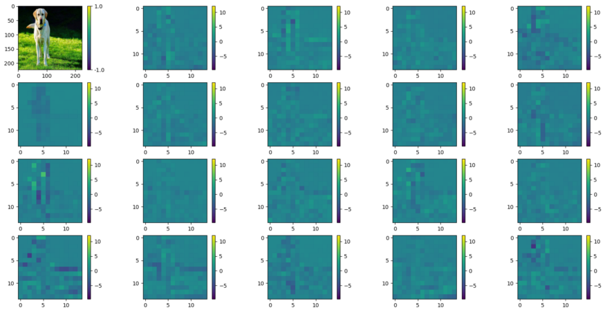
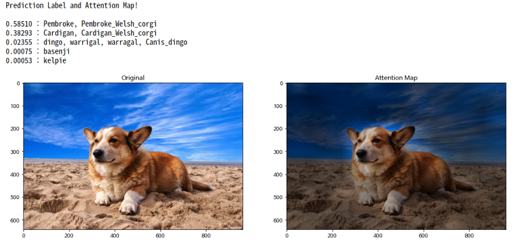
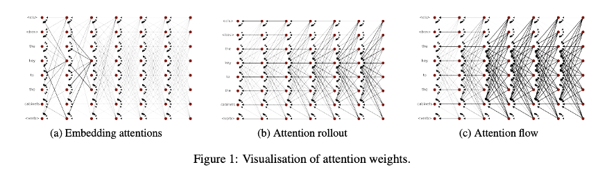
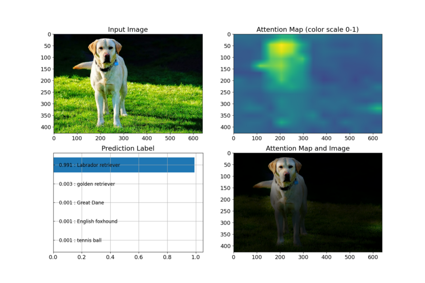

# Vision Transformer: State-of-the-art image identification technology without convolutional operations

# Vision Transformer: State-of-the-art image identification technology without convolutional operations

[](/@terada_80332?source=post_page---byline--fd10097ae9c2---------------------------------------)

[Takehiko TERADA](/@terada_80332?source=post_page---byline--fd10097ae9c2---------------------------------------)

7 min read

·

Jan 11, 2023

--

[Listen](/m/signin?actionUrl=https%3A%2F%2Fmedium.com%2Fplans%3Fdimension%3Dpost_audio_button%26postId%3Dfd10097ae9c2&operation=register&redirect=https%3A%2F%2Fmedium.com%2Faxinc-ai%2Fvision-transformer-state-of-the-art-image-identification-technology-without-convolutional-fd10097ae9c2&source=---header_actions--fd10097ae9c2---------------------post_audio_button------------------)

Share

Introducing “Vision Transformer (ViT)”, a machine learning model that can be used with the ailia SDK.  
You can easily use this model to create AI applications using [ailia SDK](https://ailia.jp/en/) as well as many other ready-to-use [ailia MODELS](https://github.com/axinc-ai/ailia-models).

### Oveview

ViT is the latest image identification technology that does not use convolution, announced by Google Research, a research division of Google.  
It has recorded the highest accuracy in IMAGENET, a famous image recognition competition published by Stanford University.

Image identification is the task of predicting the object that appears in the image.  
IMAGENET competes for the accuracy rate of prediction for 50,000 images with 1,000 identification types.  
In other words, 50,000 questions with a 0.1% accuracy rate are to be answered, and it is surprising that ViT’s identification accuracy is over 90% correct.

Press enter or click to view image in full size



Source：<https://paperswithcode.com/sota/image-classification-on-imagenet>

The ViT release date appears to be October 2020 for the first version of the paper and a little before that for the program.

[## GitHub - google-research/vision\_transformer

### In this repository we release models from the papers The models were pre-trained on the ImageNet and ImageNet-21k…

github.com](https://github.com/google-research/vision_transformer?source=post_page-----fd10097ae9c2---------------------------------------)

[## An Image is Worth 16x16 Words: Transformers for Image Recognition at Scale

### While the Transformer architecture has become the de-facto standard for natural language processing tasks, its…

arxiv.org](https://arxiv.org/abs/2010.11929?source=post_page-----fd10097ae9c2---------------------------------------)

In recent years, Convolutional Neural Networks using convolutional operations have been ranked regularly in the top accuracy rankings for image identification.  
However, the Vision Transformer has attracted attention for its novelty in that it has recorded the highest accuracy without using convolutional operations.  
The Transformer technique was originally proposed by Google Research not in the field of image processing, but in the field of natural language processing.  
In other words, the technology used in natural language processing has been adapted to image processing.

### Architecture

The network configuration of ViT introduced in the paper is as follows.

Press enter or click to view image in full size



Source: <https://arxiv.org/pdf/2010.11929.pdf>

Here is the brief flow.

> (1) Divide the image into pieces on a grid.  
> (2) Overlay (1) and transform the two-dimensional array of vertical and horizontal pixels in which luminance is stored into a one-dimensional vector array.  
> (3) (2) is then subjected to adjustable built-in features called “class token” and “position embedding.  
> (4) Perform the Transformer Encorder calculation multiple times on (3).  
> (5) Using the features generated in (4), calculate the softmax score (≒ probability value) for 1,000 classes of targets.

Here is an interesting fact: Although the above explanation is given in the paper, the Github repository published by Google Research actually processes (1) differently.  
The processing code for the relevant part is as follows.

[## vision\_transformer/models.py at main · google-research/vision\_transformer

### You can't perform that action at this time. You signed in with another tab or window. You signed out in another tab or…

github.com](https://github.com/google-research/vision_transformer/blob/master/vit_jax/models.py?source=post_page-----fd10097ae9c2---------------------------------------#L257)

What is actually being done is the following

> (1') A large convolution filter such as 16x16 is used to perform a high compression convolution operation while performing large decimation such as a stride width of 16, and use this as a substitute for overlay images.

The program code also contains the following comments:

```
# We can merge s2d+emb into a single conv; it's the same.  
x = nn.Conv(  
    features=self.hidden_size,  
    kernel_size=self.patches.size,  
    strides=self.patches.size,  
    padding='VALID',  
    name='embedding')(  
        x)
```

So here’s an illustration of what’s actually going on:

Press enter or click to view image in full size



Source : <https://pixabay.com/photos/labrador-retriever-dog-pet-labrador-6244939/>

The beginning of the Embedding process is a high-compression convolution operation.  
The sizes of the array variables for the input image and the highly compressed convolutional features are as follows.

> Shape of input data : [1, 3, 224, 224] # Batch, Channel, Height, Width  
> Shape of convolution feature : [1, 768, 14, 14] # Batch, Channel, Height, Width

Visualization looks like this:  
The upper left is the original image, and the rest are 19 out of 768 high-compression convolution features.

Press enter or click to view image in full size



Embedding in the above processing flow is performed only once.  
Encoder, on the other hand, is executed multiple times.  
That’s what the representation in the diagram where the output of the Encoder merges back into the input means.

In addition, what is done in the encoder is the processing called Self Attention in the upper stage and the general multi-layer perceptron processing (hereafter, MLP, which is an acronym for Multi Layer Perceptron) in the lower stage.  
And the configuration that repeats these two is the Transformer Encoder in ViT.

After repeating the encoder process multiple times, the features generated through the process are used to perform general softmax output MLP, and the network output is completed.

### Various repositories of ViT implementation

This is slightly off topic, but there are several ViT repositories on Github, and each has its own characteristics, so I would like to introduce them here.

First, the following gif video is intuitive and easy to understand, vit-pytorch repository by lucidrains.

Press enter or click to view image in full size


[## GitHub - lucidrains/vit-pytorch: Implementation of Vision Transformer, a simple way to achieve SOTA…

### Implementation of Vision Transformer, a simple way to achieve SOTA in vision classification with only a single…

github.com](https://github.com/lucidrains/vit-pytorch?source=post_page-----fd10097ae9c2---------------------------------------)

While the official repository by Google Research is a JAX implementation, this repository is a pytorch implementation.  
I think there are many people who like pytorch, so I appreciate it very much.  
This is why the number of “Stars”, which is a “Like” rating for the repository, is more than the official one.

This repository performs Embedding as described in the paper.  
In other words, the following process is exactly as described in the paper, and does not really use any convolution operations.

> (1) Divide the image into pieces on the grid.

Therefore, this repository may be useful when you want to purely reproduce the implementation of a paper.  
However, since no pre-trained models are explicitly provided, you need to prepare your own training data and train from scratch.  
Or, you need to convert the JAX trained model to pytorch from the official repository.

Next is PyTorch-Pretrained-ViT by lukemelas, which does not have that many “Stars” but is very precisely implemented.

[## GitHub - lukemelas/PyTorch-Pretrained-ViT: Vision Transformer (ViT) in PyTorch

### Install with pip install pytorch\_pretrained\_vit and load a pretrained ViT with: Or find a Google Colab example here…

github.com](https://github.com/lukemelas/PyTorch-Pretrained-ViT?source=post_page-----fd10097ae9c2---------------------------------------)

This repository is also a pytorch implementation, but the main concept is to convert the pre-trained model provided by Google Research’s official repository to pytorch.  
The weight values of various pretrained models on JAX are inserted into a general-purpose ViT model implemented in pytorch while converting.

Finally, there is jeonsworld’s ViT-pytorch repository, which even implements an attention map.

<https://github.com/jeonsworld/ViT-pytorch>

Basically, the same algorithms as in the official repository are implemented in pytorch, and the processing is done while converting a specific learned model.  
The “notebook” is also provided to visualize the process and perform a series of operations, so it is very helpful.  
The output of the notebook is as follows.

Press enter or click to view image in full size



After identifying the target, it also visualizes an attention map that darkens the areas that do not provide the basis for the decision.  
The implementation of this attention map is not included in the official repository of Google Research, and it seems that jeonsworld has followed the implementation from the following repository.

[## GitHub - samiraabnar/attention\_flow

### This repository contain implementations of Attention Rollout and Attention Flow algorithms, which are post hoc methods…

github.com](https://github.com/samiraabnar/attention_flow?source=post_page-----fd10097ae9c2---------------------------------------)

The paper on Attention Flow and the conceptual diagram described in the paper are as follows:

[## Quantifying Attention Flow in Transformers

### In the Transformer model, "self-attention" combines information from attended embeddings into the representation of the…

arxiv.org](https://arxiv.org/abs/2005.00928?source=post_page-----fd10097ae9c2---------------------------------------)

Press enter or click to view image in full size



Source : <https://arxiv.org/pdf/2005.00928.pdf>

The ViT in ailia-models also follows jeonsworld’s implementation.  
In addition, ailia-models also supports video input, so you can continuously check how the attention map changes from frame to frame.

### Using from ailia SDK

The vit programs provided by the ailia SDK are as follows:

[## ailia-models/image\_classification/vit at master · axinc-ai/ailia-models

### (from https://pixabay.com/photos/labrador-retriever-dog-pet-labrador-6244939/) Automatically downloads the onnx and…

github.com](https://github.com/axinc-ai/ailia-models/tree/master/image_classification/vit?source=post_page-----fd10097ae9c2---------------------------------------)

To perform processing on an image, use the commands below.

```
$ python vit.py -i input.png
```

An execution example is below.

Press enter or click to view image in full size



Press enter or click to view image in full size


Source : <https://pixabay.com/videos/car-racing-motor-sports-action-74/>

---

[ax Inc.](https://axinc.jp/en/) has developed [ailia SDK](https://ailia.jp/en/), which is a self-contained cross-platform high speed inference SDK for rapid AI application development.

ax Inc. provides a wide range of services from consulting and model creation, to the development of AI-based applications and SDKs. Feel free to [contact us](https://axinc.jp/en/) for any inquiry.