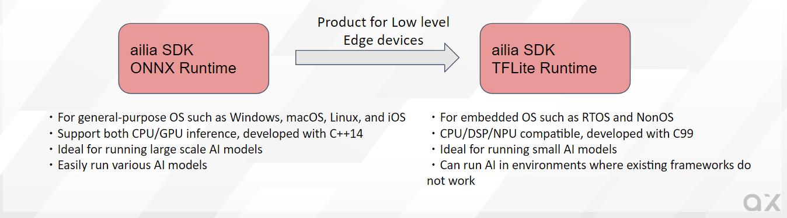
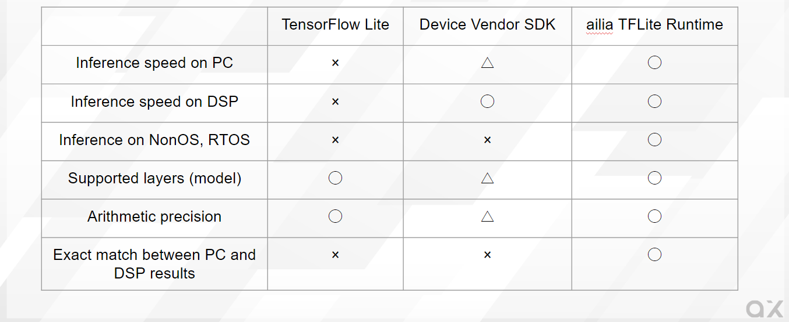
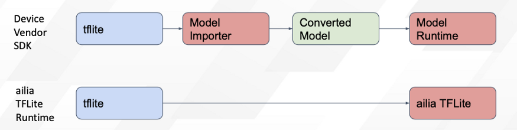
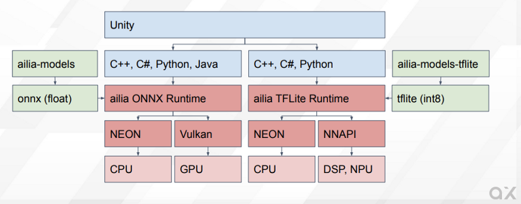

# ailia TFLite Runtime：AI Runtime for NonOS and RTOS devices

# ailia TFLite Runtime：AI Runtime for NonOS and RTOS devices

[](/@terada_80332?source=post_page---byline--8b12e412df2b---------------------------------------)

[Takehiko TERADA](/@terada_80332?source=post_page---byline--8b12e412df2b---------------------------------------)

5 min read

·

Jan 18, 2023

--

[Listen](/m/signin?actionUrl=https%3A%2F%2Fmedium.com%2Fplans%3Fdimension%3Dpost_audio_button%26postId%3D8b12e412df2b&operation=register&redirect=https%3A%2F%2Fmedium.com%2Faxinc-ai%2Failia-tflite-runtime-runtime-for-implementing-ai-on-nonos-and-rtos-devices-8b12e412df2b&source=---header_actions--8b12e412df2b---------------------post_audio_button------------------)

Share

Introducing ailia TFLite Runtime, an AI runtime for NonOS and RTOS devices. ailia TFLite Runtime makes it possible to implement AI on embedded devices with limited resources.

---

### Overview

ailia TFLite Runtime is a framework for AI inference suitable for embedded devices. ailia TFLite Runtime is developed in C99 instead of C++, so AI can be implemented on NonOS or RTOS devices where the official TensorFlow Lite is not supported.

Press enter or click to view image in full size



Overview of ailia TFLite Runtime

### Function matrix of ailia TFLite Runtime

A comparison with the official TensorFlow Lite and device vendor SDKs is shown below.

Press enter or click to view image in full size



Function matrix

Also, with ailia TFLite Runtime, unlike device vendor SDKs, tflite files can be parsed directly at runtime without the need for model conversion. This avoids accuracy degradation and model conversion errors caused by model conversion.

Press enter or click to view image in full size



No model conversion required

### ailia TFLite Runtime and ailia ONNX Runtime

The relationship with ailia ONNX Runtime, which is provided as ailia SDK, is as follows.

Press enter or click to view image in full size



ailia ONNX Runtime and ailia TFLite Runtime

ailia ONNX Runtime targets general-purpose platforms with an operating system and provides a fast inference using CPU and GPU. ONNX is supported as the model format.

The ailia TFLite Runtime is targeting embedded devices, and is designed for environments that are not supported by the official TensorFlow Lite, such as NonOS and RTOS. It also targets fast inference on DSPs and NPUs, instead of GPUs. It supports tflite as the model format.

### ailia TFLite Runtime API

The Python API of ailia TFLite Runtime provides a TensorFlow Lite compatible API. Therefore, it can be replaced with ailia TFLite Runtime without rewriting the code by simply rewriting the import.

```
#from tensorflow.lite.python.interpreter import Interpreter  
from ailia_tflite import Interpreter
```

```
interpreter = Interpreter(model_path="face_detection_front.tflite")  
interpreter.set_tensor(input_details[0]['index'], input_data)  
interpreter.invoke()
```

The C API allows memory allocators to be given as arguments, making it possible to do your own memory management for embedded devices.

```
ailiaTFLiteCreate(&instance, tflite, tflite_length, malloc, memcpy, free, AILIA_TFLITE_ENV_REFERENCE, AILIA_TFLITE_MEMORY_MODE_DEFAULT, AILIA_TFLITE_FLAGS_NONE);  
input_tensor_index = ailiaTFLiteGetInputTensorIndex(instance, 0);  
input_buffer = (uint8_t *)ailiaTFLiteGetTensorBuffer(instance, input_tensor_index);  
ailiaTFLiteGetTensorShape(instance, input_shape, input_tensor_index);  
ailiaTFLitePredict(instance);  
output_tensor_index = ailiaTFLiteGetOutputTensorIndex(instance, 0);  
output_buffer = (uint8_t *)ailiaTFLiteGetTensorBuffer(instance, output_tensor_index);  
ailiaTFLiteGetTensorShape(instance, output_shape, output_tensor_index);  
ailiaTFLiteDestroy(instance, free);  
free(tflite);
```

### ailia MODELS for TFLite

ailia Models TFLite is a model library for tflite version. tflite models quantized to Int8 are provided with sample code to easilyimplement AI functionality in embedded devices.

Examples of available models are as follows

> BlazeFace (face detection)  
> FaceMesh (face keypoint detection)  
> BlazeHand (hand detection)  
> MobileNetV1/V2 (object identification)  
> ResNet50 (object identification)  
> EfficientNetLite (object identification)  
> DeepLabv3+ (segmentation)  
> YOLOv3 tiny (object detection)  
> YOLOX tiny (object detection)  
> EfficientDet (object detection)  
> ESPCN (Super Resolution)

[## GitHub - axinc-ai/ailia-models-tflite: Quantized version of model library

### Quantized tflite models for ailia TFLite Runtime ailia TFLite Runtime is a TensorFlow Lite compatible inference engine…

github.com](https://github.com/axinc-ai/ailia-models-tflite?source=post_page-----8b12e412df2b---------------------------------------)

### ailia TFLite Runtime performance

The ailia TFLite Runtime is optimized for both x86 and Arm. In particular, it is significantly faster than the official TensorFlow Lite at inferring Int8 models in the x86 environment. This is because the official TensorFlow Lite Int8 implementation is a naive implementation and is not optimized. Therefore, ailia TFLite Runtime can be used for acceleration on both PC and embeded environment.

> Example of ResNet50 inference time  
> TensorFlow 2.7.0: 15984.6ms  
> ailia TFLite Runtime: 44.38ms (360x times faster !)  
> (Measurement environment: Intel Core i7–11700)

In addition, a faster version using NNAPI and NPU is being implemented for edge devices and will be released in spring 2023. The version under development is 3 times faster than GPU inference.

> Example of YOLOX tiny inference time  
> CPU : 120ms (ailia ONNX Runtime)  
> GPU : 60ms (ailia ONNX Runtime)  
> NNAPI : 20ms (ailia TFLite Runtime)  
> (Measurement environment: Pixel6)

### Support for quantization models

ailia TFLite Runtime supports not only Float but also Int8 models. ailia TFLite Runtime can reduce memory usage by a quarter by using Int8 models. This makes it suitable for use in embedded devices with limited memory.  
For example, using ResNet50, Float version requires 102.2MB (weight) + 15.82MB (tensor), while Int8 version requires only 26.3MB (weight) + 11.24MB (tensor).

### ailia TFLite Runtime result consistency

CPU inference in ailia TFLite Runtime supports bitwise consistency of output results between PC and embedded devices. tflite’s model format is implementation-dependent for output results because the scale is stored as a float, even for Int8 models, but ailia TFLite Runtime provides consistency by using the same formula for PCs and embedded devices.

### Download evaluation version of ailia TFLite Runtime

An evaluation version of ailia TFLite Runtime can be downloaded from the URL below. The evaluation version provides libraries for Windows, macOS, and Linux. For libraries for embedded devices, please [contact us](https://marketing.axinc.jp/en-contact-product) separately.

[## AILIA-TFLITE Request Evaluation License

### Edit description

axip-console.appspot.com](https://axip-console.appspot.com/trial/terms/AILIA-TFLITE?lang=en&source=post_page-----8b12e412df2b---------------------------------------)

Install in the Python environment as follows.

```
cd ailia_tflite_runtime/python  
# Please put the license file at the same folder as booststrap.py  
python3 bootstrap.py  
pip3 install .
```

### ailia TFLite Runtime Roadmap

We plan to release ailia TFLite Runtime 1.2.0 in Spring 2023. The new features are below:

・NPU inference with NNAPI  
・Unity Plugin added  
・Addition of binaries for Android and iOS

### Contact about ailia TFLite Runtime

For purchasing ailia TFLite Runtime, please contact ax Corporation.

[## Inquiries about our products and services

### Edit description

marketing.axinc.jp](https://marketing.axinc.jp/en-contact-product?source=post_page-----8b12e412df2b---------------------------------------)

---

[ax Inc.](https://axinc.jp/en/) has developed [ailia SDK](https://ailia.jp/en/), which enables cross-platform, GPU-based rapid inference.

ax Inc. provides a wide range of services from consulting and model creation, to the development of AI-based applications and SDKs. Feel free to [contact us](https://axinc.jp/en/) for any inquiry.