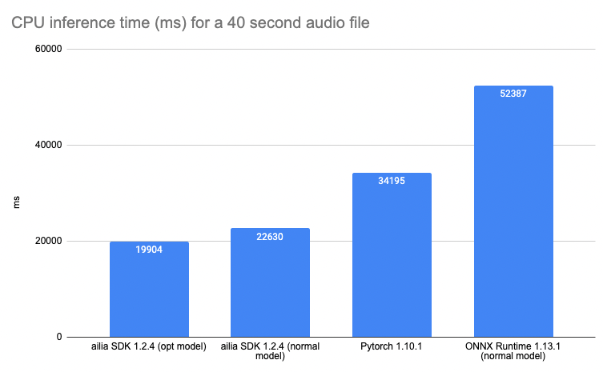
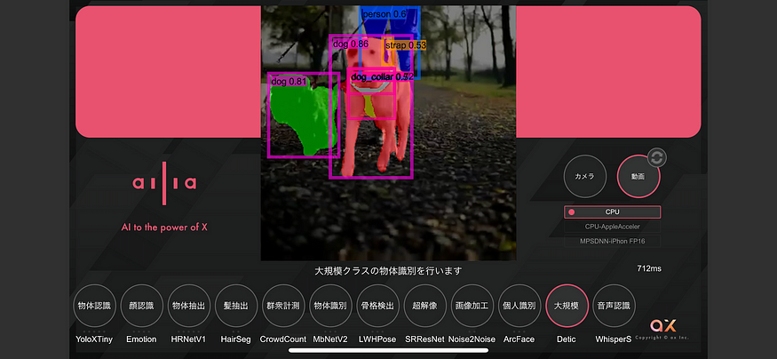
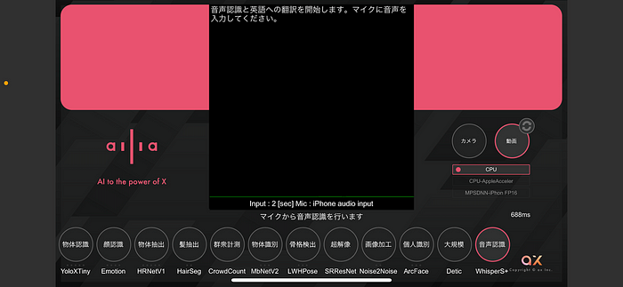
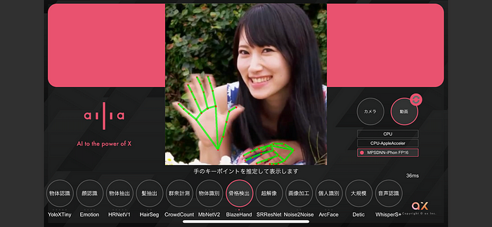
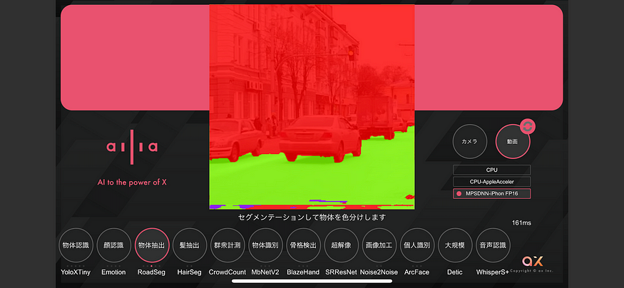

# Released ailia SDK 1.2.14

# Released ailia SDK 1.2.14

[](/@terada_80332?source=post_page---byline--e5d4d3285b05---------------------------------------)

[Takehiko TERADA](/@terada_80332?source=post_page---byline--e5d4d3285b05---------------------------------------)

4 min read

·

Mar 23, 2023

--

[Listen](/m/signin?actionUrl=https%3A%2F%2Fmedium.com%2Fplans%3Fdimension%3Dpost_audio_button%26postId%3De5d4d3285b05&operation=register&redirect=https%3A%2F%2Fmedium.com%2Faxinc-ai%2Freleased-ailia-sdk-1-2-14-e5d4d3285b05&source=---header_actions--e5d4d3285b05---------------------post_audio_button------------------)

Share

We are pleased to introduce version 1.2.14 of ailia SDK, a cross-platform framework to perform fast AI inference on GPU or CPU. You can find more information about ailia SDK on the [official website](https://axinc.jp/en/solutions/ailia_sdk.html).

The new features of ailia SDK 1.2.14 are as follows:


## Newly supported layers

DFT, Mean, LpPool, and Upsample layers are supported; DFT is a layer added with onnx opset=17 and performs a discrete Fourier transform. It is expected to be used for voice preprocessing in the future.

## AVX512 support

AVX512 support for Gemm and Convolution has been added. It boost up to 1.61 times faster for large Gemm.

## Optimizations for Whisper

CPU inference has been optimized for Whisper, as a result Whisper’s inference speed has been greatly improved. Now compared to the official Whisper Pytorch, Whisper on ailia is 1.7 times faster.

Press enter or click to view image in full size



Whisper benchmark (conversion time for 40 seconds of Japanese speech, evaluated with Whisper Small and Beam Size 1)

The vertical axis of the graph shows the time required for inference; the shorter the time, the faster the inference. normal model is the ONNX model converted from Pytorch, and opt model is the ONNX model passed through ailia Optimizer.

You can try Whisper from ailia MODELS on github.

[## ailia-models/audio\_processing/whisper at master · axinc-ai/ailia-models

### Audio file Recognized speech text He hoped there would be stew for dinner, turnips and carrots and bruised potatoes and…

github.co](https://github.com/axinc-ai/ailia-models/tree/master/audio_processing/whisper?source=post_page-----e5d4d3285b05---------------------------------------)

## Reduced memory usage in memory-saving mode

Reduced memory usage when using memory reuse mode (AILIA\_MEMORY\_REDUCE\_INTERSTAGE) in CPU inference. In particular, memory usage is reduced compared to the previous version for complex models such as Detic and Whisper. For example, Whisper’s Decoder Small uses 1886MB in ailia SDK 1.2.13, but is reduced to about 1252MB in ailia SDK 1.2.14.

## Fix compatibility between Android NDK versions

Fixed a problem with libc++\_static symbols being exposed in .so files, and fixed compatibility when using a different version of the Android NDK than the ailia SDK.

## Fixing problems with mixed Vulkan versions

Fixed a problem in which device enumeration failed when Vulkan 1.0 devices and Vulkan 1.1 devices are mixed.

## Profile mode improvements

Added the ability to output consumption time by layer in profile mode. This facilitates analysis of bottlenecks. An example of the output is shown below.

```
====Profile(Grouped by LayerType)====  
LayerType       TotalPredictTime(Average)[us]   TimeRatio[%]  
Convolution     1225009 43.46  
Convolution/ReLU[Fused] 1003087 35.59  
Eltwise 204641  7.26  
ReLU    151380  5.37  
Transpose       95091   3.37  
Resize  51491   1.83  
Concat  39713   1.41  
BatchNorm       31717   1.13  
MatMul  15263   0.54  
Softmax 849     0.03  
Convolution/Sigmoid[Fused]      394     0.01  
Reshape 137     0.00  
ConvertValue    47      0.00  
Unsqueeze       8       0.00  
Ailia_ConvBN_Convert    0       0.00  
Shape   0       0.00  
Slice   0       0.00
```

## Unity Plugin

Changed the AiliaModel class to inherit IDisposable. This reduces the possibility of running out of memory during Editor development.

We also added a bundle build to ailia.audio to fix a problem with AppleSilicon not loading dylibs even after renaming them to bundle.

## ailia AI showcase updates

ailia AI showcase has been updated to ailia SDK 1.2.14, enabling the use of Detic, Whisper, BlazeHand, FaceMesh, and RoadSegmentationAdas. In addition, NPU inference using the ailia TFLite Runtime for some models is now supported in the Android environment. iOS version can be downloaded from the AppStore and Android version from Google Play.

Press enter or click to view image in full size



Object Detection with Detic



Speech recognition with Whisper



Key point detection of hands with BlazeHand

Press enter or click to view image in full size



Road surface detection with RoadSegmentationAdas

---

[ailia SDK](https://axinc.jp/en/solutions/ailia_sdk.html) is a self-contained cross-platform high speed inference SDK for AI developed by ax Inc.

ax Inc. provides a wide range of services from consulting and model creation, to the development of AI-based applications and SDKs. Feel free to [contact us](https://axinc.jp/en/) for any inquiry.