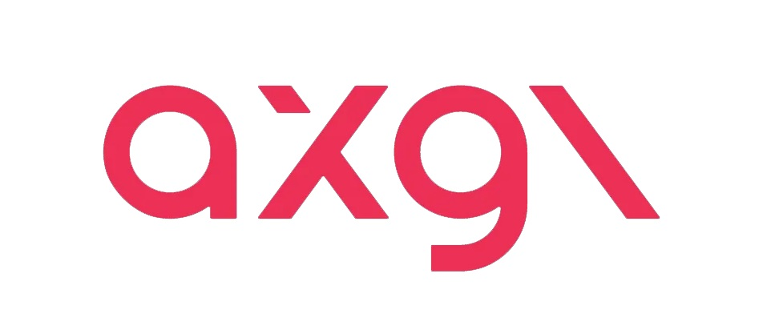
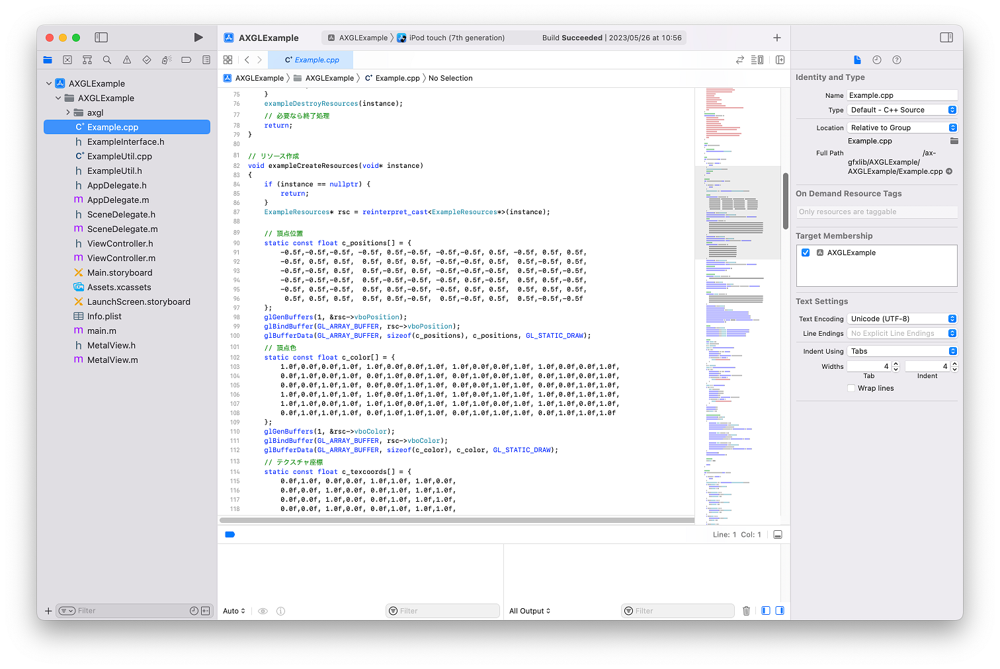

# Introduction to axgl

# Introduction to axgl

[](/@cochard-dav?source=post_page---byline--8b8bd7aaf30e---------------------------------------)

[David Cochard](/@cochard-dav?source=post_page---byline--8b8bd7aaf30e---------------------------------------)

3 min read

·

Sep 23, 2023

--

[Listen](/m/signin?actionUrl=https%3A%2F%2Fmedium.com%2Fplans%3Fdimension%3Dpost_audio_button%26postId%3D8b8bd7aaf30e&operation=register&redirect=https%3A%2F%2Fmedium.com%2Faxinc-ai%2Fintroduction-to-axgl-8b8bd7aaf30e&source=---header_actions--8b8bd7aaf30e---------------------post_audio_button------------------)

Share

Press enter or click to view image in full size



*axgl* is a software layer built on top of *iOS Metal* that emulates *OpenGL ES.* It enables existing applications created using *OpenGL ES* to run on *Metal*.

---

## Overview

This *OpenGL ES 2.0/3.0* emulation layer is built on top of the *Metal* API.


With *axgl*, *OpenGL ES* graphics resources (buffer objects, textures, etc.) are created and converted into *Metal* objects (MTLBuffer, MTLTexture, etc.)

GLSL shaders are converted to MSL shaders using *glslang* and *SPIRV-Cross*, and a MTLLibrary is maintained inside *axgl*.

*GLES* drawing API calls are created/executed as *Metal* commands.

## What can be done with axgl

The purpose of this project is to enable existing applications created using *OpenGL ES* to run on *Metal* by simply rebuilding them.

As of June 2023, *OpenGL ES* is deprecated on iOS, but applications developed with *OpenGL ES* using axgl can still run.

## Getting started

*axgl* is available at the GitHub link below.

[## GitHub — axinc-ai/ax-gfxlib: ax Graphics Library

### ax Graphics Library. Contribute to axinc-ai/ax-gfxlib development by creating an account on GitHub.

github.com](https://github.com/axinc-ai/ax-gfxlib?source=post_page-----8b8bd7aaf30e---------------------------------------)

## Usage

You can include the source code of *axgl* in your application or simply link with it as a library. The GitHub repository contains a sample code as well.

`AXGLExample`: Sample which includes the *axgl* source code

Use XCode to open and build the project `/AXGLExample/AXGLExample.xcodeproj`

Press enter or click to view image in full size



`AXGLExample opened in` XCode


サンプルをシミュレータで実行

`AXGLExampleSL` : Sample using *axgl* as a library

Use XCode to open and build the project `/AXGLExampleSL/AXGLExampleSL.xcodeproj`

Both samples render the same thing.

The XCode project for the *axgl* library exists in the folder `/axgl/build/xcode/axgl.xcodeproj`

## Changes in the application

The migration can be done with minimal source code changes. The *MetalView* class included in the *AXGLExample* and *AXGLExampleSL* sample code is the corresponding implementation.

**・Update of headers**

Application headers needs to be updated as follows. To avoid conflicts with Apple’s `EAGL.h`, include declarations should be made before Apple’s headers.

```
#include <axgl/EAGL.h>  
#include <axgl/EAGLDrawable.h>  
#include <axgl/ES3/gl.h>
```

**・Update of layerClass**

Replaces the `layerClass` that uses `CAEAGLLLayer` with `CAMetalLayer` since it uses *Metal* as its graphics API.

Change the `layerClass` method of a class inheriting from `UIView` to return `CAMetalLayer`

```
+ (id)layerClass  
{  
 return [CAMetalLayer class];  
}
```

**・Update of render buffer storage**

The onscreen render buffer is created from a `CAMetalLayer`.  
The render buffer storage is specified by calling `EAGLContext::renderbufferStorageFromLayer`

```
// GLuint _colorRenderbuffer; // レンダーバッファオブジェクト  
 // EAGLContext* _context;     // コンテキスト  
 // CAMetalLayer* _metalLayer; // Metalのコアアニメーションレイヤー  
 glGenRenderbuffers(1, &_colorRenderbuffer);  
 glBindRenderbuffer(GL_RENDERBUFFER, _colorRenderbuffer);  
 [_context renderbufferStorageFromLayer:GL_RENDERBUFFER fromLayer:_metalLayer];
```

## Conclusion

With *axgl*, you can easily make your existing *OpenGL ES* applications work with *Metal*.

## Commercial License

*axgl* exists in AGPL as well as commercial license. For a commercial license, please contact [ax Inc.](https://axinc.jp/en/)

---

[ax Inc.](https://axinc.jp/en/) has developed [ailia SDK](https://ailia.jp/en/), which enables cross-platform, GPU-based rapid inference.

ax Inc. provides a wide range of services from consulting and model creation, to the development of AI-based applications and SDKs. Feel free to [contact us](https://axinc.jp/en/) for any inquiry.