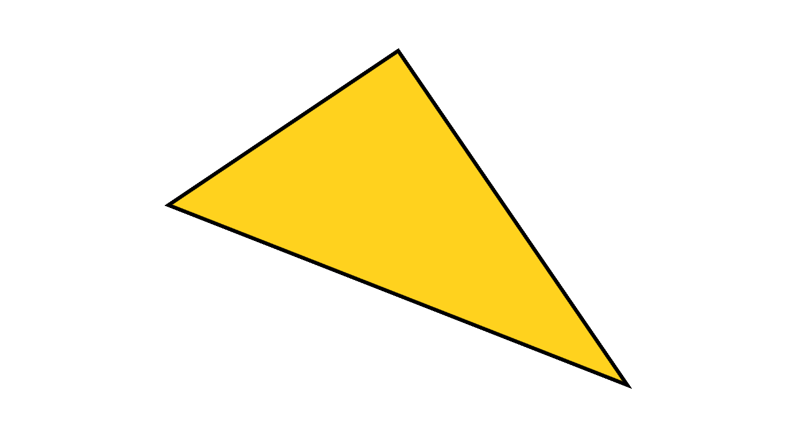
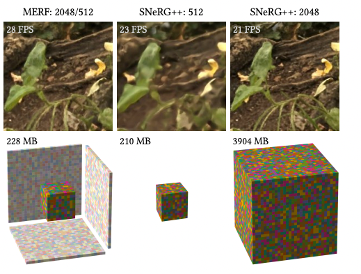
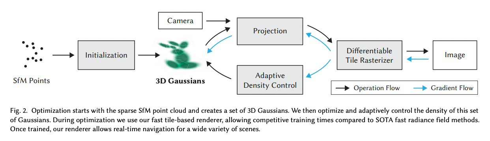
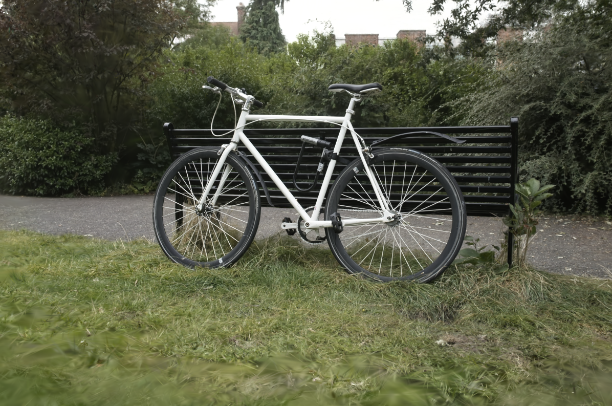
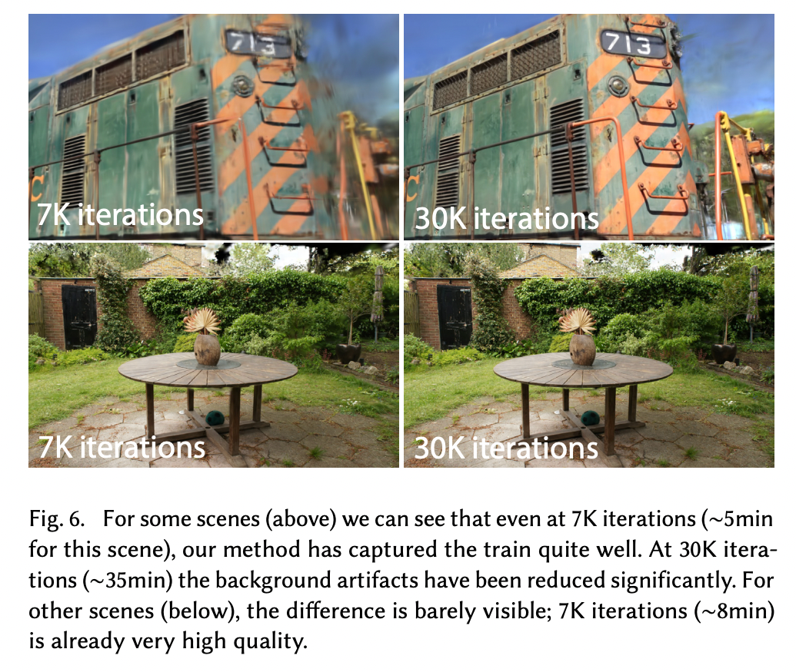
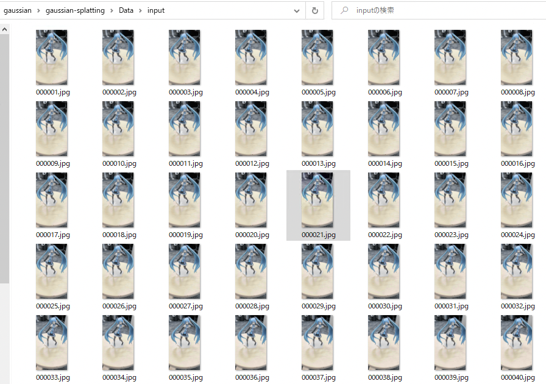

# 3D Gaussian Splatting : Real-Time Rendering of Photorealistic Scenes

# 3D Gaussian Splatting : Real-Time Rendering of Photorealistic Scenes

[](/@cochard-dav?source=post_page---byline--f7f1a47f060---------------------------------------)

[David Cochard](/@cochard-dav?source=post_page---byline--f7f1a47f060---------------------------------------)

6 min read

·

Oct 2, 2023

--

[Listen](/m/signin?actionUrl=https%3A%2F%2Fmedium.com%2Fplans%3Fdimension%3Dpost_audio_button%26postId%3Df7f1a47f060&operation=register&redirect=https%3A%2F%2Fmedium.com%2Faxinc-ai%2F3d-gaussian-splatting-real-time-rendering-of-photorealistic-scenes-f7f1a47f060&source=---header_actions--f7f1a47f060---------------------post_audio_button------------------)

Share

## Overview

*3D Gaussian Splatting*, announced in August 2023, is a method to render a 3D scene in real-time based on a few images taken from multiple viewpoints.

The 3D space is defined as a set of *Gaussians*, and the parameters of each *Gaussian* are computed using machine learning. Note that machine learning training is not required at rendering-time, therefore fast rendering is possible.

[## 3D Gaussian Splatting for Real-Time Radiance Field Rendering

### 3D Gaussian Splatting for Real-Time Radiance Field Rendering

3D Gaussian Splatting for Real-Time Radiance Field Renderingrepo-sam.inria.fr](https://repo-sam.inria.fr/fungraph/3d-gaussian-splatting/?source=post_page-----f7f1a47f060---------------------------------------)

The fundamental concepts of *3D Gaussian Splatting* are well explained in the article below, please refer to it if you are not familiar with the basics.

[## Introduction to 3D Gaussian Splatting

### We’re on a journey to advance and democratize artificial intelligence through open source and open science.

huggingface.co](https://huggingface.co/blog/gaussian-splatting?source=post_page-----f7f1a47f060---------------------------------------)

## Comparison with photogrammetry and NERF

*Photogrammetry* is a technique for generating 3D polygons from multiple viewpoint images, taken for example by placing the object on a turn-table and taking pictures while turning the object 360 degrees. While photogrammetry is useful for scanning objects, it cannot render scenes without contours, such as the sky, or fine details in distant scenes. In addition, because optimization is performed by solving conventional optimization problems, it is not possible to generate 3D polygons accurately for some use cases such as reflections and mirrors.

Press enter or click to view image in full size



Polygon used to render typical 3D scenes (Source: <https://huggingface.co/blog/gaussian-splatting>）

To address these limitations, *NERF* has recently drew attention. [*NERF*](https://github.com/bmild/nerf)is another method to render a 3D scene from images taken from multiple viewpoints. The basic idea is train a model to represent the scene in an implicit way, more specifically a volumetric representation of the density and color atany given location. To render the scene from a given viewpoint we then sample this volume to compute the color of the final image at this particular point. This rendering method is able to accurately render open scenes, as well as reflective objects. However, the downside is that *NERF* is rather slow to render.

Press enter or click to view image in full size


NERF pipeline overview (Source: <https://github.com/bmild/nerf>)

As a method to speed up *NERF*, [*MERF*](https://arxiv.org/abs/2302.12249)has been proposed, which enables real-time processing by baking the results of rays traced in multiple directions in advance into a volume texture. However, because *MERF* utilizes fixed-size volume textures like 512x512x512 and high-resolution textures such as 2048x2048, the output experiences a reduction in detail and shape fidelity.



MERF Overview (Source: <https://arxiv.org/pdf/2302.12249.pdf>)

*3D Gaussian Splatting* is yet another approach that solves another set of limitations and which can render in real-time. First, images from multiple viewpoints are converted to a point cloud, then point cloud is converted to Gaussians with parameters, and the parameters are finally learned using machine learning.

Press enter or click to view image in full size


Representation of a Gaussian (Source: <https://huggingface.co/blog/gaussian-splatting>)

While machine learning is required for the training of Gaussian parameters, the rendering does not require any heavy processing and can be done in real-time.

Press enter or click to view image in full size


Rendering of overlapping Gaussians (Source: <https://huggingface.co/blog/gaussian-splatting>)

## 3D Gaussian Splatting Architecture

Press enter or click to view image in full size



Architecture (Source: <https://repo-sam.inria.fr/fungraph/3d-gaussian-splatting/3d_gaussian_splatting_low.pdf>)

3D Gaussian Splatting first uses the [COLMAP](https://colmap.github.io/) library to generate a point cloud from the set of input images. This process takes only a few dozen seconds. From the input images, the external parameters of the camera (tilt and position) are estimated by matching pixels between images, and the point cloud is computed based on these parameters. Here, the process is handled by an optimization problem that is not machine learning.

Press enter or click to view image in full size


Point Cloud (Source: <https://huggingface.co/blog/gaussian-splatting>)

Next, machine learning using Pytorch optimizes the following parameters of each gaussian:

- Position: where it’s located (XYZ)
- Covariance: how it’s stretched/scaled (3x3 matrix)
- Color: what color it is (RGB)
- Alpha: how transparent it is (α)

The optimization actually renders the image at each camera position estimated by COLMAP, and the parameters are determined to be close to the original image. Therefore, the output of 3D Gaussian Splatting will be an image that is close to the original photo at the camera positions where it was taken. A differentiable renderer is used for rendering for optimization, and making the renderer differentiable allows optimization by Pytorch.

Here is a visualization of the rendering of the gaussians:

Press enter or click to view image in full size



Source: <https://huggingface.co/blog/gaussian-splatting>

If we ignore the alpha value and render the gaussians, we get the following. result and we can clearly see the ellipses.

Press enter or click to view image in full size


Source: <https://huggingface.co/blog/gaussian-splatting>

Here is a comparison of accuracy by training time: 7K iterations were trained in 5 minutes and 30K iterations in 35 minutes using the A6000 GPU. The more time used for training, the more accurate the gaussian is.

Press enter or click to view image in full size



Source: <https://repo-sam.inria.fr/fungraph/3d-gaussian-splatting/3d_gaussian_splatting_low.pdf>

## Ease of Use vs. Accuracy

Since the COLMAP process creates input data for training 3D Gaussian Splatting, we can assume that using a camera rig where the camera position is known or the exact camera internal parameters are known, would generate a more accurate point cloud and improve the final accuracy.

However, as far as we have tested, a practical 3D scene can be generated even with the camera of an iPhone, and we believe that the ease of use is a huge advantage of 3D Gaussian Splatting.

## Usage on Windows

The following blog (in Japanese only) was used as a reference for building a Windows environment to create 3D Gaussian Splatting.

[## 3D Gaussian Splattingの使い方 (Windows環境構築)

### NeRFとは異なる、新たなRadiance Fieldの技術「3D Gaussian Splatting for Real-Time Radiance Field…

lilea.net](https://lilea.net/lab/how-to-setup-3d-gaussian-splatting/?source=post_page-----f7f1a47f060---------------------------------------)

On a PC with Visual Studio 2019 installed, clone the official repository, including external and submobules (`recursive` option). Without the recursive option, an `glm.h not found` will occur in the `diff-gaussian-rasterization` module.

```
git clone https://github.com/graphdeco-inria/gaussian-splatting --recursive
```

Next, create a new conda environment the following way:

```
"C:\Program Files (x86)\Microsoft Visual Studio\2019\Professional\VC\Auxiliary\Build\vcvars64.bat"  
SET DISTUTILS_USE_SDK=1 # Windows only  
conda env create --file environment.yml  
conda activate gaussian_splatting
```

If you get an error in building `diff-gaussian-rasterization`, remove the virtual environment and start over with the following command.

```
conda remove -n gaussian_splatting --all
```

Or, go into the virtual environment and install the submodule explicitly.

```
conda activate gaussian_splatting  
cd <dir_to_repo>/gaussian-splatting  
pip install submodules\diff-gaussian-rasterization  
pip install submodules\simple-knn
```

You also need to download COLMAP.

[## Releases · colmap/colmap

### COLMAP — Structure-from-Motion and Multi-View Stereo — Releases · colmap/colmap

github.com](https://github.com/colmap/colmap/releases?source=post_page-----f7f1a47f060---------------------------------------)

Download the pre-built viewer.

[## GitHub — graphdeco-inria/gaussian-splatting: Original reference implementation of “3D Gaussian…

### Original reference implementation of “3D Gaussian Splatting for Real-Time Radiance Field Rendering” — GitHub …

github.com](https://github.com/graphdeco-inria/gaussian-splatting?source=post_page-----f7f1a47f060---------------------------------------#pre-built-windows-binaries)

### Input Preparation

Convert the video taken with an iPhone to sequentially numbered jpg files and place the converted files in the folder `gaussian-splatting/Data/input`

```
ffmpeg -i face.MOV %06d.jpg
```

Press enter or click to view image in full size



学習用データセット

### Running COLMAP

The following command executes COLMAP, which takes about 18 seconds for about 538 images.

```
python convert.py --colmap_executable "<PATH>\gaussian\COLMAP-3.8-windows-cuda\COLMAP-3.8-windows-cuda\COLMAP.bat" -s "C:\Users\kyakuno\Desktop\gaussian\gaussian-splatting\Data"
```

### Training

The following command is used for training which is even possible using an RTX3080 with 12 GB of VRAM. 7000 iterations takes about 21 hours.

```
python train.py -s "<PATH>\gaussian\gaussian-splatting\Data"
```

### Visualization

```
SIBR_gaussianViewer_app.exe -m "<PATH>\gaussian\gaussian-splatting\output\c1d627ca-d"
```

The viewpoint can be controlled with the mouse by pressing the Y key.

Example of 3D Gaussian Splatting

---

[ax Inc.](https://axinc.jp/en/) has developed [ailia SDK](https://ailia.jp/en/), which enables cross-platform, GPU-based rapid inference.

ax Inc. provides a wide range of services from consulting and model creation, to the development of AI-based applications and SDKs. Feel free to [contact us](https://axinc.jp/en/) for any inquiry.