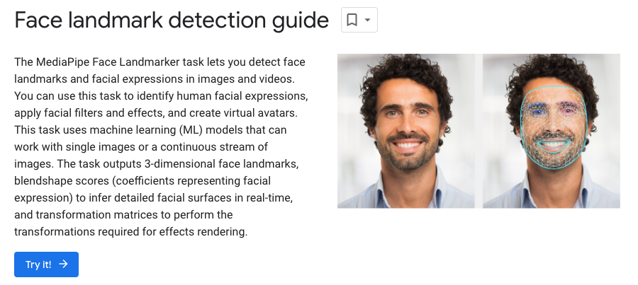
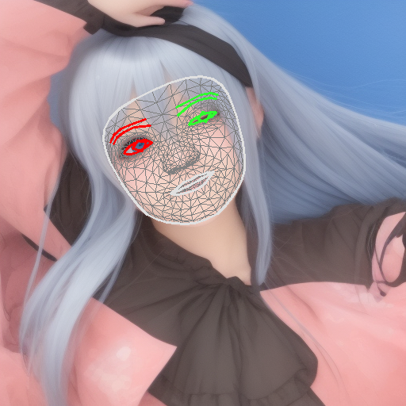
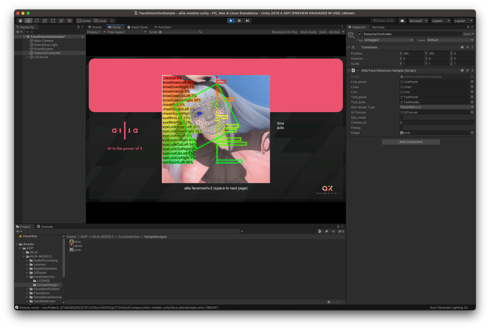

# FaceMeshV2 : Detecting Key Points on Faces in Real Time with Blendshapes

# FaceMeshV2 : Detecting Key Points on Faces in Real Time with Blendshapes

[](/@cochard-dav?source=post_page---byline--6381dbf78756---------------------------------------)

[David Cochard](/@cochard-dav?source=post_page---byline--6381dbf78756---------------------------------------)

3 min read

·

Oct 11, 2023

--

1

[Listen](/m/signin?actionUrl=https%3A%2F%2Fmedium.com%2Fplans%3Fdimension%3Dpost_audio_button%26postId%3D6381dbf78756&operation=register&redirect=https%3A%2F%2Fmedium.com%2Faxinc-ai%2Ffacemeshv2-detecting-key-points-on-faces-in-real-time-with-blendshapes-6381dbf78756&source=---header_actions--6381dbf78756---------------------post_audio_button------------------)

Share

This is an introduction to「FaceMeshV2」, a machine learning model that can be used with [ailia SDK](https://ailia.jp/en/). You can easily use this model to create AI applications using [ailia SDK](https://ailia.jp/en/) as well as many other ready-to-use [ailia MODELS](https://github.com/axinc-ai/ailia-models).

---

## Overview

*FaceMeshV2* is a model developed by *Google* to detect key points from facial images. It was introduced in *MediaPipe v0.9.2.1*, released on March 24 2023. *FaceMeshV2* computes facial keypoints with higher precision than with the previous [*FaceMeshV1*](/axinc-ai/facemesh-detecting-key-points-on-faces-in-real-time-977c03f1bab) and also include the support of blendshapes

Press enter or click to view image in full size



Source: <https://developers.google.com/mediapipe/solutions/vision/face_landmarker>

[## Face landmark detection guide | MediaPipe | Google for Developers

### The MediaPipe Face Landmarker task lets you detect face landmarks and facial expressions in images and videos. You can…

developers.google.com](https://developers.google.com/mediapipe/solutions/vision/face_landmarker?source=post_page-----6381dbf78756---------------------------------------)

## Output Examples

The input resolution has been expanded to make facial keypoints more accurate than before, and keypoints for the iris of the eyes have been added. In addition, blendshape parameters such as blinking and open mouth can now be computed.


Input image



Output image

Press enter or click to view image in full size


Output of blendshape coefficients

## Architecture

[*FaceMeshV1*](/axinc-ai/facemesh-detecting-key-points-on-faces-in-real-time-977c03f1bab)requires a 192x192x3 image input, while *FaceMeshV2* requires a 256x256x3 image input. The number of key points increased from 468 in *FaceMeshV1* to 478 in *FaceMeshV2* with the addition of LEFT\_IRIS and RIGHT\_IRIS.

The output format of *FaceMeshV2* is the same as *FaceMeshV1*, with `(x,y,z)` output for each keypoint.

## Blendshapes Support

The following 52 blendshapes can be detected, each of which has a 0–1 probability value.

```
public static string [] BlendshapeLabels = {  
   "_neutral",  
   "browDownLeft",  
   "browDownRight",  
   "browInnerUp",  
   "browOuterUpLeft",  
   "browOuterUpRight",  
   "cheekPuff",  
   "cheekSquintLeft",  
   "cheekSquintRight",  
   "eyeBlinkLeft",  
   "eyeBlinkRight",  
   "eyeLookDownLeft",  
   "eyeLookDownRight",  
   "eyeLookInLeft",  
   "eyeLookInRight",  
   "eyeLookOutLeft",  
   "eyeLookOutRight",  
   "eyeLookUpLeft",  
   "eyeLookUpRight",  
   "eyeSquintLeft",  
   "eyeSquintRight",  
   "eyeWideLeft",  
   "eyeWideRight",  
   "jawForward",  
   "jawLeft",  
   "jawOpen",  
   "jawRight",  
   "mouthClose",  
   "mouthDimpleLeft",  
   "mouthDimpleRight",  
   "mouthFrownLeft",  
   "mouthFrownRight",  
   "mouthFunnel",  
   "mouthLeft",  
   "mouthLowerDownLeft",  
   "mouthLowerDownRight",  
   "mouthPressLeft",  
   "mouthPressRight",  
   "mouthPucker",  
   "mouthRight",  
   "mouthRollLower",  
   "mouthRollUpper",  
   "mouthShrugLower",  
   "mouthShrugUpper",  
   "mouthSmileLeft",  
   "mouthSmileRight",  
   "mouthStretchLeft",  
   "mouthStretchRight",  
   "mouthUpperUpLeft",  
   "mouthUpperUpRight",  
   "noseSneerLeft",  
   "noseSneerRight"  
  };
```

Blendshape’s model first includes mean-reduction and normalization. The conversion from pixel coordinates to internal coordinates is done so that inputting rasterized pixels after rasterization works without problems.

Press enter or click to view image in full size


## Usage in MediaPipe

To use *FaceMeshV2* from *MediaPipe*, use the following *Colab*.

After downloading `face_landmarker_v2_with_blendshapes.task`, give `face_landmarker_v2_with_blendshapes.task` as `base_option` and set `output_face_ blendshapes=True` to also output blendshape data.

[## mediapipe/examples/face\_landmarker/python/[MediaPipe\_Python\_Tasks]\_Face\_Landmarker.ipynb at main ·…

### Contribute to googlesamples/mediapipe development by creating an account on GitHub.

github.com](https://github.com/googlesamples/mediapipe/blob/main/examples/face_landmarker/python/%5BMediaPipe_Python_Tasks%5D_Face_Landmarker.ipynb?source=post_page-----6381dbf78756---------------------------------------)

## Usage in ailia SDK

*FaceMeshV2* can be used withailia SDK with the following command.

```
$ python3 facemesh_v2.py --input input.jpg
```

To also compute blendshape coefficients, add the `— blendshape` option.

```
$ python3 facemesh_v2.py --input input.jpg --blendshape
```

[## ailia-models/face\_recognition/facemesh\_v2 at master · axinc-ai/ailia-models

### The collection of pre-trained, state-of-the-art AI models for ailia SDK — ailia-models/face\_recognition/facemesh\_v2 at…

github.com](https://github.com/axinc-ai/ailia-models/tree/master/face_recognition/facemesh_v2?source=post_page-----6381dbf78756---------------------------------------)

## Usage in Unity

*FaceMeshV2* can also be used withailia SDK within Unity.

[## ailia-models-unity/Assets/AXIP/AILIA-MODELS/FaceDetection at master · axinc-ai/ailia-models-unity

### Unity version of ailia models repository. Contribute to axinc-ai/ailia-models-unity development by creating an account…

github.com](https://github.com/axinc-ai/ailia-models-unity/tree/master/Assets/AXIP/AILIA-MODELS/FaceDetection?source=post_page-----6381dbf78756---------------------------------------)

Press enter or click to view image in full size



---

[ax Inc.](https://axinc.jp/en/) has developed [ailia SDK](https://ailia.jp/en/), which enables cross-platform, GPU-based rapid inference.

ax Inc. provides a wide range of services from consulting and model creation, to the development of AI-based applications and SDKs. Feel free to [contact us](https://axinc.jp/en/) for any inquiry.