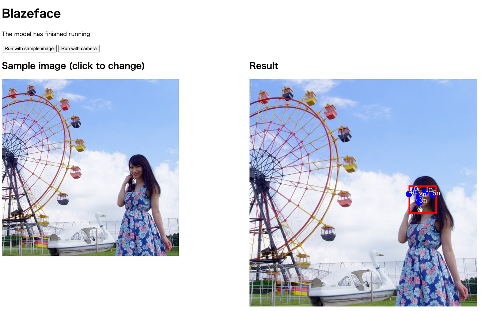

# ailia.js: a library to execute ML models inside the browser

# ailia.js: a library to execute ML models inside the browser

[](/@amo_65350?source=post_page---byline--e179c99c5b19---------------------------------------)

[Amo](/@amo_65350?source=post_page---byline--e179c99c5b19---------------------------------------)

4 min read

·

Oct 19, 2023

--

[Listen](/m/signin?actionUrl=https%3A%2F%2Fmedium.com%2Fplans%3Fdimension%3Dpost_audio_button%26postId%3De179c99c5b19&operation=register&redirect=https%3A%2F%2Fmedium.com%2Faxinc-ai%2Failia-js-a-library-to-execute-ml-models-inside-the-browser-e179c99c5b19&source=---header_actions--e179c99c5b19---------------------post_audio_button------------------)

Share

In this article I will present you ailia.js, a AI inference engine that runs inside the browser. This library allows you to execute any kind of ML model (unless some node types are not yet supported).

## **About ailia.js**

ailia.js is a runtime to perform AI inference inside the browser, from models in the ONNX format. Thanks to a wasm layer, the ailia API can be used from Javascript.

Press enter or click to view image in full size


ailia meets WebAssembly

## ailia.js demo

You can run a demo of ailia.js at the URL below. It can perform face detection, hands detection, or object detection, from an image or from your webcam.

[## ailia.js Demo

### Edit description

ailia.jp](https://ailia.jp/ailia-js/?source=post_page-----e179c99c5b19---------------------------------------)

Press enter or click to view image in full size



Face detection in the browser with ailia.js

## ailia.js API

On the following URL you can find how to use the ailia.js API:

[## Tutorial: Get Started

### Edit description

axinc-ai.github.io](https://axinc-ai.github.io/ailia-sdk/api/js/en/tutorial-get_started.html?source=post_page-----e179c99c5b19---------------------------------------)

After ailia.js finished loading, download the ONNX, create the ailia instance, and run the inference API:

```
import {Ailia} from './ailia.js';  
import {readFileAsync, distinguishModelFiles, readImageData} from './demoUtils.js';  
  
await Ailia.initialize();  
let ailia = new Ailia();  
  
modelfiles.addEventListener('change', async () => {  
    await loadModel();  
    myResult.innerText = '';  
});  
  
async function loadModel() {  
    if (modelFiles.files.length !== 2) {  
       return;  
    }  
  
    let {modelFile, weightsFile} = distinguishModelFiles(modelFiles.files);  
  
    if (modelFile === undefined) {  
        console.log('Error: could not find a model file with the extension .onnx.prototxt');  
        return;  
    }  
    if (weightsFile === undefined) {  
        console.log('Error: could not find a weights file with the extension .onnx');  
        return;  
    }  
  
    console.log(`model file: ${modelFile.name}`);  
    console.log(`weights file: ${weightsFile.name}`);  
  
    let [modelFileContents, weightsFileContents] = await Promise.all([  
        readFileAsync(modelFile),  
        readFileAsync(weightsFile)  
    ]);  
  
    let loadStatus = ailia.loadModelAndWeights(modelFileContents, weightsFileContents);  
    if (loadStatus) {  
        console.log('model files loaded');  
        document.querySelector('button.myButton').removeAttribute("hidden");  
    }  
}  
  
function buttonClicked() {  
    return new Promise((resolve) =>  
        document.querySelector('.myButton').addEventListener('click', () => resolve())  
    );  
}  
  
await buttonClicked();  
console.log('button clicked');  
  
let inputPicturePath = 'testmnist.jpg';  
let inputPicData = await readImageData(inputPicturePath);  
  
let preprocessFactory = function (inputPictureData) {  
    let preprocessingFunc = function (inputBuffers) {  
        for (let y = 0; y<inputPictureData.height; ++y) {  
            const lineOffset = y * inputPictureData.width;  
            for (let x = 0; x<inputPictureData.width; ++x) {  
                let red = inputPictureData.data[(lineOffset + x) * 4];  
                inputBuffers.byIndex[0].buffer.Float32[lineOffset + x] = red - 128;  
            }  
        }  
    };  
    return preprocessingFunc;  
};  
  
let postprocessCb = function (outputBuffers) {  
    let result = [];  
    for (const floatValue of outputBuffers.byIndex[0].buffer.Float32) {  
        result.push(floatValue);  
    }  
    return result;  
};  
  
  
try {  
  
    let result = ailia.run(preprocessFactory(inputPicData), postprocessCb, [[1, 1, inputPicData.width, inputPicData.height]]);  
  
    for (const [index, resultItem] of Object.entries(result)) {  
        console.log(`prediction score of ${index}: ${resultItem}`);  
    }  
  
} catch (e) {  
    console.log(e);  
} finally {  
    ailia.destroy();  
}
```

## Build settings for ailia.js

In the internals of ailia.js, the code is built with two flavors: one, ailia\_s.wasm, without SIMD support, and the other one, ailia\_simd\_s.wasm, with SIMD support. Within the ailia.js library, if you don’t precise your preference, the choice between SIMD-ful or SIMD-less is made automatically for you.

For example, with the model BlazeFace, in Chrome and on a M2 Mac, the SIMD-less flavor takes 21ms to perform the inference, whereas the SIMD-ful takes only 8ms.

The SIMD acceleration can be used in supported browsers on Windows, Linux, macOS, and Android. Currently the SIMD acceleration cannot be used on iOS (at the 16.2 version when this article was originally written).

You can test whether a browser is supported by using the code below (this snippet was written based on [webassembly-feature](https://unpkg.com/browse/webassembly-feature@1.3.0/lib/index.js)):

```
function simd(){  
    const buf = new Uint8Array([0,97,115,109,1,0,0,0,1,6,1,96,1,123,1,123,3,2,1,0,10,10,1,8,0,32,0,32,0,253,44,11]);  
    return WebAssembly.validate(buf);  
}
```

## Examples of usage of AI inference in the browser

Browser-based AI inference can be used for example to pre- or post- process audio and video streams in WebRTC communication apps (similar to the famous “filters” on Instagram or on TikTok videos).

Concretely, background replacement in video chat, noise filtering in audio streams recorded through the microphone, or also VAD (Voice Activity Detection, e.g. used for avatar chats), are all example of use cases for browser-based inference.

Browser-based AI inference can also be used in SaaS scenarios, with for example face detection, face authentication, QR code detection, etc.

## Demo version of ailia.js

The current ailia.js version, corresponding to ailia SDK 1.2.15, is being provided separately. If you are interested, please contact ax Co., Ltd.

From the SDK version 1.2.16, ailia.js will be included in the standard package of ailia SDK.

As a company devoted to bringing AI into practical use, ax Co., Ltd. is developing the ailia SDK, which can perform cross-platform, high-speed inference, leveraging the power of GPUs. ax Co., Ltd. provides total solutions related to AI, from consulting to model creation, providing SDKs, development of applications / systems using AI, and support, so please feel free to contact us.

(Translated from Japanese. Original page [here](/axinc/ailia-js-%E3%83%96%E3%83%A9%E3%82%A6%E3%82%B6%E4%B8%8A%E3%81%A7%E6%A9%9F%E6%A2%B0%E5%AD%A6%E7%BF%92%E3%83%A2%E3%83%87%E3%83%AB%E3%82%92%E5%AE%9F%E8%A1%8C%E5%8F%AF%E8%83%BD%E3%81%AB%E3%81%99%E3%82%8B%E3%83%A9%E3%82%A4%E3%83%96%E3%83%A9%E3%83%AA-bcddf5aed057).)