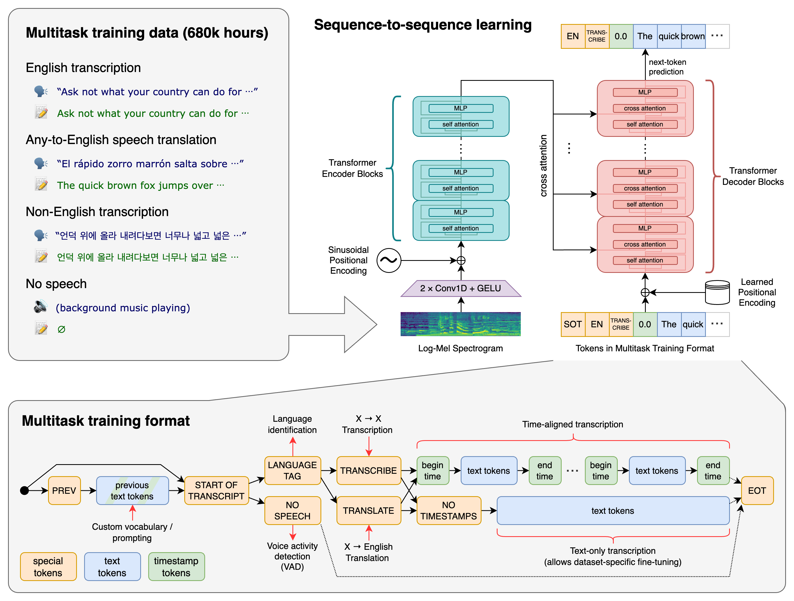
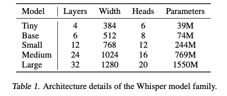
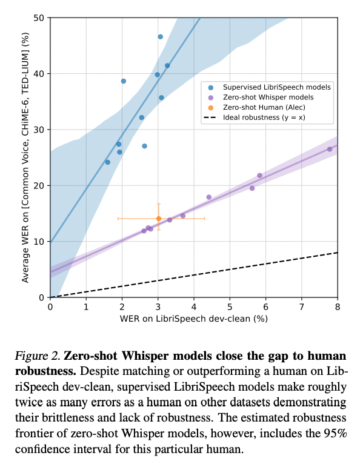

# Whisper : Speech Recognition Model Capable of Recognizing 99 Languages

# Whisper : Speech Recognition Model Capable of Recognizing 99 Languages

[](/@cochard-dav?source=post_page---byline--5b5cf0197c16---------------------------------------)

[David Cochard](/@cochard-dav?source=post_page---byline--5b5cf0197c16---------------------------------------)

11 min read

·

Nov 13, 2023

--

1

[Listen](/m/signin?actionUrl=https%3A%2F%2Fmedium.com%2Fplans%3Fdimension%3Dpost_audio_button%26postId%3D5b5cf0197c16&operation=register&redirect=https%3A%2F%2Fmedium.com%2Faxinc-ai%2Fwhisper-speech-recognition-model-capable-of-recognizing-99-languages-5b5cf0197c16&source=---header_actions--5b5cf0197c16---------------------post_audio_button------------------)

Share

This is an introduction to「Whisper」, a machine learning model that can be used with [ailia SDK](https://ailia.jp/en/). You can easily use this model to create AI applications using [ailia SDK](https://ailia.jp/en/) as well as many other ready-to-use [ailia MODELS](https://github.com/axinc-ai/ailia-models).

---

## Overview

*Whisper* is a speech recognition model released by *OpenAI* in October 2022. It can output text from an audio file as input. By learning from a vast dataset of 68,000 hours of speech, the system achieves highly accurate speech recognition in 99 languages, including Japanese.

[## GitHub — openai/whisper: Robust Speech Recognition via Large-Scale Weak Supervision

### Whisper is a general-purpose speech recognition model. It is trained on a large dataset of diverse audio and is also a…

github.com](https://github.com/openai/whisper?source=post_page-----5b5cf0197c16---------------------------------------)

## Differences between Whisper and Wav2Vec

In learning speech recognition, it is important to know how to prepare the dataset. Traditional academic datasets contain only about 1,000 hours of audio files, which is not enough.

Previous research *Wav2Vec 2.0* has shown that it can produce state-of-the-art performance after being trained on 1,000,000 hours of audio data that has not been manually annotated and then fine-tuned using an annotated dataset.

However, fine-tuning can degrade generalization performance, and Whisper aims to achieve performance without fine-tuning.

## Training dataset

*Whisper*’s encoder was trained through weakly supervised learning using a large number of audio files and texts available on the Internet. Because it is trained from a larger number of data sets than traditional academic data sets, it is more accurate.

The text of audio files available on the Internet does not contain information such as how many seconds after the text begins, but weakly supervised learning allows learning without detailed annotation. This allows us to train on a larger number of data sets than previously possible and to achieve performance without fine tuning.

The entire dataset is 680,000 hours of speech and text. It includes 117,000 hours of speech and text for the recognition of 96 languages other than the three most represented languages. 125,000 hours of data have additional text for translation capability into English.

Audio files available on the Internet include not only those converted to text by human hands, but also those converted to text by machines. Since using these data for training would reduce accuracy, a mechanism is established to identify and exclude those that have been textualized by machines.

## Architecture

*Whisper* architecture uses an encoder-decoder transformer, which as the name implies consists of an encoder and a decoder. The encoder obtains a latent representation from speech, and the decoder outputs text from the latent representation.

Press enter or click to view image in full size



Source: <https://github.com/openai/whisper>

Audio files are handled in 16 kHz PCM format scaled to a range of -1 to 1 and frequency converted with an 80-channel Mel Spectrogram. The window size for the Mel Spectrogram conversion is 25 ms and the stride is 10 ms. The Mel Spectrogram is used in segments of 30 seconds each.

The encoder is run only once per 30-second segment to extract the latent representation from the spectrogram. First, it applies twice a convolution using GELU for activation with a filter size of 3 to compute input embedding. The second convolution has a stride of 2. The transformer performs position embedding using *Sin* function. Since the encoder is executed only once per 30-second segment, so the load is not very high.

The decoder outputs the probability of occurrence for each one of the 51865 tokens from the latent representation. The tokens are determined by performing a *Greedy Search* or *Beam Search* on the probability of occurrence of the tokens in the output. The beam search has a beam size (number of search branches) of 5.

The decoder outputs a maximum of 224 tokens per 30-second segment, so it is executed up to 224 times. If two consecutive timestamp tokens appear in the decoding results across 224 inferences, the token sequence of speech recognition is chosen and output.

For the chosen token sequence, *GPT2TokenizerFast* decodes it into text. The architecture is a byte-level BPE text tokenizer, which does not output words, but Unicode byte codes.

The timestamp gives you the number of seconds of actual speech recognition that was done. Then cut out the unprocessed part of the Mel Spectrogram, add a Mel Spectrogram to make it 30 seconds, and repeat the decoding process again.

Both encoder and decoder have the same transformer architecture.

## Example of Whisper Execution Flow

For a deep dive of the Whisper source code, I would recommend the great video below from [Aleksa Gordić](https://github.com/gordicaleksa) of the Youtube channel *“*[*The AI Epiphany*](https://www.youtube.com/@TheAIEpiphany)***”*** which goes into details for each processing step.

### Overall execution flow

1. 44.1 kHz, audio file input  
   （Shape = (168192, ) ) in the case of a 5 second-long input
2. Perform Mel Spectrogram conversion on the entire audio file  
   （Shape = (80, 1051) ) in the case of a 5 second-long input
3. Perform language identification  
   N\_FRAMES = get Mel Spectrogram for 30 seconds,  
   converted to feature vector by encoder,  
   output frequencies for token IDs by decoder,  
   determine the language based on the frequency associated with the special token ID corresponding to each language  
   Encoder Input Shape = (1,80,3000)   
   Encoder Output Shape = (1,1500,768))
4. Conversion to text  
   N\_FRAMES = 30 seconds of Mel Spectrograms, converted to feature vectors by encoder, decoder up to 224 times to output a sequence of tokens  
   Encoder Input Shape = (1,80,3000)  
   Encoder Output Shape = (1,1500,768)
5. Compute timestamps  
   Check timestamp token in decoder output to know how much second of text was produced
6. Prepare for the next segment  
   Discard Mel Spectrograms of the part that has been processed, and fill the remaining Mel Spectrogram with the following audio data to create a 30-second segment.
7. Repeat procedure from step 4

### Decoder Input and Output Examples

The input and output shape of the decoder is shown below.

This is the case for language identification. Inference is performed only once.

> Output：tokens = (1, 1), kv\_cache = (24, 1, 1, 768), offset = (), audio\_features = (1, 1500, 768)  
> Output：logits = (1, 1, 51865), kv\_cache = (24, 1, 1, 768)

For the conversion to text, inference is performed 224 times.

> Step 1
>
> Input：tokens = (5, 3), kv\_cache = (24, 5, 3, 768), offset = (1), audio\_features = (1, 1500, 768)  
> Output：logits = (5, 3, 51865), kv\_cache = (24, 5, 3, 768)
>
> Step 2
>
> Input：tokens = (5, 1), kv\_cache = (24, 5, 4, 768), offset = (1), audio\_features = (1, 1500, 768)  
> Output：logits = (5, 1, 51865), kv\_cache = (24, 5, 4, 768)

### sot\_sequence

The decoder is executed up to 224 times. The input of the first iteration is the`sot_sequence,`specifically, the following three tokens are given.

> [SOT=50258] [LANGURAGE\_ID=50259+LANGUAGE\_IDX] [TRANSCRIBE=50359]

For the second and subsequent runs within the same segment, the last token decoded in the previous run is submitted.

> [Token determined by GreedySearch or BeamSearch]

For the second and subsequent segments, enter the usual `sot_sequence` after first giving the sequence of tokens resulting from the decoding of the previous segment.

> [SOT\_PREV=50361] [Maximum of 224 previous tokens, or 224 trailing tokens if more than 224] [SOT=50258] [LANGURAGE\_ID] [TRANSCRIBE=50359]

The token sequence of the decoded result of the previous segment also includes the timestamp. Also, two consecutive timestamps must be given. For example, in the token sequence resulting from the decoding of the previous segment, the timestamp token is `50646`, twice in a row.

```
prev_tokens = [50364, 634, 19737, 456, 576, 312, 25203, 4281, 1068, 1193, 11, 1261, 2600, 293, 21005, 293, 25267, 2640, 11811, 293, 4046, 50646, 50646, 5839, 1756, 3755, 281, 312, 6632, 1493, 484, 294, 5060, 11, 8532, 292, 8617, 4046, 1147, 4880, 13, 50872]
```

From here, the `sot_sequence` is created as follows: we see that `50646` before `SOT=50258` is twice consecutive.

```
sot_sequence = [50361, 50364, 634, 19737, 456, 576, 312, 25203, 4281, 1068, 1193, 11, 1261, 2600, 293, 21005, 293, 25267, 2640, 11811, 293, 4046, 50646, 50646, 50258, 50259, 50359]
```

### Beam Size

When performing beam search, `sot_sequence`is extended by the beam size.

> Step 1: tokens = [[50258 50259 50359] [50258 50259 50359] [50258 50259 50359] [50258 50259 50359] [50258 50259 50359]]
>
> Step 2: tokens = [[50364] [50392] [50394] [50396] [50395]]

Greedy search selects the highest probability of the tokens output by the decoder.

Beam search evaluates multiple patterns of token connections and selects the best text. *Whisper* by default, with `beam_size=5`, searches for 5 patterns and selects the best word connections.

[## Understanding greedy search and beam search

### Greedy search and beam search are well known algorithms in the language generation tasks of NLP (Natural Language…

medium.com](/@jessica_lopez/understanding-greedy-search-and-beam-search-98c1e3cd821d?source=post_page-----5b5cf0197c16---------------------------------------)

Smaller beam sizes reduce the number of decoder inference batches, resulting in faster processing. For example a beam size of 2 is 2.35 times faster than a beam size of 5. Surprisingly, recognition results are stable even when the beam size is reduced.

Whisper’s C++ implementation, `whisper.cpp`, uses greedy search (equivalent to beam size 1) by default, and ailia MODELS has been modified to use greedy search by default.

### Vocabulary

Conversion from token to word is done using the correspondence table defined in `vocab.json,`which contains the bytecode and the corresponding `token_id`. The bytecodes are stored as text in `bytes_to_unicode`.

```
{"!": 0, "\"": 1, "#": 2, "$": 3, ... "Ġs": 262, "ou": 263, "Ġthe": 264, ...}
```

To convert a list of `token_ids` to text, reference the bytecode text from the `token_id` to create a bytecode text sequence. The bytecode text sequence is then converted to a bytecode sequence and decoded in utf-8.

The conversion from bytecode text sequence to text can be found in`convert_tokens_to_string`.

```
def convert_tokens_to_string(self, tokens):  
    """Converts a sequence of tokens (string) in a single string."""  
    text = "".join(tokens)  
    text = bytearray([self.byte_decoder[c] for c in text]).decode("utf-8", errors=self.errors)  
    return text
```

[## transformers/src/transformers/models/gpt2/tokenization\_gpt2.py at main · huggingface/transformers

### 🤗 Transformers: State-of-the-art Machine Learning for Pytorch, TensorFlow, and JAX. …

github.com](https://github.com/huggingface/transformers/blob/main/src/transformers/models/gpt2/tokenization_gpt2.py?source=post_page-----5b5cf0197c16---------------------------------------)

[## Which encoding does GPT2 vocabulary file use?

### I wanted to investigate a little, how tokenizer works. But the model trained in Russian language (mostly), and I see…

discuss.huggingface.co](https://discuss.huggingface.co/t/which-encoding-does-gpt2-vocabulary-file-use/8875/2?source=post_page-----5b5cf0197c16---------------------------------------)

## Special tokens

*Whisper* uses the following special tokens.

> `startoftranscript (50258)` *: start of text transcription, placed first in* `sot_sequence``languages (50259–50357)` *:* `TOKEN_ID` *for each language.*`translate (50358)` *: indicates translation task*`transcribe (50359)` *: indicates transcription task*`starttoflm (50360)` *: not used*`starttofprev (50361)` *: include before* `sot_sequence`*to indicate that the end of the token in segment 1 is to be given when processing segment 2 and beyond*`nospeech (50362)` *: the probability that the segment does not contain any vocal and is silent*`notimestamps (50363)` *: not used*`timestamp_begin (50364)` *: Indicates the start of the timestamp*

## Timestamp

*Whisper* adds a timestamp token at the beginning and the end of the transcribed text sequence. The timestamp token has a `token_id` greater than or equal to `timestamp_begin (50364)`, and the timestamp granularity is 0.02sec.

For example, `token_id=50364` indicates a position of 0sec since it’s the value of `timestamp_begin (50364)` that we saw in the special tokens above, and `token_id=50714` indicates a position of `350 * 0.02sec = 7sec`.

Timestamp tokens must always appear in sequence, except immediately before `EOT`. Therefore, when a timestamp token appears, the next token is constrained to also be a timestamp token. If two timestamp tokens appear in sequence, the next token is constrained to be a normal token.

Furthermore, if the sum of the probability of the timestamp tokens is greater than the probability of the normal token, the timestamp is given priority.

Since the special token `notimestamps (50363)` also contains a high probability value, the probability value is reset to `-np.inf`.

This logic is performed in the `ApplyTimeStampRule` function in the file `decode_utils.py`.

If two timestamp tokens are reached twice in a row, the text up to that point is finalized. If a timestamp token appears only once, just before the `EOT`, all processing in the segment is considered complete, and the remaining Mel Spectrogram in the segment is skipped.

## Model Variants

*Whisper* has five model variants to choose from, depending on the accuracy and processing load. The default is `Small,` which is more accurate than the variant called `Base`.



Source: <https://cdn.openai.com/papers/whisper.pdf>

## Model Precision

*Whisper* has better generalization performance than conventional *wav2vec 2.0*, with less dependency on the training dataset, and has a very low error rate.

Press enter or click to view image in full size


Source: <https://cdn.openai.com/papers/whisper.pdf>

Let’s look at the graph below. The horizontal axis is the error rate (aka. WER) on *LibriSpeech* and the vertical axis is the error rate on the other benchmarks. A model trained with *LibriSpeech* in a supervised manner (in blue) performs well on *LibriSpeech*, but has a higher error rate on the other benchmarks. *Whisper* (in purple) on the other hand generalizes much more and has a lower error rate, both in *LibriSpeech* and in other benchmarks.



Whisper precision (Source: <https://cdn.openai.com/papers/whisper.pdf>)

## Inference Processing Time

Here are the durations for CPU inference using Pytorch on a MacBook Pro 13 (Intel Core i5):

> Time and memory consumption required to process 40 seconds of audio
>
> medium 96.22sec (3.80GB)  
> small 39.16sec (1.68GB)  
> base 17.97sec (1.00GB)  
> tiny 7.87sec (0.84GB)

Below are durations for GPU inference using Pytorch on Windows (RTX3080).

> Time required to process 40 seconds of audio
>
> medium 7.155sec  
> small 4.183sec (GPU memory 4GB)  
> base 2.906sec  
> tiny 2.657sec

Model loading and instance creation time is about 6 seconds for `Small`

> Measuring conditions
>
> Input：40 seconds of audio file in Japanese  
> Inference setup A：MacBook Pro 13 2.3 GHz quad-core Intel Core i5  
> Inference setup B：Windows11 11th Gen Intel Core i7–11700 + RTX3080  
> Inference framework：Pytorch 1.9.0 (macOS)、1.13.1 (Windows)  
> beam\_size : 1

## Usage

You can run *Whisper* on any audio file with the following command.

```
$ python3 whisper.py --input demo.wav
```

[## ailia-models/audio\_processing/whisper at master · axinc-ai/ailia-models

### Audio file Recognized speech text He hoped there would be stew for dinner, turnips and carrots and bruised potatoes and…

github.com](https://github.com/axinc-ai/ailia-models/tree/master/audio_processing/whisper?source=post_page-----5b5cf0197c16---------------------------------------)

An example output is shown below.

```
INFO whisper.py (704) : Start inference...  
 INFO whisper.py (571) : Detected language: English  
 [00:00.000 --> 00:10.000]  He hoped there would be stew for dinner, turnips and carrots and bruised potatoes and fat mutton pieces to be ladled out in thick, peppered, flour-fattened sauce.  
 INFO whisper.py (739) : Script finished successfully.
```

The default model is the `Small` variant, so if you want to use a faster model, specify `Base` for `model_type`

```
$ python3 whisper.py --input input.wav -m base
```

You can specify the beam size when beam search is used.

```
$ python3 whisper.py --input input.wav --beam_size 5
```

To monitor the progress, use the `— debug` option.

```
$ python3 whisper.py --input input.wav --debug
```

*Whisper* can be applied to microphone input using `pyaudio` with the following command.

```
$ python3 whisper.py -V
```

*Whisper* requires the installation of `librosa` to load audio files.

```
$ pip3 install librosa
```

*Whisper* is supported in *ailia SDK* starting from version 1.2.14 and it provides faster CPU inference than the official *Pytorch* implementation.

## Advanced usage

The article below explains how to perform prompt engineering on *Whisper* to improve its recognition accuracy for unknown words such as people’s names and technical terms.

[## Prompt Engineering in Whisper

### Whisper, an AI model for speech recognition also uses a language model internally, therefore we can apply some prompt…

medium.com](/axinc/prompt-engineering-in-whisper-ce8e6623ab84?source=post_page-----5b5cf0197c16---------------------------------------)

Below is a more flexible but more complex method to do it as well.

[## Whisper Fine Tuning To Transcribe Jargon

### This article explains how Whisper can be fine-tuned with a small amount of data set to make domain-specific terminology…

medium.com](/axinc-ai/whisper-fine-tuning-to-transcribe-jargon-976164a5eac8?source=post_page-----5b5cf0197c16---------------------------------------)

## Dependency Libraries

*Whisper* in *ailia MODELS* uses `ailia.tokenizer`. This allows inference even in environments without torch, eliminating cuDNN version issues, etc.

It is also possible to use torch’s transformers by using the `disable_ailia_tokenizer` option.

```
$ python3 whisper.py --input input.wav --disable_ailia_tokenizer
```

In that case, the following additional packages must be installed.

```
$ pip3 install transformers
```

When running on a Mac M1 with *TensorFlow* installed, an illegal hardware instruction exception may occur because the *TensorFlow* that *Transformers* imports uses AVX2. In that case try to uninstall *TensorFlow*.

```
$ pip3 uninstall tensorflow
```

## Alternative Implementations

A C++ implementation of *Whisper* is available.

[## GitHub — ggerganov/whisper.cpp: Port of OpenAI’s Whisper model in C/C++

### High-performance inference of OpenAI’s Whisper automatic speech recognition (ASR) model: Plain C/C++ implementation…

github.com](https://github.com/ggerganov/whisper.cpp?source=post_page-----5b5cf0197c16---------------------------------------)

---

[ax Inc.](https://axinc.jp/en/) has developed [ailia SDK](https://ailia.jp/en/), which enables cross-platform, GPU-based rapid inference.

ax Inc. provides a wide range of services from consulting and model creation, to the development of AI-based applications and SDKs. Feel free to [contact us](https://axinc.jp/en/) for any inquiry.