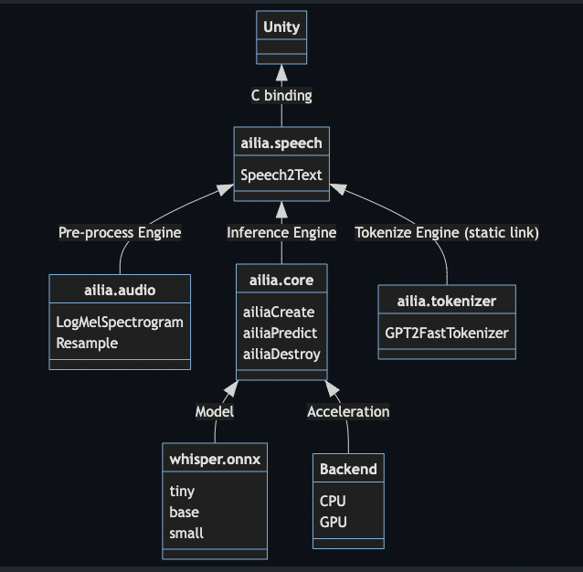
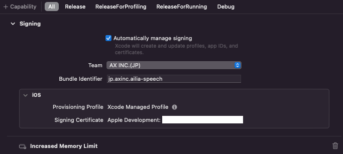
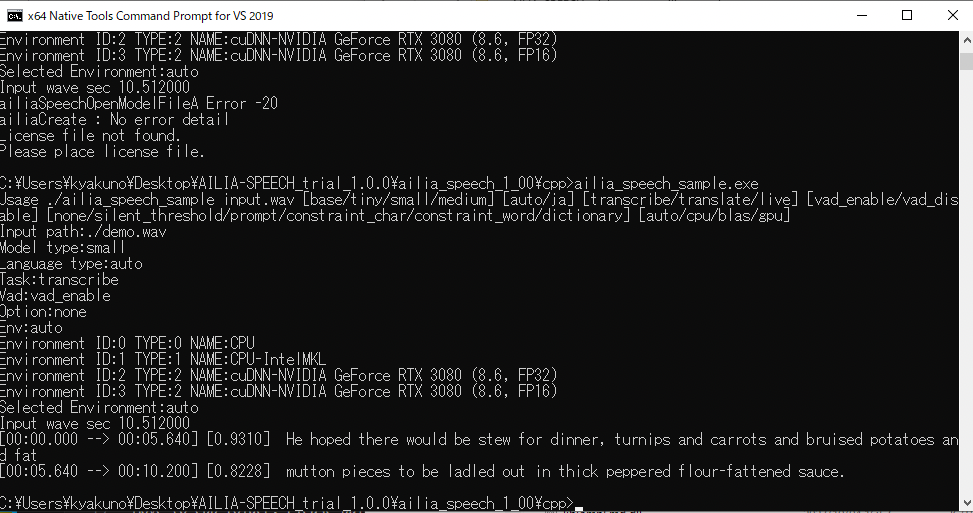

# ailia AI Speech : Speech Recognition Library for Unity and C++

# ailia AI Speech : Speech Recognition Library for Unity and C++

[](/@cochard-dav?source=post_page---byline--d29db1abe978---------------------------------------)

[David Cochard](/@cochard-dav?source=post_page---byline--d29db1abe978---------------------------------------)

9 min read

·

Nov 14, 2023

--

[Listen](/m/signin?actionUrl=https%3A%2F%2Fmedium.com%2Fplans%3Fdimension%3Dpost_audio_button%26postId%3Dd29db1abe978&operation=register&redirect=https%3A%2F%2Fmedium.com%2Faxinc-ai%2Failia-ai-speech-speech-recognition-library-for-unity-and-c-d29db1abe978&source=---header_actions--d29db1abe978---------------------post_audio_button------------------)

Share

Introducing *ailia AI Speech*, an AI speech recognition library which allows you to easily implement speech recognition in your applications.

*ailia AI Speech* offersC# bindings to be used with Unity, but it can also be used directly using the C API for native applications.

Press enter or click to view image in full size


ailia AI Speech : AI Speech Recognition Library by ailia SDK

[## AI Speech ｜ailia AI Series

### In Japanese only, please contact us for English support

www.ailia.ai](https://www.ailia.ai/speech?source=post_page-----d29db1abe978---------------------------------------)

## Main features

### Supports 99 languages

It uses a multilingual AI model and is capable of recognizing 99 languages, including Japanese, Chinese, and English.

### Works offline

Speech recognition can be performed on-device CPU, without the need for cloud computing.

### Supports mobile devices

Speech recognition can be performed not only on PCs, but also on iOS and Android mobile devices.

### Unity combatibility

In addition to the C API, a Unity Plugin is provided, making it easy to implement speech recognition in Unity-based applications.

### Translation to English

Real-time translation into English can be performed simultaneously with speech recognition, including from Japanese and Chinese.

## Demo

We provide a demo developed with Unity showing real-time speech recognition and live translation from an audio file or microphone. This demo is developed using Unity.

Demo application running on macOS

A demo application for Windows can be downloaded from the following download URL. To run the demo, the ailia SDK license file must be placed in the same folder as the executable file.

[## AILIA-SPEECH — Windows License Application

axip-console.appspot.com](https://axip-console.appspot.com/trial/terms/AILIA-SPEECH-WIN?source=post_page-----d29db1abe978---------------------------------------)

The demo app for macOS can be downloaded from the download URL below. To run the demo, you need to place the ailia SDK license file in `~/Library/SHALO/`

[## ILIA-SPEECH — MAC License Application

axip-console.appspot.com](https://axip-console.appspot.com/trial/terms/AILIA-SPEECH-MAC?source=post_page-----d29db1abe978---------------------------------------)

Microphone performance is critical in speech recognition. MacBook microphones perform relatively well, Windows users must make sure to use a decent microphone for best results.

For iOS and Android, voice recognition can be evaluated in the *ailia AI Showcase*, which is available in the [app store](https://apps.apple.com/jp/app/ailia-ai-showcase/id1522828798) and the [Google Play Store](https://play.google.com/store/apps/details?id=jp.axinc.ailia_ai_showcase).

## The challenges ailia AI Speech solves

AI-based speech recognition system usually require to use Python. In addition, external dependent libraries are required for audio preprocessing and textualization post-processing, which makes it difficult to implement AI-based speech recognition in native apps, and it has been common to perform speech recognition on the server.

*ailia AI Speech* solves this problem by creating a library of entire AI speech recognizers, including speech preprocessing and textualization post-processing. You can implement AI-based speech recognition offline, without the need for Python and without the need for a server. It is possible to convert audio that cannot be uploaded to a server for security reasons, such as minutes of a meeting, into text.

Live conversion is also implemented as a unique feature, allowing real-time voice input from a microphone.

## The technology behind *ailia AI Speech*

### Architecture

*ailia AI Speech* uses `ailia.audio` for voice preprocessing, *ailia SDK* for fast AI inference, and `ailia.tokenizer` to convert inference results into text. Those modules are bound to `ailia.speech` C API, and then bindings were created for Unity.



ailia AI Speech architecture

### Supported platforms

*ailia AI Speech* runs on Windows, macOS, iOS, Android, and Linux.

### API

The API reference for ailia AI Speech is available below.

C++

[## ailia\_speech: ailia Speech SDK Document

axinc-ai.github.io](https://axinc-ai.github.io/ailia-sdk/supplemental/speech/cpp/jp/?source=post_page-----d29db1abe978---------------------------------------)

C# (Unity)

[## ailia\_speech: ailia Speech Unity Plugin Document

axinc-ai.github.io](https://axinc-ai.github.io/ailia-sdk/supplemental/speech/unity/jp/?source=post_page-----d29db1abe978---------------------------------------)

### Usage

You first create an instance with `ailiaSpeechCreate`, open the model with `ailiaSpeechOpenModelFile`, input PCM with `ailiaSpeechPushInputData`, check if enough PCM has been input with `ailiaSpeechBuffered`, convert to text with `ailiaSpeechTranscribe`, and get recognition results with `ailiaSpeechGetText`.

`ailiaSpeechPushInputData` does not require the input of the entire voice at once, but can supply the voice little by little and receive real-time input from the microphone.

`ailiaSetSilentThreshold` can be used to perform text transcription after a certain period of silence.

### C++ sample

```
#include "ailia.h"  
#include "ailia_audio.h"  
#include "ailia_speech.h"  
#include "ailia_speech_util.h"  
  
void main(void){  
 // Instance Creation  
 struct AILIASpeech* net;  
 AILIASpeechApiCallback callback = ailiaSpeechUtilGetCallback();  
 int memory_mode = AILIA_MEMORY_REDUCE_CONSTANT | AILIA_MEMORY_REDUCE_CONSTANT_WITH_INPUT_INITIALIZER | AILIA_MEMORY_REUSE_INTERSTAGE;  
 ailiaSpeechCreate(&net, AILIA_ENVIRONMENT_ID_AUTO, AILIA_MULTITHREAD_AUTO, memory_mode, AILIA_SPEECH_TASK_TRANSCRIBE, AILIA_SPEECH_FLAG_NONE, callback, AILIA_SPEECH_API_CALLBACK_VERSION);  
  
 // Model file loading  
 ailiaSpeechOpenModelFileA(net, "encoder_small.onnx", "decoder_small_fix_kv_cache.onnx", AILIA_SPEECH_MODEL_TYPE_WHISPER_MULTILINGUAL_SMALL);  
  
 // Language Settings  
 ailiaSpeechSetLanguage(net, "ja");  
  
 // PCM bulk input  
 ailiaSpeechPushInputData(net, pPcm, nChannels, nSamples, sampleRate);  
  
 // Transcription  
 while(true){  
  // Was sufficient PCM supplied for texting?  
  unsigned int buffered = 0;  
  ailiaSpeechBuffered(net, &buffered);  
  if (buffered == 1){  
   // Start Transcription  
   ailiaSpeechTranscribe(net);  
  
   // Get the number of texts that could be retrieved  
   unsigned int count = 0;  
   ailiaSpeechGetTextCount(net, &count);  
  
   // Get transcription result  
   for (unsigned int idx = 0; idx < count; idx++){  
    AILIASpeechText text;  
    ailiaSpeechGetText(net, &text, AILIA_SPEECH_TEXT_VERSION, idx);  
  
    float cur_time = text.time_stamp_begin;  
    float next_time = text.time_stamp_end;  
    printf("[%02d:%02d.%03d --> %02d:%02d.%03d] ", (int)cur_time/60%60,(int)cur_time%60, (int)(cur_time*1000)%1000, (int)next_time/60%60,(int)next_time%60, (int)(next_time*1000)%1000);  
    printf("%s\n", text.text);  
   }  
  }  
  
  // Check whether all PCMs have been processed or not  
  unsigned int complete = 0;  
  ailiaSpeechComplete(net, &complete);  
  if (complete == 1){  
   break;  
  }  
 }  
  
 // Instance release  
 ailiaSpeechDestroy(net);  
}
```

### C# sample

```
// Instance Creation  
IntPtr net = IntPtr.Zero;  
AiliaSpeech.AILIASpeechApiCallback callback = AiliaSpeech.GetCallback();  
int memory_mode = Ailia.AILIA_MEMORY_REDUCE_CONSTANT | Ailia.AILIA_MEMORY_REDUCE_CONSTANT_WITH_INPUT_INITIALIZER | Ailia.AILIA_MEMORY_REUSE_INTERSTAGE;  
AiliaSpeech.ailiaSpeechCreate(ref net, env_id, Ailia.AILIA_MULTITHREAD_AUTO, memory_mode, AiliaSpeech.AILIA_SPEECH_TASK_TRANSCRIBE, AiliaSpeech.AILIA_SPEECH_FLAG_NONE, callback, AiliaSpeech.AILIA_SPEECH_API_CALLBACK_VERSION);  
string base_path = Application.streamingAssetsPath+"/";  
AiliaSpeech.ailiaSpeechOpenModelFile(net, base_path + "encoder_small.onnx", base_path + "decoder_small_fix_kv_cache.onnx", AiliaSpeech.AILIA_SPEECH_MODEL_TYPE_WHISPER_MULTILINGUAL_SMALL);  
  
// Language Settings  
AiliaSpeech.ailiaSpeechSetLanguage(net, "ja");  
  
// PCM bulk input  
AiliaSpeech.ailiaSpeechPushInputData(net, samples_buf, threadChannels, (uint)samples_buf.Length / threadChannels, threadFrequency);  
  
// Transcription  
while (true){  
  // Was sufficient PCM supplied for texting?  
  uint buffered = 0;  
  AiliaSpeech.ailiaSpeechBuffered(net, ref buffered);  
  
  if (buffered == 1){  
      // Start Transcription  
      AiliaSpeech.ailiaSpeechTranscribe(net);  
  
      // Get the number of texts that could be retrieved  
      uint count = 0;  
      AiliaSpeech.ailiaSpeechGetTextCount(net, ref count);  
  
      // Get transcription result  
      for (uint idx = 0; idx < count; idx++){  
          AiliaSpeech.AILIASpeechText text = new AiliaSpeech.AILIASpeechText();  
          AiliaSpeech.ailiaSpeechGetText(net, text, AiliaSpeech.AILIA_SPEECH_TEXT_VERSION, idx);  
          float cur_time = text.time_stamp_begin;  
          float next_time = text.time_stamp_end;  
          Debug.Log(Marshal.PtrToStringAnsi(text.text));  
      }  
  }  
  
  // Check whether all PCMs have been processed or not  
  uint complete = 0;  
  AiliaSpeech.ailiaSpeechComplete(net, ref complete);  
  if (complete == 1){  
    break;  
  }  
}  
  
// Instance release  
AiliaSpeech.ailiaSpeechDestroy(net);
```

Unity also offers `AiliaSpeechModel`, an abstraction of the AiliaSpeech API, allowing for multi-threaded text transcription.

```
void OnEnable(){  
  // Instance Creation  
  AiliaSpeechModel ailia_speech = new AiliaSpeechModel();  
  ailia_speech.Open(asset_path + "/" + encoder_path, asset_path + "/" + decoder_path, env_id, api_model_type, task, flag, language);  
}  
  
void Update(){  
  // Retrieve microphone intput  
  float [] waveData = GetMicInput();  
  
  // Queue data if processing is ongoing  
  if (ailia_speech.IsProcessing()){  
    waveQueue.Add(waveData); // queuing  
    return;  
  }  
  
  // Retrieve multi-threaded processing results  
  List<string> results = ailia_speech.GetResults();  
  for (uint idx = 0; idx < results.Count; idx++){  
      string text = results[(int)idx];  
      string display_text = text + "\n";  
      content_text = content_text + display_text;  
  }  
  
  // Request new inference if inference has been completed  
  ailia_speech.Transcribe(waveQueue, frequency, channels, complete);  
  waveQueue = new List<float[]>(); // Initialize queue  
}  
  
void OnDisable(){  
  // Instance release  
  ailia_speech.Close();  
}
```

### Notes regarding the building process

The Unity Plugin sample uses the *StandaloneFileBrowser* asset for the file dialog. Due to a limitation of *StandaloneFileBrowser*, an error occurs when building with `il2cpp` in a Windows environment, so please build with `mono`. This is not a limitation of *ailia AI Speech*, so `il2cpp` can be used if the file dialog is not used.

If you want to run on iOS, please specify `Increased Memory Limit` in the `Capability` section in xCode, because the `Small` model requires about 1.82 GB of memory.



Increased Memory Limit

### Underlying model

The AI model used for *ailia AI Speech* is *Whisper*, developed by *Open AI*, which supports 99 languages.

[## Whisper : Speech recognition model capable of recognizing 99 languages

### This is an introduction to「Whisper」, a machine learning model that can be used with ailia SDK. You can easily use this…

medium.com](/axinc-ai/whisper-speech-recognition-model-capable-of-recognizing-99-languages-5b5cf0197c16?source=post_page-----d29db1abe978---------------------------------------)

### Model optimizations

The underlying *Whisper* model has been adjusted with a smaller beam size to speed up the inference and perform real-time recognition. In addition, the shape of `kv_cache` is fixed during the conversion of ONNX, so that memory is not re-allocated between inferences.

For the ONNX output from Pytorch, `ReduceMean -> Sub -> Pow -> ReduceMean -> Add -> Sqrt -> Div` is integrated into `MeanVarianceNormalization` by passing it through *ailia’s ONNX Optimizer*.

### Real-time recognition (live mode)

A feature that is not present in the official *Whisper* is support for real-time recognition. This is the ability to perform speculative inference and preview with the current buffer contents without waiting for 30 seconds of audio to arrive, 30 seconds being the size of the buffer *Whisper* needs to process.

To enable real-time recognition, add the argument`AILIA_SPEECH_FLAG_LIVE` to `ailiaSpeechCreate`.

```
ailiaSpeechCreate(&net, AILIA_ENVIRONMENT_ID_AUTO, AILIA_MULTITHREAD_AUTO, memory_mode, AILIA_SPEECH_TASK_TRANSCRIBE, AILIA_SPEECH_FLAG_LIVE, callback, AILIA_SPEECH_API_CALLBACK_VERSION);
```

The transcribed text preview is notified to `IntermediateCallback`, which can also abort speech recognition by giving a return value of 1.

```
int intermediate_callback(void *handle, const char *text){  
 printf("%s\n", text);  
 return 0; // return 1 to abort  
}  
  
ailiaSpeechSetIntermediateCallback(net, &intermediate_callback, NULL);
```

When using real-time recognition, the detection of repetitions is also enabled. When the same word is repeated N times in a row, the system waits until a new word comes in.

Normal mode is recommended when inputting from an audio file, and live mode is recommended when inputting from a microphone.

### Language detection

If the `ailiaSpeechSetLanguage` API is not called, language detection is performed for each segment, otherwise the specified language is assumed for all segments. Calling `ailiaSpeechSetLanguage` is recommended whenever possible since language detection can be wrong, especially on short audio files.

### Translation

You can translate into English by giving the argument`AILIA_SPEECH_TASK_TRANSLATE` to `ailiaSpeechCreate`

### Speed up

*ailia AI Speech* can run on CPU or GPU. When running on CPU, `IntelMKL`is used for Windows and `Accelerate.framework` is used for macOS to speed up the process. On GPU, Windows uses `cuDNN` and macOS uses `Metal` for acceleration.

## Download of ailia AI Speech trial version

A 1-month free evaluation version of *ailia AI Speech* is available for download at the URL below. The evaluation version includes the library, sample programs, and the Unity Package.

[## AILIA-SPEECH Trial Version

axip-console.appspot.com](https://axip-console.appspot.com/trial/terms/AILIA-SPEECH?source=post_page-----d29db1abe978---------------------------------------)

The license file sent with the evaluation license application should be placed in the same folder as `ailia_speech.dll` for Windows. For macOS, place it in `~/Library/SHALO/,` for Linux, place it in `~/.shalo/`

## Build of ailia AI Speech trial version

For Windows, use the `x64 Native Tools Command Prompt` for VS 2019 to build. download the SDK, go to the `cpp` folder and run the following command.

```
cl ailia_speech_sample.cpp wave_reader.cpp ailia.lib ailia_audio.lib ailia_tokenizer.lib ailia_speech.lib
```

Press enter or click to view image in full size


Build command line (Japanese version)

When the build is completed, `ailia_speech_sample.exe` is generated, and it can be executed after placing the license file in the `cpp` folder.

Press enter or click to view image in full size



Sample Execution

The setup instructions for macOS and Linux are available at the page below in Japanese only. Please contact us for support in English.

[## ailia\_speech: Setup Procedure (Japanese)

axinc-ai.github.io](https://axinc-ai.github.io/ailia-sdk/supplemental/speech/cpp/jp/setup.html?source=post_page-----d29db1abe978---------------------------------------)

## Applications for ailia AI Speech

### Taking notes during meetings

It can be used to take minutes of important meetings, even offline, by recognizing speech in real-time without length limitations.

### Hand-free voice memo

It can be used for voice memos and daily reports without manual text input.

### Search from audio in a video

Text can be extracted from the audio of a video file and used to search for specific scenes by word.

### Split audio line by line

It can be used to extract text from an audio file and split the file into separate audio files for each line.

### Call center voice analysis

It can be used as an input method for call centers to search for the best answer plan based on the current call content.

### Conversations with avatars

This can be used as a way to enter a conversation with your avatar.

## Continuous improvement

We keep improving on this product, and offer regular updates, such as the recent [1.1.0 update](/axinc-ai/released-ailia-ai-speech-1-1-0-c7f85defb04d), as well as additional integration such as Python.

[## Released ailia AI Speech 1.1.0

### We released ailia AI Speech 1.1.0, which includes support for Whisper Large, voice recognition error correction, and a…

medium.com](/axinc-ai/released-ailia-ai-speech-1-1-0-c7f85defb04d?source=post_page-----d29db1abe978---------------------------------------)

[## Addition of Python API to ailia AI Voice and ailia AI Speech

### About ailia AI Voice and ailia AI Speech

medium.com](/axinc-ai/addition-of-python-api-to-ailia-ai-voice-and-ailia-ai-speech-d0613f205248?source=post_page-----d29db1abe978---------------------------------------)

---

[ax Inc.](https://axinc.jp/en/) has developed [ailia SDK](https://ailia.jp/en/), which enables cross-platform, GPU-based rapid inference.

ax Inc. provides a wide range of services from consulting and model creation, to the development of AI-based applications and SDKs. Feel free to [contact us](https://axinc.jp/en/) for any inquiry.