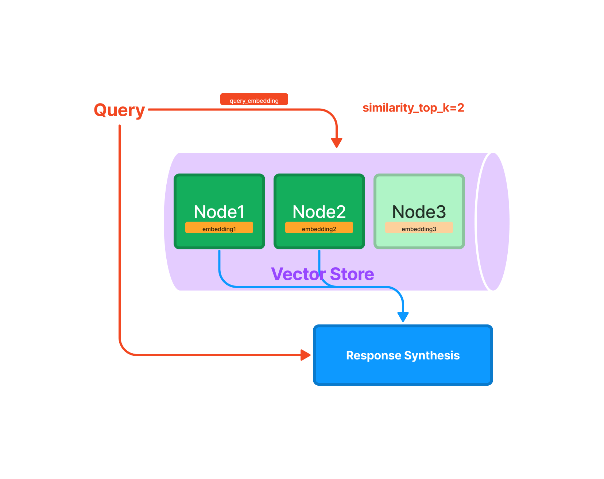

# LlamaIndex : How to use ChatGPT on custom data

# LlamaIndex : How to use ChatGPT on custom data

[](/@cochard-dav?source=post_page---byline--abcbe0e716b3---------------------------------------)

[David Cochard](/@cochard-dav?source=post_page---byline--abcbe0e716b3---------------------------------------)

4 min read

·

Nov 15, 2023

--

2

[Listen](/m/signin?actionUrl=https%3A%2F%2Fmedium.com%2Fplans%3Fdimension%3Dpost_audio_button%26postId%3Dabcbe0e716b3&operation=register&redirect=https%3A%2F%2Fmedium.com%2Faxinc-ai%2Fllamaindex-how-to-use-chatgpt-on-custom-data-abcbe0e716b3&source=---header_actions--abcbe0e716b3---------------------post_audio_button------------------)

Share

Introducing *LlamaIndex*, a framework that allows you to ask questions about your own data in *ChatGPT*.

---

## Overview

By entering text, HTML, PDF, etc., to create an index file and then querying that index file, it is possible to ask questions about the latest information that *ChatGPT* has not been trained on.

[## GitHub — jerryjliu/llama\_index: LlamaIndex (GPT Index) is a project that provides a central…

### LlamaIndex (GPT Index) is a project that provides a central interface to connect your LLM’s with external data. …

github.com](https://github.com/jerryjliu/llama_index?source=post_page-----abcbe0e716b3---------------------------------------)

## Knowledge Base Extension

*ChatGPT* is trained on large text data, but suffers from a lack of knowledge about data that were not part of the training dataset. For example, if you were to question *ChatGPT* about a specific product, it would not have the information for that product, so it would not be able to answer appropriately.

This problem can be solved by embedding product information in the *ChatGPT* Prompt.

Let’s look at the example. Considering the following input query:

> Why is it that the function ‘C’ is not available for product ‘A’?

and assuming the following new information have been fed to the knowledge base:

> Product ‘A’ has a function called ‘B’ and a function called ‘C’, and the function called ‘B’ cannot be combined with the function called ‘C’

Then the input query can be automatically adjusted to

> Product ‘A’ has a function called ‘B’ and a function called ‘C’, and the function called ‘B’ cannot be combined with the function called ‘C’. Why is it that the function ‘C’ is not available for product ‘A’?

and *ChatGPT* will be able to process it in a more meaningful way.

## The Challenges

*ChatGPT* limits prompt length to 4096 tokens at the time of writing. The new knowledge to be considered (the product specification in the previous example) might be several MB, which goes over the limit.

*LlamaIndex* solves this problem by converting the text into a multi-segmented index and querying them in sequence.

## Indexing Mechanism

The text of the additional knowledge is divided into multiple nodes, and embeddings are computed for each node. When a new query is made, the embeddings of the query are computed, N nodes with the closest distance are selected and used as prompts to ask questions to *ChatGPT*.

Press enter or click to view image in full size



Querying mechanism (Source: <https://gpt-index.readthedocs.io/en/v0.6.8/guides/primer/index_guide.html>)

When a query requires multiple nodes, the answer of the first node is input to the next node, which is then refined to obtain the final output.

Press enter or click to view image in full size


Response Synthesis (Source: <https://gpt-index.readthedocs.io/en/v0.6.8/how_to/query/response_synthesis.html>)

## Usage

*LlamaIndex* requires python 3.8 or newer and can be installed using `pip`

```
pip install llama-index
```

The following example inputs the PDF of ailia SDK documentation and indexes it.

```
import os  
os.environ["OPENAI_API_KEY"] = 'YOUR_OPENAI_API_KEY'  
  
from llama_index import GPTSimpleVectorIndex, SimpleDirectoryReader  
from llama_index import download_loader  
  
CJKPDFReader = download_loader("CJKPDFReader")  
loader = CJKPDFReader()  
  
documents = loader.load_data("ailia_sdk.pdf")  
index = GPTSimpleVectorIndex(documents)  
index.save_to_disk('index.json')
```

Then query the index you’ve just created.

```
import os  
os.environ["OPENAI_API_KEY"] = 'YOUR_OPENAI_API_KEY'  
  
from llama_index import GPTSimpleVectorIndex, LLMPredictor  
from langchain import OpenAI  
  
query_text ="What operating systems does ailia SDK support?"  
  
llm_predictor = LLMPredictor(llm=OpenAI(temperature=0, max_tokens=350))  
index = GPTSimpleVectorIndex.load_from_disk('index.json')  
response = index.query(query_text, llm_predictor=llm_predictor)  
  
print("Q:", query_text)  
print("A:", str(response))
```

## Example

The 1.2MB PDF file of the ailia SDK documentation results in a 1.6MB index.

```
$ python3 create_index.py  
  
INFO:llama_index.token_counter.token_counter:> [build_index_from_documents] Total LLM token usage: 0 tokens  
INFO:llama_index.token_counter.token_counter:> [build_index_from_documents] Total embedding token usage: 72737 tokens
```

Let’s query the index:

```
$ python3 query_index.py  
  
INFO:llama_index.token_counter.token_counter:> [query] Total LLM token usage: 3608 tokens  
INFO:llama_index.token_counter.token_counter:> [query] Total embedding token usage: 24 tokens  
Q: What operating systems does ailia SDK support?  
A: Ailia SDK supports Windows, Mac, Linux, iOS, Android, Jetson, and RaspberryPi operating systems.
```

## Troubleshooting

The following error might occur, when indexing PDF in written in Japanese for example.

`ValueError: A single term is larger than the allowed chunk size`

This issue is addressed in the issue below:

[## How to fixed “ValueError: A single term is larger than the allowed chunk size.” · Issue #453 ·…

### You can’t perform that action at this time. You signed in with another tab or window. You signed out in another tab or…

github.com](https://github.com/jerryjliu/llama_index/issues/453?source=post_page-----abcbe0e716b3---------------------------------------)

This error occurs because, unlike English, Japanese words are not separated by spaces, making sentences too long. It can be avoided by converting the sentence to include a space after the punctuation mark, as shown below.

```
doc.text = doc.text.replace("、", "、 ")  
doc.text = doc.text.replace("。", "。 ")
```

Some queries in Japanese might also trigger the following error:

`This model’s maximum context length is 4097 tokens, however you requested 4224 tokens`

This error is also addressed in the issue below:

[## Chunk size sometimes exceeds max model size · Issue #294 · jerryjliu/llama\_index

### InvalidRequestError: This model’s maximum context length is 4097 tokens, however you requested 4229 tokens (3973 in…

github.com](https://github.com/jerryjliu/llama_index/issues/294?source=post_page-----abcbe0e716b3---------------------------------------)

## Pricing

*LlamaIndex* is using OpenAI’s paid APIs behind the scene.

Creating a 1.2MB index consumes 72737 tokens, at $0.002 / 1K tokens we are at a total of about $0.14.

A query for a 1.2MB index consumes 3632 tokens, at $0.002 / 1K tokens it’s about $0.007.

## Sample Program

The sample code used in this blog post can be found below.

[## GitHub — axinc-ai/llama-index-sample: The sample program of llama index

### You can’t perform that action at this time. You signed in with another tab or window. You signed out in another tab or…

github.com](https://github.com/axinc-ai/llama-index-sample?source=post_page-----abcbe0e716b3---------------------------------------)

---

[ax Inc.](https://axinc.jp/en/) has developed [ailia SDK](https://ailia.jp/en/), which enables cross-platform, GPU-based rapid inference.

ax Inc. provides a wide range of services from consulting and model creation, to the development of AI-based applications and SDKs. Feel free to [contact us](https://axinc.jp/en/) for any inquiry.