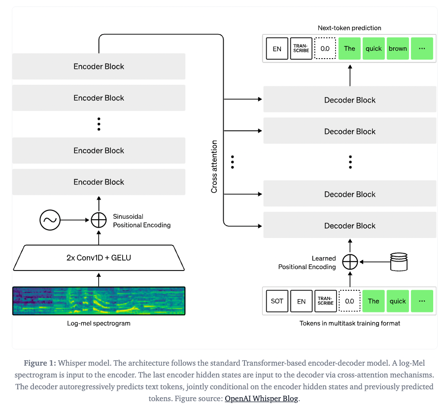

# Whisper Fine Tuning To Transcribe Jargon

# Whisper Fine Tuning To Transcribe Jargon

[](/@cochard-dav?source=post_page---byline--976164a5eac8---------------------------------------)

[David Cochard](/@cochard-dav?source=post_page---byline--976164a5eac8---------------------------------------)

4 min read

·

Nov 23, 2023

--

2

[Listen](/m/signin?actionUrl=https%3A%2F%2Fmedium.com%2Fplans%3Fdimension%3Dpost_audio_button%26postId%3D976164a5eac8&operation=register&redirect=https%3A%2F%2Fmedium.com%2Faxinc-ai%2Fwhisper-fine-tuning-to-transcribe-jargon-976164a5eac8&source=---header_actions--976164a5eac8---------------------post_audio_button------------------)

Share

This article explains how *Whisper* can be fine-tuned with a small amount of data set to make domain-specific terminology recognizable. By creating a dataset with *Tacotron2* synthesized speech, a *Whisper* model can be created and recognize technical terms.

---

## About Whisper

*Whisper* is a speech recognition model developed by *OpenAI* able to transcribe many languages with high accuracy. However a limitation of this model is that technical terms that don’t appear during training cannot be transcribed.

Press enter or click to view image in full size



Whisper Architecture (Source: <https://huggingface.co/blog/fine-tune-whisper>)

Refer to the article below for more details about *Whisper* mechanisms.

[## Whisper : Speech recognition model capable of recognizing 99 languages

### This is an introduction to「Whisper」, a machine learning model that can be used with ailia SDK. You can easily use this…

medium.com](/axinc-ai/whisper-speech-recognition-model-capable-of-recognizing-99-languages-5b5cf0197c16?source=post_page-----976164a5eac8---------------------------------------)

## Technical Terms Using Prompt Engineering

One method to include technical terms in Whisper’s knowledge base is to embed those terms in the initial prompt used by the language model. This method was described in details in the article below.

[## Prompt Engineering in Whisper

### Whisper, an AI model for speech recognition also uses a language model internally, therefore we can apply some prompt…

medium.com](/axinc-ai/prompt-engineering-in-whisper-6bb18003562d?source=post_page-----976164a5eac8---------------------------------------)

However we saw that this initial prompt has strong size limitations and cannot be used for a large dataset of new words.

## Whisper Fine Tuning

The developers of transformers for *Pytorch* from [*Hugging Face*](https://huggingface.co/) added a feature to transformers to perform Whisper fine tuning.

This fine tuning technique to make *Whisper* learn new words by giving it audio / text pairs is described in the following blog post. Since *Whisper* predicts UTF8 bytecodes directly, so there is no need to update the initial vocabulary items when adding new words.

[## Fine-Tune Whisper For Multilingual ASR with 🤗 Transformers

### In this blog, we present a step-by-step guide on fine-tuning Whisper for any multilingual ASR dataset using Hugging…

huggingface.co](https://huggingface.co/blog/fine-tune-whisper?source=post_page-----976164a5eac8---------------------------------------)

Note that when fine-tuning for languages with no space between words, like in Japanese, the the `compute_metrics` function mentioned in the blog post cannot correctly calculate the Word Error Rate (WER). In that case it is necessary to improve the metrics function using morphological analysis of the [open source Japanese NLP library *Ginza*](https://github.com/megagonlabs/ginza). This method is explained in the following blog post, available in Japanese only.

[## Hugging FaceでOpenAIの音声認識”Whisper”をFine Tuningする方法が公開されました | DevelopersIO

### こんちには。 データアナリティクス事業本部 機械学習チームの中村です。 OpenAIがリリースしたWhisperについて、先日Hugging FaceのブログでHugging…

dev.classmethod.jp](https://dev.classmethod.jp/articles/whisper-fine-tuning-by-huggingface/?source=post_page-----976164a5eac8---------------------------------------)

## Dataset Structure

To build your own dataset, use `DatasetDict` and `Dataset` , and provide the path to the audio file in `fileList` and the text to be trained on `sentenceList.`

```
from datasets import DatasetDict, Dataset  
common_voice = DatasetDict()  
fileList = ["test/tsukuyomi1.wav", "test/tsukuyomi2.wav"]  
sentenceList = ["こんにちは。今日は新しいAIエンジンであるailia SDKを紹介します。ailia SDKは高速なAI推論エンジンです。", "コア技術"]  
common_voice["train"] = Dataset.from_dict({"audio": fileList, "sentence": sentenceList}).cast_column("audio", Audio(sampling_rate=16000))
```

## Training

The training follows the procedure from *Hugging Face* and uses `Seq2SeqTrainingArguments` and `Seq2SeqTrainer` to set up the data set and run `trainer.train()`

```
trainer.train()
```

With 5 audio files, 40 epochs on an Mac M1 CPU, the training of *Whisper Small* takes about 20 minutes. When learning is complete, the results are output to `whisper-small-en/checkpoint-40`

Such training can be done based on speech synthesized generated using [*Tacotron2*](https://github.com/NVIDIA/tacotron2).

## Inference

To run an inference using the newly trained model, load the model with `WhisperForConditionalGeneration.from_pretrained` as shown below.

```
import torch  
from transformers import AutoProcessor, WhisperForConditionalGeneration  
from datasets import load_dataset, DatasetDict, Dataset  
from datasets import Audio  
  
processor = AutoProcessor.from_pretrained("openai/whisper-small")  
  
# original  
#model = WhisperForConditionalGeneration.from_pretrained("openai/whisper-small")  
  
# fine tuned  
model = WhisperForConditionalGeneration.from_pretrained("whisper-small-ja/checkpoint-40")  
  
model.config.forced_decoder_ids \  
    = processor.get_decoder_prompt_ids(language = "ja", task = "transcribe")  
model.config.suppress_tokens = []  
  
common_voice = DatasetDict()  
fileList = ["test/ailia.wav"]  
common_voice["train"] = Dataset.from_dict({"audio": fileList}).cast_column("audio", Audio(sampling_rate=16000))  
  
for i in range(len(common_voice["train"])):  
    inputs = processor(common_voice["train"][i]["audio"]["array"], return_tensors="pt")  
    input_features = inputs.input_features  
  
    generated_ids = model.generate(inputs=input_features)  
  
    transcription = processor.batch_decode(generated_ids, skip_special_tokens=True)[0]  
  
    print(transcription)
```

Examples of inference code can be found in the official *Hugging Face* documentation.

[## Whisper

### The Whisper model was proposed in Robust Speech Recognition via Large-Scale Weak Supervision by Alec Radford, Jong Wook…

huggingface.co](https://huggingface.co/docs/transformers/model_doc/whisper?source=post_page-----976164a5eac8---------------------------------------)

## Conversion to official Whisper weights

The script below converts from the official *Whisper* to the *Hugging Face Whisper.* The reverse operation is needed to use models trained with *Hugging Face* with regular *Whisper*.

[## transformers/convert\_openai\_to\_hf.py at main · huggingface/transformers

### 🤗 Transformers: State-of-the-art Machine Learning for Pytorch, TensorFlow, and JAX. …

github.com](https://github.com/huggingface/transformers/blob/main/src/transformers/models/whisper/convert_openai_to_hf.py?source=post_page-----976164a5eac8---------------------------------------)

```
from transformers import AutoProcessor, WhisperForConditionalGeneration  
finetune_model = WhisperForConditionalGeneration.from_pretrained("whisper-small-ja/checkpoint-40")  
  
WHISPER_MAPPING = {  
    "encoder.ln_post.weight": "encoder.layer_norm.weight", # added by ax  
    "encoder.ln_post.bias": "encoder.layer_norm.bias", # added by ax  
    "blocks": "layers",  
    "mlp.0": "fc1",  
    "mlp.2": "fc2",  
    "mlp_ln": "final_layer_norm",  
    ".attn.query": ".self_attn.q_proj",  
    ".attn.key": ".self_attn.k_proj",  
    ".attn.value": ".self_attn.v_proj",  
    ".attn_ln": ".self_attn_layer_norm",  
    ".attn.out": ".self_attn.out_proj",  
    ".cross_attn.query": ".encoder_attn.q_proj",  
    ".cross_attn.key": ".encoder_attn.k_proj",  
    ".cross_attn.value": ".encoder_attn.v_proj",  
    ".cross_attn_ln": ".encoder_attn_layer_norm",  
    ".cross_attn.out": ".encoder_attn.out_proj",  
    "decoder.ln.": "decoder.layer_norm.",  
    "encoder.ln.": "encoder.layer_norm.",  
    "token_embedding": "embed_tokens",  
    "encoder.positional_embedding": "encoder.embed_positions.weight",  
    "decoder.positional_embedding": "decoder.embed_positions.weight",  
    #"ln_post": "layer_norm", # disabled by ax  
}  
  
def rename_keys(s_dict):  
    keys = list(s_dict.keys())  
    for key in keys:  
        new_key = key  
        for v, k in WHISPER_MAPPING.items():  
            if k in key:  
                new_key = new_key.replace(k, v)  
  
        print(f"{key} -> {new_key}")  
  
        s_dict[new_key] = s_dict.pop(key)  
    return s_dict  
  
state_dict = finetune_model.model.state_dict()  
rename_keys(state_dict)  
  
import whisper  
model = whisper.load_model("small")  
  
missing, unexpected = model.load_state_dict(state_dict, strict = False)  
  
if len(missing):  
    print("Weight name not found", missing)  
    raise  
  
result = model.transcribe("test/axell_130.wav", language="ja", verbose=False)  
  
for s in result["segments"]:  
    start = s['start']  
    end = s['end']  
    text = s['text']  
    print(str(start) + "\t" + str(end) + "\t" + text)
```

## About ailia Speech

[ax Inc.](https://axinc.jp/en/) provides a library that allows AI speech recognition using *Whisper* to run offline as a Unity or C++ API, including custom prompt features.

[## ailia AI Speech : Speech Recognition Library for Unity and C++

### Introducing ailia AI Speech, an AI speech recognition library which allows you to easily implement speech recognition…

medium.com](/axinc-ai/ailia-ai-speech-speech-recognition-library-for-unity-and-c-d29db1abe978?source=post_page-----976164a5eac8---------------------------------------)

---

[ax Inc.](https://axinc.jp/en/) has developed [ailia SDK](https://ailia.jp/en/), which enables cross-platform, GPU-based rapid inference.

ax Inc. provides a wide range of services from consulting and model creation, to the development of AI-based applications and SDKs. Feel free to [contact us](https://axinc.jp/en/) for any inquiry.