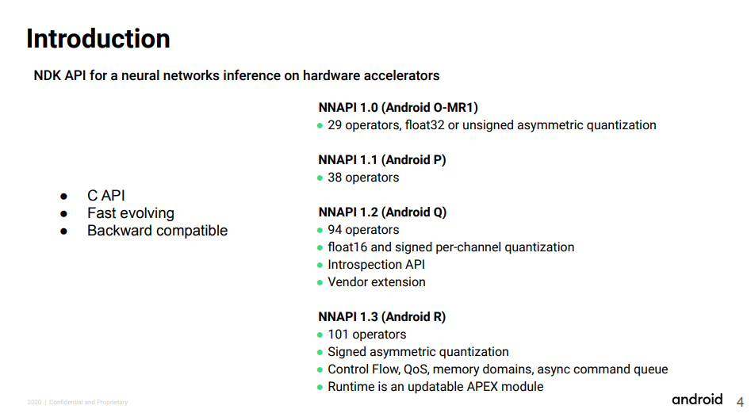

# NNAPI : Low-level API for using NPU on Android

# NNAPI : Low-level API for using NPU on Android

[David Cochard](/@cochard-dav?source=post_page---byline--616e51f7b474---------------------------------------)

4 min read

·

Nov 30, 2023

--

1

[Listen](/m/signin?actionUrl=https%3A%2F%2Fmedium.com%2Fplans%3Fdimension%3Dpost_audio_button%26postId%3D616e51f7b474&operation=register&redirect=https%3A%2F%2Fmedium.com%2Faxinc-ai%2Fnnapi-low-level-api-for-using-npu-on-android-616e51f7b474&source=---header_actions--616e51f7b474---------------------post_audio_button------------------)

Share

This is a description of *NNAPI* (Neural Networks API), a low-level API for using NPUs on Android to enable fast inference of AI models.

---

## Overview

*NNAPI* (Neural Networks API)is a low-level API for using NPU (Neural Processing Unit) for Android, similarly to what *cuDNN* is for *NVIDIA* GPUs. *NNAPI* enables fast inference using *Google Pixel*’s *EdgeTPU*, as well as NPUs from *Qualcomm* and *Mediatek*.

Using *NNAPI*, it is possible to connect operators such as convolution to build graphs and perform AI inference using NPUs through device vendor drivers.

*NNAPI* is a C language API that can be used from Android NDK.

NNAPI Architecture( Source: <https://developer.android.com/ndk/guides/neuralnetworks>)

## NNAPI Tensor Format

*NNAPI* is designed based on the *tflite* specification with tensors that support both `float` and `int8`. However, NPUs often support only `int8`, and if a `float` model is given, it will be executed on the CPU or GPU. Therefore, to use NPU, you must use a model quantized to `int8`.

## NNAPI Versions

*NNAPI* has Feature Level 3 (NNAPI 1.2) available for Android 10 or earlier and Feature Level 4 (NNAPI 1.3) available for Android 11 or later. `TENSOR_QUANT8_ASYMM` with `ZERO_POINT` variable quantization commonly used in *tflite* requires Feature Level 4 or higher, so Android 11 or later is effectively required to infer a general *tflite* model quantized in *TensorFlow*.

Press enter or click to view image in full size

NNAPI versions (Source: <https://www.w3.org/2020/Talks/mlws/mw-androidnn.pdf>)

## NNAPI Devices

You can give *NNAPI* a list of devices to use, and *NNAPI* will automatically select the best one.

Since *NNAPI* always includes a software implementation device called `nnapi_reference`, layers defined in *NNAPI* but not supported by NPUs are offloaded to the CPU implementation. Of course, the automatic offloading to `nnapi_reference` of NPU-incompatible layers or parameters often results in slower execution.

## Supported Operators

The operators that can be executed by NNAPI are defined below.

[## Neural Networks API | Android NDK | Android Developers

### The Android Neural Networks API (NNAPI) is an Android C API designed for running computationally intensive operations…

developer.android.com](https://developer.android.com/ndk/guides/neuralnetworks?source=post_page-----616e51f7b474---------------------------------------#operations)

## Non-Supported Operators

`NON_MAX_SUPPRESSION`, `LEAKY_RELU`, `PACK`, `SHAPE`, and `SPLIT_V` are not supported.

## Supported Operators Requiring Extra Care

Since *NNAPI* implementationis provided by device vendors, it is not yet stable, and workarounds for specific devices are needed.

### Conv

The `bias_scale` must explicitly specify the *tflite* constraint `input_scale * filter_scale`. With *Snapdragon855*, this value is ignored and is automatically determined from input, filter, and output. *Snapdragon 8+* refers to `bias_scale`, so if you put in different values, the results will be inconsistent.

*NNAPI* will raise an error if scales contains 0 in `PerChannelQuantParams`. If 0 is detected, the minimum float value must be set.

### FC

If `bias` does not exist, NNAPI will raise an error, so a tensor with bias 0 must be explicitly generated and given.

### Pad

When padding in the channel direction, *Snapdragon 8+* outputs an incorrect value, while the `PAD_V2` outputs the correct value, but it is slower than `PAD`.

### Mean

The *tflite* `Mean` is not constrained to have the same scale and zero point for input and output, but the NNAPI implementation of `Mean` has those constraints, which requires some scale conversions.

## Debugging

If an incorrect operator is given to *NNAPI*, an error is often output to *logcat*, so check the *logcat* error first.

## Benchmark

*NNAPI* benchmarks for each SoC are summarized below.

[## AI-Benchmark

### Have some questions regarding the scores? Faced some issues? Want to discuss the results? Welcome to our new AI…

ai-benchmark.com](https://ai-benchmark.com/ranking_processors?source=post_page-----616e51f7b474---------------------------------------)

We have confirmed that the NNAPI NPU (int8) runs 15 times faster than the CPU (float) on the *Snapdragon 8+ Gen1* and `yolox_tiny`.

## Demo

The [ailia AI showcase](https://play.google.com/store/apps/details?id=jp.axinc.ailia_ai_showcase) published on Google Play by ax Inc. allows inference using NNAPI and NPU. Currently, `YOLOX_TINY`, `YOLOX_S`, `HRNET`, `MobileNetV2`, `ResNet50`, `BlazeFace`, and `FaceMesh` support NPU inference.

Press enter or click to view image in full size

Inference of hrnet on Snapdragon 8+ (CPU 220ms、GPU 130ms、NPU 9ms)

[Download ailia AI showcase from Google Play](https://play.google.com/store/apps/details?id=jp.axinc.ailia_ai_showcase)

At the ailia AI showcase, NPU inference is performed using the *ailia TFLite Runtime* developed by *ax Inc.* and *Axell Corporation*. *ailia TFLite Runtime* is an SDK for running *tflite* inference, which allows complex graphs such as `YOLOX` to be executed with *NNAPI* by subgraph partitioning operators that are not executable with *NNAPI* and CPU execution.

[## ailia TFLite Runtime : Runtime for implementing AI on NonOS and RTOS devices

### Introducing ailia TFLite Runtime, a runtime for implementing AI on NonOS and RTOS devices. ailia TFLite Runtime makes…

medium.com](/axinc-ai/ailia-tflite-runtime-runtime-for-implementing-ai-on-nonos-and-rtos-devices-8b12e412df2b?source=post_page-----616e51f7b474---------------------------------------)

In addition, quantized models that can be used with *NNAPI* are available at *ailia-models-tflite*.

[## GitHub — axinc-ai/ailia-models-tflite: Quantized version of model library

### Quantized tflite models for ailia TFLite Runtime ailia TFLite Runtime is a TensorFlow Lite compatible inference engine…

github.com](https://github.com/axinc-ai/ailia-models-tflite?source=post_page-----616e51f7b474---------------------------------------)

---

[ax Inc.](https://axinc.jp/en/) has developed [ailia SDK](https://ailia.jp/en/), which enables cross-platform, GPU-based rapid inference.

ax Inc. provides a wide range of services from consulting and model creation, to the development of AI-based applications and SDKs. Feel free to [contact us](https://axinc.jp/en/) for any inquiry.