# Generate images with custom poses using StableDiffusionWebUI and ControlNet

# Generate images with custom poses using StableDiffusionWebUI and ControlNet

[](/@cochard-dav?source=post_page---byline--c18d190cade1---------------------------------------)

[David Cochard](/@cochard-dav?source=post_page---byline--c18d190cade1---------------------------------------)

6 min read

·

Dec 1, 2023

--

[Listen](/m/signin?actionUrl=https%3A%2F%2Fmedium.com%2Fplans%3Fdimension%3Dpost_audio_button%26postId%3Dc18d190cade1&operation=register&redirect=https%3A%2F%2Fmedium.com%2Faxinc-ai%2Fgenerate-images-with-custom-poses-using-stablediffusionwebui-and-controlnet-c18d190cade1&source=---header_actions--c18d190cade1---------------------post_audio_button------------------)

Share

This article explains how to generate images with custom character postures using *StableDiffusionWebUI* for the image creation, and *ControlNet* for the constraint management.

---

## About StableDiffusion and ControlNet

*StableDiffusion* is an AI model that can generate illustrations from an arbitrary text prompt. Various extensions have been made to *StableDiffusion* by the community, and *ControlNet* is one of them which can be used to force custom poses for characters in the generated image.

[## StableDiffusion: Machine Learning Model to Generate Images From Text

### StableDiffusion is a machine learning model that generates images from text. The trained model is publicly available…

medium.com](/axinc-ai/stablediffusion-machine-learning-model-to-generate-images-from-text-22034d9b44b7?source=post_page-----c18d190cade1---------------------------------------)

## About StableDiffusionWebUI

*StableDiffusionWebUI* is a web front-end that allows you to easily use *StableDiffusion* on PC. It can be used by running the following commands on a Windows PC with an NVIDIA RTX series GPU, with [Git](https://gitforwindows.org/) and [Python](https://www.python.org/downloads/release/python-3106/) installed.

[## GitHub - AUTOMATIC1111/stable-diffusion-webui: Stable Diffusion web UI

### Stable Diffusion web UI. Contribute to AUTOMATIC1111/stable-diffusion-webui development by creating an account on…

github.com](https://github.com/AUTOMATIC1111/stable-diffusion-webui?source=post_page-----c18d190cade1---------------------------------------)

```
git clone https://github.com/AUTOMATIC1111/stable-diffusion-webui.git  
cd .\stable-diffusion-webui\  
.\webui-user.bat
```

After that simply open the given URL in your web browser.

```
Model loaded in 9.5s (calculate hash: 3.5s, load weights from disk: 0.1s, create model: 2.9s, apply weights to model: 0.7s, apply half(): 0.6s, move model to device: 1.0s, load textual inversion embeddings: 0.7s).  
Running on local URL:  http://127.0.0.1:7860
```

In the web UI, open the *txt2img* tab, enter the text prompt and press *Generate* to create the image.

Press enter or click to view image in full size

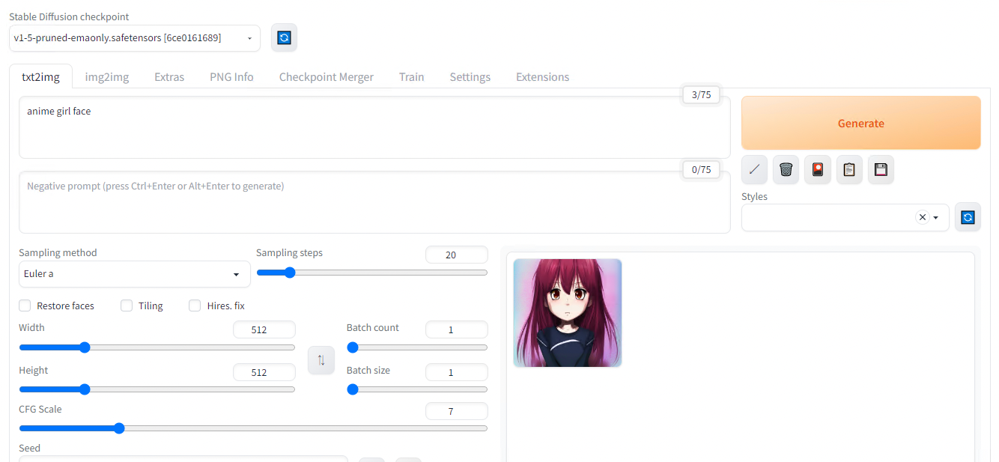

Result with default parameters for the prompt “anime girl face”

## Use of different models

*StableDiffusion* has lots of model variants. The model files are in `safetensors` format and can be downloaded and placed in the models folder for use.

As a first example, download `Basil_mix_fixed.safetensors` and place it in `\stable-diffusion-webui\models\Stable-diffusion`. This model file is fine-tuned with realistic texture and Asian faces.

[## Basil\_mix\_fixed.safetensors · nuigurumi/basil\_mix at main

### Upload Basil\_mix\_fixed.safetensors 447b3e6 This file is stored with Git LFS . It is too big to display, but you can…

huggingface.co](https://huggingface.co/nuigurumi/basil_mix/blob/main/Basil_mix_fixed.safetensors?source=post_page-----c18d190cade1---------------------------------------)

Next, place `vae-ft-mse-840000-ema-pruned.safetensors` into `\stable-diffusion-webui\models\VAE`. [Variational autoencoder](https://stable-diffusion-art.com/how-to-use-vae/) (VAE) is a post-processing technique that can be used to improve the quality of images you generate with *StableDiffusion*. `sd-vae-ft-mse-original` is a popular option to correct artefacts on generated face.

[## vae-ft-mse-840000-ema-pruned.safetensors · stabilityai/sd-vae-ft-mse-original at main

### Adding `safetensors` variant of this model (#1) 629b3ad This file is stored with Git LFS . It is too big to display…

huggingface.co](https://huggingface.co/stabilityai/sd-vae-ft-mse-original/blob/main/vae-ft-mse-840000-ema-pruned.safetensors?source=post_page-----c18d190cade1---------------------------------------)

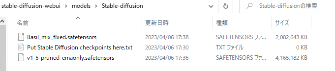

Custom model files

Once the model files has been placed, the downloaded model can be used by pressing the refresh mark in the upper left corner of the web UI to select the model from the list box.

Press enter or click to view image in full size

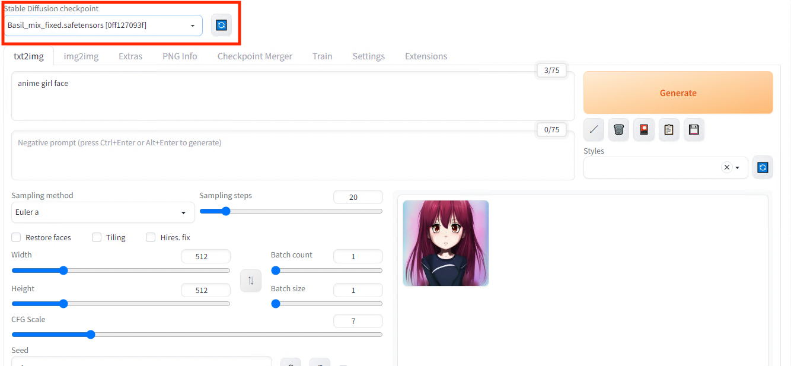

Model selection

The VAE model is selected in the settings under in the`VAE` category.

Press enter or click to view image in full size

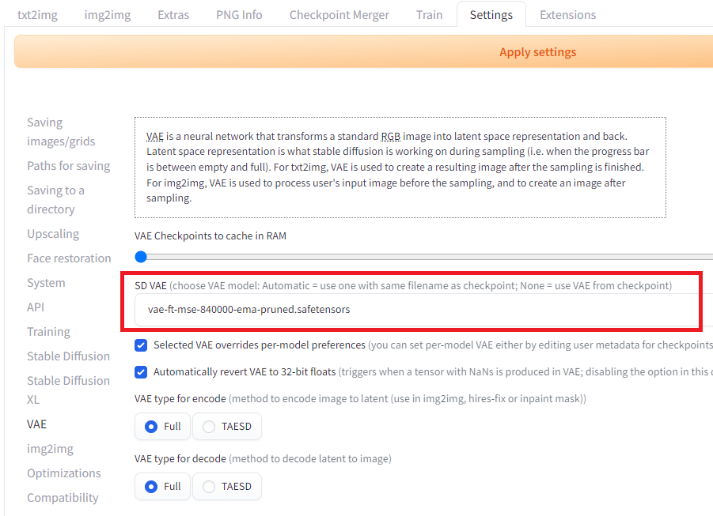

VAE selection

Press enter or click to view image in full size

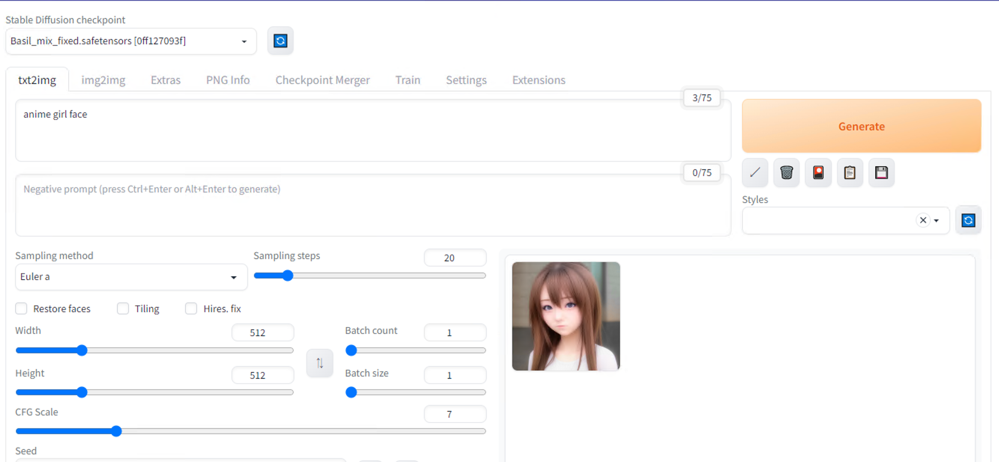

Result with custom parameters for the prompt “anime girl face”

## Installation of ControlNet

With standard *StableDiffusion*, you can only control the output of illustrations with text. *ControlNet* allows you to control the output of your illustrations using skeletons, line drawings, and segmentation.

*ControlNet* can be installed as a plug-in to *StableDiffusionWebUI*. Install the extensions by specifying `https://github.com/Mikubill/sd-webui-controlnet` in the `Install from URL` textbox.

Press enter or click to view image in full size

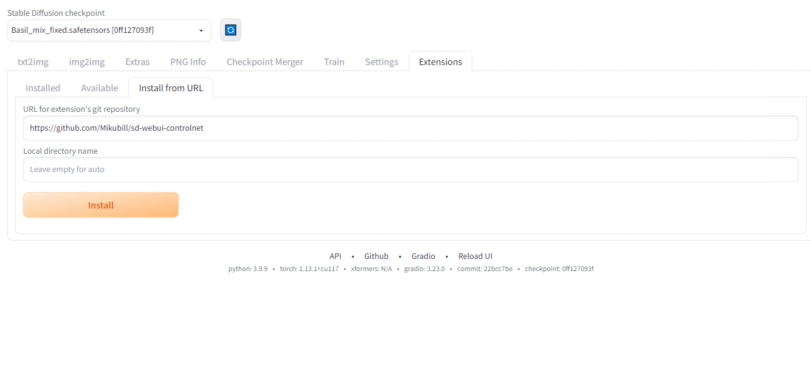

Installation of ControlNet

After installation, press Apply and restart UI.

Press enter or click to view image in full size

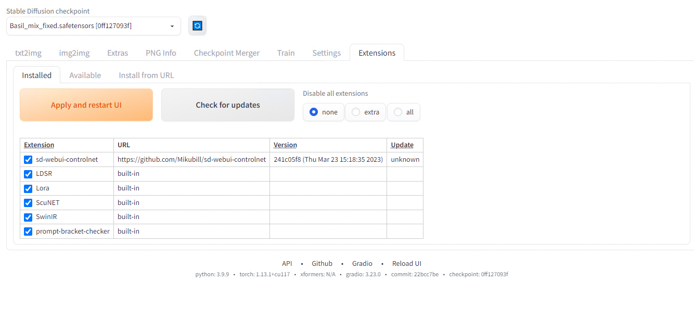

After restart

A new set of parameters is available inthe txt2img interface.

Press enter or click to view image in full size

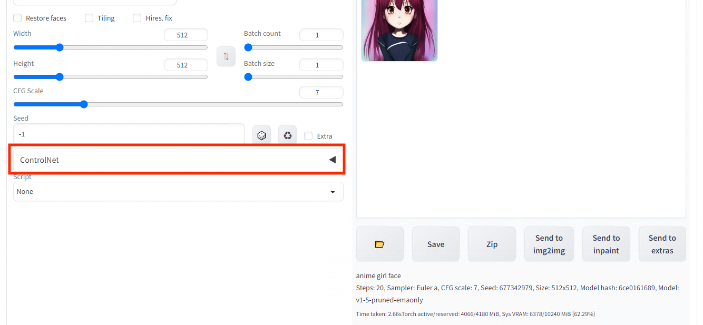

ControlNet settings

Next, download the model file`control_openpose-fp16.safetensors` and place it in `\stable-diffusion-webui\models\ControlNet` in order to constraint the generated image with a pose estimation inference result.

[## control\_openpose-fp16.safetensors · webui/ControlNet-modules-safetensors at main

### This file is stored with Git LFS . It is too big to display, but you can still download it. SHA256…

huggingface.co](https://huggingface.co/webui/ControlNet-modules-safetensors/blob/main/control_openpose-fp16.safetensors?source=post_page-----c18d190cade1---------------------------------------)

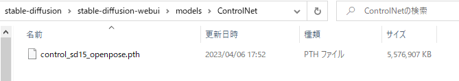

ControlNet custom model file

Return to the web UI and open the ControlNet tab, check `Enable` and specify `OpenPose` as preprocessor. Upload any image and press `Preview Annotate Result`.

Press enter or click to view image in full size

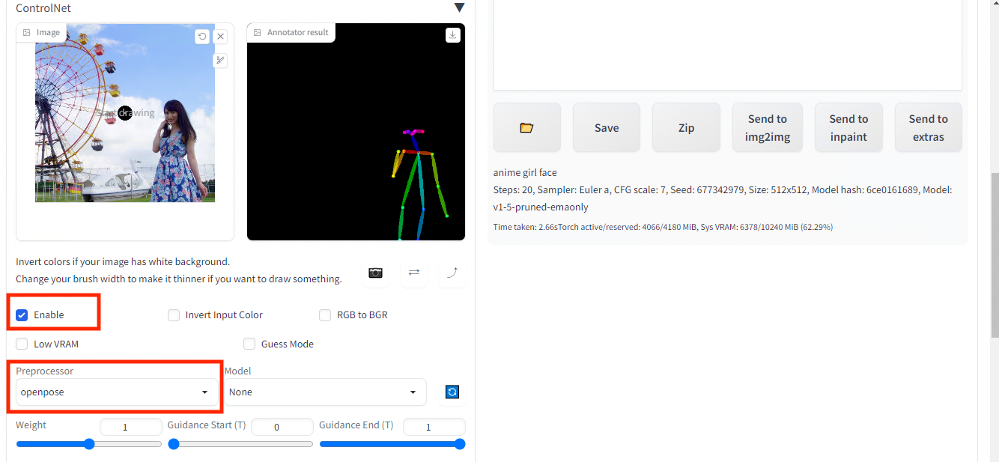

Pose estimation result (right) of the input image (left)

Once you have successfully estimated the skeleton, set the model to`control_sd15_openpose` . If the model does not appear, press the blue reload button.

Press enter or click to view image in full size

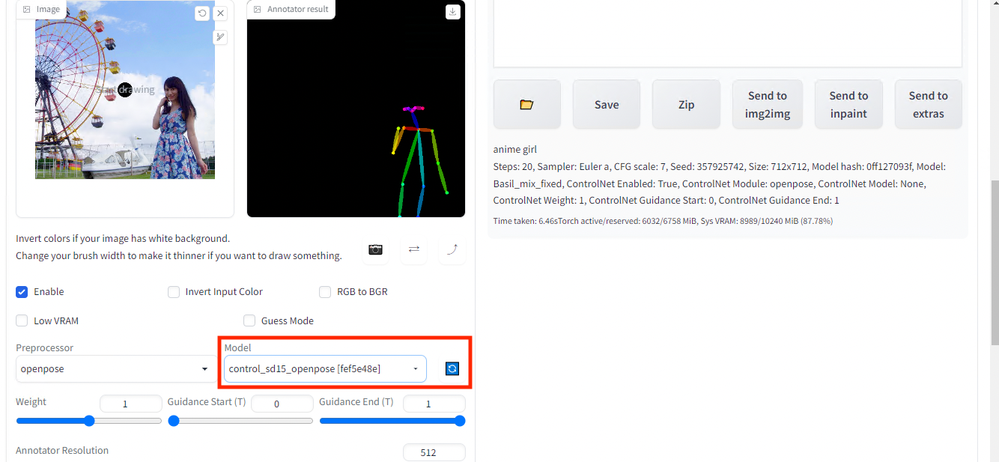

Set the custom model

Press `Generate`.

Press enter or click to view image in full size

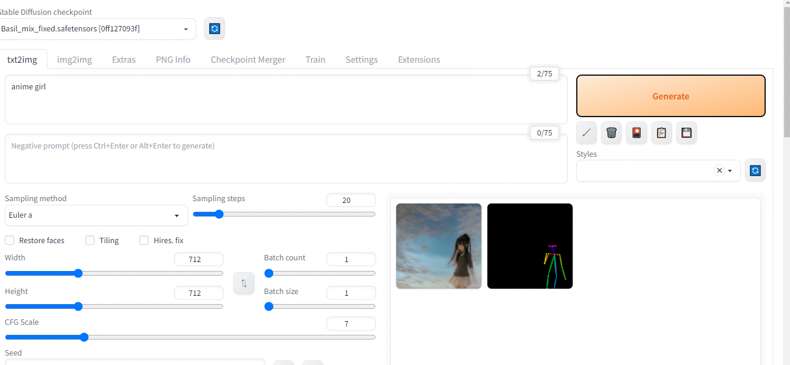

Image generated based on the previous pose estimation result

Press enter or click to view image in full size

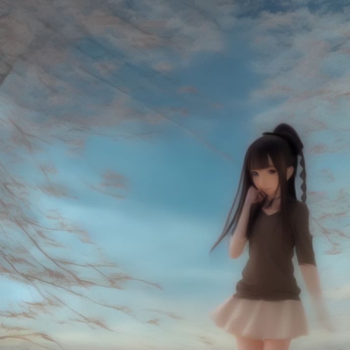

Result for text prompt “anime girl” + ControlNet Pose Estimation

## Constraint by Segmentation

Because segmentation usually contains more information than a simple pose estimation result, let’s contraint our image generation with it.

Same as before, download the model `control_seg-fp16.safetensors` and place it in `\stable-diffusion-webui\models\ControlNet.`

[## control\_seg-fp16.safetensors · webui/ControlNet-modules-safetensors at main

### This file is stored with Git LFS . It is too big to display, but you can still download it. SHA256…

huggingface.co](https://huggingface.co/webui/ControlNet-modules-safetensors/blob/main/control_seg-fp16.safetensors?source=post_page-----c18d190cade1---------------------------------------)

Set `segmentation` for preprocessor and `control_seg-fp16` for model.

Press enter or click to view image in full size

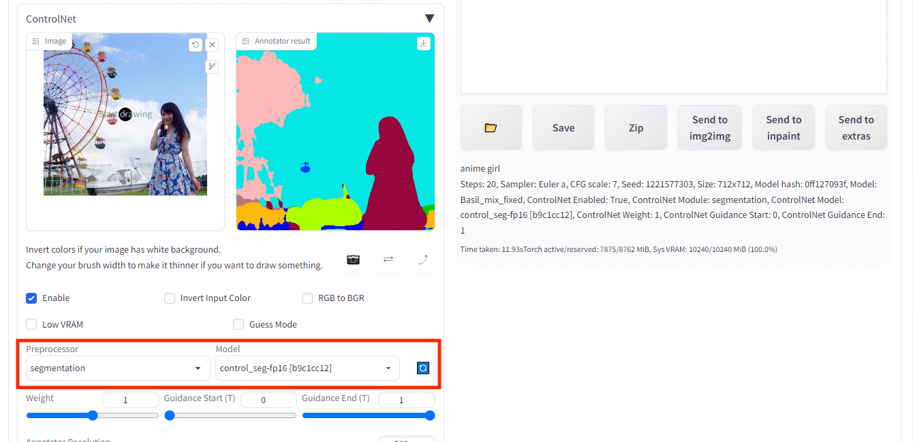

Input image (left) and the segmentation result (right)

Then generate.

Press enter or click to view image in full size

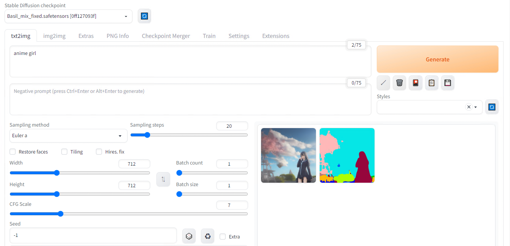

Image generated based on the previous segmentation result

Press enter or click to view image in full size

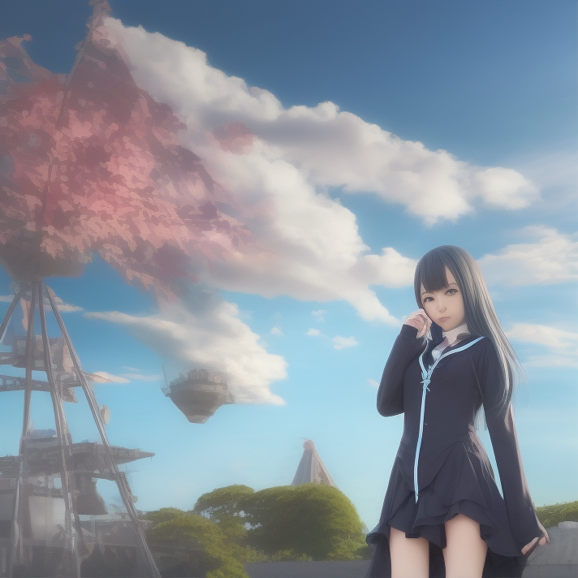

Result for text prompt “anime girl” + ControlNet Segmentation

## How ControlNet Works

*ControlNet* source code and papers can be found below.

[## GitHub — lllyasviel/ControlNet: Let us control diffusion models!

### Official implementation of Adding Conditional Control to Text-to-Image Diffusion Models. ControlNet is a neural network…

github.com](https://github.com/lllyasviel/ControlNet?source=post_page-----c18d190cade1---------------------------------------)

*ControlNet* provides a way to further train *StableDiffusion*’s middle layers based on input constraints.

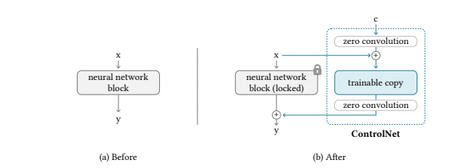

ControlNet Architecture (Source: <https://arxiv.org/pdf/2302.05543.pdf>)

The weights of the *StableDiffusion* layer are fixed (or “locked”), and a layer called *ZeroConvolution*, with a kernel size of 1x1, weight=0, and bias=0, is sandwiched between the *StableDiffusion* layer, which initially starts in exactly the same state as the *StableDiffusion* layer.

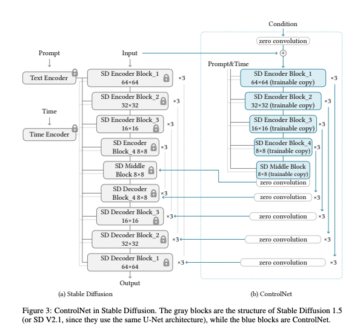

ControlNet Architecture (Source: <https://arxiv.org/pdf/2302.05543.pdf>)

The *ZeroConvolution* is trained using back propagation and evolves to a regular 1x1 Convolution, making it efficient for small datasets.

In this approach called *Adapter*, the weights of the base model are kept fixed (unchanged), and only the differences in the feature vectors (the representations of the input data) are learned. This is a form of fine-tuning, where you take a pre-trained model (the base model) and slightly adjust it for a specific task or dataset. This method is considered effective because it allows for the customization of a model without the need to retrain it entirely, which saves resources and time.

[## GitHub — gaopengcuhk/CLIP-Adapter

### Official implementation of ‘CLIP-Adapter: Better Vision-Language Models with Feature Adapters’. CLIP-Adapter is a…

github.com](https://github.com/gaopengcuhk/CLIP-Adapter?source=post_page-----c18d190cade1---------------------------------------)

*ControlNet* can be applied to models other than the standard *StableDiffusion* weights (such as the `BasilMix` model we downloaded earlier) and still produce normal output.

---

[ax Inc.](https://axinc.jp/en/) has developed [ailia SDK](https://ailia.jp/en/), which enables cross-platform, GPU-based rapid inference.

ax Inc. provides a wide range of services from consulting and model creation, to the development of AI-based applications and SDKs. Feel free to [contact us](https://axinc.jp/en/) for any inquiry.