# Generate Images of Specific Characters using LoRA

# Generate Images of Specific Characters using LoRA

[](/@cochard-dav?source=post_page---byline--5587901077b6---------------------------------------)

[David Cochard](/@cochard-dav?source=post_page---byline--5587901077b6---------------------------------------)

9 min read

·

Dec 3, 2023

--

[Listen](/m/signin?actionUrl=https%3A%2F%2Fmedium.com%2Fplans%3Fdimension%3Dpost_audio_button%26postId%3D5587901077b6&operation=register&redirect=https%3A%2F%2Fmedium.com%2Faxinc-ai%2Fgenerate-images-of-specific-characters-using-lora-5587901077b6&source=---header_actions--5587901077b6---------------------post_audio_button------------------)

Share

This artcicle explains how to generate images of a specific character in *StableDiffusionWebUI,* after creating our own LoRA using *SdWebUITrainTools* and *Kohya’sGUI*.

---

## About StableDiffusionWebUI

*StableDiffusionWebUI* is a framework that allows you to easily generate illustrations on your PC using *Stable Diffusion*. Refer to the article below for instructions on how to set it up.

[## Generate images with custom poses using StableDiffusionWebUI and ControlNet

### This article explains how to generate images with custom character postures using StableDiffusionWebUI for the image…

medium.com](/axinc-ai/generate-images-with-custom-poses-using-stablediffusionwebui-and-controlnet-c18d190cade1?source=post_page-----5587901077b6---------------------------------------)

For more information about *Stable Diffusion*, see the article below.

[## StableDiffusion: Machine Learning Model to Generate Images From Text

### StableDiffusion is a machine learning model that generates images from text. The trained model is publicly available…

medium.com](/axinc-ai/stablediffusion-machine-learning-model-to-generate-images-from-text-22034d9b44b7?source=post_page-----5587901077b6---------------------------------------)

## About LoRA

*LoRA* (Low-Rank Adaptation) is a training method that consist of retraining only some of the weights of *StableDiffusion* models, more specifically, only the weights of the cross-attention layers.

> Also, not all of the parameters need tuning: they found that often, Q,K,V,O (i.e., attention layer) of the transformer model is enough to tune. (This is also the reason why the end result is so small). This repo will follow the same idea.

*LoRA* can be used to generate images of characters of your own design or of a specific composition. *LoRA* models are also much smaller in size.

[## GitHub — cloneofsimo/lora: Using Low-rank adaptation to quickly fine-tune diffusion models.

### Using LoRA to fine tune on illustration dataset : $W = W\_0 + \alpha \Delta W$, where $\alpha$ is the merging ratio…

github.com](https://github.com/cloneofsimo/lora?source=post_page-----5587901077b6---------------------------------------)

*LoRA* and *ControlNet (*that we mentioned in [a previous article](/axinc-ai/generate-images-with-custom-poses-using-stablediffusionwebui-and-controlnet-c18d190cade1)) can be used together as *LoRA* statically modifies *Stable Diffusion* model weights, while *ControlNet* dynamically adds values to *Stable Diffusion* feature vectors.

Note that *LoRA* is not unique to *Stable Diffusion*, but itis widely used as a method for efficiently re-training other large base models, such as *Whisper* and *Llama*.

[## Parameter-Efficient Fine-Tuning of Whisper-Large V2 in Colab on T4 GPU using 🤗 PEFT+INT8 training…

### Attention ASR developers and researchers! 🚀 Great news, with the latest update of 🤗 PEFT, you can now fine-tune your…

github.com](https://github.com/openai/whisper/discussions/988?source=post_page-----5587901077b6---------------------------------------)

[## Add LoRA support by slaren · Pull Request #820 · ggerganov/llama.cpp

### This change allows applying LoRA adapters on the fly without having to duplicate the model files. Instructions: Obtain…

github.com](https://github.com/ggerganov/llama.cpp/pull/820?source=post_page-----5587901077b6---------------------------------------)

## Applications of LoRA

Plug-ins for applying *LoRA* are installed as standard in *StableDiffusionWebUI*. A popular source of *LoRA* files is *Civitai*.

[## Civitai | Stable Diffusion models, embeddings, hypernetworks and more

### Civitai is a platform for Stable Diffusion AI Art models. We have a collection of over 1,700 models from 250+ creators…

civitai.com](https://civitai.com/?query=lora&source=post_page-----5587901077b6---------------------------------------)

Let use for example *Gacha splash LORA,* which is designed to generate images following the style and composition standards of games Gacha screens.

[## Gacha splash LORA | Stable Diffusion LORA | Civitai

### 13,638 Mar 21, 2023 3.0 version is released. I rebuilt the entire training set for this version. Notes: Please avoid…

civitai.com](https://civitai.com/models/13090/gacha-splash-lora?source=post_page-----5587901077b6---------------------------------------)

Place the downloaded LoRA file `GachaSplash4.safetensors` in `stable-diffusion-webui/models/Lora`.

Press enter or click to view image in full size


To apply a *LoRA* model, go to the `Lora` tab and select the model, which adds a tag in the text prompt.

Press enter or click to view image in full size

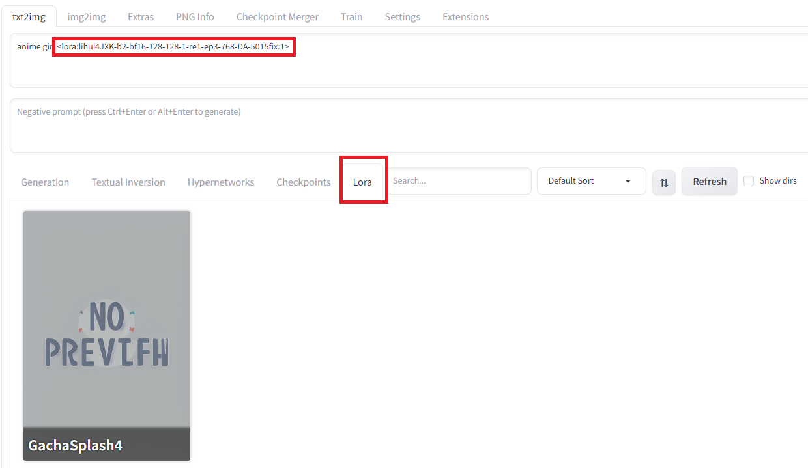

Generating an image in this state will output an image with *LoRA* applied.

Press enter or click to view image in full size


Results for the text prompt “anime girl” + LoRA

## Creation of LoRA models

There are two ways to create a *LoRA* by entering an image of a specific character: using *SdWebUITrainTools* or using *Kohys’s GUI*.

As an example, let’s generate a LoRA that generates images in the style of [Unity chan](https://unity-chan.com/), the Unity game engine mascot.

### Using SdWebUITrainTools

First install *SdWebUITrainTools* from the `Extensions` tab in StableDiffusionWebUI and enter the URL `https://github.com/liasece/sd-webui-train-tools`

[## GitHub — liasece/sd-webui-train-tools: The stable diffusion webui training aid extension helps you…

### The stable diffusion webui training aid extension helps you quickly and visually train models such as Lora.

github.com](https://github.com/liasece/sd-webui-train-tools?source=post_page-----5587901077b6---------------------------------------)

Press enter or click to view image in full size

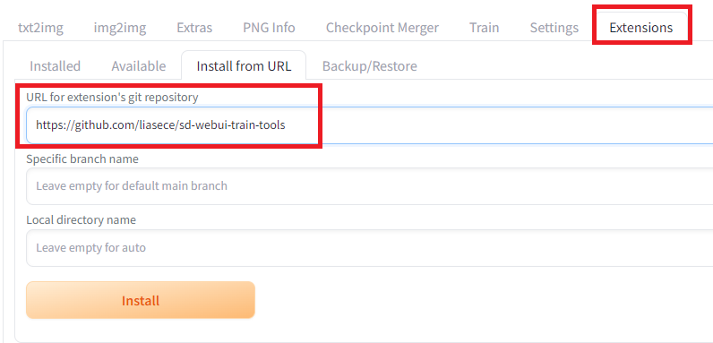

Installation of *SdWebUITrainTools*

After clicking `Apply and restart UI` in the `Installed` subtab, a new tab `Train Tools` should be available.

Press enter or click to view image in full size

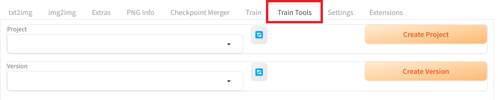

Create a new project and a new version, then download the `Unity-chan HD Image Pack Vol. 1` at the link below, that we’ll use for training. (© Unity Technologies Japan/UCL)

[## DATA DOWNLOAD-Guideline

### HOME DATA DOWNLOAD JP EN Created March 6, 2014 Revised ...

unity-chan.com](https://unity-chan.com/contents/guideline_en/?source=post_page-----5587901077b6---------------------------------------)

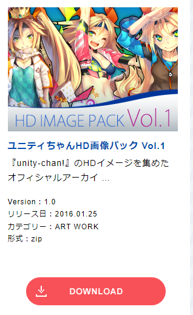

Dataset to download from the link above

Press enter or click to view image in full size


Files of the training dataset

Drop all images into the `Upload Dataset` section and click the `Update dataset` button. It is said that *LoRA* requires at least 20 images for training.

Press enter or click to view image in full size

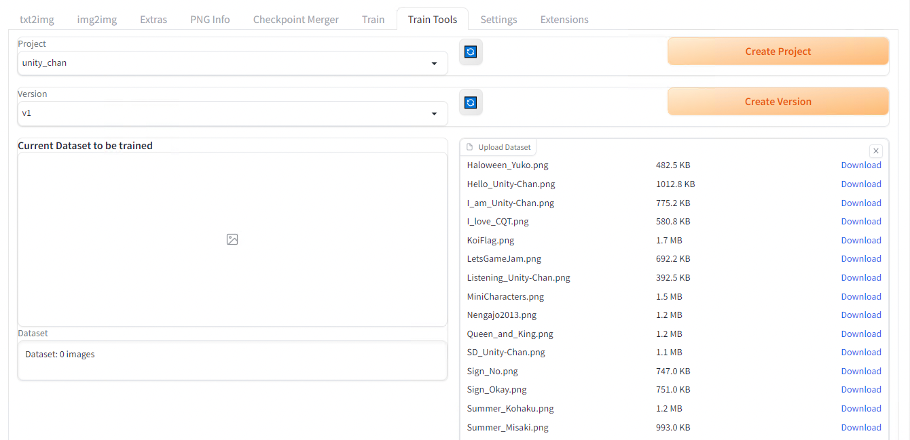

Choose a model in the `Train base model` dropdown, then click the `Begin train` button located below in the same page. The training takes about 2 hours with RTX3080.

Press enter or click to view image in full size

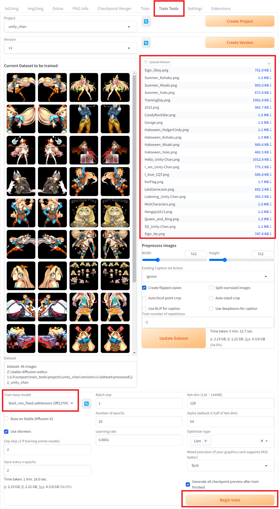

If you run into errors while running the training, please refer to the **Troubleshooting** section at the end of this article.

When complete, the *LoRA* file will be output in `stable-diffusion-webui\outputs\train_tools\projects`

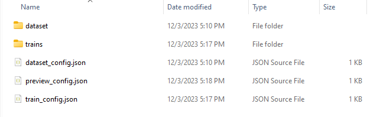

Press enter or click to view image in full size

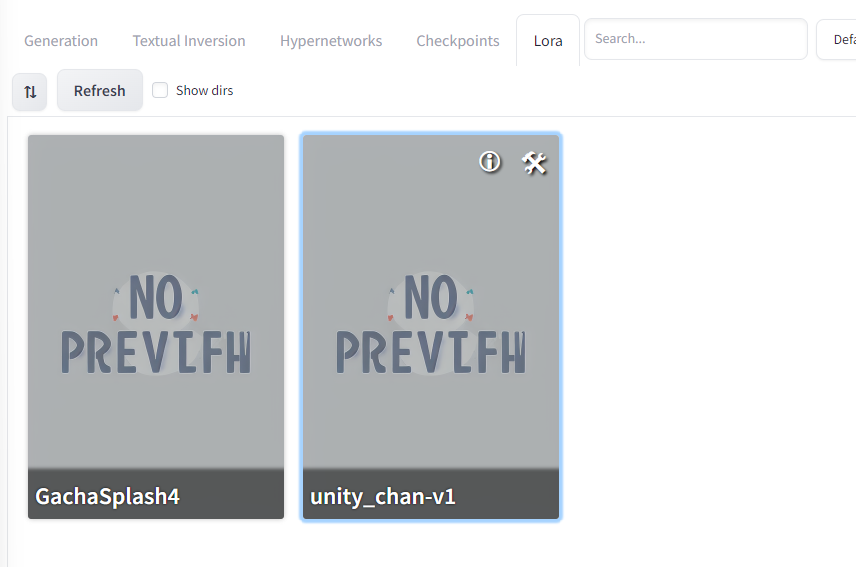

Copy the model you’d like to use to `stable-diffusion-webui/models/Lora` and after refreshing the *LoRA* model list we used earlier, select the newly added model. As we saw before, a tag `<lora:unity_chan-v1:1>` should be automatically added to your text prompt.

However when generating an image with it, we can see that the influence of the Unity-chan style is not obvious.

Press enter or click to view image in full size

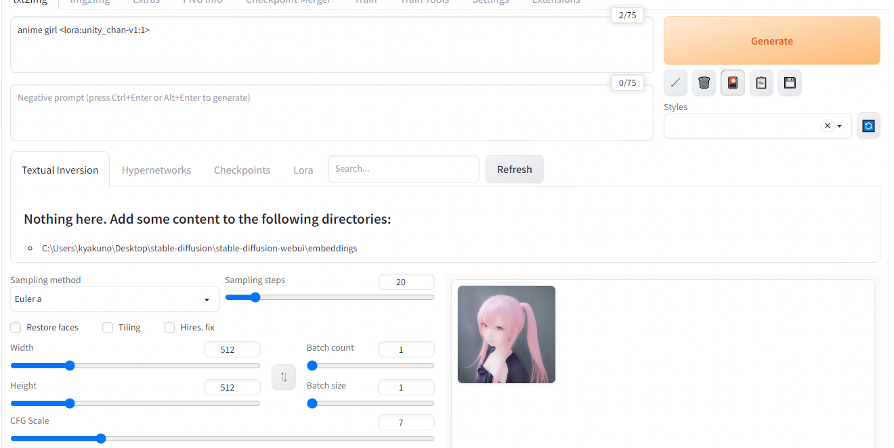

LoRA weigth = 1

This is because the default weigth of 1 is not strong enough, let’s try again with 1000.

Press enter or click to view image in full size

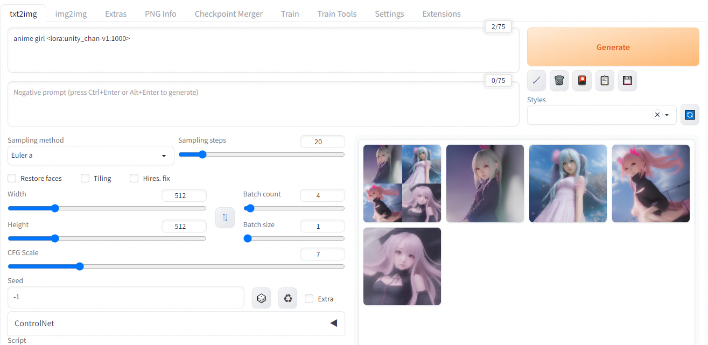

LoRA weigth = 1000

The new result is much better, showing UnityChan’s twin-tail and ribbon concepts have been acquired from the dataset.

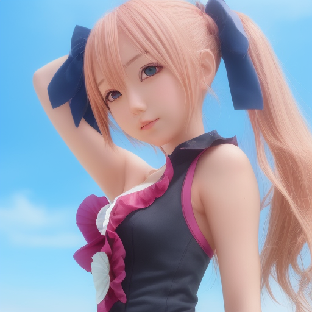

The next step to improve the result would be to work on the training dataset. The original dataset had many images that were not suited for the task, let’s remove them. Below is the new dataset and an example of generated image with this v2.

Press enter or click to view image in full size

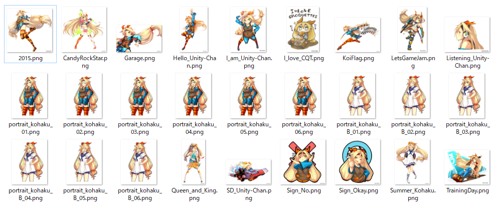

Dataset v2


Generation result v2

The reason why the result is not looking like an anime is probably due to the base model (`Basil_mix`) may be optimized for live-action. See the [previous article](/axinc-ai/generate-images-with-custom-poses-using-stablediffusionwebui-and-controlnet-c18d190cade1) to know more about this model. After replacing the model with `Anything-v4` more suited for anime character the result is much better.

[## andite/anything-v4.0 · Hugging Face

### Edit model card Fantasy.ai is the official and exclusive hosted AI generation platform that holds a commercial use…

huggingface.co](https://huggingface.co/andite/anything-v4.0?source=post_page-----5587901077b6---------------------------------------)

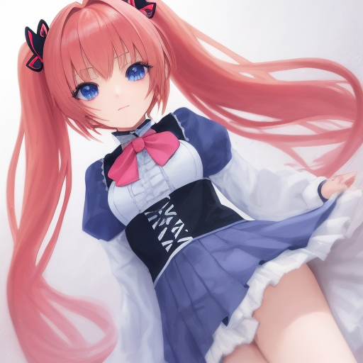

Generation of output with model v5

We now have an anime style but We’re still quite not there yet… It turns out generating images of a specific character can be greatly improved but describing the physical characteristics from the prompt as well as using a *LoRA*. Let’s enhance the prompt to describe Unity chan’s main features.

> 1 girl, yellow hair, twin tail, orange ribbon, blue head band, green eye, long hair

The result after that is much better.

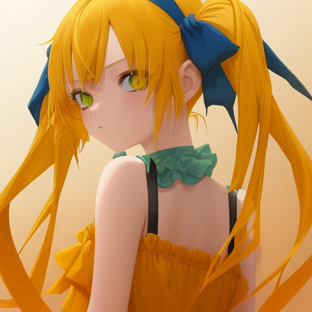

Generation of output with improved prompt

### Using Kohya’s GUI

Starting from the same dataset we had in the previous section.

Press enter or click to view image in full size

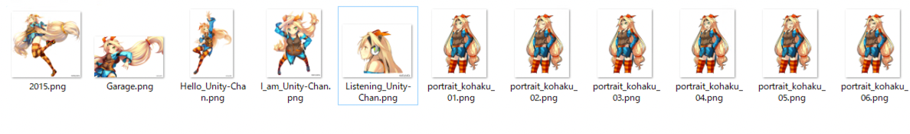

Training dataset

Install *Kohya’s GUI.*

```
git clone https://github.com/bmaltais/kohya_ss  
setup.bat  
gui-user.bat
```

[## GitHub - bmaltais/kohya\_ss

### This repository provides a Windows-focused Gradio GUI for Kohya's Stable Diffusion trainers. The GUI allows you to set…

github.com](https://github.com/bmaltais/kohya_ss?source=post_page-----5587901077b6---------------------------------------)

In the webUI, select `DreamboothLoRA`. In this case, since this is an animated image, specify `AnythingV4`.

Press enter or click to view image in full size

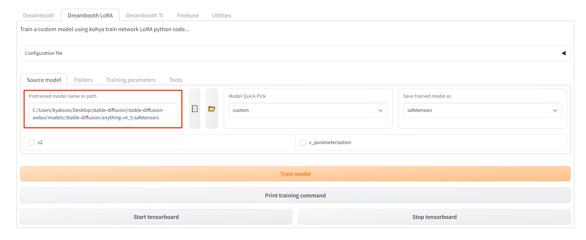

Model setting

Specify the folder of images to be trained on in `Folders` (the parent folderof the one containing images). The name of the folder will be the number of steps and the prompt for using the character. In this example, put the image in the folder named `20_unitychan`, and specify the destination folder in `Output`.

Press enter or click to view image in full size


Training dataset file structure

Press enter or click to view image in full size


Folder settings

Set `Epochs` to 5 in the settings.

Press enter or click to view image in full size

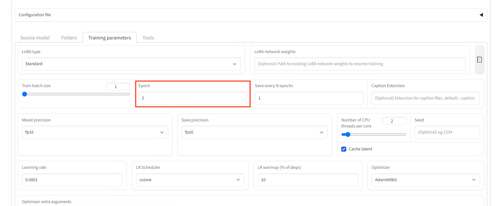

Set the number of epochs

Press the `Train model` button to start the training that takes about 10 minutes.

Copy the generated `last.safetensors` to `models/LoRA` in the *StableDiffusionWebUI* and follow the procedure for applying LoRA to generate the image. Specify the folder name `unitychan` in the prompt in reference to our folder name.

Press enter or click to view image in full size

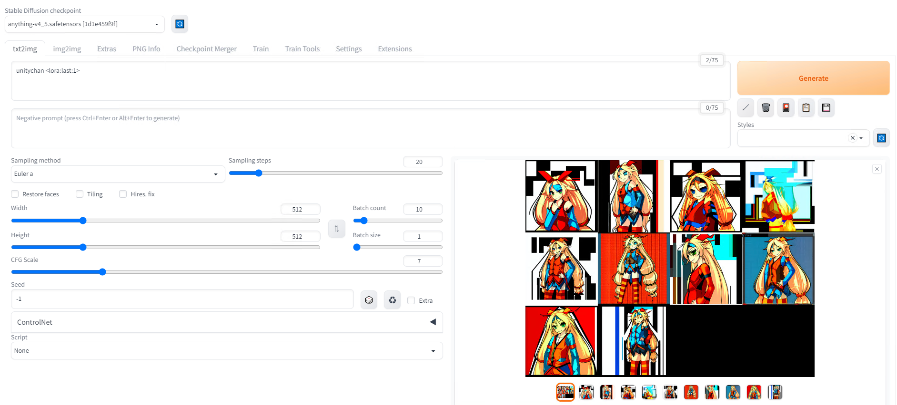

Generation prompt

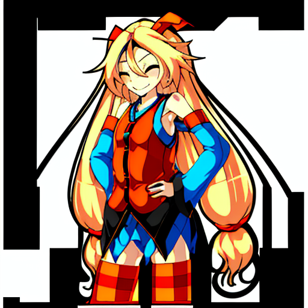

Generation result from the previous prompt

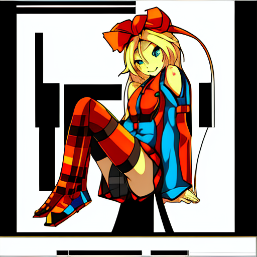

Generation result when combined with ControlNet pose control


Generation result with prompt “unity\_chan, on the beach”

## Troubleshooting (SdWebUITrainTools)

### Errors while training with SdWebUITrainTools

If you are using Python 3.9 instead of Python 3.10, you will get the following error:

> def readImages(inputPath: str, level: int = 0, include\_pre\_level: bool = False, endswith :str | list[str] = [“.png”,”.jpg”,”.jpeg”,”.bmp”,”.webp”]) -> list[Image.Image]:  
> TypeError: unsupported operand type(s) for |: ‘type’ and ‘types.GenericAlias’

This is because the operator `|` was added in Python 3.10. You will need to recreate the environment with [Python 3.10.9](https://www.python.org/downloads/release/python-3109/). To recreate the environment, install Python 3.10.9, delete the venv folder in the `stable-diffusion-webui` folder, and then run `webui.bat`.

[## CAN NOT find the training tool tab: TypeError: unsupported operand type(s) for |: · Issue #1 ·…

### You can’t perform that action at this time. You signed in with another tab or window. You signed out in another tab or…

github.com](https://github.com/liasece/sd-webui-train-tools/issues/1?source=post_page-----5587901077b6---------------------------------------)

### `ModuleNotFoundError: No module named ‘xformers.ops’; ‘xformers’ is not a package`

In case you run into the error `ModuleNotFoundError: No module named ‘xformers.ops’; ‘xformers’ is not a package` during training, you can apply the fix below.

[## Need help with updating xformers. (0.0.17 -> 0.0.20) · AUTOMATIC1111/stable-diffusion-webui ·…

### Hello! I recently updated my Automatic1111 via git pull to version 1.4.0 released earlier this week. The program runs…

github.com](https://github.com/AUTOMATIC1111/stable-diffusion-webui/discussions/11551?source=post_page-----5587901077b6---------------------------------------)

`xformers` should be enabled because disabling it makes the training consumes a lot of VRAM, resulting in `cudaOutOfMemory`.

## Troubleshooting (Kohya’s GUI)

### TypeError: argument of type ‘WindowsPath’ is not iterable

It seems that the `bitsandbytes` binary needs to be overwritten as shown below for Windows.

```
copy .\bitsandbytes_windows\*.dll .\venv\Lib\site-packages\bitsandbytes\  
copy .\bitsandbytes_windows\cextension.py .\venv\Lib\site-packages\bitsandbytes\cextension.py  
copy .\bitsandbytes_windows\main.py .\venv\Lib\site-packages\bitsandbytes\cuda_setup\main.py
```

[## failing to train LORA and getting these errors ( libcudart.so not found , 'WindowsPath' is not…

### hi, this is my 3rd clean install to kohya\_ss with all the requirements but still having the same problem... i have…

github.com](https://github.com/kohya-ss/sd-scripts/issues/195?source=post_page-----5587901077b6---------------------------------------)

### ModuleNotFoundError: No module named ‘xformers’

Newer `xformers 0.0.18` will cause the following error.

```
RuntimeError: xformers::efficient_attention_forward_cutlass() expected at most 8 argument(s) but received 13 argument(s). Declaration: xformers::efficient_attention_forward_cutlass(Tensor query, Tensor key, Tensor value, Tensor? cu_seqlens_q, Tensor? cu_seqlens_k, int? max_seqlen_q, bool compute_logsumexp, bool causal) -> (Tensor, Tensor)
```

You need to install `xformers 0.0.14`.

```
pip install -U -I --no-deps https://github.com/C43H66N12O12S2/stable-diffusion-webui/releases/download/f/xformers-0.0.14.dev0-cp310-cp310-win_amd64.whl
```

[## ModuleNotFoundError: No module named ‘xformers’ · Issue #420 · kohya-ss/sd-scripts

### I can’t train a model with LoRA… ….. [Dataset 0] loading image sizes…

github.com](https://github.com/kohya-ss/sd-scripts/issues/420?source=post_page-----5587901077b6---------------------------------------)

---

[ax Inc.](https://axinc.jp/en/) has developed [ailia SDK](https://ailia.jp/en/), which enables cross-platform, GPU-based rapid inference.

ax Inc. provides a wide range of services from consulting and model creation, to the development of AI-based applications and SDKs. Feel free to [contact us](https://axinc.jp/en/) for any inquiry.