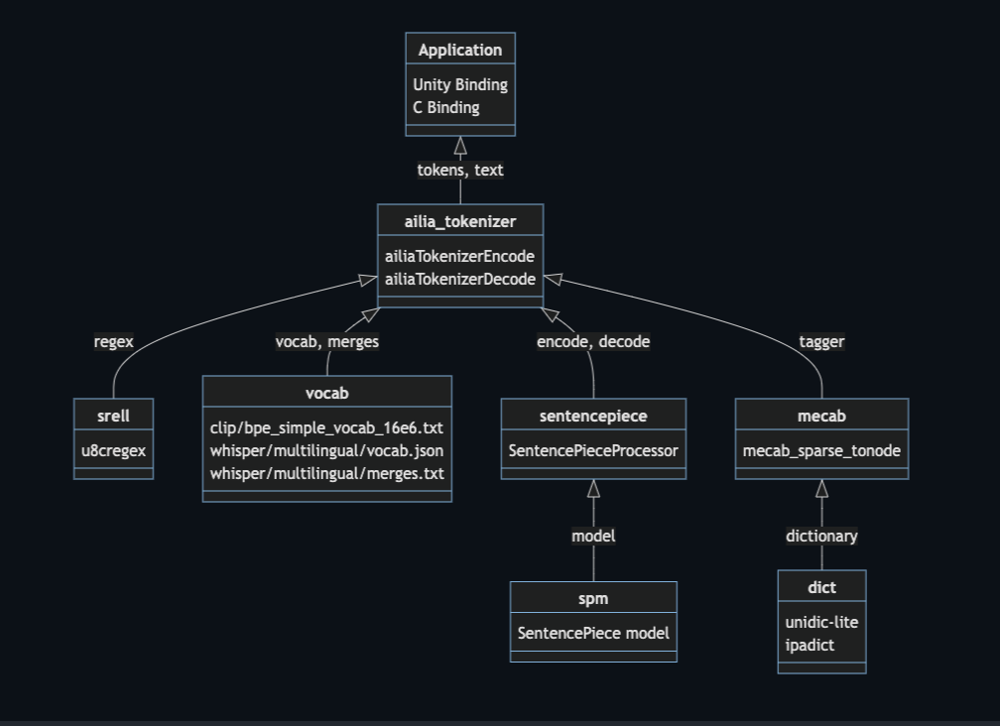

# ailia Tokenizer : NLP Tokenizer for Unity and C++

# ailia Tokenizer : NLP Tokenizer for Unity and C++

[](/@cochard-dav?source=post_page---byline--e8c3625f9877---------------------------------------)

[David Cochard](/@cochard-dav?source=post_page---byline--e8c3625f9877---------------------------------------)

6 min read

·

Dec 4, 2023

--

[Listen](/m/signin?actionUrl=https%3A%2F%2Fmedium.com%2Fplans%3Fdimension%3Dpost_audio_button%26postId%3De8c3625f9877&operation=register&redirect=https%3A%2F%2Fmedium.com%2Faxinc-ai%2Failia-tokenizer-nlp-tokenizer-for-unity-and-c-e8c3625f9877&source=---header_actions--e8c3625f9877---------------------post_audio_button------------------)

Share

Introducing *ailia Tokenizer*, a tokenizer for NLP that can be used from Unity or C++, without the need for an Python environment.

---

## Overview

A tokenizer is an API for converting text into tokens (sequences of symbols) that can be handled by AI models, and for converting tokens back into text.


ailia Tokenizer

[*Transformers* from *Pytorch*](https://pytorch.org/hub/huggingface_pytorch-transformers/#tokenizer)has usually been used for tokenization. However, *transformers* runs only in Python and cannot be tokenized from Android or iOS applications.

The *ailia Tokenizer* solves this problem by performing NLP tokenization without using Pytorch transformers, thus making it available on Android and iOS.

Since *ailia Tokenizer* encapsulates [*Mecab*](https://github.com/taku910/mecab) and [*SentencePiece*](https://github.com/google/sentencepiece), complex tokenization such as [*BERT Japanese*](https://huggingface.co/docs/transformers/model_doc/bert-japanese) can be done on the device.

## Usage examples

*ailia Tokenizer* allows cross-conversion between *Whisper*, *CLIP*, *XLMRoberta*, *Marian*, *BERT Japanese WordPiece*, and *BERT Japanese Character* text and tokens. Examples below tokenize Japanese words since this is our primary use case.

### Whisper

```
Text ハードウェア ソフトウェア  
Tokens [15927, 44165, 20745, 28571, 12817, 220, 42668, 17320, 7588, 20745, 28571, 12817]  
Text ハードウェア ソフトウェア
```

### CLIP

```
Text ハードウェア ソフトウェア  
Tokens [49406  2429   237 18584   231  3909    99  3909   100  3909   351  3909  
    121  2429   243 42384  3909    99  3909   100  3909   351 49407]  
Text <|startoftext|>ハードウェア ソフトウェア <|endoftext|>
```

[CLIP](/axinc-ai/clip-learning-transferable-visual-models-from-natural-language-supervision-4508b3f0ea46)’s tokenizer is compatible with [*StableDiffusion*](/axinc-ai/stablediffusion-machine-learning-model-to-generate-images-from-text-22034d9b44b7).

### XLMRoBERTa

```
Text This is a test.  
Tokens [   0, 3293,   83,   10, 3034,    5,    2]
```

*XLMRoberta*’s tokenizer is compatible with *SentenceTransformer*.

### Marian

```
Text "This is a cat."  
Tokens [183, 30, 15, 11126, 4, 0]
```

```
Tokens [32000,   517,  6044,    68,     6,     0]  
Text これは猫です。
```

*Marian*’s tokenizer is compatible with *FuguMT*.

### BERT Japanese WordPiece

```
Text 太郎は次郎が持っている本を花子に渡した。  
Words ['太郎', 'は', '次郎', 'が', '持っ', 'て', 'いる', '本', 'を', '花', '子', 'に', '渡し', 'た', '。']  
Tokens [5250, 9, 10833, 14, 1330, 16, 33, 108, 11, 1172, 462, 7, 9427, 10, 8]
```

*Mecab* and *ipadic* are used internally.

### BERT Japanese Character

```
Text 太郎は次郎が持っている本を花子に渡した。  
Words ['太', '郎', 'は', '次', '郎', 'が', '持', 'っ', 'て', 'い', 'る', '本', 'を', '花', '子', 'に', '渡', 'し', 'た', '。']  
Tokens [529, 644, 12, 357, 644, 20, 313, 30, 18, 19, 11, 77, 15, 814, 163, 8, 735, 16, 9, 10]
```

*Mecab* and *ipadic* are used internally.

## ailiaTokenizer API

Create an *ailia Tokenizer* instance pass it a UTF8 string as an argument to obtain the associated tokens.

**C++**

```
#include <stdio.h>  
#include <vector>  
#include <stdint.h>  
#include <stdlib.h>  
  
#include "ailia_tokenizer.h"  
  
int main(int argc, char *argv[]){  
 int32_t type = AILIA_TOKENIZER_TYPE_WHISPER;  
 printf("Tokenizer type %d\n", type);  
 AILIATokenizer *net;  
 ailiaTokenizerCreate(&net, type, AILIA_TOKENIZER_FLAG_NONE);  
 const char * text = u8"ハードウェア ソフトウェア";  
 printf("Input Text : %s\n", text);  
 ailiaTokenizerEncode(net, text);  
 unsigned int count;  
 ailiaTokenizerGetTokenCount(net, &count);  
 std::vector<int> tokens(count);  
 ailiaTokenizerGetTokens(net, &tokens[0], count);  
 ailiaTokenizerDecode(net, &tokens[0], count);  
 printf("Tokens : ");  
 for (int i = 0; i < count; i++){  
  printf("%d ", tokens[i]);  
 }  
 printf("\n");  
 unsigned int len;  
 ailiaTokenizerGetTextLength(net, &len);  
 std::vector<char> out_text(len);  
 char * p_text = &out_text[0];  
 ailiaTokenizerGetText(net, p_text, len);  
 printf("Output Text : %s\n", p_text);  
 return 0;  
}
```

**Unity**

```
AiliaTokenizerModel model = new AiliaTokenizerModel();  
model.Create(AiliaTokenizer.AILIA_TOKENIZER_TYPE_CLIP, AiliaTokenizer.AILIA_TOKENIZER_FLAG_UTF8_SAFE);  
string text = "ハードウェア ソフトウェア";  
int [] tokens = model.Encode(text);  
string decoded = model.Decode(tokens);  
model.Close();
```

Press enter or click to view image in full size


Unityでの実行例

## Loading Dictionnaries

For tokenizers other than *Whisper* and *Clip* that require an additional dictionary, load the dictionary after instantiation and before calling `ailiaTokenizerEncode`.

**C++**

```
if (type == AILIA_TOKENIZER_TYPE_BERT_JAPANESE_CHARACTER || type == AILIA_TOKENIZER_TYPE_BERT_JAPANESE_WORDPIECE){  
  status = ailiaTokenizerOpenDictionaryFile(net, "./dict/ipadic");  
  if (status != 0){  
   printf("ailiaTokenizerOpenDictionaryFile error %d\n", status);  
   return -1;  
  }  
  if (type == AILIA_TOKENIZER_TYPE_BERT_JAPANESE_CHARACTER){  
   status = ailiaTokenizerOpenVocabFile(net, "./test/gen/bert_japanese/vocab_character.txt");  
  }else{  
   status = ailiaTokenizerOpenVocabFile(net, "./test/gen/bert_japanese/vocab_wordpiece.txt");  
  }  
  if (status != 0){  
   printf("ailiaTokenizerOpenVocabFile error %d\n", status);  
   return -1;  
  }  
 }  
 if (type == AILIA_TOKENIZER_TYPE_MARIAN || type == AILIA_TOKENIZER_TYPE_XLM_ROBERTA){  
  if (type == AILIA_TOKENIZER_TYPE_MARIAN){  
   status = ailiaTokenizerOpenModelFile(net, "./test/gen/fugumt/source.spm");  
  }else{  
   status = ailiaTokenizerOpenModelFile(net, "./test/gen/sentence-transformer/sentencepiece.bpe.model");  
  }  
  if (status != 0){  
   printf("ailiaTokenizerOpenModelFile error %d\n", status);  
   return -1;  
  }  
 }
```

**Unity**

```
if (tokenizerModelType == TokenizerModels.sentence_transformer){  
   string model_path = "AiliaTokenizer/sentencepiece.bpe.model";  
   string asset_path = Application.streamingAssetsPath;  
  
   #if UNITY_ANDROID  
    CopyModelToTemporaryCachePath(model_path);  
    asset_path=Application.temporaryCachePath;  
   #endif  
   status = model.Open(model_path = asset_path+"/"+model_path);  
   if (status == false){  
    Debug.Log("Open error");  
    return;  
   }  
  }
```

## Architecture

*ailia Tokenizer* supports *BPE (Byte Pair Encoding)* tokenizer*, SentencePiece,* and *Mecab*.

Press enter or click to view image in full size



ailia Tokenizer Architecture

### BPE

*BPE (*Byte Pair Encoding*)* handles UTF8 strings directly in bytecode, more specifically elements called *bigrams* to represent character sequences, rather than words. For encoding, the string is divided by specific patterns such as a spaces, and the *bigrams* are constructed according to `merges.txt` which contains the list of merge operations learned during the training phase of the BPE algorithm. Additionally, `vocab.txt` plays a critical role as it provides the foundational set of tokens, including individual characters and basic symbols, which are used as the starting point for the encoding process and subsequent application of the merge rules.

The character encoding is UTF8 compatible, and [*srell*](https://www.akenotsuki.com/misc/srell/), which is UTF8 compatible, is used for regular expressions. *Whisper* and *CLIP*, which use BPE, encapsulate the dictionary in the binary, so tokenization can be performed without external files.

### SentencePiece

In models that use *SentencePiece*, they load a model in SPM (SentencePiece Model) format and perform encoding and decoding. In the case of *XLMRoBERTa*, the sequences of SPM are rearranged into FAIRSEQ format. In the case of *Marian*, an EOS (End Of Sentence) token is added at the end.

### Mecab

In models that use *Mecab*, they load a dictionary in *Mecab* format, then split text into words, followed by subword segmentation using *WordPiece* or *Character*, and perform encoding and decoding.

## Usage

*ailia Tokenizer* is used in *ailia AI Speech*, a speech recognition library using *Whisper*.

[## ailia AI Speech : Speech Recognition Library for Unity and C++

### Introducing ailia AI Speech, an AI speech recognition library which allows you to easily implement speech recognition…

medium.com](/axinc-ai/ailia-ai-speech-speech-recognition-library-for-unity-and-c-d29db1abe978?source=post_page-----e8c3625f9877---------------------------------------)

The output of *Whisper* is a sequence of tokens, which needs to be converted into UTF8 strings. During this process, it’s important to note that UTF8 includes surrogate pairs, where multiple bytes compose a single character. Therefore, the intermediate output from *Whisper* might result in strings that are invalid in UTF8. If you try to display these invalid UTF8 characters using Unity’s Text, the entire string might not be displayed properly.

In *ailia Tokenizer*, you can specify `AILIA_TOKENIZER_FLAG_UTF8_SAFE` to ensure that only valid UTF8 strings are outputted. Additionally, we have released an English-to-Japanese translation model using *ailia Tokenizer* and *FuguMT* on `ailia-models-cpp`.

[## ailia-models-cpp/fugumt/fugumt.cpp at master · axinc-ai/ailia-models-cpp

### C++ version of ailia models repository. Contribute to axinc-ai/ailia-models-cpp development by creating an account on…

github.com](https://github.com/axinc-ai/ailia-models-cpp/blob/master/fugumt/fugumt.cpp?source=post_page-----e8c3625f9877---------------------------------------)

## Continuous improvement

We keep working on this library to add more features over time. New blog posts will be published for new releases as the product evolves such as the one below.

[## Released ailia Tokenizer 1.3

### We have released ailia Tokenizer 1.3, which enables mutual conversion between text and tokens. We have also introduced…

medium.com](/axinc-ai/released-ailia-tokenizer-1-3-e24c2068607a?source=post_page-----e8c3625f9877---------------------------------------)

## Download ailia Tokenizer

An evaluation version of *ailia Tokenizer* can be downloaded from

[## AILIA-TOKENIZER Download

axip-console.appspot.com](https://axip-console.appspot.com/trial/terms/AILIA-TOKENIZER?source=post_page-----e8c3625f9877---------------------------------------)

The API documentation is below.

**C++ API**

[## ailia\_tokenizer: ailia Tokenizer SDK Document

axinc-ai.github.io](https://axinc-ai.github.io/ailia-sdk/supplemental/tokenizer/cpp/en/?source=post_page-----e8c3625f9877---------------------------------------)

**Unity API**

[## ailia\_tokenizer: ailia Tokenizer Unity Plugin Document

axinc-ai.github.io](https://axinc-ai.github.io/ailia-sdk/supplemental/tokenizer/unity/en/?source=post_page-----e8c3625f9877---------------------------------------)

---

[ax Inc.](https://axinc.jp/en/) has developed [ailia SDK](https://ailia.jp/en/), which enables cross-platform, GPU-based rapid inference.

ax Inc. provides a wide range of services from consulting and model creation, to the development of AI-based applications and SDKs. Feel free to [contact us](https://axinc.jp/en/) for any inquiry.