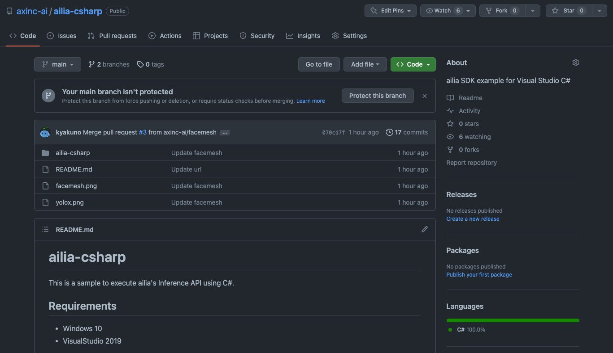
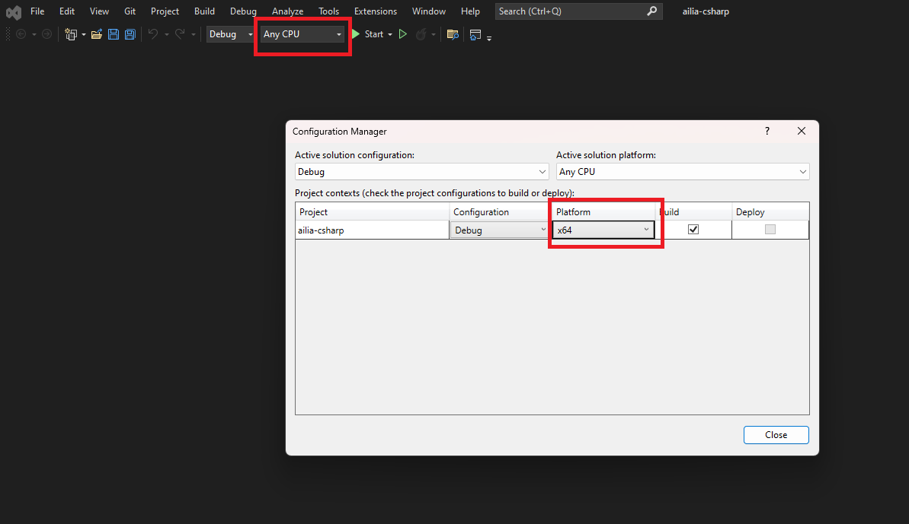

# ailia SDK Tutorial (C#)

# ailia SDK Tutorial (C#)

[David Cochard](/@cochard-dav?source=post_page---byline--e31262697300---------------------------------------)

3 min read

·

Dec 6, 2023

--

[Listen](/m/signin?actionUrl=https%3A%2F%2Fmedium.com%2Fplans%3Fdimension%3Dpost_audio_button%26postId%3De31262697300&operation=register&redirect=https%3A%2F%2Fmedium.com%2Faxinc-ai%2Failia-sdk-tutorial-c-e31262697300&source=---header_actions--e31262697300---------------------post_audio_button------------------)

Share

This article explains how to use [ailia SDK](https://ailia.jp/en/) from Visual Studio and C#, making it possible to easily incorporate AI features into applications developed in C#.

---

## Download Project Files

Samples using ailia SDK from Visual Studio and C# are available on github below.

<https://github.com/axinc-ai/ailia-csharp>

Press enter or click to view image in full size

ailia-csharp repository

## Download ailia SDK

The DLLs needed for running C# samples can be found in the ailia SDK that you can download from the link below.

[## ax Inc.

### A future in which all devices carry AI We believe such a future is on the way. To usher in that day, we will keep…

axinc.jp](https://axinc.jp/en/trial/?source=post_page-----e31262697300---------------------------------------)

## Build Project

Open the project`ailia-csharp.sln`, change the `Active Platform` from `Any CPU` to `x64` and build.

Press enter or click to view image in full size

Visual Studio platform settings

Copy `ailia.dll` included in ailia SDK to `/ailia-csharp/ailia-csharp/bin/x64/Debug.`For trial versions of ailia SDK, you also need to copy the license file in the same folder.

## Run Samples

The sample shows CPU inference of the object detection model [YOLOX](/axinc-ai/yolox-object-detection-model-exceeding-yolov5-d6cea6d3c4bc) and the face detection [FaceMesh](/axinc-ai/facemesh-detecting-key-points-on-faces-in-real-time-977c03f1bab).

Press enter or click to view image in full size

YOLOX sample

Press enter or click to view image in full size

FaceMesh sample

To perform inference on the GPU, copy not only `ailia.dll` but also `ailia_vulkan.dll` and set the `gpu_mode` variable in `AiliaYoloxSample.cs` and `AiliaFaceMeshSample.cs` to `true`.

## Difference between C# for Unity and C# for Visual Studio

### API

The C# LowLevel API and Model Class provided for Unity in the Alia SDK can be used in Visual Studio without modification.

[## ailia SDK Tutorial (Unity)

### Here is a tutorial on using ailia SDK in Unity, a fast way to perform deep learning inference using Unity with the GPU.

medium.com](/axinc-ai/ailia-sdk-tutorial-unity-54f2a8155b8f?source=post_page-----e31262697300---------------------------------------)

[## ailia: ailia Unity Plugin Document

axinc-ai.github.io](https://axinc-ai.github.io/ailia-sdk/api/unity/en/?source=post_page-----e31262697300---------------------------------------)

### C# Interfaces

The interface definition files for Unity included in the ailia SDK without modification in Visual Studio C# projects. You can find those in the sample project below.

[## ailia-csharp/ailia-csharp/ailia-csharp/ailia at main · axinc-ai/ailia-csharp

### ailia SDK example for Visual Studio C#. Contribute to axinc-ai/ailia-csharp development by creating an account on…

github.com](https://github.com/axinc-ai/ailia-csharp/tree/main/ailia-csharp/ailia-csharp/ailia?source=post_page-----e31262697300---------------------------------------)

### Compatilibity with Unity-specific Types

ailia’s interface definition for Unity uses the `UnityEngine` namespace and some non-standard C# functions such as `Debug`, `Color32`, `Vector2`, and `Mathf`. The file `AiliaMigrattion.cs` is provided to define these functions.

[## ailia-csharp/ailia-csharp/ailia-csharp/ailia/AiliaMigration.cs at main · axinc-ai/ailia-csharp

### ailia SDK example for Visual Studio C#. Contribute to axinc-ai/ailia-csharp development by creating an account on…

github.com](https://github.com/axinc-ai/ailia-csharp/blob/main/ailia-csharp/ailia-csharp/ailia/AiliaMigration.cs?source=post_page-----e31262697300---------------------------------------)

### Order of Images

Unity handles images in B2T (Bottom To Top) but the C# Bitmap class uses T2B (Top to Bottom), so it must be flipped upside down to be handled in the ailia SDK sample for Unity.

### About ailia MODELS Unity

Since the code in [ailia MODELS Unity](https://github.com/axinc-ai/ailia-models-unity) depends on the Unity renderer and textures, the renderer part must be replaced with Bitmap Graphics and the textures with Bitmap. The C# sample project provided versions of YOLOX and FaceMesh with the renderer replaced with Graphics, so you can refer to the rewritten parts.

---

[ax Inc.](https://axinc.jp/en/) has developed the ailia SDK, which enables cross-platform, GPU-based rapid inference. ax Inc. provides a wide range of services from consulting, model creation, SDK provision of SDKs, development of AI-based applications and systems, to support Please feel free to [contact us](https://docs.google.com/forms/d/e/1FAIpQLSdZNX-_Z5NJD8qNLOWsiNaPocOMUEfezwfhEusb_C83WeljwA/viewform) as we offer a total solution for.