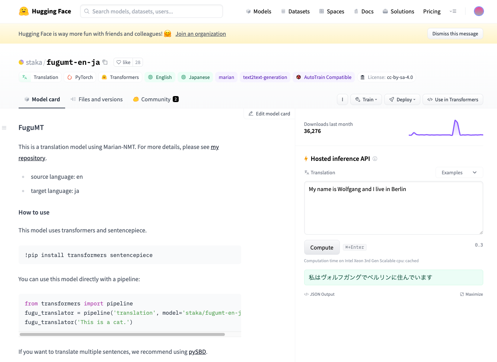

# FuguMT : Machine Learning Model for English to Japanese Translation

# FuguMT : Machine Learning Model for English to Japanese Translation

[](/@cochard-dav?source=post_page---byline--0ac47b924244---------------------------------------)

[David Cochard](/@cochard-dav?source=post_page---byline--0ac47b924244---------------------------------------)

3 min read

·

Dec 10, 2023

--

1

[Listen](/m/signin?actionUrl=https%3A%2F%2Fmedium.com%2Fplans%3Fdimension%3Dpost_audio_button%26postId%3D0ac47b924244&operation=register&redirect=https%3A%2F%2Fmedium.com%2Faxinc-ai%2Ffugumt-machine-learning-model-for-english-to-japanese-translation-0ac47b924244&source=---header_actions--0ac47b924244---------------------post_audio_button------------------)

Share

This is an introduction to「FuguMT」, a machine learning model that can be used with [ailia SDK](https://ailia.jp/en/). You can easily use this model to create AI applications using [ailia SDK](https://ailia.jp/en/) as well as many other ready-to-use [ailia MODELS](https://github.com/axinc-ai/ailia-models).

---

## Overview

*FuguMT* is a language model for Japanese translation based on [MarianMT](https://marian-nmt.github.io/), a framework developed by *Microsoft* for machine translation. *FuguMT* is able to translate English text to Japanese, under a CC-BY-SA-4.0 license.

Press enter or click to view image in full size



FuguMT

[## staka/fugumt-en-ja · Hugging Face

### This is a translation model using Marian-NMT. For more details, please see my repository. source…

huggingface.co](https://huggingface.co/staka/fugumt-en-ja?source=post_page-----0ac47b924244---------------------------------------)

[## GitHub — s-taka/fugumt

github.com](https://github.com/s-taka/fugumt?source=post_page-----0ac47b924244---------------------------------------)

## Dataset

The *FuguMT* training data can be found in the blog below (Japanese only). The dataset contains about 6.6 million bilingual pairs (Japanese: 690MB English: 610MB, about 100 million words), and the training was conducted for about 30 hours using *Marian-NMT + SentencePiece* on AWS `p3.2xlarge`.

[## ぷるーふおぶこんせぷと

### 英文を日本語訳するニューラル機械翻訳モデルをCC BY-SA 4.0で公開した。 以前の記事 で紹介した手法を用い昨年11月に構築したモデルである 性能はそこそこ（後述）。構築手法は本格的（Marian-NMT[1]を用いた…

staka.jp](https://staka.jp/wordpress/?p=413&source=post_page-----0ac47b924244---------------------------------------)

The BLEU (BiLingual Evaluation Understudy) score is 31.65, higher than GPT3.5’s 27.04 and GPT4’s 29.66.

[## ぷるーふおぶこんせぷと

### GPT-4の翻訳性能を外務省WEBサイトのテキスト（日本語/英語）を用いて定量的[1]に測ってみた。…

staka.jp](https://staka.jp/wordpress/?p=731&source=post_page-----0ac47b924244---------------------------------------)

## Architecture

*FuguMT* is a transformer-based *Sequence2Sequence* model. The output can be obtained one token at a time by iterating through the decoder.

Decoder inputs are `input_ids`, `attention_mask`, `decoder_input_ids`, and `past_key_values[25]`. `input_ids` are the input token sequence, `attention_mask` is a vector of 1s, `decoder_input_ids` are the token IDs from the previous iteration (`pad=32000` initially), and `past_key_values` are internal states of size `(beam_size, 8, 0, 64)`, with the ‘0’ part increasing with each inference.

The decoder outputs logits and `past_key_values[25]`, where logits are 32001-dimensional, containing the probability of each token. Text is determined via beam search based on logits. In the Python version, the default `beam_size` is 12.

The tokenizer used is *MarianTokenizer*, which is a *SentencePiece* model, employing English source and Japanese target models for input and output, respectively.

## Usage (Python)

To use *FuguMT* from ailia SDK in Python, use the following command

```
$ python3 fugumt-en-ja.py --input "This is a cat."
```

The output translation woule be:

```
translation_text: これは猫です。
```

[## ailia-models/natural\_language\_processing/fugumt-en-ja at master · axinc-ai/ailia-models

### Text (English) to translate This is a cat. Translated (Japanese) text translation\_text: これは猫です。 This model requires…

github.com](https://github.com/axinc-ai/ailia-models/tree/master/natural_language_processing/fugumt-en-ja?source=post_page-----0ac47b924244---------------------------------------)

## Usage (C++)

A sample of using *FuguMT* in C++ with [*ailia Tokenizer*](/axinc-ai/ailia-tokenizer-nlp-tokenizer-for-unity-and-c-e8c3625f9877) is also available below.

Below is the build process and a running sample.

```
cd fugumt  
export AILIA_LIBRARY_PATH=../ailia/library  
export AILIA_TOKENIZER_PATH=../ailia_tokenizer/library  
cmake .  
make  
./fugumt.sh
```

```
env_id : 0 type : 0 name : CPU  
env_id : 1 type : 1 name : CPU-AppleAccelerate  
env_id : 2 type : 2 name : MPSDNN-Apple M1 Max (Warning : FP16 backend is not worked this model)  
you can select environment using -e option  
selected env name : CPU-AppleAccelerate  
Input : This is a cat.  
Input Tokens :  
183 30 15 11126 4 0   
Output : これは猫です  
Output Tokens :  
517 6044 68 0   
Program finished successfully.
```

[## ailia-models-cpp/fugumt at master · axinc-ai/ailia-models-cpp

### C++ version of ailia models repository. Contribute to axinc-ai/ailia-models-cpp development by creating an account on…

github.com](https://github.com/axinc-ai/ailia-models-cpp/tree/master/fugumt?source=post_page-----0ac47b924244---------------------------------------)

---

[ax Inc.](https://axinc.jp/en/) has developed [ailia SDK](https://ailia.jp/en/), which enables cross-platform, GPU-based rapid inference.

ax Inc. provides a wide range of services from consulting and model creation, to the development of AI-based applications and SDKs. Feel free to [contact us](https://axinc.jp/en/) for any inquiry.