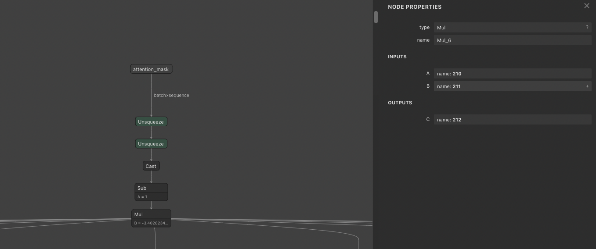

# Run BERT ONNX model in FP16

# Run BERT ONNX model in FP16

[](/@cochard-dav?source=post_page---byline--0256a0e0a558---------------------------------------)

[David Cochard](/@cochard-dav?source=post_page---byline--0256a0e0a558---------------------------------------)

4 min read

·

Dec 11, 2023

--

[Listen](/m/signin?actionUrl=https%3A%2F%2Fmedium.com%2Fplans%3Fdimension%3Dpost_audio_button%26postId%3D0256a0e0a558&operation=register&redirect=https%3A%2F%2Fmedium.com%2Faxinc-ai%2Frun-bert-onnx-model-in-fp16-0256a0e0a558&source=---header_actions--0256a0e0a558---------------------post_audio_button------------------)

Share

When exporting BERT to ONNX, there are cases where inferences cannot be made in FP16. This section explains how to investigate the cause of such cases and how to correct the problem so that inference can be performed.

---

## Overview

*BERT* is a model for natural language processing (aka. NLP). Using transfer learning on the original model which was trained on big data, it is possible to do a wide variety of natural language tasks with small amounts of data.

[## BERT : A Machine Learning Model for Efficient Natural Language Processing

### This is an introduction to「BERT」, a machine learning model that can be used with ailia SDK. You can easily use this…

medium.com](/axinc-ai/bert-a-machine-learning-model-for-efficient-natural-language-processing-aef3081c24e8?source=post_page-----0256a0e0a558---------------------------------------)

## Convert BERT to ONNX

BERT can be converted to ONNX by using `convert_graph_to_onnx.py` included in Hugging Face’s `Transformers` repository.

[## transformers/src/transformers/convert\_graph\_to\_onnx.py at main · huggingface/transformers

### 🤗 Transformers: State-of-the-art Machine Learning for Pytorch, TensorFlow, and JAX. …

github.com](https://github.com/huggingface/transformers/blob/main/src/transformers/convert_graph_to_onnx.py?source=post_page-----0256a0e0a558---------------------------------------)

```
python3 convert_graph_to_onnx.py — framework pt — model cl-tohoku/bert-base-japanese-whole-word-masking ./work/bert-base-japanese-whole-word-masking.onnx — pipeline fill-mask
```

## Conversion Issues

Converting *BERT* to ONNX in *Transformers* 4.29.2 results in successful inference on FP32, but incorrect output on FP16.

FP32 inference results:

```
INFO bert_maskedlm.py (82) : Input text : I [MASK] money to live.  
INFO bert_maskedlm.py (85) : Tokenized text : ['I', '[MASK]', 'money', 'to', 'live', '.']  
INFO bert_maskedlm.py (97) : Indexed tokens : [1007, 4, 87, 352, 17, 167, 66, 10]  
INFO bert_maskedlm.py (112) : Predicting...  
INFO bert_maskedlm.py (126) : Predictions :   
INFO bert_maskedlm.py (130) : 0 need  
INFO bert_maskedlm.py (130) : 1 use  
INFO bert_maskedlm.py (130) : 2 make  
INFO bert_maskedlm.py (130) : 3 have  
INFO bert_maskedlm.py (130) : 4 earn
```

FP16 inference results

```
INFO bert_maskedlm.py (82) : Input text : I [MASK] money to live.  
INFO bert_maskedlm.py (85) : Tokenized text : ['I', '[MASK]', 'money', 'to', 'live', '.']  
INFO bert_maskedlm.py (97) : Indexed tokens : [1007, 4, 87, 352, 17, 167, 66, 10]  
INFO bert_maskedlm.py (112) : Predicting...  
INFO bert_maskedlm.py (126) : Predictions :   
INFO bert_maskedlm.py (130) : 0 [CLS]  
INFO bert_maskedlm.py (130) : 1 [MASK]  
INFO bert_maskedlm.py (130) : 2 [PAD]  
INFO bert_maskedlm.py (130) : 3 [UNK]  
INFO bert_maskedlm.py (130) : 4 [SEP]
```

## Identifying the cause

ailia SDK allows you to dump all tensor values, not just the ones used as input or output. To investigate this kind of issue, print all tensor values to see which layers cause incorrect output. Since `get_blob_data` throws an error for tensors that have disappeared due to optimization, we catch these with an exception.

```
for i in range(0,ailia_model.get_blob_count()):  
        try:  
            data = ailia_model.get_blob_data(i)  
            print("Idx", i, ailia_model.get_blob_name(i), data)  
        except:  
            continue
```

It becomes apparent that from `Blob 212` in `Index 7`, the value turns into NaN (Not a Number).

```
Idx.6 211 -3.4028235e+38  
Idx.7 212 [[[[nan nan nan nan nan nan]]]]
```

When checked with [*Netron*](/axinc-ai/visualizing-an-onnx-model-using-netron-49b845a3c5b9), it is found that the `Bias` from the `Mul` operator of the `attention_mask` is `-3.40e+38`, a value that cannot be represented in FP16, resulting in the output of `NaN` (Not a Number).

Press enter or click to view image in full size



Blob 212

Therefore, upon checking the Transformers’ issues on GitHub, it is noted that in the PR dated January 20, 2022, what was previously written as F-10000 (-1e4) has been corrected to write the maximum value of either FP16 or FP32.

[## Not use -1e4 as attn mask (#17306) · huggingface/transformers@d3cb288

### 🤗 Transformers: State-of-the-art Machine Learning for Pytorch, TensorFlow, and JAX. — Not use -1e4 as attn mask…

github.com](https://github.com/huggingface/transformers/commit/d3cb28886ac68beba9a6646b422a4d727b056c0c?source=post_page-----0256a0e0a558---------------------------------------)

This appears to have been incorporated for the improvement of fine-tuning accuracy in FP16.

[## Fix -1e4 as attn mask by ydshieh · Pull Request #17306 · huggingface/transformers

### What does this PR do? Fix the issues regarding -1e4 as attention mask. Fix #17215 #17121 #14859

github.com](https://github.com/huggingface/transformers/pull/17306?source=post_page-----0256a0e0a558---------------------------------------)

The original value of -10e4 seems to originate from *Google*’s original implementation of BERT.

```
IMO, the -10e4 comes from the original Google implementation of BERT and we just copied it everywhere. However I've now seen a couple of issues related to this.
```

[## A potential bug in ModuleUtilsMixin.get\_extended\_attention\_mask · Issue #14859 ·…

### Environment info transformers version: 4.13.0 Platform: Python version: 3.8.5 PyTorch version (GPU?): 1.10.0+cu102…

github.com](https://github.com/huggingface/transformers/issues/14859?source=post_page-----0256a0e0a558---------------------------------------)

## Fix the issue

Having identified the cause, we can modify `modeling_utils.py` to ensure that the `Bias` of `Mul` fits within FP16.

```
extended_attention_mask = (1.0 - extended_attention_mask) * -1e4#torch.finfo(dtype).min
```

By making the change and exporting, it has now become possible to perform correct inference even in FP16.

---

[ax Inc.](https://axinc.jp/en/) has developed [ailia SDK](https://ailia.jp/en/), which enables cross-platform, GPU-based rapid inference.

ax Inc. provides a wide range of services from consulting and model creation, to the development of AI-based applications and SDKs. Feel free to [contact us](https://axinc.jp/en/) for any inquiry.