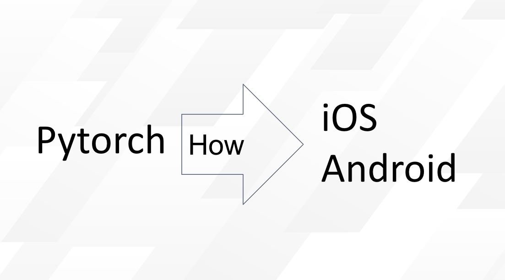
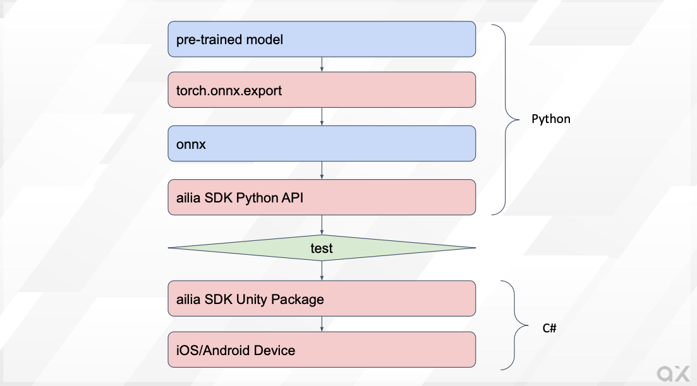

# Use AI Models Trained in Pytorch on iOS and Android

# Use AI Models Trained in Pytorch on iOS and Android

[](/@cochard-dav?source=post_page---byline--19526228214b---------------------------------------)

[David Cochard](/@cochard-dav?source=post_page---byline--19526228214b---------------------------------------)

5 min read

·

Dec 12, 2023

--

[Listen](/m/signin?actionUrl=https%3A%2F%2Fmedium.com%2Fplans%3Fdimension%3Dpost_audio_button%26postId%3D19526228214b&operation=register&redirect=https%3A%2F%2Fmedium.com%2Faxinc-ai%2Fuse-ai-models-trained-in-pytorch-on-ios-and-android-19526228214b&source=---header_actions--19526228214b---------------------post_audio_button------------------)

Share

This article explains how to use AI models trained with *Pytorch* on iOS and Android using the [ailia SDK](https://ailia.jp/en/).

Press enter or click to view image in full size



---

## Challenges of AI models on edge devices

Using an AI model that has been trained on a PC using *Pytorch* can present some challenges to use it on edge devices such as iPhone or Android, challenges that ailia SDK can help solving.

### Platform-specific frameworks

iOS devices usually run AI models using *CoreML* provided by *Apple*, while *Android* developers usually choose *TensorFlowLite*. Different APIs must be used for each platform and must be optimized for each.

ailia SDK is a unified framework that can run inference on Windows, macOS, Linux, iOS, and Android with a common API.

### Platform-specific languages

*ObjectiveC* or *Swift* must be used for iOS, and *Java* or *Kotlin* for Android, while ailia SDK is compatible with the Unity game engine and can be interacted with in C#, that can then be executed on both iOS and Android devices.

### Model conversion errors

When porting from *Pytorch* to a different framework, model conversion errors may occur. AI models have become increasingly complex in recent years, and are particularly prone to problems when using 5D tensors or in cases where the tensor shapes change dynamically from frame to frame.

With ailia SDK, common ONNX models can be used on PCs and smartphones without the need for model conversion. Therefore, if the model is confirmed to work on a PC, it is guaranteed to run on iOS and Android as is, without suffering from model conversion errors.

### GPU not available

The GPU delegate in *TensorFlowLite* has only a few supported layers, and as a result, GPUs often cannot be used efficiently on Android.

With ailia SDK, GPU inference is available in *Vulkan* for *Android*, and *Metal* is available for iOS as well as *CoreML*.

## Development flow using ailia SDK

After converting the Pytorch model to ONNX, you can start using it directly in Python to confirm that the inference is working properly. The next step is to use this same model in Unity and run the application on smartphones.

Press enter or click to view image in full size



ailia SDK development flow

### Convert Pytorch models to ONNX

Since ailia SDK uses the ONNX format, first convert the *Pytorch* model to ONNX using `torch.onnx.export`.

When the input has a fixed shape, it is possible to output ONNX by calling export with the torch model, argument`model` in the command below, and the input tensor, indicated by `x`, as arguments.

```
torch.onnx.export(model, x, 'output.onnx', verbose=False, opset_version=11)
```

If the shape of the input is specified dynamically, use `dynamic_axes`. In this example, two variables, `x1` and `x2`, are used as inputs, with `axis0` and `axis3` of `x1` being variable.

```
torch.onnx.export(model, (x1, x2), 'output.onnx', verbose=False, opset_version=11, input_names=["input1", "input2"], dynamic_axes={"input1": {0: "batch_size", 3:"samples"}})
```

### Inference from ONNX

The exported ONNX model can be tested using ONNX Runtime or ailia SDK.

With ONNX Runtime:

```
import onnxruntime  
model = onnxruntime.InferenceSession("input.onnx")  
output = model.run(None, {"input1":tensor.numpy()})[0]  
output = torch.from_numpy(output.astype(np.float32)).clone()
```

With ailia SDK

```
import ailia  
model = ailia.Net(None, "input.onnx")  
output = model.run({"input1":tensor.numpy()})[0]  
output = torch.from_numpy(output.astype(np.float32)).clone()
```

ailia SDK can be downloaded from the link below:

[## ax Inc.

### A future in which all devices carry AI We believe such a future is on the way. To usher in that day, we will keep…

axinc.jp](https://axinc.jp/en/trial/?source=post_page-----19526228214b---------------------------------------)

The Python environment to run ailia SDK can be easily setup with the following command:

```
cd ailia_sdk/python  
python3 bootstrap.py  
pip3 install .
```

If the test above did not reveal any issue, move on to device implementation.

### Inference from Unity

Import the Unity Package of ailia SDK into Unity. Place the converted ONNX files in the `StreamingAsstes` folder. An example inference code is shown below:

```
float [] infer(float [] input1){  
    // Open model file  
    AiliaModel model=new AiliaModel();  
#if UNITY_ANDROID  
    model.OpenFile(null,Application.temporaryCachePath+"/input.onnx");  
#else  
    model.OpenFile(null,Application.streamingAssetsPath+"/input.onnx");  
#endif  
  
    // Set input  
    Ailia.AILIAShape shape=new Ailia.AILIAShape();  
    shape.x=input1.Length;  
    shape.y=1;  
    shape.z=1;  
    shape.w=1;  
    shape.dim=4;  
    model.SetInputBlobShape(shape, model.FindBlobIndexByName("input1"));  
    model.SetInputBlobData(input1, model.FindBlobIndexByName("input1"));  
  
    // Infer  
    model.Update();  
  
    // Get output  
    Ailia.AILIAShape output_shape=model.GetOutputShape();  
    float [] output=new float[output_shape.x * output_shape.y * output_shape.z * output_shape.w];  
    model.GetBlobData(output,(int)model.GetOutputBlobList()[0]);  
    model.Close();  
    return output;  
}
```

For Android, copy the `StreamingAssets` file to `temporaryCachePath` since it is not directly accessible.

```
private void CopyModelToTemporaryCachePath (string file_name)  
{  
#if UNITY_ANDROID && !UNITY_EDITOR  
    string prefix="";  
#else  
    string prefix="file://";  
#endif  
  
    string path = prefix+Application.streamingAssetsPath + "/" + file_name;  
    string toPath = Application.temporaryCachePath + "/" + file_name;  
  
    Debug.Log("Copy "+path+" to "+toPath);  
  
    if (System.IO.File.Exists(toPath) == true)  
    {  
        FileInfo fileInfo = new System.IO.FileInfo(toPath);  
        if (fileInfo.Length != 0)  
        {  
            Debug.Log("Already exists : " + toPath + " " + fileInfo.Length);  
            return;  
        }  
    }  
  
    WWW www = new WWW(path);  
    while (!www.isDone)  
    {  
        // NOP.  
    }  
    File.WriteAllBytes(toPath, www.bytes);  
}
```

Finally deploy this Unity program to your smartphone for final testing.

## ailia SDK support libraries

### Overview

Pytorch models can be used with ailia SDK using the above procedure, however some features such as `torch_audio`, tokenizer of `Transformers` may be used, and those are only accessible from Python. This is where ailia SDK support libraries can help.

### ailia.audio

This library is equivalent to `torch_audio` and `librosa`. It supports mel-spectrum conversion of audio, etc.

[## GitHub — axinc-ai/ailia-audio-samples: ailia.audio samples of unity

### ailia.audio samples of unity. Contribute to axinc-ai/ailia-audio-samples development by creating an account on GitHub.

github.com](https://github.com/axinc-ai/ailia-audio-samples?source=post_page-----19526228214b---------------------------------------)

### ailia.tokenizer

This library is equivalent to tokenizer of `Transformers`. It can convert text into Japanese BERT tokens, etc.

[## ailia Tokenizer : NLP Tokenizer for Unity and C++

### Introducing ailia Tokenizer, a tokenizer for NLP that can be used from Unity or C++, without the need for an Python…

medium.com](/axinc-ai/ailia-tokenizer-nlp-tokenizer-for-unity-and-c-e8c3625f9877?source=post_page-----19526228214b---------------------------------------)

## Conclusion

By using ailia SDK and its support libraries, models trained with *Pytorch* can be easily run on edge devices. ax Inc. can assist you for any issues you might encounter. Feel free to [contact us](https://axinc.jp/en/) for any inquiry.

---

[ax Inc.](https://axinc.jp/en/) has developed [ailia SDK](https://ailia.jp/en/), which enables cross-platform, GPU-based rapid inference.

ax Inc. provides a wide range of services from consulting and model creation, to the development of AI-based applications and SDKs. Feel free to [contact us](https://axinc.jp/en/) for any inquiry.