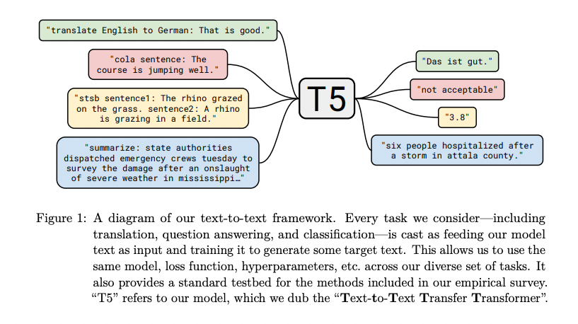
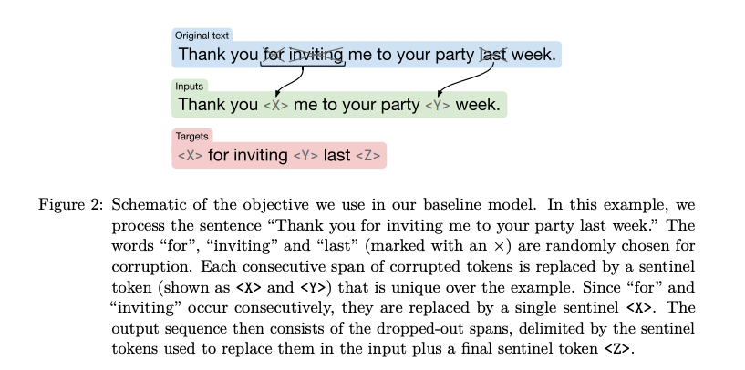
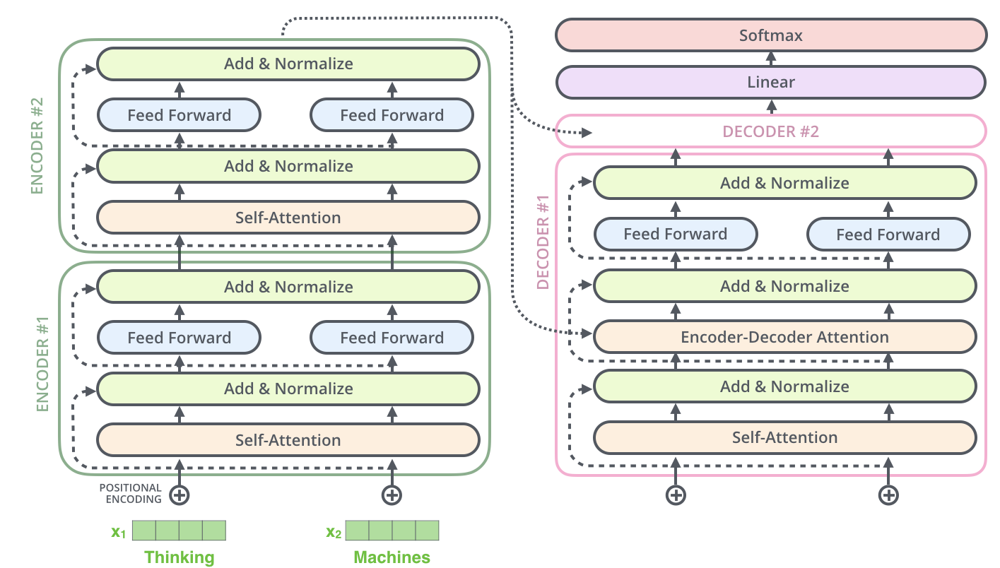

# T5 : Machine Learning Model to Generate Text From Text

# T5 : Machine Learning Model to Generate Text From Text

[](/@cochard-dav?source=post_page---byline--ba1f819facdc---------------------------------------)

[David Cochard](/@cochard-dav?source=post_page---byline--ba1f819facdc---------------------------------------)

3 min read

·

Dec 13, 2023

--

[Listen](/m/signin?actionUrl=https%3A%2F%2Fmedium.com%2Fplans%3Fdimension%3Dpost_audio_button%26postId%3Dba1f819facdc&operation=register&redirect=https%3A%2F%2Fmedium.com%2Faxinc-ai%2Ft5-machine-learning-model-to-generate-text-from-text-ba1f819facdc&source=---header_actions--ba1f819facdc---------------------post_audio_button------------------)

Share

This is an introduction to「T5」, a machine learning model that can be used with [ailia SDK](https://ailia.jp/en/). You can easily use this model to create AI applications using [ailia SDK](https://ailia.jp/en/) as well as many other ready-to-use [ailia MODELS](https://github.com/axinc-ai/ailia-models).

## Overview

T5 stands for *Text-to-Text Transfer Transformer*, a machine learning model that generates text from text release by *Google* in October 2019.

[## Exploring the Limits of Transfer Learning with a Unified Text-to-Text Transformer

### Transfer learning, where a model is first pre-trained on a data-rich task before being fine-tuned on a downstream task…

arxiv.org](https://arxiv.org/abs/1910.10683?source=post_page-----ba1f819facdc---------------------------------------)

While the traditional [BERT](/axinc-ai/bert-a-machine-learning-model-for-efficient-natural-language-processing-aef3081c24e8) model predicts a single masked token from a sequence of tokens, T5 outputs text that includes multiple masked words from the token sequence. This enables fine-tuning for text generation tasks such as summarization.

## Architecture

T5 considers natural language processing to be a text-to-text task, taking text as input and generating text as output, inspired by other similar tasks such as Question Answering, Language Modeling, and Span Extraction.

Press enter or click to view image in full size



T5 overview (Source: <https://arxiv.org/pdf/1910.10683.pdf>)

During training, specific words are masked, and the text that predicts these masked words is used as the training data.

Press enter or click to view image in full size



T5 training (Source: <https://arxiv.org/pdf/1910.10683.pdf>)

T5 has a general transformer encoder and decoder structure.

Press enter or click to view image in full size



T5 structure (Source: <http://jalammar.github.io/illustrated-transformer/>)

## T5 tokenizer

The tokenizer for T5 uses *SentencePiece*, which encode using *SentencePieceProcessor* after splitting the text with *SpecialTokens*.

[## transformers/src/transformers/models/t5/tokenization\_t5.py at main · huggingface/transformers

### 🤗 Transformers: State-of-the-art Machine Learning for Pytorch, TensorFlow, and JAX. …

github.com](https://github.com/huggingface/transformers/blob/main/src/transformers/models/t5/tokenization_t5.py?source=post_page-----ba1f819facdc---------------------------------------)

## T5 accuracy evaluation

For the accuracy evaluation of the T5 summarization model, ROUGE ([Recall-Oriented Understudy for Gisting Evaluation)](https://aclanthology.org/W04-1013.pdf) can be used. ROUGE is an accuracy evaluation based on Precision and Recall, calculating how much of the generated words are included in the training data as Precision, and how much of the generated summary is included in the training data as Recall, then computing the F1 score. The concept is similar to the mAP (mean Average Precision) used in Object Detection.

## Examples of T5 execution

T5 can be used for many text-generation tasks. Let’s for example run it on the text of the medium article you’re currently reading up to this point and ask T5 to generate a title for it.

> T5 — A Machine Learning Model for AI Applications

Pretty straightforward, now let’s ask for a summary of the article.

> T5 is a machine learning model that can be used with ailia SDK to create AI applications. T5 considers natural language processing to be a text-to-text task, taking text as input and generating text as output. The tokenizer for T5 uses SentencePiece. For the accuracy evaluation of the T5 summarization model, ROUGE is used.

## T5 with Japanese language support

A well-known T5 that supports Japanese is `sonoisa/t5-base-japanese,` which base model is available on Hugging Face.

[## sonoisa/t5-base-japanese · Hugging Face

### We’re on a journey to advance and democratize artificial intelligence through open source and open science.

huggingface.co](https://huggingface.co/sonoisa/t5-base-japanese?source=post_page-----ba1f819facdc---------------------------------------)

In May 2023, `small`, `base`, `large`, and `xl` models have also been released.

[## 日本語T5モデルの公開｜株式会社レトリバ

### Chief Research Officerの西鳥羽(https://twitter.com/jnishi)です。日本語データによる学習を行ったT5モデルを公開いたしました。Huggingface…

note.com](https://note.com/retrieva/n/n7b4186dc5ada?source=post_page-----ba1f819facdc---------------------------------------)

It is said that training of T5 on TPU pod v3–128 takes about 3 to 4 days and costs approximately 10,000$ in server expenses.

## Use T5 in ailia SDK

T5 models available in ailia SDK are fine tuned version for Japanese language. You can for example run the title generation model similarly to what we did earlier on an input file `input.txt,` by running the following command.

```
$ python3 t5_base_japanese_title_generation.py -i input.txt
```

[## ailia-models/natural\_language\_processing/t5\_base\_japanese\_title\_generation at master ·…

### The collection of pre-trained, state-of-the-art AI models for ailia SDK …

github.com](https://github.com/axinc-ai/ailia-models/tree/master/natural_language_processing/t5_base_japanese_title_generation?source=post_page-----ba1f819facdc---------------------------------------)

---

[ax Inc.](https://axinc.jp/en/) has developed [ailia SDK](https://ailia.jp/en/), which enables cross-platform, GPU-based rapid inference.

ax Inc. provides a wide range of services from consulting and model creation, to the development of AI-based applications and SDKs. Feel free to [contact us](https://axinc.jp/en/) for any inquiry.