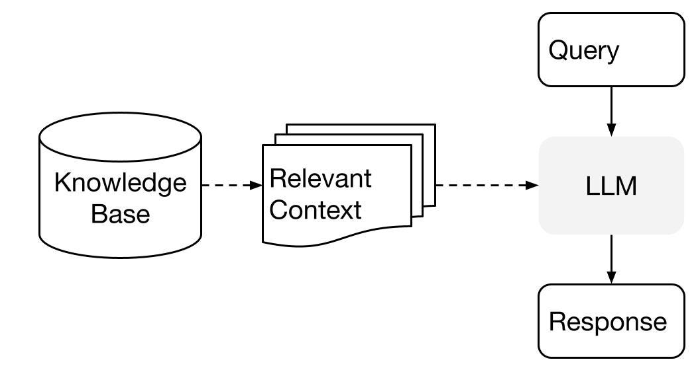

# Feed Any Document to ChatGPT Using LangChain

# Feed Any Document to ChatGPT Using LangChain

[](/@cochard-dav?source=post_page---byline--b290c59d1a7d---------------------------------------)

[David Cochard](/@cochard-dav?source=post_page---byline--b290c59d1a7d---------------------------------------)

3 min read

·

Dec 14, 2023

--

[Listen](/m/signin?actionUrl=https%3A%2F%2Fmedium.com%2Fplans%3Fdimension%3Dpost_audio_button%26postId%3Db290c59d1a7d&operation=register&redirect=https%3A%2F%2Fmedium.com%2Faxinc-ai%2Ffeed-any-document-to-chatgpt-using-langchain-b290c59d1a7d&source=---header_actions--b290c59d1a7d---------------------post_audio_button------------------)

Share

## Overview

Since *ChatGPT* cannot respond to data it has not been trained on, a method of extrapolating context has been developed. This method is called *RAG (Retrieval Augmented Generation)*, which involves inserting external text into the query and having the Large Language Model (LLM) generate an answer based on this augmented input.

Press enter or click to view image in full size



Source: <https://gpt-index.readthedocs.io/en/latest/getting_started/concepts.html>

By using *LangChain*, RAG can be easily implemented. It allows for the creation of an index from any document and allows you to ask queries based on the context of that document.

## Index creation

To create an index from a PDF, the following process is used. First, the PDF is loaded (the documentation of [ailia SDK](https://ailia.jp/en/) `AR02ALA_UM01_22E.pdf` in the example below), and text is generated. Then, the text is divided into semantically relevant chunks using *TextSplitter*. After that, embeddings are calculated and written to [*ChromaDB*](https://www.trychroma.com/), a local vector database.

```
from langchain.document_loaders import PDFMinerLoader  
  
loader = PDFMinerLoader("AR02ALA_UM01_22E.pdf")  
documents = loader.load()  
  
from langchain.text_splitter import RecursiveCharacterTextSplitter  
text_splitter = RecursiveCharacterTextSplitter(chunk_size=400, chunk_overlap=0)  
texts = text_splitter.split_documents(documents)  
  
from langchain.embeddings import OpenAIEmbeddings  
embeddings = OpenAIEmbeddings()  
  
from langchain.vectorstores import Chroma  
db = Chroma.from_documents(texts, embeddings, persist_directory="./storage")  
db.persist()
```

## Querying the index

To obtain answers from an index, load the index into *ChromaDB*, obtain a `retriever` instance, and generate answers using `RetrievalQA`.

In the example below, the `stuff` argument is specified as `chain_type` in `RetrievalQA`, which means no refinement is performed and all the documents are “stuffed” into the final prompt. This involves only one call to the language model, but in case we have too many documents, the documents may not fit inside the context window.

```
from langchain.embeddings import OpenAIEmbeddings  
embeddings = OpenAIEmbeddings()  
  
from langchain.vectorstores import Chroma  
db = Chroma(persist_directory="./storage", embedding_function=embeddings)  
retriever = db.as_retriever()  
  
from langchain.llms import OpenAI  
llm = OpenAI(model_name="text-davinci-003", temperature=0, max_tokens=500)  
  
from langchain.chains import RetrievalQA  
qa = RetrievalQA.from_chain_type(llm=llm, chain_type="stuff", retriever=retriever)  
  
import sys  
args = sys.argv  
if len(args) >= 2:  
 query = args[1]  
else:  
 query = "What operating systems does ailia SDK support?"  
answer = qa.run(query)  
  
print("Q:", query)  
print("A:", answer)
```

## Advanced features

### Streaming output

To use streaming output, give `streaming=True` to OpenAI and provide a custom callback handler.

```
llm = OpenAI(model_name="text-davinci-003", temperature=0, max_tokens=500,  streaming=True, callback_manager=CallbackManager([MyCustomCallbackHandler()]), )  
from langchain.chains import RetrievalQA  
qa = RetrievalQA.from_chain_type(llm=llm, chain_type="stuff", retriever=retriever)  
query = "What is ailia SDK?"  
answer = qa.run(query)
```

[## Custom callback handlers | 🦜️🔗 Langchain

### You can create a custom handler to set on the object as well. In the

python.langchain.com](https://python.langchain.com/docs/modules/callbacks/custom_callbacks?source=post_page-----b290c59d1a7d---------------------------------------)

### Register and filter multiple documents in ChromaDB

In the metadata’s sources of *ChromaDB*, filenames are included. By using the filtering `search_kwargs` as argument in `as_retriever`, it is possible to limit the search to specific documents only.

```
retriever = db.as_retriever(  
            search_kwargs={  
                "k": TOP_K,  
                "filter": {"source":filter}  
            })
```

## Troubleshooting

### Cannot install ChromaDB on macOS

The following error might occur when installing *ChromaDB* using *pip3* on Mac.

```
clang -Wno-unused-result -Wsign-compare -Wunreachable-code -fno-common -dynamic -DNDEBUG -g -fwrapv -O3 -Wall -iwithsysroot/System/Library/Frameworks/System.framework/PrivateHeaders -iwithsysroot/Applications/Xcode.app/Contents/Developer/Library/Frameworks/Python3.framework/Versions/3.9/Headers -arch arm64 -arch x86_64 -Werror=implicit-function-declaration -I/private/var/folders/_5/1td0d93j50j3h3l13x3tbczm0000gn/T/pip-build-env-g6zyba0j/overlay/lib/python3.9/site-packages/pybind11/include -I/private/var/folders/_5/1td0d93j50j3h3l13x3tbczm0000gn/T/pip-build-env-g6zyba0j/overlay/lib/python3.9/site-packages/numpy/core/include -I./hnswlib/ -I/Applications/Xcode.app/Contents/Developer/Library/Frameworks/Python3.framework/Versions/3.9/include/python3.9 -c ./python_bindings/bindings.cpp -o build/temp.macosx-10.9-universal2-3.9/./python_bindings/bindings.o -O3 -march=native -stdlib=libc++ -mmacosx-version-min=10.7 -DVERSION_INFO=\"0.7.0\" -std=c++14 -fvisibility=hidden  
  clang: error: the clang compiler does not support '-march=native'  
  error: command '/usr/bin/clang' failed with exit code 1
```

In such a case, the problem can be avoided by doing the following:

```
export HNSWLIB_NO_NATIVE=1
```

## Sample code

The sample code used in this article is available at the repository below.

[## GitHub — axinc-ai/langchain-sample

### Contribute to axinc-ai/langchain-sample development by creating an account on GitHub.

github.com](https://github.com/axinc-ai/langchain-sample?source=post_page-----b290c59d1a7d---------------------------------------)

---

[ax Inc.](https://axinc.jp/en/) has developed [ailia SDK](https://ailia.jp/en/), which enables cross-platform, GPU-based rapid inference.

ax Inc. provides a wide range of services from consulting and model creation, to the development of AI-based applications and SDKs. Feel free to [contact us](https://axinc.jp/en/) for any inquiry.