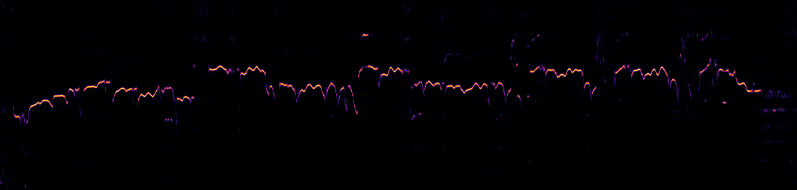
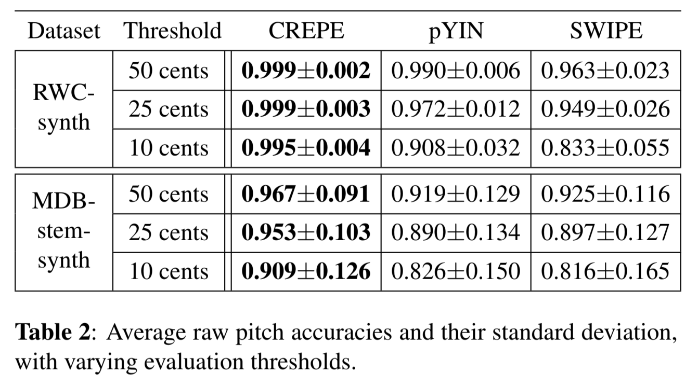
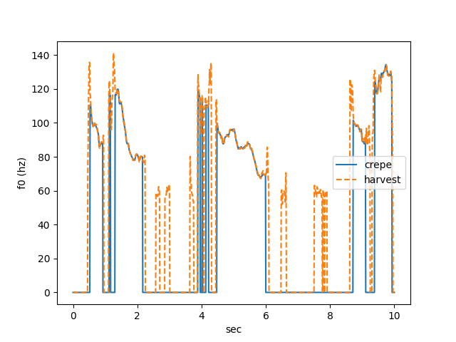

# Crepe : A Machine Learning Model for High-Precision Pitch Estimation

# Crepe : A Machine Learning Model for High-Precision Pitch Estimation

[](/@cochard-dav?source=post_page---byline--8562d83d44a5---------------------------------------)

[David Cochard](/@cochard-dav?source=post_page---byline--8562d83d44a5---------------------------------------)

5 min read

·

Dec 28, 2023

--

1

[Listen](/m/signin?actionUrl=https%3A%2F%2Fmedium.com%2Fplans%3Fdimension%3Dpost_audio_button%26postId%3D8562d83d44a5&operation=register&redirect=https%3A%2F%2Fmedium.com%2Faxinc-ai%2Fcrepe-a-machine-learning-model-for-high-precision-pitch-estimation-8562d83d44a5&source=---header_actions--8562d83d44a5---------------------post_audio_button------------------)

Share

This is an introduction to「Crepe」, a machine learning model that can be used with [ailia SDK](https://ailia.jp/en/). You can easily use this model to create AI applications using [ailia SDK](https://ailia.jp/en/) as well as many other ready-to-use [ailia MODELS](https://github.com/axinc-ai/ailia-models).

---

## Overview

*Crepe* is a pitch estimation algorithm that estimates the [fundamental frequency](https://en.wikipedia.org/wiki/Fundamental_frequency) (F0) from audio waveforms.

In the realm of pitch estimation, traditional methods like *pYIN* and *SWIPE* have been used. However, these methods have had difficulties in estimating F0 in noisy environments. Crepe addresses this issue by using CNNs (Convolutional Neural Networks) to build a noise-resistant F0 estimation mechanism.

*Crepe* is used for pitch guidance in singing synthesis in the RVC (Retrieval-based-Voice-Conversion) technology.

Press enter or click to view image in full size



The pitch estimated by Crepe (Source: <https://github.com/marl/crepe>)

[## CREPE: A Convolutional Representation for Pitch Estimation

### The task of estimating the fundamental frequency of a monophonic sound recording, also known as pitch tracking, is…

arxiv.org](https://arxiv.org/abs/1802.06182?source=post_page-----8562d83d44a5---------------------------------------)

[## GitHub — marl/crepe: CREPE: A Convolutional REpresentation for Pitch Estimation — pre-trained…

### CREPE: A Convolutional REpresentation for Pitch Estimation — pre-trained model (ICASSP 2018) — GitHub — marl/crepe…

github.com](https://github.com/marl/crepe?source=post_page-----8562d83d44a5---------------------------------------)

## Architecture

*Crepe* takes a 16kHz PCM of 1024 samples as input and outputs the probability values for F0. F0 is quantized on a logarithmic scale across 360 bins, with probability values output for each frequency. The final F0 value is selected based on these probability values, ranging from 50Hz (bin = 39) to 2006Hz (bin = 308). The hop size is 10ms, allowing for the calculation of one F0 value every 10ms.

*Crepe* processes data in batches of size 512, handling approximately five seconds of data at a time. The smoothing process, which will be discussed later, is carried out on this batch size.

During preprocessing, normalization is performed by subtracting the mean and then dividing by the standard deviation on a per-batch basis for PCM. The normalized PCM is then input into *Crepe’s* model to obtain F0 values for all batches.

The model structure of *Crepe* is as follows: The final F0 values are obtained by repeatedly applying Conv1D to the PCM waveform.

Press enter or click to view image in full size


Source: <https://arxiv.org/pdf/1802.06182.pdf>

## Post-processing

During the post-processing of Crepe, the choice of which F0 values to adopt can be made from three options: *ArgMax*, *WeightedArgMax*, and the *Viterbi* algorithm. If a smoothed output is desired, the Viterbi algorithm is used.

The Viterbi algorithm smoothes the F0 values in batches, by moving the usual argmax in such a way that it is more likely to be selected if it is close to the previous or next value in the time series. Specifically, a transition matrix is created to facilitate the selection of F0 values in the range of +-12, the score of each transition pattern from t=0 to batch\_size-1 is calculated based on the Confidence value and the transition matrix, and the final series of F0 values is obtained by backward tracing the transition with the highest score.

For the actual algorithm, please refer to the Viterbi algorithm in *librosa*.

[## librosa/librosa/sequence.py at main · librosa/librosa

### Python library for audio and music analysis. Contribute to librosa/librosa development by creating an account on…

github.com](https://github.com/librosa/librosa/blob/main/librosa/sequence.py?source=post_page-----8562d83d44a5---------------------------------------)

When confidence values are used with *ArgMax* or *WeightedArgMax* without the Viterbi algorithm, the F0 values are not smoothed. As a result, if used in RVC (Retrieval-based-Voice-Conversion), the generated speech may include sudden, clip noise-like high sounds.

In RVC, Periodicity is also calculated along with the F0 values. Periodicity is the probability value of the model output for the bin after smoothing. If Periodicity is less than 0.1, it is considered a silent segment, and an F0 value of 0 is assigned. Without this process, the output of RVC may include sounds that seem to stretch from the previous note into the silent parts, resulting in a robotic-like voice.

## Precision and benchmark

*pYIN*, conceived in 2014, is a method that uses the correlation of waveforms, while *SWIPE* focuses on the characteristics of power spectra.

*Crepe* comes in two models: `full` and `tiny`. The `full` model outperforms the *pYIN* algorithm in terms of performance.

Press enter or click to view image in full size



Crepe precision benchmark (Source: <https://github.com/marl/crepe>)

Comparing the output result of *Crepe* to another influential paper called [Harvest](https://www.semanticscholar.org/paper/Harvest%3A-A-High-Performance-Fundamental-Frequency-Morise/7143d07db6e2a12d0119bcd7dd21ed981072e728) gives the following results. With Crepe `full` model, outputs closely resemble those of harvest. While the `tiny` model shows fluctuating pitches in silent parts, the outputs for the voiced parts are close to those of harvest.



Full model


Tiny model

## Usage

*Crepe* can be used with ailia SDK with the following command.

```
$ python3 crepe.py --input input.wav
```

[## ailia-models/audio\_processing/crepe at master · axinc-ai/ailia-models

### The collection of pre-trained, state-of-the-art AI models for ailia SDK - ailia-models/audio\_processing/crepe at master…

github.com](https://github.com/axinc-ai/ailia-models/tree/master/audio_processing/crepe?source=post_page-----8562d83d44a5---------------------------------------)

An implementation for Unity is also provided for use with Retrieval-based-Voice-Conversion (RVC).

[## ailia-models-unity/Assets/AXIP/AILIA-MODELS/AudioProcessing/AiliaRvcCrepe.cs at master ·…

### Unity version of ailia models repository. Contribute to axinc-ai/ailia-models-unity development by creating an account…

github.com](https://github.com/axinc-ai/ailia-models-unity/blob/master/Assets/AXIP/AILIA-MODELS/AudioProcessing/AiliaRvcCrepe.cs?source=post_page-----8562d83d44a5---------------------------------------)

---

[ax Inc.](https://axinc.jp/en/) has developed [ailia SDK](https://ailia.jp/en/), which enables cross-platform, GPU-based rapid inference.

ax Inc. provides a wide range of services from consulting and model creation, to the development of AI-based applications and SDKs. Feel free to [contact us](https://axinc.jp/en/) for any inquiry.