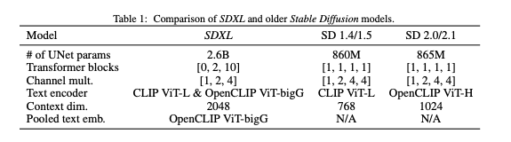
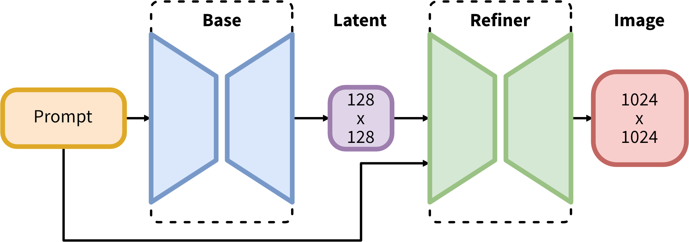
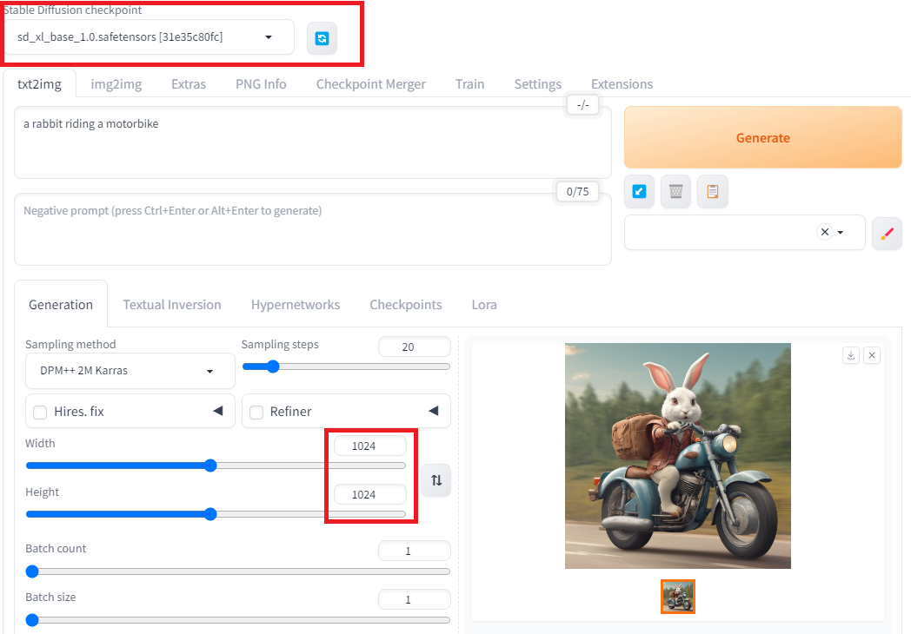
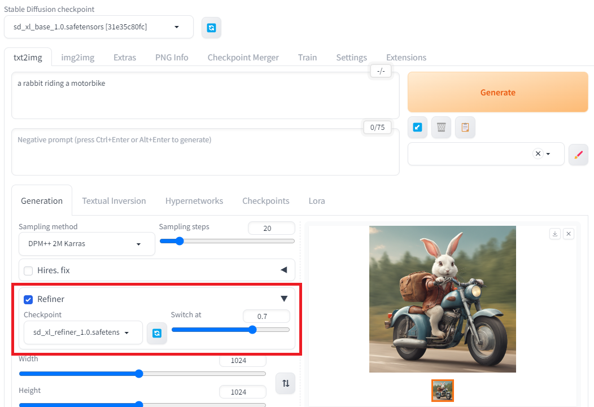
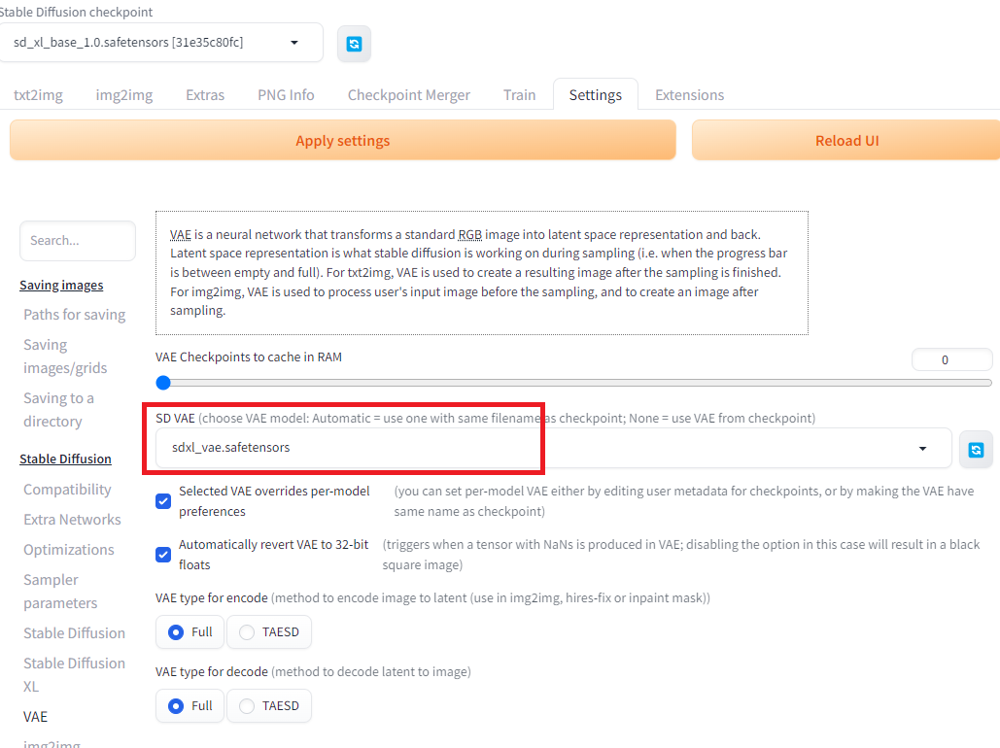

# Generating High-Quality Images with SDXL

# Generating High-Quality Images with SDXL

[](/@cochard-dav?source=post_page---byline--ec586e4a63f9---------------------------------------)

[David Cochard](/@cochard-dav?source=post_page---byline--ec586e4a63f9---------------------------------------)

4 min read

·

Jan 3, 2024

--

1

[Listen](/m/signin?actionUrl=https%3A%2F%2Fmedium.com%2Fplans%3Fdimension%3Dpost_audio_button%26postId%3Dec586e4a63f9&operation=register&redirect=https%3A%2F%2Fmedium.com%2Faxinc-ai%2Fgenerating-high-quality-images-with-sdxl-ec586e4a63f9&source=---header_actions--ec586e4a63f9---------------------post_audio_button------------------)

Share

This article explains how to generate high-quality images using SDXL, the latest model of [*Stable Diffusion*](/axinc-ai/stablediffusion-machine-learning-model-to-generate-images-from-text-22034d9b44b7).

---

## Overview

*SDXL 1.0* and its improved variant *SDXL Turbo* are the latest image generation models developed by [stability.ai](https://stability.ai/stable-image).

[## SDXL: Improving Latent Diffusion Models for High-Resolution Image Synthesis

### We present SDXL, a latent diffusion model for text-to-image synthesis. Compared to previous versions of Stable…

arxiv.org](https://arxiv.org/abs/2307.01952?source=post_page-----ec586e4a63f9---------------------------------------)

Compared to [*StableDiffusion 1.5*](/axinc-ai/stablediffusion-machine-learning-model-to-generate-images-from-text-22034d9b44b7) (aka. *SD 1.5*), *SDXL* utilizes a UNet backbone with three times the parameters, increases the latent space resolution from 64x64 to 128x128, and expands the generated image resolution from 512x512 to 1024x1024.



SDXL specifications (Source: <https://arxiv.org/pdf/2307.01952.pdf>)

Subjective quality has significantly improved in *SDXL* compared to *SD1.5*.

Press enter or click to view image in full size


SDXL subjective quality evaluation (Source: <https://huggingface.co/stabilityai/stable-diffusion-xl-base-1.0>)

*SDXL* consists of two models: a `base model` and a `refiner model`. The `base model` can be used standalone, but adding a pass of the `refiner model` and even an additional [VAE](https://stable-diffusion-art.com/how-to-use-vae/) to improve the image quality.

Press enter or click to view image in full size



SDXL architecture (Source: <https://huggingface.co/stabilityai/stable-diffusion-xl-base-1.0>)

## How to use SDXL from StableDiffusionWebUI

We already made an article on how to get started with *SD1.5* in *StableDiffusionWebUI* available at the link below:

[## Generate images with custom poses using StableDiffusionWebUI and ControlNet

### This article explains how to generate images with custom character postures using StableDiffusionWebUI for the image…

medium.com](/axinc-ai/generate-images-with-custom-poses-using-stablediffusionwebui-and-controlnet-c18d190cade1?source=post_page-----ec586e4a63f9---------------------------------------)

To use *SDXL*, perform a `git pull` to update to the latest version, 1.7.0 at the time of writing.

### Usage of the base model

Download `sd_xl_base_1.0.safetensors` from *Hugging Face* and place it in the `models/Stable-diffusion` directory. Its size is 6.7GB, which is larger than the 4.1GB of *StableDiffusion 1.5*.

[## stabilityai/stable-diffusion-xl-base-1.0 at main

### We’re on a journey to advance and democratize artificial intelligence through open source and open science.

huggingface.co](https://huggingface.co/stabilityai/stable-diffusion-xl-base-1.0/tree/main?source=post_page-----ec586e4a63f9---------------------------------------)

Select the model `sd_xl_base_1.0.safetensors`in the web interface model list, set the output resolution to 1024, and the VAE to`None` in the Settings if you had one set previously.

Press enter or click to view image in full size



Press enter or click to view image in full size


Result for prompt “a rabbit riding a motorbike”, seed 1937406479

### Usage of the refiner model

Similarly to what we just did for the `base model`, download `sd_xl_refiner_1.0.safetensors` from *Hugging Face* and place it in the `models/Stable-diffusion` directory.

[## stabilityai/stable-diffusion-xl-refiner-1.0 at main

### We're on a journey to advance and democratize artificial intelligence through open source and open science.

huggingface.co](https://huggingface.co/stabilityai/stable-diffusion-xl-refiner-1.0/tree/main?source=post_page-----ec586e4a63f9---------------------------------------)

It’s really easy in the latest versions of *Stable Diffusion WebUI* without any extension with the built-in panel below. Select the downloaded model and set at which point you want the model to be switched to the `refiner model`.

Press enter or click to view image in full size



### Further refine with VAE

Finally you can also try to use the dedicated SDXL VAE from the link below, copy the file in the `models/VAE` folder and select it in the VAE settings.

[## stabilityai/sdxl-vae at main

### We're on a journey to advance and democratize artificial intelligence through open source and open science.

huggingface.co](https://huggingface.co/stabilityai/sdxl-vae/tree/main?source=post_page-----ec586e4a63f9---------------------------------------)

Press enter or click to view image in full size



## Troubleshooting

If you are trying to run SDXL on a GPU with less than 12GB of memory, you’ll probably encounter a `CUDA Out of memory` error.

In this case you can try to edit the file `webui-user.bat` and add the following parameters.

```
set COMMANDLINE_ARGS=--xformers --reinstall-xformers --medvram
```

Note that `xformers`, which greatly improves memory consumption, only works on NVidia GPUs. If you still get the exception you can try further limitation by switching `--medvram` with`--lowvram.`

See *stable-diffusion-webui* parameter list for further details.

[## Optimizations

### Stable Diffusion web UI. Contribute to AUTOMATIC1111/stable-diffusion-webui development by creating an account on…

github.com](https://github.com/AUTOMATIC1111/stable-diffusion-webui/wiki/Optimizations?source=post_page-----ec586e4a63f9---------------------------------------)

## Create LoRA models based on SDXL

We described in a previous article what is a LoRA (Low-Rank Adaptation of Large Language Models) and how to create them.

[## Generate Images of Specific Characters using LoRA

### This artcicle explains how to generate images of a specific character in StableDiffusionWebUI, after creating our own…

medium.com](/axinc-ai/generate-images-of-specific-characters-using-lora-5587901077b6?source=post_page-----ec586e4a63f9---------------------------------------)

Below is a tutorial on how to do something similar using the *Kohya’s GUI* we used in the article above based on SDXL models.

---

[ax Inc.](https://axinc.jp/en/) has developed [ailia SDK](https://ailia.jp/en/), which enables cross-platform, GPU-based rapid inference.

ax Inc. provides a wide range of services from consulting and model creation, to the development of AI-based applications and SDKs. Feel free to [contact us](https://axinc.jp/en/) for any inquiry.