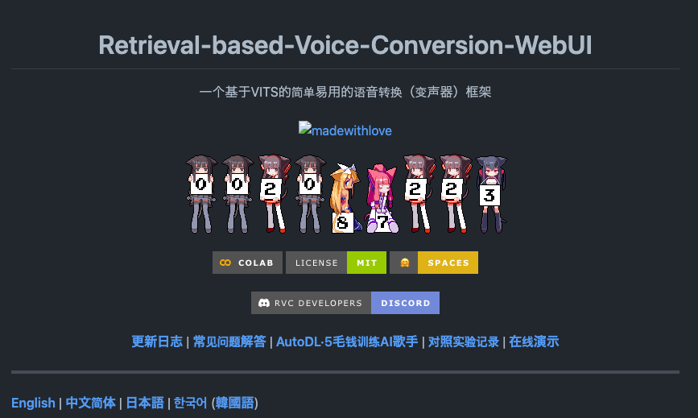
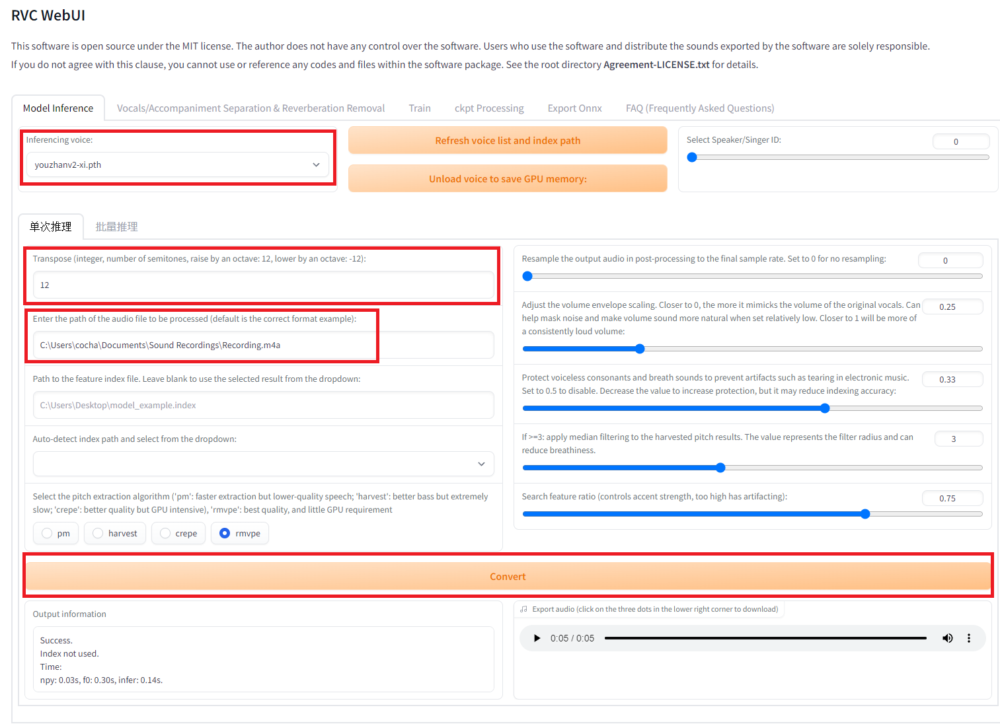
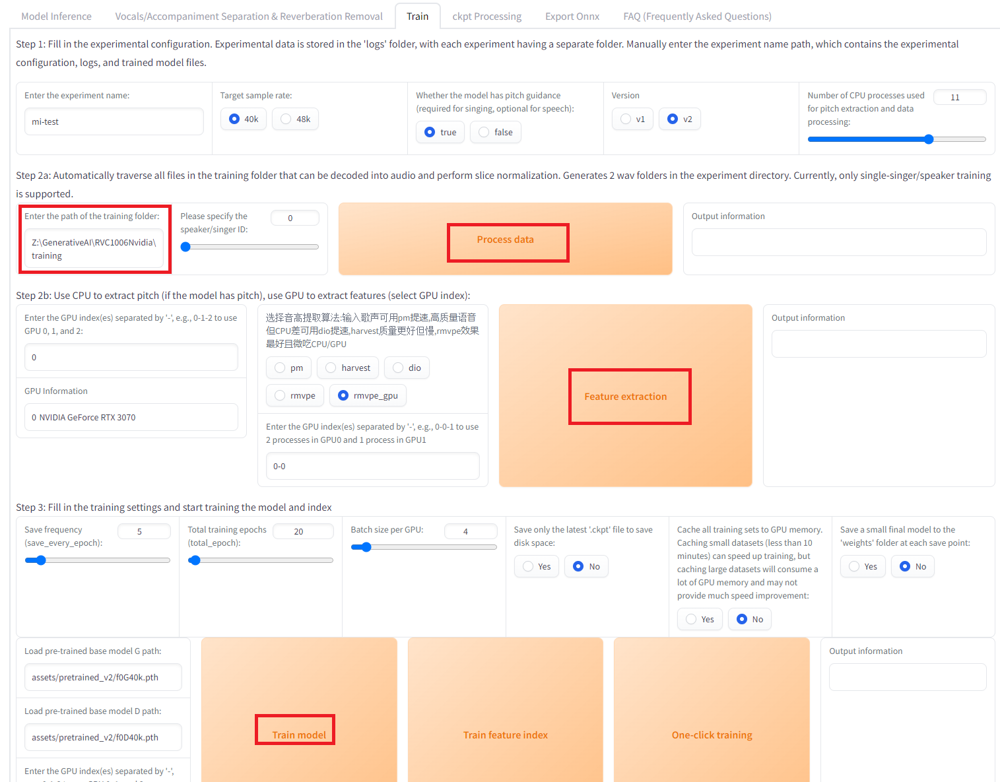
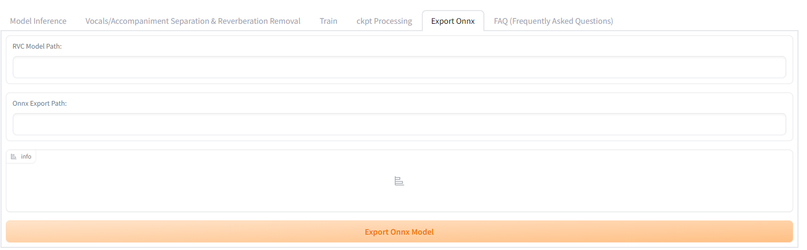

# RVC: An AI-Powered Voice Changer

# RVC: An AI-Powered Voice Changer

[](/@cochard-dav?source=post_page---byline--39927cc83bee---------------------------------------)

[David Cochard](/@cochard-dav?source=post_page---byline--39927cc83bee---------------------------------------)

7 min read

·

Jan 7, 2024

--

2

[Listen](/m/signin?actionUrl=https%3A%2F%2Fmedium.com%2Fplans%3Fdimension%3Dpost_audio_button%26postId%3D39927cc83bee&operation=register&redirect=https%3A%2F%2Fmedium.com%2Faxinc-ai%2Frvc-an-ai-powered-voice-changer-39927cc83bee&source=---header_actions--39927cc83bee---------------------post_audio_button------------------)

Share

This is an introduction to「RVC」, a machine learning model that can be used with [ailia SDK](https://ailia.jp/en/). You can easily use this model to create AI applications using [ailia SDK](https://ailia.jp/en/) as well as many other ready-to-use [ailia MODELS](https://github.com/axinc-ai/ailia-models).

---

## Overview

*RVC (Retrieval-based-Voice-Conversion)* is an AI-powered voice changer that can learn to perform high-quality voice transformations using just about 10 minutes of short audio samples. Traditional voice changers required two sets of data: one’s own voice and the target voice for conversion, posing the challenge of needing to prepare a personal voice dataset. RVC overcomes this by using a versatile feature extraction model called *HuBERT*, enabling conversion from any voice to a specific target voice.

Press enter or click to view image in full size



Source: <https://github.com/RVC-Project/Retrieval-based-Voice-Conversion-WebUI>

[## GitHub — RVC-Project/Retrieval-based-Voice-Conversion-WebUI: Voice data <= 10 mins can also be used…

### Voice data <= 10 mins can also be used to train a good VC model! — GitHub …

github.com](https://github.com/RVC-Project/Retrieval-based-Voice-Conversion-WebUI?source=post_page-----39927cc83bee---------------------------------------)

## Architecture

### Basic structure

*RVC* utilizes two models: *Hubert* for feature extraction and *net\_g* for audio generation.

*HuBERT* is a versatile feature extraction model. It’s like an audio version of [BERT](/axinc-ai/bert-a-machine-learning-model-for-efficient-natural-language-processing-aef3081c24e8), which is used in natural language processing. *HuBERT* is trained to predict masked MFCC (Mel Frequency Cepstral Coefficients) after extracting MFCC for each frame. The architecture of the model is based on [Transformer](https://github.com/huggingface/transformers).

[## HuBERT: Self-Supervised Speech Representation Learning by Masked Prediction of Hidden Units

### Self-supervised approaches for speech representation learning are challenged by three unique problems: (1) there are…

arxiv.org](https://arxiv.org/abs/2106.07447?source=post_page-----39927cc83bee---------------------------------------)

The input to *HuBERT* is PCM (Pulse-Code Modulation), and it outputs a feature vector. When a PCM of size (1, 156736) is input, the resulting feature vector from *HuBERT* is (1, 489, 256).

The input to *net\_g* is the feature vector, and it outputs PCM. There are 4 variants of *net\_g* in *RVC*, depending on the version (1 or 2) and the presence or absence of `if_f0`, used for pitch guidance (details in the next section).

```
self.if_f0 = cpt.get("f0", 1)  
self.version = cpt.get("version", "v1")  
if self.version == "v1":  
    if self.if_f0 == 1:  
        self.net_g = SynthesizerTrnMs256NSFsid(  
            *cpt["config"], is_half=config.is_half  
        )  
    else:  
        self.net_g = SynthesizerTrnMs256NSFsid_nono(*cpt["config"])  
elif self.version == "v2":  
    if self.if_f0 == 1:  
        self.net_g = SynthesizerTrnMs768NSFsid(  
            *cpt["config"], is_half=config.is_half  
        )  
    else:  
        self.net_g = SynthesizerTrnMs768NSFsid_nono(*cpt["config"])
```

The internal structure of *net\_g* comprises several components:

- **Embedding**: Encodes the feature vector from *HuBERT*.
- **TextEncoder**: Encodes pitch.
- **PosteriorEncoder**: Generates `z`, a latent representation or feature vector which captures the essential characteristics of the input audio signal
- **ResidualCouplingBlock**: Calculates `z_p` (posterior encoded vector) which embodies the modified features necessary to produce the desired output voice, incorporating aspects of the target voice while retaining the linguistic content of the original input.
- **GeneratorNSF**: Produces PCM from the processed data.

These components work in sequence to transform the encoded audio features into a PCM audio format, effectively changing the characteristics of the voice while maintaining the original pitch and rhythm of the input.

### Pitch Guidance

*RVC* includes a feature known as pitch guidance, internally managed by a flag called `if_f0`. When `if_f0` is set to `True`, the fundamental frequency (f0) of the input voice is additionally provided during the voice synthesis process in *net\_g*.

For extracting the f0 of the input voice, various methods are available, including the [*WORLD*](https://github.com/JeremyCCHsu/Python-Wrapper-for-World-Vocoder)vocoder and CNN-based models like [*Crepe*](https://github.com/marl/crepe) that we covered in [this article](/axinc-ai/crepe-a-machine-learning-model-for-high-precision-pitch-estimation-8562d83d44a5). The choice of f0 extraction method does not need to match the one used during training, it can be selected arbitrarily at inference time.

By using f0, it becomes possible to reflect the original voice’s intonation (such as pitch), making it suitable for singing and other applications where maintaining the original melody or pitch pattern is crucial.

In conversational applications, to reduce processing load, models that do not utilize f0 may be used. This flexibility allows for a balance between performance and computational efficiency, depending on the specific requirements of the use case.

### Faiss

*RVC* utilizes a vector search library called [*Faiss*](https://github.com/facebookresearch/faiss) to enhance its ability to closely match the original voice. This feature works by selecting the feature vectors from the training dataset that are closest in distance to the feature vector of the input voice, as extracted by Hubert. By performing a weighted average with the input voice’s *HuBERT* features, the system approximates the characteristics of the original voice more closely.

When using *Faiss*, enabling the `Protect` mode adjusts the process based on the fundamental frequency (f0). If the f0 is less than 1, the segment is considered silent, and the degree of reflection of the original voice’s characteristics is increased. This approach makes it easier to reflect nuances like breath sounds in the synthesized voice, enhancing the naturalness and expressiveness of the voice conversion.

## Usage

### Setup

The official *RVC* can be launched as a web UI.

You start by cloning the repository and installing the dependent libraries. At the time of writing, the dependent libraries are not compatible with Python 3.11, therefore Python 3.10 is used.

The full setup procedure is described in English [here](https://github.com/RVC-Project/Retrieval-based-Voice-Conversion-WebUI/blob/main/docs/en/README.en.md), for Windows and Mac, as well as NVidia / AMD / Intel hardware. You can also directly download the [complete package as a zip file](https://github.com/RVC-Project/Retrieval-based-Voice-Conversion-WebUI/releases).

For macOS, due to compatibility issues with certain layers, it is necessary to run on the CPU. This can be achieved by using the following command:

```
export PYTORCH_ENABLE_MPS_FALLBACK=1
```

### Inference

Once the web UI is launched, specify the model and input the audio file, then press the conversion button. If you are using a model that includes F0 and want to convert from a male to a female voice, specify `+12` in the pitch change settings named `Transpose` in the UI.

Press enter or click to view image in full size



Interface with version [updated1006v2](https://github.com/RVC-Project/Retrieval-based-Voice-Conversion-WebUI/releases/tag/updated1006v2)

### Training

For training, use the `Train` tab.

Download the initial weight file, `f0G40k.pth`, and place it in the `pretrained_v2` directory.

[## lj1995/VoiceConversionWebUI at main

### We’re on a journey to advance and democratize artificial intelligence through open source and open science.

huggingface.co](https://huggingface.co/lj1995/VoiceConversionWebUI/tree/main/pretrained_v2?source=post_page-----39927cc83bee---------------------------------------)

Store the audio files for training in a folder and set this folder path in the UI. Then click on `Process data` , `Feature Extraction` and finally `Train model`.

Press enter or click to view image in full size



Interface with version [updated1006v2](https://github.com/RVC-Project/Retrieval-based-Voice-Conversion-WebUI/releases/tag/updated1006v2)

If necessary, to acquire the features for *Faiss*, click on `Train Feature Index`. The training results will be stored in the ‘weights’ folder. Training completes in about 5 minutes with 7 minutes of audio.

### RVC v1 and v2

When training *RVC*, you can choose between versions v1 and v2. In v1, the output from *HuBERT* and the input to *net\_g* are 256-dimensional. In v2, these become 756-dimensional. This difference in dimensionality affects the detail and quality of the voice conversion, with v2 potentially offering more nuanced voice transformations due to its higher-dimensional feature space.

### Conversion to ONNX

*RVC* officially supports the conversion of the *net\_g* model to ONNX format. To perform the conversion, select the `Export ONNX` tab, specify the `.pth` file for the RVC model path, and the `.onnx` file for the ONNX output path and press the export button. This feature facilitates the use of RVC models in a variety of environments and platforms that support ONNX, enhancing the versatility of the voice conversion model.

Press enter or click to view image in full size



Interface with version [updated1006v2](https://github.com/RVC-Project/Retrieval-based-Voice-Conversion-WebUI/releases/tag/updated1006v2)

Regarding *HuBERT*, it’s possible to convert it to ONNX using the torch nightly version by modifying the source code of RVC. Since *HuBERT* is independent of the audio source and is commonly used, you can directly use the ONNX file already converted by our company.

[## Hubert onnx model inference problem · Issue #70289 · pytorch/pytorch

### 🐛 Describe the bug Hi, I am converting Hubert model to onnx format with this script: import torch import torchaudio…

github.com](https://github.com/pytorch/pytorch/issues/70289?source=post_page-----39927cc83bee---------------------------------------)

The model sizes are 293.5MB for `hubert_base` , and 110.2MB for `net_g`.

## Using RVC from ailia SDK

You can convert the input audio using the following command:

```
$ python3 rvc.py -i input.wav
```

[## ailia-models/audio\_processing/rvc at master · axinc-ai/ailia-models

### The collection of pre-trained, state-of-the-art AI models for ailia SDK - ailia-models/audio\_processing/rvc at master ·…

github.com](https://github.com/axinc-ai/ailia-models/tree/master/audio_processing/rvc?source=post_page-----39927cc83bee---------------------------------------)

By default, we use the following model under the MIT License. This model does not utilize F0 (fundamental frequency).

[## 【無料】RVC向け学習済みボイスモデルデータ「愛想良い系少女の声 5種風味パック」 — ちはや神社 — BOOTH

### 【無料】RVC向け学習済みボイスモデルデータ「愛想良い系少女の声 5種風味パック」 このデータはRVC(Realtime Voice…

chihaya369.booth.pm](https://chihaya369.booth.pm/items/4701666?source=post_page-----39927cc83bee---------------------------------------)

A model that utilizes F0 (fundamental frequency) can be executed using the following command. The `index` is an option for *Faiss*.

```
python3 rvc.py -i 0-input.wav -m Rinne.onnx --f0_method harvest --f0 1 --f0_up_key 11 --tgt_sr 48000 --file_index Rinne.index --index_rate 0.75
```

Our company is conducting tests with the following model. Since this model cannot be redistributed, please use it after converting it to ONNX format.

[## RinneAi/RinneVoiceSet · Hugging Face

### We’re on a journey to advance and democratize artificial intelligence through open source and open science.

huggingface.co](https://huggingface.co/RinneAi/RinneVoiceSet?source=post_page-----39927cc83bee---------------------------------------)

When using the RVC v2 model, add `2` to the `version` option.

## Using RVC from Unity

By using the ailia SDK, you can utilize *RVC* in Unity. In the following example, the input audio is split into `AudioClip` segments using *SileroVAD*. *RVC* is then applied to each `AudioClip`, and the voice-changed clip is outputted and played through an `AudioSource`. This setup supports both models that use F0 and those that do not. For calculating F0, `crepe_tiny` is used.

[## ailia-models-unity/Assets/AXIP/AILIA-MODELS/AudioProcessing at master · axinc-ai/ailia-models-unity

### Unity version of ailia models repository. Contribute to axinc-ai/ailia-models-unity development by creating an account…

github.com](https://github.com/axinc-ai/ailia-models-unity/tree/master/Assets/AXIP/AILIA-MODELS/AudioProcessing?source=post_page-----39927cc83bee---------------------------------------)

---

[ax Inc.](https://axinc.jp/en/) has developed [ailia SDK](https://ailia.jp/en/), which enables cross-platform, GPU-based rapid inference.

ax Inc. provides a wide range of services from consulting and model creation, to the development of AI-based applications and SDKs. Feel free to [contact us](https://axinc.jp/en/) for any inquiry.