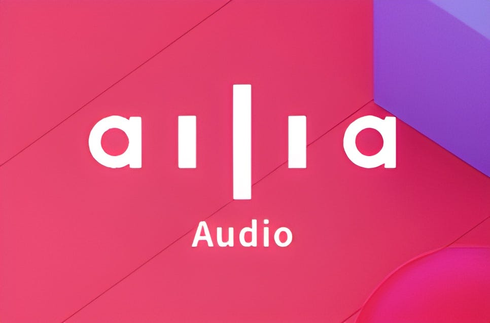

# ailia Audio: A Library for Audio Pre-processing and Post-processing

# ailia Audio: A Library for Audio Pre-processing and Post-processing

[David Cochard](/@cochard-dav?source=post_page---byline--ed588bafdbe2---------------------------------------)

4 min read

·

Jan 9, 2024

--

[Listen](/m/signin?actionUrl=https%3A%2F%2Fmedium.com%2Fplans%3Fdimension%3Dpost_audio_button%26postId%3Ded588bafdbe2&operation=register&redirect=https%3A%2F%2Fmedium.com%2Faxinc-ai%2Failia-audio-a-library-for-audio-pre-processing-and-post-processing-ed588bafdbe2&source=---header_actions--ed588bafdbe2---------------------post_audio_button------------------)

Share

This is an introduction to *ailia Audio*, a library designed for audio pre-processing and post-processing to on-device AI audio processing easier.

Press enter or click to view image in full size

## Overview

In recent years, the use of machine learning in the field of audio has been increasing, specifically in areas such as voice recognition, speech synthesis, pitch estimation, and noise reduction.

However, when dealing with audio, it is common to apply a mel-spectrogram transformation to the input audio waveform. This process has typically been carried out using external libraries like `torch.audio` or `librosa`, not within the AI model itself.

As a result, even though AI models can be converted to ONNX format, implementing the mel-spectrogram transformation preprocessing was necessary for running these models on iOS or Android. This transformation requires the implementation of FFT (Fast Fourier Transform) and other complex processes, demanding significant development effort.

*ailia Audio* is a library that solves this problem. By providing various APIs compatible with `torch.audio` and `librosa`, including mel-spectrogram transformation, *ailia Audio* makes it easy to implement audio processing AI models written in Python on iOS and Android platforms.

## Usage examples

The voice recognition model [Whisper](/axinc-ai/whisper-speech-recognition-model-capable-of-recognizing-99-languages-5b5cf0197c16) requires the calculation of a `log_melspectrum` from the input audio waveform. With *ailia Audio*, it becomes possible to implement *Whisper* on iOS and Android platforms.

### Implementation with librosa

In `librosa`, `log_melspectrum` is calculated by first calling `librosa.stft` and `librosa.filters.mel`, and then computing the logarithm (base 10) of the result.

[## ailia-models/audio\_processing/whisper/audio\_utils.py at master · axinc-ai/ailia-models

### The collection of pre-trained, state-of-the-art AI models for ailia SDK …

github.com](https://github.com/axinc-ai/ailia-models/blob/master/audio_processing/whisper/audio_utils.py?source=post_page-----ed588bafdbe2---------------------------------------)

### Implementation with ailia Audio

When using *ailia Audio*, you can calculate the `log_melspectrum` by calling `ailia.audio.mel_spectrogram` and then computing the logarithm (base 10) of the result.

[## ailia-models/audio\_processing/whisper/ailia\_audio\_utils.py at master · axinc-ai/ailia-models

### The collection of pre-trained, state-of-the-art AI models for ailia SDK …

github.com](https://github.com/axinc-ai/ailia-models/blob/master/audio_processing/whisper/ailia_audio_utils.py?source=post_page-----ed588bafdbe2---------------------------------------)

## ailia Audio bindings

`librosa` and `torch.audio` are implemented in Python. In contrast, *ailia Audio* is implemented in C++, which allows for native access from C++ and Objective-C. Additionally, it can be accessed from C# and Dart through FFI (Foreign Function Interface). For verification purposes, Python bindings are also provided. Therefore, like the ailia SDK, it can be used across various platforms. This versatility makes *ailia Audio* a highly adaptable solution for audio processing in diverse application environments.

## ailia Audio API

*ailia Audio* includes the following audio processing implementations:

・*FFT、IFFT  
・Spectrogram、InverseSpectrogram  
・MelSpectrogram  
・MagPhase、Standardize、ComplexNorm、ConvertToMel、dB  
・Resample  
・LinearFilter、LinearFilterZiCoef、FilterFilter*

The C++ API reference if available at the link below:

[## ailia: ailia\_audio.h File Reference

### audio processing library More… audio processing library Create a mel filter-bank. Get the number of frames generated…

axinc-ai.github.io](https://axinc-ai.github.io/ailia-sdk/api/cpp/en/ailia__audio_8h.html?source=post_page-----ed588bafdbe2---------------------------------------)

API reference in Python:

[## ailia.audio package — ailia Python API 1.2.9 documentation

### Edit description

axinc-ai.github.io](https://axinc-ai.github.io/ailia-sdk/api/python/en/ailia.audio.html?source=post_page-----ed588bafdbe2---------------------------------------)

## ailia Audio samples

There are examples of using ailia Audio from C++ and Unity as follows:

[## GitHub — axinc-ai/ailia-audio-samples: ailia.audio samples of unity

### ailia.audio samples of unity. Contribute to axinc-ai/ailia-audio-samples development by creating an account on GitHub.

github.com](https://github.com/axinc-ai/ailia-audio-samples?source=post_page-----ed588bafdbe2---------------------------------------)

For samples using *ailia Audio* from Python, you can refer to [ailia MODELS](https://github.com/axinc-ai/ailia-models/tree/master/audio_processing) where implementations for both `librosa`/`torch.audio` and *ailia Audio* are provided, allowing for easy switching between them. This setup is useful for understanding how to port from `librosa` or `torch.audio` to *ailia Audio*, as you can compare both implementations side by side. The files with `_ailia` in their names are the ones using *ailia Audio*, while those without it are the original implementations using `librosa` or `torch.audio`.

### CRNN Audio Classification

[## ailia-models/audio\_processing/crnn\_audio\_classification/crnn\_audio\_classification\_util\_ailia.py at…

### The collection of pre-trained, state-of-the-art AI models for ailia SDK …

github.com](https://github.com/axinc-ai/ailia-models/blob/master/audio_processing/crnn_audio_classification/crnn_audio_classification_util_ailia.py?source=post_page-----ed588bafdbe2---------------------------------------)

[## ailia-models/audio\_processing/crnn\_audio\_classification/crnn\_audio\_classification\_util.py at master…

### The collection of pre-trained, state-of-the-art AI models for ailia SDK …

github.com](https://github.com/axinc-ai/ailia-models/blob/master/audio_processing/crnn_audio_classification/crnn_audio_classification_util.py?source=post_page-----ed588bafdbe2---------------------------------------)

### Pytorch DC TTS (Text-To-Speech)

[## ailia-models/audio\_processing/pytorch-dc-tts/pytorch\_dc\_tts\_utils\_ailia.py at master ·…

### The collection of pre-trained, state-of-the-art AI models for ailia SDK …

github.com](https://github.com/axinc-ai/ailia-models/blob/master/audio_processing/pytorch-dc-tts/pytorch_dc_tts_utils_ailia.py?source=post_page-----ed588bafdbe2---------------------------------------)

[## ailia-models/audio\_processing/pytorch-dc-tts/pytorch\_dc\_tts\_utils.py at master ·…

### The collection of pre-trained, state-of-the-art AI models for ailia SDK …

github.com](https://github.com/axinc-ai/ailia-models/blob/master/audio_processing/pytorch-dc-tts/pytorch_dc_tts_utils.py?source=post_page-----ed588bafdbe2---------------------------------------)

### Whisper (Voice Recognition)

[## ailia-models/audio\_processing/whisper/ailia\_audio\_utils.py at master · axinc-ai/ailia-models

### The collection of pre-trained, state-of-the-art AI models for ailia SDK …

github.com](https://github.com/axinc-ai/ailia-models/blob/master/audio_processing/whisper/ailia_audio_utils.py?source=post_page-----ed588bafdbe2---------------------------------------)

[## ailia-models/audio\_processing/whisper/audio\_utils.py at master · axinc-ai/ailia-models

### The collection of pre-trained, state-of-the-art AI models for ailia SDK …

github.com](https://github.com/axinc-ai/ailia-models/blob/master/audio_processing/whisper/audio_utils.py?source=post_page-----ed588bafdbe2---------------------------------------)

## Conclusion

By using *ailia Audio*, it becomes possible to implement AI models for audio processing on iOS and Android. [ax Inc.](https://axinc.jp/en/) also offers services to port your models to iOS and Android, if you are interested, feel free to [contact us](https://axinc.jp/en/) for any inquiry.

---

[ax Inc.](https://axinc.jp/en/) has developed [ailia SDK](https://ailia.jp/en/), which enables cross-platform, GPU-based rapid inference.

ax Inc. provides a wide range of services from consulting and model creation, to the development of AI-based applications and SDKs. Feel free to [contact us](https://axinc.jp/en/) for any inquiry.