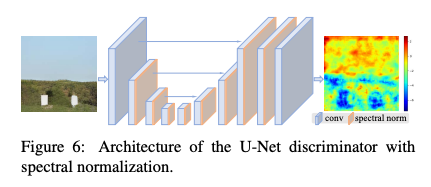

# Real ESRGAN: Super-Resolution Model Enhanced for Denoising

# Real ESRGAN: Super-Resolution Model Enhanced for Denoising

[](/@cochard-dav?source=post_page---byline--dd581b2702a8---------------------------------------)

[David Cochard](/@cochard-dav?source=post_page---byline--dd581b2702a8---------------------------------------)

4 min read

·

Jan 10, 2024

--

[Listen](/m/signin?actionUrl=https%3A%2F%2Fmedium.com%2Fplans%3Fdimension%3Dpost_audio_button%26postId%3Ddd581b2702a8&operation=register&redirect=https%3A%2F%2Fmedium.com%2Faxinc-ai%2Freal-esrgan-super-resolution-model-enhanced-for-denoising-dd581b2702a8&source=---header_actions--dd581b2702a8---------------------post_audio_button------------------)

Share

This is an introduction to「Real ESRGAN」, a machine learning model that can be used with [ailia SDK](https://ailia.jp/en/). You can easily use this model to create AI applications using [ailia SDK](https://ailia.jp/en/) as well as many other ready-to-use [ailia MODELS](https://github.com/axinc-ai/ailia-models).

## Overview

*Real ESRGAN* is a super-resolution model that enlarges images. Based on the architecture of [*ESRGAN*](https://arxiv.org/abs/1809.00219)(*Enhanced Super-Resolution Generative Adversarial Networks*), *Real ESRGAN* has improved its training dataset and model architecture to enhance its denoising capabilities. When enlarging images to high resolution, it effectively removes noise from the original image, enabling the acquisition of clearer and more distinct images than traditional methods.

Press enter or click to view image in full size


Real ESRGAN results (Source: <https://arxiv.org/pdf/2107.10833.pdf>)

[## GitHub — xinntao/Real-ESRGAN: Real-ESRGAN aims at developing Practical Algorithms for General…

### Real-ESRGAN aims at developing Practical Algorithms for General Image/Video Restoration. — GitHub …

github.com](https://github.com/xinntao/Real-ESRGAN?source=post_page-----dd581b2702a8---------------------------------------)

[## Real-ESRGAN: Training Real-World Blind Super-Resolution with Pure Synthetic Data

### Though many attempts have been made in blind super-resolution to restore low-resolution images with unknown and complex…

arxiv.org](https://arxiv.org/abs/2107.10833?source=post_page-----dd581b2702a8---------------------------------------)

## Architecture

When applying super-resolution to images, it’s essential for the model to not only account for downsampling due to resizing but also for different noise types present in the original image.

These noises include blur, general noise (such as Gaussian, Poisson, Color, Gray), and artifacts like blocking and [ringing](https://en.wikipedia.org/wiki/Ringing_artifacts#JPEG) resulting from JPEG compression.

The original *ESRGAN* assumed that these noises were applied only once. However, images on the internet often undergo multiple compressions, leading to stronger noises that were not adequately addressed.

*Real ESRGAN* addresses this by applying noise twice when creating the dataset for training, attempting to restore the original image from those with more noise influence. Additionally, to simulate [ringing artifacts](https://en.wikipedia.org/wiki/Ringing_artifacts#JPEG) that frequently occur near the outlines in hand-drawn images, a 2D *sinc* filter is applied. This filter cuts high-frequency components at random frequencies, thereby generating ringing artifacts.

Press enter or click to view image in full size


Procedure for training dataset creation (Source: <https://arxiv.org/pdf/2107.10833.pdf>)

The model architecture of *Real ESRGAN* is an improved version of *ESRGAN*. Specifically, it modifies the *UNet*’s VGG-based backbone to include `Skip Connections` similar to *ResNet*. Additionally, `Batch Normalization` is replaced with `Spectral Normalization`. These changes enhance the model’s ability to handle more complex and varied types of noise and artifacts in images, contributing to higher quality super-resolution results.



Real ESRGAN architecture (Source: <https://arxiv.org/pdf/2107.10833.pdf>)

For the original, high-resolution dataset, *Real ESRGAN* uses `DIV2K`, `Flickr2K`, and the `OutdoorSceneTraining` datasets. The resolution of the training patches is 256x256.

During training, a combination of `L1 loss`, `Perceptual loss`, and `GAN loss` functions are used. This combination of loss functions helps in achieving a balance between maintaining image fidelity (through L1 loss), ensuring perceptually convincing results (through Perceptual loss), and creating realistic textures and details in the upscaled images (through GAN loss). This approach is key to the effectiveness of Real ESRGAN in producing high-quality super-resolution images.

## Output Image Quality

This is a comparison between the traditional *ESRGAN* and *Real-ESRGAN*. While *ESRGAN* tends to retain the ringing artifacts around the contours present in the original image, *Real ESRGAN* mostly removes these to generate images with a sharper and clearer appearance which significantly enhances the overall quality of the output images.

Press enter or click to view image in full size


Benchmark (Source: <https://arxiv.org/pdf/2107.10833.pdf>)

## Usage with ailia SDK

You can use *Real-ESRGAN* with ailia SDK using the following command.

```
$ python3 real_esrgan.py -i input_anime.jpg -s output.jpg
```

By default, *Real ESRGAN* is optimized for real-world images, but it also supports an anime model which can be activated by using the `-m` option.

```
$ python3 real_esrgan.py -m RealESRGAN_anime -i input_anime.jpg -s output_anime.jpg
```

[## ailia-models/super\_resolution/real-esrgan at master · axinc-ai/ailia-models

### The collection of pre-trained, state-of-the-art AI models for ailia SDK — ailia-models/super\_resolution/real-esrgan at…

github.com](https://github.com/axinc-ai/ailia-models/tree/master/super_resolution/real-esrgan?source=post_page-----dd581b2702a8---------------------------------------)

## Usage with Unity or C#

To run *Real ESRGAN* in Unity using the following sample.

[## ailia-models-unity/Assets/AXIP/AILIA-MODELS/SuperResolution at master · axinc-ai/ailia-models-unity

### Unity version of ailia models repository. Contribute to axinc-ai/ailia-models-unity development by creating an account…

github.com](https://github.com/axinc-ai/ailia-models-unity/tree/master/Assets/AXIP/AILIA-MODELS/SuperResolution?source=post_page-----dd581b2702a8---------------------------------------)

You can also run it in vanilla C# in Visual Studio.

[## GitHub — axinc-ai/ailia-csharp: ailia SDK example for Visual Studio C#

### ailia SDK example for Visual Studio C#. Contribute to axinc-ai/ailia-csharp development by creating an account on…

github.com](https://github.com/axinc-ai/ailia-csharp?source=post_page-----dd581b2702a8---------------------------------------)

---

[ax Inc.](https://axinc.jp/en/) has developed [ailia SDK](https://ailia.jp/en/), which enables cross-platform, GPU-based rapid inference.

ax Inc. provides a wide range of services from consulting and model creation, to the development of AI-based applications and SDKs. Feel free to [contact us](https://axinc.jp/en/) for any inquiry.