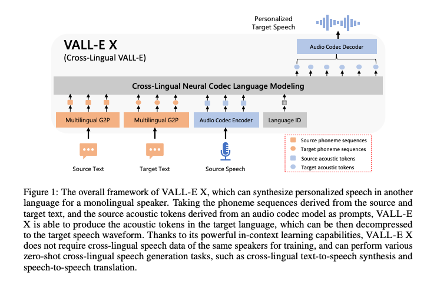
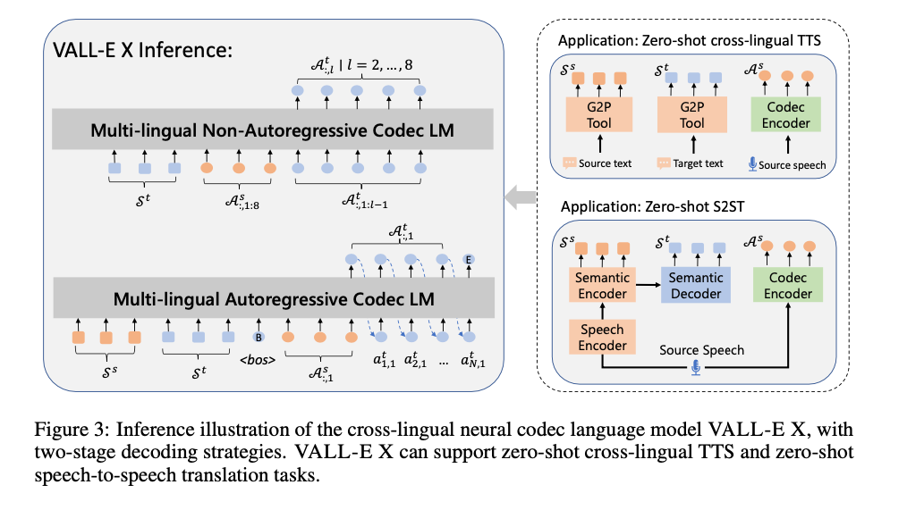
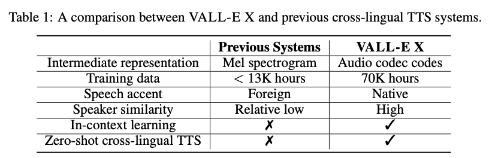

# VALL-E-X : Zero-Shot Text-To-Speech Cross-Lingual Model

# VALL-E-X : Zero-Shot Text-To-Speech Cross-Lingual Model

[](/@cochard-dav?source=post_page---byline--9686ada19131---------------------------------------)

[David Cochard](/@cochard-dav?source=post_page---byline--9686ada19131---------------------------------------)

9 min read

·

Jan 25, 2024

--

[Listen](/m/signin?actionUrl=https%3A%2F%2Fmedium.com%2Fplans%3Fdimension%3Dpost_audio_button%26postId%3D9686ada19131&operation=register&redirect=https%3A%2F%2Fmedium.com%2Faxinc-ai%2Fvall-e-x-zero-shot-text-to-speech-cross-lingual-model-9686ada19131&source=---header_actions--9686ada19131---------------------post_audio_button------------------)

Share

This is an introduction to「VALL-E-X」, a machine learning model that can be used with [ailia SDK](https://ailia.jp/en/). You can easily use this model to create AI applications using [ailia SDK](https://ailia.jp/en/) as well as many other ready-to-use [ailia MODELS](https://github.com/axinc-ai/ailia-models).

---

## Overview

*VALL-E-X* is an open-source implementation of a voice synthesis model developed by *Microsoft*. While *Microsoft* has published a paper on it, they have not released the source code and trained model, leading to this unofficial implementation. *VALL-E*, initially a single-language voice synthesis model, has been expanded into VALL-E-X to support multiple languages.

Press enter or click to view image in full size


VALL-E vs. VALL-E-X (Source: <https://www.microsoft.com/en-us/research/project/vall-e-x/>)

[## GitHub — Plachtaa/VALL-E-X: An open source implementation of Microsoft’s VALL-E X zero-shot TTS…

### An open source implementation of Microsoft’s VALL-E X zero-shot TTS model. Demo is available in…

github.com](https://github.com/Plachtaa/VALL-E-X?source=post_page-----9686ada19131---------------------------------------)

[## Speak Foreign Languages with Your Own Voice: Cross-Lingual Neural Codec Language Modeling

### We propose a cross-lingual neural codec language model, VALL-E X, for cross-lingual speech synthesis. Specifically, we…

arxiv.org](https://arxiv.org/abs/2303.03926?source=post_page-----9686ada19131---------------------------------------)

## Main Features

*VALL-E-X* is capable of synthesizing speech from English, Chinese, and Japanese text. It can also, given few seconds of audio as prompt, synthesize voice with similar vocal characteristics and emotions.

Traditionally, when using a voice changer, [RVC (Retrieval-based Voice Conversion)](/axinc-ai/rvc-an-ai-powered-voice-changer-39927cc83bee) was utilized, which required about 10 minutes of pre-recorded voice for training. In contrast, *VALL-E-X* does not require training and can change vocal characteristics with just a few seconds of audio.

RVC is a voice-to-voice model suitable for applications like live chat in games. If this kind of voice-to-voice process is needed, *VALL-E-X*, being a text-to-speech model, requires converting the original voice to text using tools like [*Whisper*](/axinc-ai/whisper-speech-recognition-model-capable-of-recognizing-99-languages-5b5cf0197c16) before synthesizing speech.

*VALL-E-X* is especially ideal for language conversion. For example, if you have an audio and text in English, *VALL-E-X* can produce a speech in Japanese with the same intonation for each sentence.

The page linked below contains actual examples of voices synthesized with each system. The results of English voice synthesis with Japanese vocal qualities, found at the end of the page in section `Japanese zero-shot cross-lingual text-to-speech` , are particularly illustrative. You can notice that it’s not just the vocal qualities of the original voice that are captured, but also the emotions.

[## VALL-E

### VALL-E X can synthesize personalized speech in another language for a monolingual speaker. Taking the phoneme sequences…

plachtaa.github.io](https://plachtaa.github.io/?source=post_page-----9686ada19131---------------------------------------)

## Architecture

### Context

*VALL-E-X* is based on Meta’s [*AudioGen*](https://audiocraft.metademolab.com/audiogen.html)and Google’s [*AudioLM*](https://google-research.github.io/seanet/audiolm/examples/), two advanced voice synthesis algorithms.

*AudioGen* consists of four models: an *audio encoder, text encoder, transformer encoder*, and an *audio decoder*. The *audio decoder* uses an *Auto Regressive Audio Generation Model* to synthesize speech from text.

*AudioLM* transforms the input voice into semantic tokens using *w2v-BERT*, and then converts these into acoustic tokens using *SoundStream* (a model equivalent to [*EnCodec*](https://github.com/facebookresearch/encodec)), subsequently generating the continuation of the input voice.

*VALL-E-X* employs these modern neural codec language models. By converting audio into a sequence of tokens using [*EnCodec*](https://github.com/facebookresearch/encodec), it handles voice synthesis within the framework of natural language processing *Seq2Seq* (sequence-to-sequence) models. This approach allows for more sophisticated and flexible voice synthesis capabilities.

### Model structure

*VALL-E-X* takes three inputs.

- **Source Text**: This is the original text that corresponds to the source speech. It’s what the speaker in the source audio is saying
- **Source Speech**: This is an audio file containing the speech that you want the synthesized voice to emulate in terms of vocal qualities and style.
- **Target Text**: This is the text you want to be synthesized. It’s the content that you want the output speech to contain.

The texts are converted into phonemes by G2P, then tokenized. These tokens are processed by two Transformers (AR and NAR) and finally, the audio waveform is output from the tokens by a neural vocoder.

Press enter or click to view image in full size



VALL-E-X architecture (Source: <https://arxiv.org/abs/2303.03926>)

The approach of *VALL-E-X* is similar to generating a continuation of text from input text in a *Seq2Seq* (sequence-to-sequence) model. The input token sequence, composed of the reference voice transcript, the reference voice audio, and the target text for speech synthesis, is used to output a token sequence for the continuation of the speech. These tokens are then converted back into an audio waveform. By tokenizing the audio in this way, the voice can be treated like text, enabling the generation of speech within the same framework as text.

In the decoder, an *Auto Regressive (AR) Audio Generation Model* is used to generate tokens step-by-step, and then a *Non Auto Regressive (NAR) Audio Generation Model* processes these tokens in batches.

Press enter or click to view image in full size



AR and NAR (Source: <https://arxiv.org/abs/2303.03926>)

The AR Decoder then generates an intermediate representation A^t\_1. Subsequently, S^t, A^s, and A^t\_1 are used as inputs to the NAR Decoder to calculate the final intermediate representations A^t\_2 to A^t\_8. This process enables VALL-E-X to create a nuanced synthesis that mirrors the characteristics of the source voice while delivering the desired speech content.

The generation of intermediate representations 2 to 8 from intermediate representation 1 in VALL-E-X is because [EnCodec](https://github.com/facebookresearch/encodec)’s intermediate representations are expressed in multiple layers due to a *Quantizer*. The *Quantizer* in this context serves as a mechanism that allows the encoding of the audio data into a more complex, layered representation. This multi-layered approach enables the model to capture and reproduce the nuances of the speech more accurately, including aspects like tone, intonation, and speaking style, which are essential for realistic and natural-sounding speech synthesis.

Press enter or click to view image in full size


EnCodec Quantizer (Source: <https://github.com/facebookresearch/encodec>)

Finally, *Vocos* is used to convert the tokens into inputs for the *inverse short-time Fourier transform (istft)*, which then transforms them into an audio waveform.

### Intermediate Representations in VALL-E-X

While traditional voice synthesis models used Mel Spectrograms as intermediate representations, *VALL-E-X* uses tokens from [*EnCodec*](https://github.com/facebookresearch/encodec), an audio compression technology developed by *Meta*, as its intermediate representation. In the decoder, these *EnCodec* tokens are directly transformed into the input values for the inverse short-time Fourier transform (istft) by *Vocos*. The dimension of the latent representation of Embedding in *EnCodec* tokens is 1024.

Press enter or click to view image in full size



VALL-E-X comparison (Source: <https://arxiv.org/abs/2303.03926>)

### Text Tokenisation

For converting text into text tokens, a rule-based algorithm using *OpenJtalk* is employed for phoneme conversion, followed by tokenization using Byte Pair Encoding (BPE). In phoneme conversion, the full context obtained from `pyopenjtalk.extract_fullcontext` is used as the base, where accent symbols are converted to ↑ and ↓, and the sounds `ch`, `sh`, and `cl` are respectively converted to corresponding symbols in Chinese. Below is an example of the conversion when Grapheme-to-Phoneme (G2P) is applied to text.

```
G2P Input 水をマレーシアから買わなくてはならないのです  
G2P Output mi↑zɯo ma↑ɾe↓eʃiakaɾa ka↑wanakɯ*tewa na↑ɾa↓nai no↑de↓sɯ*  
G2P Input 音声合成のテストを行なっています。  
G2P Output o↑Nseego↓oseeno te↓sɯ*too o↑konat#te i↑ma↓sɯ*.
```

While it is BPE, the ‘merges’ in the `bpe_69.json` used for tokenization is an empty array, so in reality, each character is converted into a token according to the vocabulary, one character at a time.

```
Input o↑Nseego↓oseeno te↓sɯ*too o↑konat#te i↑ma↓sɯ*.  
Tokens [[31. 67. 13. 33. 21. 21. 23. 31. 69. 31. 33. 21. 21. 30. 31. 16. 34. 21.  69. 33. 53.  7. 34. 31. 31. 16. 31. 67. 27. 31. 30. 18. 34.  6. 34. 21.  16. 25. 67. 29. 18. 69. 33. 53.  7. 10.]]
```

When these tokens are subjected to text embedding, they are transformed into vectors of size `(1, num_sequence, 1024)`.

### Audio Prompt

To acquire audio prompts from the input audio, the encoder of [*EnCodec*](https://github.com/facebookresearch/encodec)is used.

### Positional Embeddings

For positional embeddings, sine waves are used. The sine wave has one learning parameter, *alpha*.

### Sampling

In the ARDecoder, sampling from the token logits is done using `torch.multinomial` instead of `ArgMax`. `torch.multinomial` is a method that uses random numbers to determine tokens based on their probability distribution.

For example, if token 1 has a probability of 0.6 and token 2 has 0.4, `ArgMax` would always select token 1. However, `torch.multinomial` makes a probabilistic selection, meaning there's a 60% chance for token 1 and a 40% chance for token 2.

However, using this method directly may result in the selection of symbols with extremely low probabilities. Therefore, as a preprocessing step, `top_k` filtering is employed. In *VALL-E-X*, `top_k` filtering is disabled by default with a value of -100, but it can be activated by explicitly setting a value in the `inference` argument of `generation.py`.

### Optimisation using kv\_cache

*VALL-E-X* employs `kv_cache` for speeding up the ARDecoder’s Transformer.

A Transformer without `kv_cache` inputs the past N tokens to output the next token, requiring the embedding of these past N tokens every time.

To optimize this, `kv_cache` stores the embeddings of the past N tokens (`kv`) instead of computing them each time. Thus, only the most recent token is input for each new step.

This `kv_cache` mechanism significantly speeds up the operation of the Transformer.

[## Speeding up the GPT — KV cache

### The common optimization trick for speeding up transformer inference is KV caching 1 2. This technique is so prominent…

www.dipkumar.dev](https://www.dipkumar.dev/becoming-the-unbeatable/posts/gpt-kvcache/?source=post_page-----9686ada19131---------------------------------------)

### Model Size

The weights that are downloaded for use in *VALL-E-X* are as follows. [*Whisper*](/axinc-ai/whisper-speech-recognition-model-capable-of-recognizing-99-languages-5b5cf0197c16)is used to obtain phonemes for calculating audio prompts:

- vallex: 1.48GB
- encodec\_24khz: 93.2MB
- vocos: 40.4MB
- whisper medium: 1.42GB

## Using VALL-E-X with Pytorch

First, clone the repository.

```
git clone git@github.com:Plachtaa/VALL-E-X.git  
cd VALL-E-X  
pip3 install -r requirements.txt
```

Below is a sample script which calculates the audio prompt of the audio file `BASIC5000_0001.wav` (taken from the [JSUT](https://sites.google.com/site/shinnosuketakamichi/publication/jsut) speech corpus) and output Japanese speech for the specified text prompt.

```
# generate audio embedding  
from utils.prompt_making import make_prompt  
model_name="jsut"  
make_prompt(name=model_name, audio_prompt_path="BASIC5000_0001.wav")  
  
# generate audio  
from utils.generation import SAMPLE_RATE, generate_audio, preload_models  
from scipy.io.wavfile import write as write_wav  
  
preload_models()  
  
text_prompt = """  
音声合成のテストを行なっています。  
"""  
audio_array = generate_audio(text_prompt, prompt=model_name)  
  
write_wav(model_name+"_cloned.wav", SAMPLE_RATE, audio_array)
```

In the `make_prompt` process, `tokenize_audio` is executed on the input audio, followed by the [*EnCodec*](https://github.com/facebookresearch/encodec)encoder. Additionally, text is generated using [*Whisper*](/axinc-ai/whisper-speech-recognition-model-capable-of-recognizing-99-languages-5b5cf0197c16), and this generated text is saved as a `text_prompt`. In `generate_audio`, the desired text prompt, the audio prompt of the reference voice, and the text prompt of the reference voice audio are input to perform speech synthesis.

*VALL-E-X*, unlike [RVC (Retrieval-based Voice Conversion)](/axinc-ai/rvc-an-ai-powered-voice-changer-39927cc83bee), directly reflects the characteristics of short audio samples. Therefore, it might be beneficial to prepare several audio prompts with different emotions or intonations and switch between them as needed. This approach allows for greater flexibility and variety in the synthesized speech, adapting to different emotional tones or speaking styles.

## Using VALL-E-X with ailia SDK

*VALL-E-X* can be run in ONNX format using ailia SDK 1.2.15 or later.

[## ailia-models/audio\_processing/vall-e-x at master · axinc-ai/ailia-models

### The collection of pre-trained, state-of-the-art AI models for ailia SDK — ailia-models/audio\_processing/vall-e-x at…

github.com](https://github.com/axinc-ai/ailia-models/tree/master/audio_processing/vall-e-x?source=post_page-----9686ada19131---------------------------------------)

The following commands can be used for speech synthesis. Currently, BLAS runs faster than GPU on macOS, so if necessary, give `-e 1` to run using BLAS.

```
python3 vall-e-x.py -i "音声合成のテストを行なっています。" -e 1
```

To use a reference voice, enter the audio file and the transcription of the audio file in the transcript option. The transcription of the voice file can be generated by [*Whisper*](/axinc-ai/whisper-speech-recognition-model-capable-of-recognizing-99-languages-5b5cf0197c16) or other software if necessary.

```
python3 vall-e-x.py -i "音声合成のテストを行なっています。" --audio BASIC5000_0001.wav --transcript "水をマレーシアから買わなくてはならないのです" -e 1
```

---

[ax Inc.](https://axinc.jp/en/) has developed [ailia SDK](https://ailia.jp/en/), which enables cross-platform, GPU-based rapid inference.

ax Inc. provides a wide range of services from consulting and model creation, to the development of AI-based applications and SDKs. Feel free to [contact us](https://axinc.jp/en/) for any inquiry.